# 网络编程

Socket：端口号与IP地址的组合得出一个网络套接字

InetAddress类主要表示IP地址，两个子类：Inet4Address、Inet6Address。

//客户端

Socket s = new Socket(“192.168.40.165”,9999);

OutputStream out = s.getOutputStream();

out.write(“hello”.getBytes());

s.close();

//服务器

ServerSocket ss = new ServerSocket(9999);

Socket s = ss.accept ();

InputStream in = s.getInputStream();

byte[] buf = new byte[1024];

int num = in.read(buf);

String str = new String(buf,0,num);

System.out.println(s.getInetAddress().toString()+”:”+str);

s.close();

ss.close();

# Servlet

执行流程

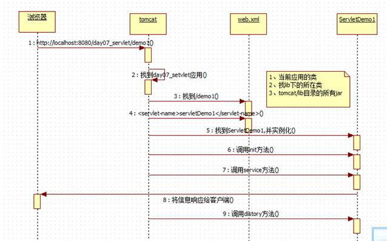

 

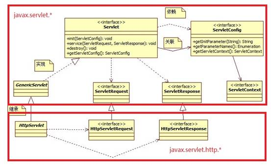

 

**Servlet****生命周期**

实例化-->初始化-->服务->销毁

（实例化-->初始化）第一次访问Servlet就出生（默认情况下）

（服务）应用活着，servlet就活着

（销毁）应用卸载了servlet就销毁。

 

**Servlet****的三种创建方式**

实现javax.servlet.Servlet接口（参见：编写一个servlet程序：）

继承javax.servet.GenericServlet类

继承javax.servlet.http.HttpServlet类

 

****

​    ****

​        **AnyName**

​        **HelloServlet**

​    ****

​    ****

​        **AnyName**

​        **/demo/hello.html**

​    ****

****

 

 

**Servlet****获取配置信息**

ServletConfig的使用

| [String](http://java.sun.com/j2se/1.5/docs/api/java/lang/String.html) | **[getInitParameter](mk:@MSITStore:F:\API\java_ee_api_中英文对照版.chm::/javax/servlet/ServletContext.html#getInitParameter(java.lang.String))**`(`[String](http://java.sun.com/j2se/1.5/docs/api/java/lang/String.html)` name)` //根据配置文件中的key得到value |
| ------------------------------------------------------------ | ------------------------------------------------------------ |
|                                                              |                                                              |

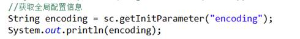

 

**ServletContext****（重要）**

ServletContext: 代表的是整个应用。一个应用只有一个ServletContext对象。单实例。

域对象：在一定范围内（当前应用），使多个Servlet共享数据。

String getRealPath(String path);//根据资源名称得到资源的绝对路径.

可以得到当前应用任何位置的任何资源。

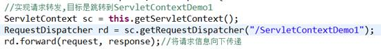

 

 

# Request、response

request.setAttribute("itemsList", itemsList);

request.getRequestDispatcher("WEB-INF/jsp/items/itemsList.jsp").forward(request, response);

  

**二、****HttpServletRequest**

1、请求行 

Get http://localhost:8080 http/1.1

Request.getMethod(); 获得请求方式

***getRequestURL();返回客户端发出请求时的完整URL。

***getRequestURI(); 返回请求行中的资源名部分。

*****getContextPath(); 当前应用的虚拟目录 /day09_01_request

getQueryString() ; 返回请求行中的参数部分。

2、请求消息头

 \* String  getHeader(String name) 根据头名称得到头信息值

 Enumeration  getHeaderNames() 得到所有头信息name

 Enumeration  getHeaders(String name) 根据头名称得到相同名称头信息

3、请求正文（重要）

*** getParameter(name) 根据表单中name属性的名，获取value属性

*** getParameterMap 到表单提交的所有值的方法  //做框架用，非常实用

*** void setAttribute(String name, Object value);

*** Object getAttribute(String name);

Void removeAttribute(String name);

 

请求转发与包含相关的方法

RequestDispatcher getRequestDispatcher(String path)

*** forward(ServletRequest request, ServletResponse response) //转发的方法

include(ServletRequest request, ServletResponse response) //请求包含

 

与请求编码相关的方法：

//告诉服务器客户端什么编码,只能处理post请求方式

*****request.setCharacterEncoding("UTF-8"); 

//解决get方式编码

String name = new String(name.getBytes(“iso-8859-1”),”UTF-8”);

 

 

**一、****HttpServletResponse**

1、响应行 HTTP/1.1 200 OK

setStatus(int sc) 设置响应状态码

2、响应头

***** sendRedirect(String location) 请求重定向

      setHeader(String name, String value) 设置响应头信息



//告知浏览器使用什么码表

response.setHeader("content-type", "text/html;charset=UTF-8");

 

3、响应正文（主体）

*** getWrite(); 字符输出流

getOutputStream(); 字节输出流

setCharacterEncoding(String charset) 告知服务器使用什么编码

*****setContentType(String type)

 

 

 

# HttpServletRequest中的Cookie与HttpSession对象

**会话技术：**

 

**由于****cookie****是由客户端浏览器保存和携带的，所以称之为客户端技术**

| [Cookie](mk:@MSITStore:E:/jsdk23/javax/servlet/http/Cookie.html)`[]` | **[getCookies](mk:@MSITStore:E:/jsdk23/javax/servlet/http/HttpServletRequest.html#getCookies())**`()` |
| ------------------------------------------------------------ | ------------------------------------------------------------ |
|                                                              |                                                              |

name：名称不能唯一确定一个Cookie。路径可能不同。

value：不能存中文。

path：默认值是写Cookie的那个程序的访问路径

比如：http://localhost:8080/day10_00_cookie/servlet/ck1写的Cookie

path就是：/day10_00_cookie/servlet 看当前创建cookie的资源（servlet）文件路径 

客户端在访问服务器另外资源时，根据访问的路径来决定是否带着Cookie到服务器

当前访问的路径如果是以cookie的path开头的路径，浏览器就带。否则不带。

 

maxAge：cookie的缓存时间。默认是-1（默认存在浏览器的内存中）。单位是秒。

负数：cookie的数据存在浏览器缓存中

0：删除。路径要保持一致，否则可能删错人。

正数：缓存（持久化到磁盘上）的时间

 

 

**HttpSession**

\> 同一个会话下，可以使一个应用的多个资源共享数据

\> cookie客户端技术，只能存字符串。HttpSession服务器端的技术，它可以存对象。

2、常用方法

把数据保存在HttpSession对象中，该对象也是一个域对象。

void setAttribute(String name,Object value);

Object getAttribute(String name);

void removeAttribute(String name);

HttpSession.getId():

 

setMaxInactiveInterval(int interval) 设置session的存活时间

invalidate() 使此会话无效

 

3、getSession():内部执行原理

HttpSession request.getSession():内部执行原理

1、获取名称为JSESSIONID的cookie的值。

2、没有这样的cookie，创建一个新的HttpSession对象，分配一个唯一的SessionID，并且向客户端写了一个名字为JSESSIONID=sessionID的cookie

3、有这样的Cookie，获取cookie的值（即HttpSession对象的值），从服务器的内存中根据ID找那个HttpSession对象：

找到了：取出继续为你服务。

找不到：从2开始。

 

 

HttpSession request.getSession(boolean create):

参数：

true：和getSession()功能一样。

false：根据客户端JSESSIONID的cookie的值，找对应的HttpSession对象，找不到返回null（不会创建新的，只是查询）。

 

 

 

 

 

 

 

 

 

 

 

 

# JSP

**jsp****的9****个内置对象**

**指在JSP****的<%=%>** **和<% %>****中可以直接使用的对象**

| 对象名      | 类型                                   | 说明                               |
| ----------- | -------------------------------------- | ---------------------------------- |
| request     | javax.servlet.http.HttpServletRequest  |                                    |
| response    | javax.servlet.http.HttpServletResponse |                                    |
| session     | javax.servlet.http.HttpSession         | 由session="true"开关               |
| application | javax.servlet.ServletContext           |                                    |
| exception   | java.lang.Throwable                    | 由isErrorPage="false"开关          |
| page        | java.lang.Object当前对象this           | 当前servlet实例                    |
| config      | javax.servlet.ServletConfig            |                                    |
| out         | javax.servlet.jsp.JspWriter            | 字符输出流，相当于 printWriter对象 |
| pageContext | javax.servlet.jsp.PageContext          |                                    |

**没有cookie****！！！！**

 

 

pageContext(重要)

1、本身也是一个域对象：它可以操作其它三个域对象（request session application）的数据

pageContext提供JSP页面所有对象及空间访问
    ${pageContext.request.contextPath }

 

实际开发常用对象：

PageContext : pageConext 存放的数据在当前页面有效。开发时使用较少。

**ServletRequest: request** **存放的数据在一次请求（转发）内有效。使用非常多。**

HttpSession: session 存放的数据在一次会话中有效。使用的比较多。如：存放用户的登录信息，购物车功能。

ServletContext: application 存放的数据在整个应用范围内都有效。因为范围太大，应尽量少用。

 

*详细**JSP**内容查看**web**目录下的笔记*

# JDBC

组成JDBC的２个包：

　java.sql

　javax.sql

开发JDBC应用需要以上2个包的支持外，还需要导入相应JDBC的数据库实现(即数据库**驱动**)。

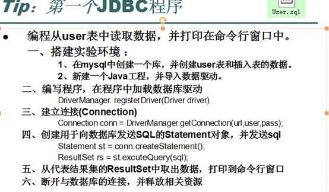

**注意**：在实际开发中并不推荐采用registerDriver方法注册驱动。原因有二：

一、查看Driver的源代码可以看到，如果采用此种方式，会导致驱动程序注册两次，也就是在内存中会有两个Driver对象。

二、程序依赖mysql的api，脱离mysql的jar包，程序将无法编译，将来程序切换底层数据库将会非常麻烦。

 

推荐方式：Class.forName(“com.mysql.jdbc.Driver”);

**Class.\*forName\*(*****conf\*****.getProperty(****"driver"****))**

采用此种方式不会导致驱动对象在内存中重复出现，并且采用此种方式，程序仅仅只需要一个**字符串**，不需要依赖具体的驱动，使程序的灵活性更高。

同样，在开发中也不建议采用具体的驱动类型指向getConnection方法返回的connection对象。

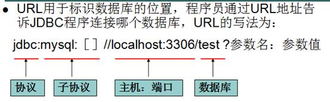

 

Jdbc程序运行完后，切记要释放程序在运行过程中，创建的那些与数据库进行交互的对象，这些对象通常是ResultSet, Statement和Connection对象。

特别是Connection对象，它是非常稀有的资源，用完后必须马上释放，如果Connection不能及时、正确的关闭，极易导致系统宕机。

为确保资源释放代码能运行，资源释放代码也一定要放在finally语句中。

 

l     statment和preparedStatement的区别:

\1. preparedStatement是statement的孩子

​    \3. preparedStatement会对sql语句进行预编译，以减轻数据库服务器的压力

​    \2. preparedStatement可以防止sql注入的问题

 

l **防止sql注入的原理：**

st = conn.prepareStatement(sql);  //预编译这条sql

​         st.setString(1, username);

​         st.setString(2, password);

prepareStatement防注入原理，转义参数，防止参数组成sql命令攻击数据库

 

 

 

 

# 数据库连接池

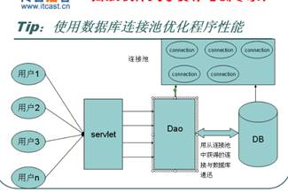

**编写标准的数据源（数据库连接池）**

自定义数据库连接池要实现javax.sql.DataSource接口

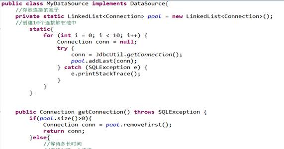

当用户使用完Connection，调用**Connection.close()****方法时，Collection****对象应保证将自己返回到LinkedList****中,****而不要把conn****还给数据库。**

Collection保证将自己返回到LinkedList中是此处编程的难点。 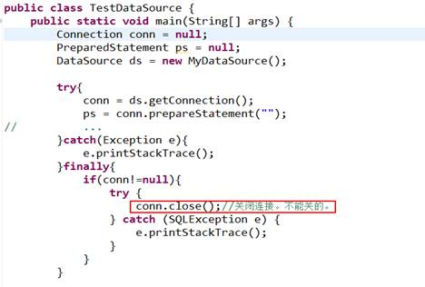

**解决方案：增强Connection****的close()**

**装饰设计模式：使用频率很高**

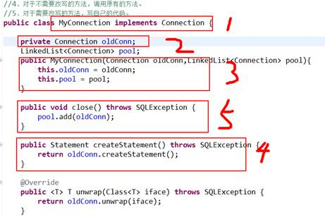

 

 

## 开发库的连接池DBCP、C3p0、Tomcat

DBCP 是 Apache 软件基金组织下的开源连接池实现，使用DBCP数据源，应用程序应在系统中增加如下两个 jar 文件：

Commons-dbcp.jar：连接池的实现

Commons-pool.jar：连接池实现的依赖库

Tomcat 的连接池正是采用该连接池来实现的。该数据库连接池既可以与应用服务器整合使用，也可由应用程序独立使用。

 

Tomcat服务器创建连接池，使用JNDI技术

**JNDI(Java Naming and Directory Interface)**

Java命名和目录接口，它对应于J2SE中的javax.naming包，

这套API的主要作用在于：它可以把Java对象放在一个容器中（JNDI容器），并为容器中的java对象取一个名称，以后程序想获得Java对象，只需通过名称检索即可。

其核心API为Context，它代表JNDI容器，其lookup方法为检索容器中对应名称的对象。

| key（String）     | value（Object） |
| ----------------- | --------------- |
| path+name         | 对象            |
| path+"jdbc/day16" | DataSource对象  |

 

## 如何编写自己的JDBC框架，核心元数据

**DataBaseMetaData****对象**

Connection.getDatabaseMetaData()

getURL()：返回一个String类对象，代表数据库的URL。

getUserName()：返回连接当前数据库管理系统的用户名。

getDatabaseProductName()：返回数据库的产品

**ParameterMetaData**

PreparedStatement . getParameterMetaData() 

Select * from user where name=? And password=?

getParameterCount()

**ResultSetMetaData**

ResultSet. getMetaData() 

getColumnCount()

getColumnName(int column)

 

## Apache DButils框架源码

commons-dbutils 是 Apache 组织提供的一个开源 JDBC工具类库，它是对JDBC的简单封装，学习成本极低，并且使用dbutils能极大简化jdbc编码的工作量，同时也不会影响程序的性能。因此dbutils成为很多不喜欢hibernate的公司的首选。

**API****：**

org.apache.commons.dbutils.**QueryRunner** 

public Object query(Connection conn, String sql, Object[] params, ResultSetHandler rsh) throws SQLException：该方法会自行处理 PreparedStatement 和 ResultSet 的创建和关闭。

public Object query(String sql, Object[] params, ResultSetHandler rsh) throws SQLException:

 

public int update(Connection conn, String sql, Object[] params) throws SQLException

public int update(Connection conn, String sql) throws SQLException

 

org.apache.commons.dbutils.**ResultSetHandler**

ArrayHandler：把结果集中的第一行数据转成对象数组。

ArrayListHandler：把结果集中的每一行数据都转成一个数组，再存放到List中。

BeanHandler：将结果集中的第一行数据封装到一个对应的JavaBean实例中。

BeanListHandler：将结果集中的每一行数据都封装到一个对应的JavaBean实例中，存放到List里。

ColumnListHandler：将结果集中某一列的数据存放到List中。

 

# JDBC应用，操作事务

```
事务绑定在ThreadLocal上   此类很重要，同个线程内共享数据
java.lang.ThreadLocal<T>
```

 

# JDBC多表操作，删除外键列等

树形结构，SQL操作在Front里面编辑

 

# 事务

事务指逻辑上的一组操作，组成这组操作的各个单元，要么全部成功，要么全部不成功。数据库默认事务是自动提交的，也就是发一条sql它就执行一条。

## 数据库开启事务命令

start transaction + Commit  开启事务，最后提交事务

Rollback 回滚事务，撤销

 

事务，设置回滚点，手动回滚注意sql有没有提交语句，没有的话系统将回滚点前也回滚了

……sql

Savepoint sp = conn.setSavepoint();

……sql

Conn.rollback(sp);

Conn.commit();  //回滚后必须要提交

 

**JDBC****控制事务语句**

Connection.setAutoCommit(false); 默认自动一条条提交，start transaction

Connection.rollback(); rollback

Connection.commit(); commit

Connection.setTransactionIsolation(int level);

 

**事务的特性ACID****：**

**原子性（Atomicity****）
**    原子性是指事务是一个不可分割的工作单位，事务中的操作要么都发生，要么都不发生。 

**一致性（Consistency****）
**    事务必须使数据库从一个一致性状态变换到另外一个一致性状态。

**隔离性（Isolation****）
**    事务的隔离性是多个用户并发访问数据库时，数据库为每一个用户开启的事务，**不能被其他事务的操作数据所干扰**，多个并发事务之间要相互隔离。

**持久性（Durability****）
**    持久性是指一个事务一旦被提交，它对数据库中数据的改变就是永久性的，接下来即使数据库发生故障也不应该对其有任何影响。

 

 

事务隔离性（isolation）避免了：**脏读，虚读，重复读**

\* 1、**READ UNCOMMITTED**: 赃读、不可重复读、虚读都有可能发生。

\* 2、**READ COMMITTED**: 避免赃读。不可重复读、虚读都有可能发生。（oracle默认的）

\* 4、**REPEATABLE READ**:避免赃读、不可重复读。虚读有可能发生。（mysql默认）

\* 8、**SERIALIZABLE**: 避免赃读、不可重复读、虚读。

级别越高，性能越低，数据越安全

 

 

## 1.演示脏读发生（读到另一个事务未提交的数据）

 

a窗口

set transaction isolation level read uncommitted; 

**start transaction;**

select * from account;

-------------发现a帐户是1000元，转到b窗口

select * from account;

-------------发现a帐户是1100元，发生了脏读（这个事务读取到了别的事务**未提交**的数据）

 

 

 

b窗口

**start transaction;**

update account set money=money+100 where name='aaa';

-------------事务在不提交的情况下，转到a窗口进行查询

 

 

## 2.避免脏读，并演示不可重复读问题的发生（这边事务没结束，读到了另一个事务结束上传的数据，这边两次读取数据不一致）

a窗口

**set transaction isolation level read committed; //** **提交后，这边才能读**

start transaction;

select * from account;

-------------发现a帐户是1000元，转到b窗口

select * from account;

-------------发现a帐户是1000元，这时我们发现read committed这种级别可以避免脏读

-------------转到b窗口

select * from account;

-------------发现a帐户是1100元，这时就发生不可重复读（指这个事务读取到了别的事务**提交**的数据）

 

b窗口

start transaction;

update account set money=money+100 where name='aaa';

-------------事务在不提交的情况下，转到a窗口进行查询

commit;

-------------转到a窗口

 

## 3.避免脏读、不可重复读，并演示虚读问题的发生

a窗口

**set transaction isolation level repeatable read;**

**start transaction;**

select * from account;

--------------------发现a帐户是1000元，并且表的总纪录数是3条,这时转到b窗口

select * from account

--------------------发现a帐户是1000元，这说明repeatable read这种级别可避免脏读

-------------------转到b窗口

select * from account

---------------------发现a帐户是1000元，这说明repeatable read这种级别还可**以避免**不可重复读

---------------------转到b窗口

select * from account

---------------------发现表中可能会多出一条ddd的记录，这就发生了虚读，也就是在这个事务内读取了**别的事务插入的数据**（幻影数据）

 

 

b窗口

**start transaction;**

update account set money=money+100 where name='aaa';

---------------------转到a窗口

commit;

---------------------转到a窗口

start transaction;

insert into account(name,money) values('ddd','1000');

commit;

--------------------转到a窗口

 

# DButils

**什么是dbutils****，它的作用**

​        DBUtils是java编程中的数据库操作实用工具，小巧简单实用。

DBUtils封装了对JDBC的操作，简化了JDBC操作。可以少写代码。

1.对于数据表的**读操作**，他可以把结果转换成List，Array，Set等java集合，便于程序员操作；

2.对于数据表的**写操作**，也变得很简单（只需写sql语句）

3.可以使用数据源，使用JNDI，数据库连接池等技术来优化性能--重用已经构建好的数据库连接对象

 

 

**二、DBUtils****的三个核心对象**

\> QueryRunner类

\> ResultSetHandler接口

\> DBUtils类

 

**QueryRunner****类**

QueryRunner中提供对sql语句操作的API.它主要有三个方法

query() 用于执行select 

update() 用于执行insert update delete

batch() 批处理

**ResultSetHandler****接口**

用于定义select操作后，怎样封装结果集.

**DbUtils****类**

它就是一个工具类,定义了关闭资源与事务处理的方法

 

**三、Dbutils****快速入门**

\> 导入jar包   

\> 创建QueryRunner对象

\> 使用query方法执行select语句

\> 使用ResultSetHandler封装结果集

\> 使用DbUtils类释放资源

 

 

**进行基本的CRUD****操作：练一下**

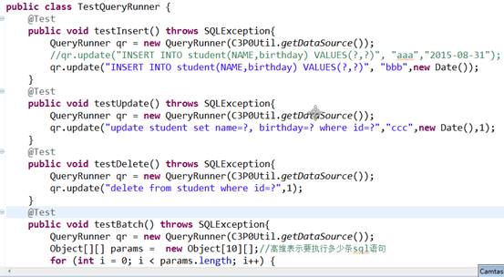

 

**五、ResultSetHandler****接口**

ResultSetHandler下的所有结果处理器

//ArrayHandler:适合取1条记录。把该条记录的每列值封装到一个数组中Object[]

//**ArrayListHandler**:适合取多条记录。把每条记录的每列值封装到一个数组中                                           Object[]，把数组封装到一个List中

//ColumnListHandler:取某一列的数据。封装到List中。

//**KeyedHandler**:取多条记录，每一条记录封装到一个Map中，再把这个Map封装到另外一个Map中，key为指定的字段值。

//MapHandler:适合取1条记录。把当前记录的列名和列值放到一个Map中

//**MapListHandler**:适合取多条记录。把每条记录封装到一个Map中，再把Map封装到List中

//ScalarHandler:适合取单行单列数据

BeanHandler

BeanListHandler 

 

**六、DBUtils****控制事务的开发**

 

**七、ThreadLocal**

模拟ThreadLocal的设计，让大家明白他的作用。

public class ThreadLocal{

private Map<Runnable,Object> container = new HashMap<Runnable,Object>();

public void set(Object value){

container.put(Thread.currentThread(),value);//用当前线程作为key

}

public Object get(){

return container.get(Thread.currentThread());

}

public void remove(){

container.remove(Thread.currentThread());

}

}

总结：调用该类的get方法，永远返回当前线程放入的数据。线程局部变量。

 

 

 

# 监听器

**监听器介绍**

Javaweb中的监听器是用于监听web常见对象HttpServletRequest, HttpSession, ServletContext

1.监听web对象创建与销毁.

2.监听web对象的属性变化

3.监听session绑定javaBean操作.

 

**监听机制相关概念**

​    1.事件----一件事情

​    2.事件源---产生这件事情的源头

​    4.监听器---对某件事情进行处理监听的一个对象

**注册监听**---将监听器与事件绑定，当事件产生时，监听器可以知道，并进行处理。

 

**javaweb****监听器介绍**

1.监听web对象创建与销毁的监听器

​                ServletContextListener

​                HttpSessionListener

​                ServletRequestListener   

2.监听web对象属性变化

​                ServletContextAttributeListener

​                HttpSessionAttributeListener

​                ServletRequestAttributeListener  

3.监听session绑定javaBean

​                HttpSessionBindingListener

​                HttpSessionActivationListener

 

 

## Web配置格式

​    <listener>

​        <listener-class>com.itheima.test.MyServletContextListener</listener-class>

​    </listener>

 

​    <listener>

​        <listener-class>com.itheima.test.MySessionListener</listener-class>

​    </listener>

 

 

 

## 统计在线人数

public class CountNumListener implements HttpSessionListener {

 

​     public void sessionCreated(HttpSessionEvent se) {

​          ServletContext context = se.getSession().getServletContext();

​          Integer count = (Integer) context.getAttribute("count");

​          if(count==null){

​               count = 1;

​               context.setAttribute("count", count);

​          }else{

​               count++;

​               context.setAttribute("count", count);

​          }

​     }

 

​     public void sessionDestroyed(HttpSessionEvent se) {

​          ServletContext context = se.getSession().getServletContext();

​          Integer count = (Integer) context.getAttribute("count");

​          count--;

​          context.setAttribute("count", count);

​     }

}

 

 

 

## 踢用户

public class UserListener implements HttpSessionAttributeListener {

​     public void attributeAdded(HttpSessionBindingEvent se) {

​          Map map = (Map) se.getSession().getServletContext().getAttribute("map");      if(map==null){

​               map = new HashMap();

​               se.getSession().getServletContext().setAttribute("map", map);

​          }

​          Object object = se.getValue();

​          if(object instanceof User){

​               User user = (User) object;

​               map.put(user.getUsername(), se.getSession());

​          }

​     }

​     public void attributeRemoved(HttpSessionBindingEvent se) {

​          // TODO Auto-generated method stub

​     }

​     public void attributeReplaced(HttpSessionBindingEvent se) {

​          // TODO Auto-generated method stub

​     }

}

 

 

public class KickServlet extends HttpServlet {

​     public void doGet(HttpServletRequest request, HttpServletResponse response)

​               throws ServletException, IOException {

​          String username = request.getParameter("username");

​          username = new String(username.getBytes("iso8859-1"),"UTF-8");

​          

​          Map map = (Map) this.getServletContext().getAttribute("map");

​          HttpSession session = (HttpSession) map.get(username);

​          if(session!=null){

​               session.invalidate();

​               map.remove(username);

​          }

​          response.sendRedirect("/day21_kick/listuser.jsp");

​     }

​     public void doPost(HttpServletRequest request, HttpServletResponse response)

​               throws ServletException, IOException {

​          doGet(request, response);

​     }

}

 

 

## 定时销毁过期session分析，Timer使用

如果session对象超过五秒没有使用就销毁。

 

怎样可以将每一个创建的session全都保存起来？

我们可以做一个HttpSessionListener，当session对象创建时，就将这个session对象装入到一个集合中.将集合保存到ServletContext域中。

 

怎样可以判断session过期了?

在HttpSession中有一个方法public long getLastAccessedTime()，它可以得到session对象最后使用的时间，可以使用invalidate方法销毁。

 

 

 

 

public class MyServletContextListener implements ServletContextListener {

 

​     public void contextInitialized(ServletContextEvent sce) {

​          ServletContext application = sce.getServletContext();

​          final List<HttpSession> list =Collections.synchronizedList(new ArrayList<HttpSession>()); //需要线程安全的集合

​          

​          application.setAttribute("sessions", list);

​          

​          //创建一个计时器对象

​          Timer t = new Timer();

​          t.schedule(new TimerTask() {

​               @Override

​               public void run() {

​                    System.out.println("开始扫描了。。。");

​                    for (Iterator iterator = list.iterator(); iterator.hasNext();) {

​                         HttpSession session = (HttpSession) iterator.next();

​                         long l = System.currentTimeMillis()-session.getLastAccessedTime();

​                         if(l>5000){//如果时间大于5秒，把session销毁

​                              System.out.println("session移除了"+session.getId());

​                              session.invalidate();//把session销毁

​                                   //list.remove(session);//从集合中移除，线程问题，不要使用

​                              iterator.remove();

​                         }

​                    }

​               }

​          }, 2000, 5000);//延迟2秒后执行，每间隔5秒执行一次

​     }

 

​     public void contextDestroyed(ServletContextEvent sce) {

 

​     }

}

 

 

public class MySessionListener implements HttpSessionListener {

​     public void sessionCreated(HttpSessionEvent se) {

​          HttpSession session = se.getSession();

​          //得到application对象中的list集合

​          ServletContext application = session.getServletContext();

​          //得到session对象，并放入到list集合中

​          List<HttpSession> list = (List<HttpSession>) application.getAttribute("sessions");

​          

​          list.add(session);

​          System.out.println("添加了"+session.getId());

​     }

​     public void sessionDestroyed(HttpSessionEvent se) {

​          // TODO Auto-generated method stub

​     }

}

 

​    我们上面的操作需要使用任务调度功能.

​    在java中有一个Timer定时器类


延迟1秒后开始执行，每过一秒再执行一次

 

关于三个域对象获取

如果在Servlet中要获取 request在方法上就有，request.getSession()  getServletContext();

 

 

 

# 过滤器

**1.****什么是Filter****及其作用介绍**

**Servlet****规范中三个技术 Servlet Listener Filter**

在javaEE中定义了一个接口 javax.servlet.Filter来描述过滤器。通过Filter可以拦截访问web资源的**请求与响应**操作.

WEB开发人员通过Filter技术，对web服务器管理的所有web资源：例如Jsp, Servlet, 静态图片文件或静态 html 文件等进行拦截，从而实现一些特殊的功能。例如实现URL级别的权限访问控制、过滤敏感词汇、压缩响应信息等一些高级功能。

 <filter>

 <filter-name>EncodingFilter</filter-name>

 <filter-class>com.itheima.product.web.filter.EncodingFilter</filter-class>

 </filter>

 <filter-mapping>

 <filter-name>EncodingFilter</filter-name>

 <url-pattern>/*</url-pattern>

 </filter-mapping>

 

 

 

**2.Filter API****介绍**   

Filter是javax.servlet包下的一个接口主要有以下三个方法

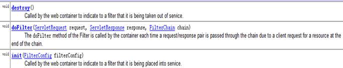

Filter接口中有一个doFilter方法，当开发人员编写好Filter，并配置对哪个web资源进行拦截后，WEB服务器每次在调用web资源的service方法之前，都会先调用一下filter的doFilter方法

web服务器在调用doFilter方法时，会传递一个filterChain对象进来，filterChain.doFilter()，开发人员可以根据需求决定是否调用此方法，调用该方法放行，则web服务器就会调用web资源的service方法，即web资源就会被访问，否则web资源不会被访问。

 

**public** **void** doFilter(ServletRequest request, ServletResponse response,

​      FilterChain chain) **throws** IOException, ServletException {

​    //1.写子类

​    //2.用包装模式

​    //3.动态代理

​    chain.doFilter(request, response); // 处理生效，chain放行给下                              一个filter

  }

 

**Filter****链与Filter****生命周期**

1.Filter链介绍

多个Filter对同一个资源进行了拦截，那么当我们在开始的Filter中执行chain.doFilter(request,response)时，是访问下一下Filter,直到最后一个Filter执行时，它后面没有了Filter,才会访问web资源。

多个Filter形成了Filter链，那么它们的执行顺序是怎样确定的？它们的执行顺序取决于<filter-mapping>在web.xml文件中配置的先后顺序。

 

2.Filter生命周期

当服务器启动，会创建Filter对象，并调用init方法，只调用一次.当访问资源时，路径与Filter的拦截路径匹配，会执行Filter中的doFilter方法，这个方法是真正拦截操作的方法.

当服务器关闭时，会调用Filter的destroy方法来进行销毁操作.

 

 

 

## 自动登录

当用户登陆成功后，判断是否勾选了自动登陆，如果勾选了，就将用户名与密码持久化存储到cookie中

 

做一个Filter，对没有登录的用户，过滤器在用户请求携带的cookies找到用户名和密码，自动登录。

 

public class LoginServlet extends HttpServlet {

​     public void doGet(HttpServletRequest request, HttpServletResponse response)

​               throws ServletException, IOException {

​          String username = request.getParameter("username");

​          String password = request.getParameter("password");

​          //MD5加密

​          password = MD5Utils.md5(password);

​          UserService us = new UserService();

​          User user = us.findUser(username,password);

​          

​          if(user!=null){

​               String autologin = request.getParameter("autologin");

​               Cookie cookie = new Cookie("user", user.getUsername()+"&"+user.getPassword());

​               cookie.setPath("/");

​               if(**autologin**!=null){//要把用户信息保存到cookie中

​                    cookie.setMaxAge(60*60*24*7);

​               }else{//要清除cookie对象的数据

​                    cookie.setMaxAge(0);

​               }

​               response.addCookie(cookie);//把cookie对象保存到客户端

​               request.getSession().setAttribute("user", user);

 

​               request.getRequestDispatcher("/home.jsp").forward(request, response);

​          }else{

​               request.setAttribute("msg", "用户名或密码错误,请重新登录！");

​               request.getRequestDispatcher("/login.jsp").forward(request, response);

​          }    

​     }

​     public void doPost(HttpServletRequest request, HttpServletResponse response)

​               throws ServletException, IOException {

​          doGet(request, response);

​     }

}

 

过滤器实现：

public class AutoLoginFilter implements Filter {

​     public void init(FilterConfig filterConfig) throws ServletException {

​          // TODO Auto-generated method stub

​     }

​     public void doFilter(ServletRequest request, ServletResponse response,

​               FilterChain chain) throws IOException, ServletException {

​          // 1、转换两个对象HttpServletRequest，HttpServletResponse

​          HttpServletRequest req = (HttpServletRequest) request;

​          HttpServletResponse resp = (HttpServletResponse) response;

 

​          String uri = req.getRequestURI();// /day17_02_autologin/login.jsp

​          String path = req.getContextPath();// /day17_02_autologin

​          path = uri.substring(path.length()); // /login.jsp

​          //如果请求的资源不是login.jsp，也不是/servlet/loginServlet（过滤的资源），才往下执行

​          if (!("/login.jsp".equals(path) || "/servlet/loginServlet".equals(path))) {

​               User user = (User) req.getSession().getAttribute("user");

​               if (user == null) {          //如果没用登录即user为null，则自动登录

​                    System.out.println("aaaaaaaaaaaaaaa");

​                    Cookie[] cookies = req.getCookies();

​                    String username = "";

​                    String password = "";

​                    // 从用户携带cookie数组中找到想要的user对象的信息

​                    for (int i = 0; cookies != null && i < cookies.length; i++) {

​                         if ("user".equals(cookies[i].getName())) {

​                              String value = cookies[i].getValue();// tom&123

​                              String[] values = value.split("&");

​                              username = values[0];

​                              password = values[1];

​                         }

​                    }

 

​                    // 登录操作

​                    UserService us = new UserService();

​                    User u = us.findUser(username, password);

​                    // 如果登录成功，把用户信息存到session中

​                    if (u != null) {

​                         req.getSession().setAttribute("user", u); //放入session后，表示登录成功

​                    }

​               }

​          }

​          // 3、放行

​          chain.doFilter(request, response);

​     }

​     public void destroy() {

​          // TODO Auto-generated method stub

​     }

}

 

 

 

### Md5加密

Message Digest Algorithm MD5（中文名为消息**摘要**算法第五版）为计算机安全领域广泛使用的一种散列函数，用以提供消息的完整性保护。

 

主流编程语言普遍已有MD5实现

**mysql****中的md5****加密实现**

update user set password=md5(password);

 

**java****中的md5****加密实现**

​    /**

 \* 使用md5的算法进行加密

 */

public static String md5(String plainText) {

  byte[] secretBytes = null;

  try {

​      secretBytes = MessageDigest.getInstance("md5").digest(

​              plainText.getBytes());

  } catch (NoSuchAlgorithmException e) {

​      throw new RuntimeException("没有md5这个算法！");

  }

  String md5code = new BigInteger(1, secretBytes).toString(16);

  for (int i = 0; i < 32 - md5code.length(); i++) {

​      md5code = "0" + md5code; //32位，不足补零

  }

  return md5code;

 

 

 

 

## 解决乱码，增强实现过滤，包装设计模式

 <filter>

 <filter-name>EncodingFilter</filter-name>

 <filter-class>com.itheima.product.web.filter.EncodingFilter</filter-class>

 </filter>

 <filter-mapping>

 <filter-name>EncodingFilter</filter-name>

 <url-pattern>/*</url-pattern>

 </filter-mapping>

 


 public class EncodingFilter implements Filter {

​     public void destroy() {

​     }

 

​     public void doFilter(ServletRequest request, ServletResponse response,

​               FilterChain chain) throws IOException, ServletException {

​          // 处理请求乱码

​          HttpServletRequest httpServletRequest = (HttpServletRequest) request;

​          HttpServletRequest myRequest = new MyRequest(httpServletRequest);

 

​          // 处理响应乱码

​          response.setContentType("text/html;charset=utf-8");

 

//请求和响应乱码处理后，放行

​          chain.doFilter(myRequest, response);

​     }

 

​     public void init(FilterConfig filterConfig) throws ServletException {

​     }

 

}

 

**//** **继承包装类**

class MyRequest extends HttpServletRequestWrapper {

​     private HttpServletRequest request;

​     private boolean hasEncode;

 

​     public MyRequest(HttpServletRequest request) {

​          super(request);// 没有无参构造器，super必须写

​          this.request = request;

​     }

 

​     // 对需要增强方法 进行覆盖

​     @Override

​     public Map getParameterMap() {

​          // 先获得请求方式

​          String method = request.getMethod();

​          if (method.equalsIgnoreCase("post")) {

​               try {

​                    request.setCharacterEncoding("utf-8");

​                    return request.getParameterMap();

​               } catch (UnsupportedEncodingException e) {

​                    e.printStackTrace();

​               }

​          } else if (method.equalsIgnoreCase("get")) {

​               Map<String, String[]> parameterMap = request.getParameterMap();

​               if (!hasEncode) { // 确保get手动编码逻辑只运行一次

​                    for (String parameterName : parameterMap.keySet()) {

​                         String[] values = parameterMap.get(parameterName);

​                         if (values != null) {

​                              for (int i = 0; i < values.length; i++) {

​                                   try {

​                                        values[i] = new String(values[i]

​                                                  .getBytes("ISO-8859-1"), "utf-8");

​                                   } catch (UnsupportedEncodingException e) {

​                                        e.printStackTrace();

​                                   }

​                              }

​                         }

​                    }

​                    hasEncode = true;

​               }

​               return parameterMap;

​          }

​          return super.getParameterMap();

​     }

 

​     @Override

​     public String getParameter(String name) {

​          Map<String, String[]> parameterMap = getParameterMap();

​          String[] values = parameterMap.get(name);

​          if (values == null) {

​               return null;

​          }

​          return values[0]; // 取回参数的第一个值

​     }

 

​     @Override

​     public String[] getParameterValues(String name) {

​          Map<String, String[]> parameterMap = getParameterMap();

​          String[] values = parameterMap.get(name);

​          return values;

​     }

 

}

 

 

## 过滤器与拦截器

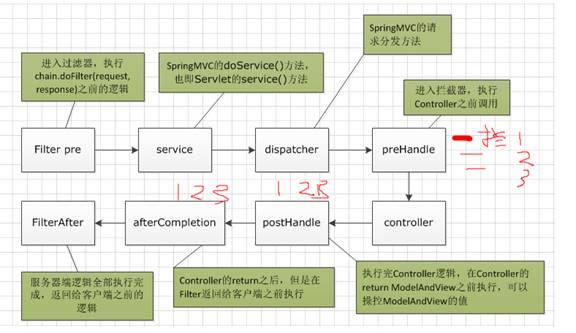

Springmvc中的过滤器与拦截器

Java过滤器与SpringMVC拦截器之间的关系与区别 - CSDN博客 https://blog.csdn.net/chenleixing/article/details/44573495

过滤器作用在servlet前后，拦截器可以贯穿servlet

 

# 文件上传下载

**1.1****文件上传的必要前提：**

a、提供form表单，method必须是post

b、form表单的enctype必须是multipart/form-data

c、提供input type="file"类的上传输入域

 

**enctype****属性**

作用：告知服务器请求正文的MIME类型。（*请求消息头：**Content-Type**作用是一致的*）

 

可选值：

l application/x-www-form-urlencoded(默认)：

正文：name=admin&password=123

服务器获取数据：String name = request.getParameter("name");

l multipart/form-data:

正文：

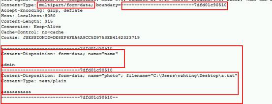

服务器获取数据：**request.getParameter(String)****方法获取指定的表单字段字符内容，但文件上传表单已经不在是字符内容，而是字节内容，所以失效。**

 

 

文件上传：解析请求正文的每部分的内容。

 

**2****、借助第三方的上传组件实现文件上传**

fileupload是由apache的commons组件提供的上传组件。它最主要的工作就是帮我们解析request.getInputStream()。

导入commons-fileupload相关jar包

l commons-fileupload.jar，核心包；

l commons-io.jar，依赖包。

 

**DiskFileItemFactory**、**ServletFileUpload**、**FileItem**。

 

a、解析原理

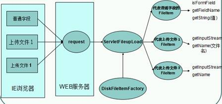

 

使用fileupload组件的步骤如下：

\1.   创建工厂类DiskFileItemFactory对象：

DiskFileItemFactory factory = new DiskFileItemFactory()

\2.   使用工厂创建解析器对象：

ServletFileUpload fileUpload = new ServletFileUpload(factory)

\3.   使用解析器来解析request对象：

List<FileItem> list = fileUpload.parseRequest(request)

 

 

FileItem对象对应一个表单项（表单字段）。可以是文件字段或普通字段

l boolean isFormField()：判断当前表单字段是否为普通文本字段，如果返回false，说明是文件字段；

l String getFieldName()：获取字段名称，例如：<input type=”text” name=”username”/>，返回的是username；

l String getString()：获取字段的内容，如果是文件字段，那么获取的是文件内容，当然上传的文件必须是文本文件；

l String getName()：获取文件字段的文件名称；（a.txt）

l String getContentType()：获取上传的文件的MIME类型，例如：text/plain。

l int getSize()：获取上传文件的大小；

l InputStream **getInputStream**()：获取上传文件对应的输入流；//可用流写到自己的输出流中

l void **write**(File)：把上传的文件保存到指定文件中。

l delete();

 

## 本质：流文件处理

public class UploadServlet1 extends HttpServlet {

​     public void doGet(HttpServletRequest request, HttpServletResponse response)

​               throws ServletException, IOException {

​          */**

​           *** *由于表单中提交数据的方式改为**multipart/form-data**，所以**request.getParameter("name")**失效*

​           ** String name = request.getParameter("name");*

​          *String photo = request.getParameter("photo");*

​          *System.out.println(name);*

​          *System.out.println(photo);\*/*

​     

​          InputStream is = request.getInputStream();

​          int len = 0;

​          byte[] b = new byte[1024];

​          while((len=is.read(b))!=-1){

​               System.out.println(new String(b,0,len));

​          }

/*        // 通过文件输出流将上传的文件保存到磁盘

​               FileOutputStream fos = new FileOutputStream(file);

 

​               int len = 0;

​               byte[] b = new byte[1024];

​               while ((len = is.read(b)) != -1) {

​                    fos.write(b, 0, len);

​               }

​               fos.close();  */

​          is.close();

​     }

​     public void doPost(HttpServletRequest request, HttpServletResponse response)

​               throws ServletException, IOException {

​          doGet(request, response);

​     }

 

}

 

 

 

 

## 文件上传时要考虑的几个问题（经验分享）

a、保证服务器的安全

把保存上传文件的目录放在用户直接访问不到的地方。


b、避免文件被覆盖

让文件名唯一即可

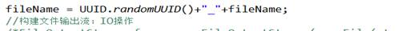

c、避免同一个文件夹中的文件过多

方案一：按照日期进行打散存储目录

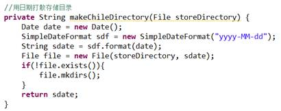

方案二：用文件名的hashCode计算打散的存储目录：二级目录

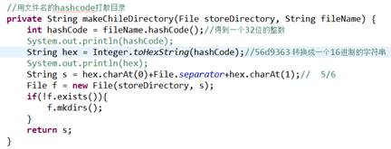

 

d、限制文件的大小：web方式不适合上传大的文件

单个文件大小：    

ServletFileUpload.setFileSizeMax(字节)

总文件大小：（多文件上传）

ServletFileUpload.setSizeMax(字节)

 

e、上传字段用户没有上传的问题

通过判断文件名是否为空即可

f、临时文件的问题

DiskFileItemFactory:

作用：产生FileItem对象

内部有一个缓存，缓存大小默认是10Kb。如果上传的文件超过10Kb，用磁盘作为缓存。

存放缓存文件的目录在哪里？默认是系统的临时目录。

 

如果自己用IO流实现的文件上传，要在流关闭后，清理临时文件。

FileItem.delete();

 

# Annotation注解

Annotation 代码里的特殊标记, 这些标记可以在**编译****,** **类加载,** **运行**时被读取, 并执行相应的处理. 通过使用 Annotation, 程序员可以在不改变原有逻辑的情况下, 在源文件中嵌入一些**补充信息**.

Annotation 可以像修饰符一样被使用, 可用于修饰包,类, 构造器, 方法, 成员变量, 参数, 局部变量的声明, 这些信息被保存在 Annotation 的 “name=value” 对中.

 

**1****、JDK****中的三个基本的注解：**

a、@Override：检查子类确实是覆盖了父类的方法。

b、@Deprecated：说明已经过时了。

c、@SuppressWarnings({ "unused", "deprecation" })：抑制程序中的警告。unused警告的类型。{}数组。”all”抑制所有警告。

 

**2****、自定义注解的语法：**

​    public @interface MyAnnotation{}

 

**注解本质就是一个接口，这个接口需要继承 Annotation****接口。反编译javap****为**

public interface MyAnnotation extends java.lang.annotation.Annotation {}

 

注解本质上就是接口

​        int age() default 0; 字段和方法融为一体，统称为“属性”不叫“方法”

 

 

//创建一个注解类，注解的属性可以为各种原生类型

public @interface MyAnnotation {

​     int age() default 0;

​     String name() default "";

​     String sex() default "";

​     String[] value();

MyAnno anno(); //为注解的属性类型

​     Color color();   //为枚举的属性类型

}

 

 

**元注解**

只能**用在注解上的注解**叫做元注解。（即：用于修饰注解的注解），说明自定义的注解的存活范围、生命周期。

 

l **@Retention**改变自定义的注解的存活范围，默认class。

RetentionPolicy:

SOURCE

CLASS

RUNTIME

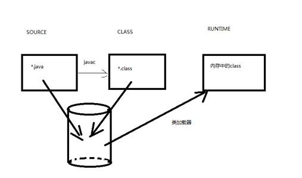

存活范围逐渐增大

 

**@Target**指定该注解能用在什么地方。

ElementType：

TYPE：

METHOD：

FIELD：

ANNOTATION_TYPE

**@Documented**：如果@MyTest注解上面有@Documented注解，那么使用了                 @MyTest的注解的类的API文档中会出现@MyTest的信息。

**@Inherited**：作用，说明该注解可以被继承下去。

 

 

 

 

## 注解的反射

**注解相关的反射技术**

java.lang.reflect.**AnnotatedElement**:

<T extends Annotation> T getAnnotation(Class<T> annotationType):*得到指定类型的注解引用。没有返回null**。*

Annotation[] getAnnotations()：*得到所有的注解，包含从父类继承下来的。*

Annotation[] getDeclaredAnnotations()：*得到自己身上的注解。*

boolean isAnnotationPresent(Class<? extends Annotation> annotationType)：*判断指定的注解有没有。*

 

**Class****、Method****、Field****、Constructor****（\*反射包中的类\*）等实现了AnnotatedElement****接口.**

**Class**.isAnnotationPresent(MyTest.class):判断类上面有没有@MyTest注解；

**Method**.isAnnotationPresent(MyTest.class):判断方法上面有没有@MyTest注解。

 

## 模拟Junit的@Test，

1.定义注解MyTest

import java.lang.annotation.Documented;

import java.lang.annotation.ElementType;

import java.lang.annotation.Inherited;

import java.lang.annotation.Retention;

import java.lang.annotation.RetentionPolicy;

import java.lang.annotation.Target;

@Documented

@Inherited

@Retention(RetentionPolicy.RUNTIME)

@Target({ElementType.METHOD,ElementType.TYPE})

public @interface MyTest {

​     long timeout() default -1; //

}

 

2.使用注解的类

@MyTest

public class SomeDaoImpl {

​     @MyTest(timeout=1000000)

​     public void testAdd(){

​          System.out.println("add方法执行了");

​     }

​     

​     @MyTest

​     public void testUpdate(){

​          System.out.println("update方法执行了");

​     }

}

 

3.运行使用注解的类，操作注解灵魂

mport java.lang.reflect.InvocationTargetException;

import java.lang.reflect.Method;

 

public class TestRunner {

​     public static void main(String[] args) throws IllegalArgumentException, IllegalAccessException, InvocationTargetException, InstantiationException {

​          **Class clazz = SomeDaoImpl.class;**

​          Method[] methods = clazz.getMethods();

​          for (Method m : methods) {

​               //得到当前方法上的**注解对象**

​               **MyTest** myTest = m.getAnnotation(MyTest.class);  ***//\******因为需要注解对象中的属性\***

​               if(myTest!=null){//如果当前方法上有@MyTest注解

​                    long timeout = myTest.timeout();

​                    if(timeout<0){//表示不需要测试

​                         m.invoke(clazz.newInstance(), null);

​                    }else{//需要测试

​                         long l1 = System.nanoTime();//得到纳秒

​                         m.invoke(clazz.newInstance(), null);

​                         long l2 = System.nanoTime();//得到纳秒

​                         if((l2-l1)>timeout){

​                              System.out.println(m.getName()+"方法超时！");

​                         }

​                    }

​               }

​          }

​     }

 

​     private static void test1() throws IllegalAccessException,

​               InvocationTargetException, InstantiationException {

​          //得到要执行的类的Class对象

​          Class clazz = SomeDaoImpl.class;

​          //得到类中的方法,包括本类中和父类中的所有公共的方法

​          Method[] methods = clazz.getMethods();

​          //遍历所有方法

​          for (Method m : methods) {

​               boolean isExistsAnno = m.isAnnotationPresent(MyTest.class);

//              System.out.println(m.getName()+"当前方法是否有注解："+isExistsAnno);

​               if(m.isAnnotationPresent(MyTest.class)){

​                    m.invoke(clazz.newInstance(), null);

​               }

​          }

​     }

}

 

## Servlet3.0中的几个注解

增加注解的支持。

**Servlet3.0****：j2ee 6.0**

Tomcat7+；JDK6.0+；

 

Servlet3.0：web.xml已经不是必须的了。替代它的就是注解。

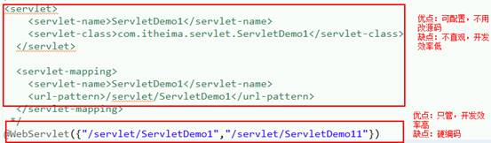

WebServlet中value()默认属性指向pattern()，可以有多个pattern

 

SpringMVC映射器的注解： **@RequestMapping****(****"/queryItems"****)**

 

# 类加载

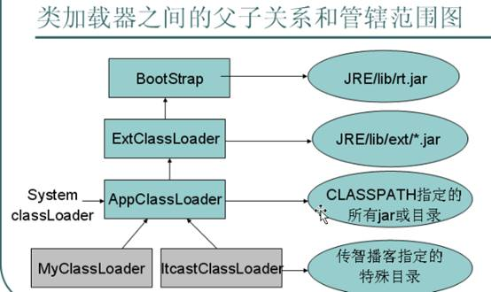

Bootstrap专门加载核心类库

Extclassloader 加载扩展类库

APPclassloader(System classLoader) 编写的类的加载器

 

父类委托：APPclassloader依次询问父类加载器，父类搜索不到类，则子类亲自动手加载

**全盘负责**：即是当一个classloader加载一个Class的时候，这个Class所依赖的和引用的其它Class通常也由这个classloader负责载入。

**cache****机制**：如果 cache中保存了这个Class就直接返回它，如果没有再加载Class，并存入cache。

类只加载一次，修改类需要重新加载。

 

 

# Struts的控制器组件主要包括

ActionServlet对象：Struts 的核心类

RequestProcessor对象：由ActionServlet调用，负责处理用户请求

Action对象：用户自己编写的类

 

Struts处理请求的流程：

当 ActionServlet 接收到 HTTP 请求后，在 doGet 或 doPost 方法中都会调用process()方法处理请求

在 ActionServlet 的 process() 方法中一旦选择了正确的子应用模块，就会调用RequestProcessor实例的process()方法来处理请求。在ActionServlet调用这个方法时，会把当前的request和response对象传给它

RequestProcessor实例的process()方法调用ProcessActionCreate()方法，先判断是否在 Action 缓存中存在Action实例，如果不存在，就创建一个Action实例，把它保存在 Action 缓存中

RequestProcessor实例的process()方法调用Action实例的execute()方法

 

 

 