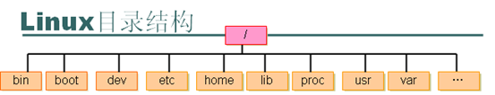

# 学习备忘

熟悉守护进程的创建、原理

了解计划作业crontab

熟悉进程、线程状态查看命令（top、strace、pstack）

熟悉内存状态查看命令memstat、free

熟悉IO状态查看命令iostat、df、du

了解linux文件的权限、用户、时间（ctime、mtime、atime）、inode等文件基本属性，熟练使用chmod、chown、chgrp等基本命令。

熟悉文件传输命令scp、rz、sz命令、

熟悉文件定位命令find、whereis命令。

熟悉软链接，熟悉ln命令。

熟悉lsof命令。

熟悉tcp状态机（三次握手、四次挥手）。

熟悉tcpdump命令。

熟悉网络状态和防火墙状态查看命令：netstat、ifconfig、iptables

熟悉socket API，包括但不限于（connect、accept、bind、listen、send/sendto、recv/recvfrom、select、gethostbyname）

了解使用文本处理命令grep、sed、cut。

了解awk命令。


# terminal

```bash
vim ~/.bashrc
#最后一行增加：
PS1="\[\e[32;40m\][\u@\h \W]\$\e[m "
# export PS1="..." 作用范围此次登录

sudo echo "PS1=\"\[\e[32;40m\][\u@\h \W]\\$\e[m \"" >> ~/.bashrc
source ~/.bashrc
```


配置文件读取顺序：

```
/etc/profile  /etc/profile.d/*.sh
[ubuntu: ~/.profile] [centos: ~/.bash_profile]   [~/.bash_login]
~/.bashrc
[ubuntu: /etc/bash.bashrc]  [centos: /etc/bashrc]
[centos: ~/.bash_logout]
```


# shell备忘

变量

```
（1）shell脚本中定义的变量是global的，其作用域从被定义的地方开始，到shell结束或被显示删除的地方为止。
（2）shell函数定义的变量默认是global的，其作用域从“函数被调用时执行变量定义的地方”开始，到shell结束或被显示删除处为止。函数定义的变量可以被显示定义成local的，其作用域局限于函数内。但请注意，函数的参数是local的。
（3）如果同名，Shell函数定义的local变量会屏蔽脚本定义的global变量。

函数local
```

规范

```bash
# 变量
${} # 引用，加花括号
"${my_var}" # 保证变量为字符串，有点繁琐，if测试时候可以用

# 字符串优先使用""
str="Hello, I know you are \"${your_name}\"! \n" # ""内直接使用变量，也可转义"
str="prefix"${your_name}"suffix" # 也可以拼接

# ''单引号里的任何字符都会原样输出，单引号字符串中的变量是无效的；
greeting_3='hello, ${your_name} !' # hello, ${your_name} !
```

**注释**

```bash
:<<EOF
sdad
aswe
EOF

>/dev/null 2>$1 # 过滤不必要输出
```


- 命名

```shell
# 当函数名后存在 () 时，关键词 function 是多余的。但是其促进了函数的快速辨识。
function my_func() {
	// ...
}

readonly PATH_TO_FILES='/some/path'

# 当赋值的值由命令替换提供时，声明和赋值必须分开。因为内建的 local 不会从命令替换中传递退出码。
my_func2() {
  local name="$1"

  # Separate lines for declaration and assignment:
  local my_var
  my_var="$(my_func)" || return
}
```


- 流程控制

```bash
# 定义数组
ips=(
"127.0.0.1"
"127.0.0.2"
)
zones=(
    "lo回环地址"
)

# 使用循环
for i in {0..6};do
    echo "${zones[i]}: ${ips[i]}"
    ping ${ips[i]} # 访问数组
done
```


环境变量

```bash
set |more #显示所有类型的环境变量，全局、局部、自定义

优先使用ss
netstat -tunlp | grep 端口号
    -t (tcp) 仅显示tcp相关选项
    -u (udp)仅显示udp相关选项
    -n 拒绝显示别名，能显示数字的全部转化为数字
    -l 仅列出在Listen(监听)的服务状态
    -p 显示建立相关链接的程序名

kill -9 pid

Ctrl+r # 搜索命令记录
```


- 进程控制

```bash
ctrl+c # 终止进程
ctrl+z # 暂停进程
# 后台运行，但是与shell终端绑定
command &

1 SIGHUP 挂起进程
2 SIGINT 终止进程
3 SIGQUIT 停止进程
9 SIGKILL 无条件终止进程
15 SIGTERM 尽可能终止进程
17 SIGSTOP 无条件停止进程，但不是终止进程
18 SIGTSTP 停止或暂停进程，但不终止进程
19 SIGCONT 继续运行停止的进程

# 非控制台下运行脚本
# nohup命令运行了另外一个命令来阻断所有发送给该进程的SIGHUP信号
nohup ./test1.sh &
```


```shell
# 一行运行多个命令，用分号隔开
date; who

ls -l
stat file.txt
date +%y%m%d
mktemp -t test.XXXXXX

set |more # 显示所有当前环境变量

# 引用变量的方式
$HOME
"$HOME"
${HOME}
${!#}
'I am in '$HOME''

# 命令的输出，赋值给变量
`` # ``引号
$() # 推荐

# 重定向
> #覆盖
>> #追加
wc < inputfile.txt # 输入重定向，统计字符
# 0,1,2文件描述符，该值必须紧紧地放在重定向符号前
ls -al badfile 2> test4.txt

# 脚本中
$ cat test8
#!/bin/bash
# testing STDERR messages
echo "This is an error" >&2 # 引用输入的错误信息文件描述符号，默认是stdout

# 使用时
$ ./test8
This is an error
$ ./test8 2> test9
$ cat test9
This is an error


# 上个命令执行的退出码。0：成功结束，1：一般性未知错误，无效参数等情况
$?

# 搭配if-then，根据上个命令执行情况来操作
if command1; then
	command set 1
elif command2; then
	command set 2
fi
#if-then语句是否能测试命令退出状态码之外的条件。
#答案是不能。但在bash shell中有个好用的工具可以帮你通过if-then语句测试其他条件。
#test命令提供了在if-then语句中测试不同条件的途径
if test $1; then
	command
fi
# bash shell提供了另一种条件测试方法，无需在if-then语句中声明test命令。
if [ condition ]; then
commands
fi
# 方括号定义了测试条件。注意，第一个方括号之后和第二个方括号之前必须加上一个空格，否则就会报错。

[ condition1 ] && [ condition2 ]
[ condition1 ] || [ condition2 ]

#字符串比较
if [ $USER = $testuser ]
if [ $USER != $testuser ]
if [ $val1 \> $val2 ] #需要转义重定向符号
-n str1 检查str1的长度是否非0
-z str1 检查str1的长度是否为0
if [ -n "$1" ]
#文件，检查是否有权限执行
if [ -x test16.sh ]

# 高级运算表达式
(( expression ))
# expression可以是任意的数学赋值或比较表达式。兼容test命令使用的标准数学运算符

# 双方括号命令提供了针对字符串比较的高级特性
[[ expression ]]
#双方括号里的expression使用了test命令中采用的标准字符串比较。但它提供了test命令未提供的另一个特性——模式匹配（pattern matching）。
if [[ $USER == r* ]]
#使用双等号（==）。双方括号命令$USER环境变量进行正则匹配，看它是否以字母r开头

$#
${!#} #拿到最后一个命令行的参数，$#
if [ $# -ne 2 ]
```


bash运算

```bash
var1=$[1 + 5]

# 顺序执行多条命令，当;号前的命令执行完（不管是否执行成功），才执行;后的命令。
cp /tmp/t2 /tmp/t2.bak; echo "hello world"

# 希望都成功执行，有一个失败就退出。逻辑&&，前面成功了后面的才会执行
lpr /tmp/t2 && rm /tmp/t2

# 希望成功一个，有一个成功就退出
cp /tmp/t2 /tmp/t2.bak || rm /tmp/t2


# 在后台启动并按顺序运行
(sleep 2; sleep 3) &
# 后台并行运行
sleep 2 & sleep 3 &
```


# Windows常用命令

```powershell
netstat -aon | findstr "80"
```


# Unix命令大全

### cat / strings

```bash
sudo cat /proc/1/environ |tr '\0' '\n'
sudo strings /proc/1/environ
export $(sudo strings /proc/1/environ |xargs)
```


### top

```
M P
VIRT — 进程使用的虚拟内存总量，单位kb。VIRT=SWAP+RES
RES — 进程使用的、未被换出的物理内存大小，单位kb。RES=CODE+DATA
```


### curl、ss(netstat)

```bash
# options
--include(-i) # 返回响应体

# https  JSON  post
curl --insecure(-k) --include(-i) --header(-H) "Content-type: application/json" --request(-X) POST --data(-d) '{}' <url>

# HTTPS链接
curl --insecure(-k) --cert <> --key <> <URL>
```

例子:

```bash
curl -i -k -X POST -d '{"argArr":[{"pod_name":"test-deployment-6f76597cdb-n8prq", "container_name":"mu", "limits":{"cpu":"100m"}, "requests":{"cpu":"50m"}}]}' http://localhost:6/backendApi/pod/patchPod

```

```bash
ss -lntp
netstat -lntp
```


### nohup、screen

```bash
# 错误输出重定向到1，是否追加式>>，取决于1
nohup ./xxx >>log 2>&1 &
```


```bash
screen ls
screen cmd
# detach退出Ctrl+A+D
-r            Reattach to a detached screen process.(连接到一个在其他地方断开的会话)
-x Attach to a not detached screen. (Multi display mode).（连接到一个没有断开的会话，即会话共

screen -r xx

screen -x xx
# alias
screen -S sockname
```


### tar

```bash
# -z[--gzip] --verbose --file
tar -czvf # -c或--create
tar -xzvf # -x或--extract
```


### sed、grep、awk

```bash
# sed 本身不会修改文件，stream edit后输出结果，如果需要修改要重定向到源文件，也可以sed -i原地修改
sed -i
sed -E # 可以使用扩展的正则，()
echo "libgcc-4.8.5-4.h5.x86_64.rpm" | sed -E "s/libgcc-(.*)\.rpm/\1/g"
不加-E，需要转义

# sed -e 多点操作
sed -e "s|<cluster-name>|$cluster_name|g" \
-e "s|<cert-file>|$cert_file|g" \
< ./input-template.yml > ./output.yml
```


```bash
grep -E
grep -v
ps -ef |grep -v "grep" |grep "ps"
grep -o
```


```bash
env |grep -E "^USER=" |awk -F '=' '{print $2}'
```


# 系统目录结构



| 目录名称    | 应放置文件的内容                                          |
| ----------- | --------------------------------------------------------- |
| /bin        | 存放单用户模式下还可以操作的命令                          |
| /boot       | 开机所需文件—内核、开机菜单以及所需配置文件等             |
| /dev        | 以文件形式存放任何设备与接口                              |
| /etc        | 配置文件                                                  |
| /home       | 用户目录                                                  |
| /lib        | 开机时用到的函数库，以及/bin与/sbin下面的命令要调用的函数 |
| /proc       | 虚拟文件系统，例如系统内核、进程、外部设备及网络状态等    |
| /usr/local  | 用户自行安装的软件                                        |
| /var        | 主要存放经常变化的文件，如日志                            |
|             |                                                           |
| /sbin       | 开机过程中需要的命令                                      |
| /media      | 用于挂载设备文件的目录                                    |
| /opt        | 放置第三方的软件                                          |
| /root       | 系统管理员的家目录                                        |
| /srv        | 一些网络服务的数据文件目录                                |
| /tmp        | 任何人均可使用的“共享”临时目录                            |
| /usr/sbin   | Linux系统开机时不会使用到的软件/命令/脚本                 |
| /usr/share  | 帮助与说明文件，也可放置共享文件                          |
| /lost+found | 当文件系统发生错误时，将一些丢失的文件片段存放在这里      |

 

 

#  常用指令

## 文件、目录操作命令

ls 显示文件和目录列表

Ls 列出普通文件

​	-l 列出文件的详细信息

​	-a 列出当前目录所有文件，包含隐藏文件、应用

mkdir 创建目录

​	-p 父目录不存在情况下先生成父目录

cd 切换目录

**touch** **生成一个空文件**   

**echo** **生成一个带内容文件**     **echo abcd>a.txt**

**cat**显示文本文件内容、more、less 分页显示文本文件内容、head,tail分别显示文件开头和结尾内容

 

cp 复制文件或目录

rm 删除文件

​	删除空目录rmdir

​	删除非空文件夹   rm -rf   目录名字-r 就是向下递归，不管有多少级目录，一并删除-f 就是直接强行删除，不作任何提示的意思

mv 移动文件或目录、文件

mv  aaa bbb 将aaa改名为bbb

**find** 在文件系统中查找指定的**文件**

​    	-name  文件名

wc 统计文本文档的行数，字数，字符数

grep 在**指定的文本文件**中查找指定的**字符串**

tree 显示目录目录改名树

**pwd** **显示当前工作目录**

 

### 例子

```shell
[root@linuxprobe ~]# head -n 2 /etc/passwd  （显示头两行）
**root**:x:0:0:root:/root:/bin/bash
**bin**:x:1:1:bin:/bin:/sbin/nologin

[root@linuxprobe ~]# cut -d: -f1 /etc/passwd   （以：为列间隔，提取第一列信息）
root
bin
daemon
Adm

[root@linuxprobe ~]# diff --brief diff_A.txt diff_B.txt    （判断文件是否相同）
Files diff_A.txt and diff_B.txt differ

 
[root@linuxprobe ~]# mkdir linuxprobe

[root@linuxprobe ~]# cd linuxprobe

[root@linuxprobe linuxprobe]# mkdir -p a/b/c/d/e   （-p创建多级目录）

[root@linuxprobe linuxprobe]# cd a

[root@linuxprobe a]# cd b

[root@linuxprobe b]#


[root@linuxprobe ~]# touch install.log

[root@linuxprobe ~]# cp install.log x.log

[root@linuxprobe ~]# ls

install.log x.log

[root@linuxprobe ~]# mv x.log linux.log  （移动，剪切 +移动后名字等于重命名）

[root@linuxprobe ~]# ls
install.log linux.log

 
[root@linuxprobe ~]# file anaconda-ks.cfg （文件属性）
anaconda-ks.cfg: ASCII text

[root@linuxprobe ~]# file /dev/sda
/dev/sda: block special

 

[root@linuxprobe ~]# tar -czvf etc.tar.gz /etc    （打包目录）
tar: Removing leading '/' from member names
/etc/
/etc/fstab
/etc/crypttab
………………省略部分压缩过程信息………………


[root@linuxprobe ~]# mkdir /root/etc

[root@linuxprobe ~]# tar -xzvf etc.tar.gz -C /root/etc   （解压到指定目录）
etc/
etc/fstab
etc/crypttab
………………省略部分解压过程信息………………
```

 

### 文**本**grep、tr、wc

grep

```shell
//在文件passwd中查找匹配字符串“/sbin/nologin”

[root@ubuntu:/etc]# grep /sbin/nologin passwd       
daemon:x:1:1:daemon:/usr/sbin:/usr/sbin/nologin
bin:x:2:2:bin:/bin:/usr/sbin/nologin
sys:x:3:3:sys:/dev:/usr/sbin/nologin
games:x:5:60:games:/usr/games:/usr/sbin/nologin
man:x:6:12:man:/var/cache/man:/usr/sbin/nologin
lp:x:7:7:lp:/var/spool/lpd:/usr/sbin/nologin
```

**文本**替换

```shell
[root@linuxprobe ~]# cat anaconda-ks.cfg | tr [a-z] [A-Z]
```

**文本**统计

```shell
[root@linuxprobe ~]# wc -l /etc/passwd     （passwd中行数表示用户数）
38 /etc/passwd
```


### 文**件**find

命令格式特殊，注意和grep的pattern区别

```shell
//在路径下查找
[root@linuxprobe ~]# find /etc -name "host*" -print
/etc/avahi/hosts
/etc/host.conf
/etc/hosts
/etc/hosts.allow
/etc/hosts.deny
/etc/selinux/targeted/modules/active/modules/hostname.pp
/etc/hostname
```

 

### 管道与重定向

简单地说，一个通道接受一个工具软件的输出，然后把那个输出输入到其它工具软件。使用UNIX/Linux的词汇，这个通道接受了一个过程的标准输出，并把这个标准的输出作为另一个过程的标准输入。如果你没有重新定向这个输出，这个输出就在屏幕上显示出来。使用一个通道，你可以重新定向这个输出，这样它就变成了另一个工具软件的标准的输入。

   例如：`grep best  /home/* xx | more`

grep 命令在指定文件查找指定字符串 

在home目录所有文件下查找best字符 此时的结果可能特别多，要分页。那么使用more可以分页查看

 

**输入输出重定向**

```bash
[root@linuxprobe ~]# man bash > readme.txt

[root@linuxprobe ~]# cat readme.txt 
BASH(1)                     General Commands Manual              BASH(1)
NAME
………………省略部分输出信息………………

[root@linuxprobe ~]# echo "Welcome to  LinuxProbe.Com" > readme.txt   （覆盖）

[root@linuxprobe ~]# echo "Quality linux learning materials" >> readme.txt （追加）

[root@linuxprobe ~]# cat readme.txt
Welcome to LinuxProbe.Com
Quality linux learning materials

[root@linuxprobe ~]# wc -l < readme.txt   （输入重定向，用得少）
2

//等于cat readme.txt | wc -l
```


## 系统管理命令

stat 显示指定文件的相关信息,比ls命令显示内容更多

who  显示在线登录用户

hostname 显示主机名称

uname显示系统信息

 

top  显示当前系统中耗费资源最多的进程

**ps**   **显示瞬间的进程状**

du   显示指定的文件（目录）已使用的磁盘空间的总量

df   显示文件系统磁盘空间的使用情况

free 显示当前内存mem和交换空间swap的使用情况

ifconfig 显示网络接口信息

ping 测试网络的连通性

netstat 显示网络状态信息，端口占用

man 命令帮助信息查询

clear 清屏

kill 杀死一个进程

 

### 一些例子

```shell
[root@linuxprobe ~]# pidof sshd
2156
[root@linuxprobe ~]# kill 2156

 
[root@linuxprobe ~]# history
1 tar xzvf VMwareTools-9.9.0-2304977.tar.gz
2 cd vmware-tools-distrib/
………………省略部分输出信息………………

[root@linuxprobe ~]# !15
anaconda-ks.cfg  Documents  initial-setup-ks.cfg  Pictures  Templates Desktop Downloads  Music  Public    Videos
```

 

 

### 进程管理

查看进程`ps`


查看某个时间点的进程信息

示例一：查看自己的进程

```shell
# ps -l
```

示例二：查看系统所有进程

```shell
# ps aux
```

示例三：查看特定的进程

```shell
# ps aux | grep threadx
```

 


实时显示进程信息`top`

示例：两秒钟刷新一次

```shell
# top -d 2
```

 

查看进程树`pstree`

示例：查看所有进程树

```shell
# pstree -A
```

 

查看占用端口的进程`netstat`

示例：查看特定端口的进程

```shell
# netstat -anp | grep portx
```

 

 

## 关机/重启命令

`shutdown`系统关机  `shutdown `命令可以安全的关闭Linux系统，shutdown命令必须有超级用户才能执行。Shutdown命令执行后会以广播的形式通知正在系统中工作的所有用户

`now `立即关机

​	12:30 指定关机时间

​	- r 关机后重启

​	- h 关机后不重新启动

`reboot` 重新启动

`halt `关机后关闭电源

# APT软件包管理

APT (Advanced Packaging Tool高级软件包工具) 是一个强大的包管理系统，而那些图形化程序如 添加/删除 应用程序 都是建立 在它的基础之上的。有了dpkg后,Debian再次开发了apt,它能自动处理依赖文件并维护已有的配置文件,快速,实用,高效

 

**APT** **使用的一些常用命令:**

安装软件包：

**sudo apt-get install** packagename

 

删除软件包：

`sudo apt-get remove packagename`

 

获取新的软件包列表：

`sudo apt-get update`

 

升级有可用更新的系统：

`sudo apt-get upgrade`

 

列出更多命令和选项：

`apt-get help`

 

通过apt可以直接通过网络安装。

常用的APT命令参数 

`apt-cache search package` 搜索包 

`apt-cache show package` 获取包的相关信息，如说明、大小、版本等 

`sudo apt-get install package` 安装包 

例如：

```shell
sudo apt-get install eclipse

sudo apt-get install sun-java6-jdk 
```

 

下载安装程序到你的**/var/cache/apt**文件夹里面然后进行安装。 

sudo apt-get install package - - reinstall 重新安装包 

sudo apt-get -f install 修复安装"-f = ――fix-missing" 

sudo apt-get remove package 删除包 

sudo apt-get remove package - - purge 删除包，包括删除配置文件等 

sudo apt-get update 更新源 

sudo apt-get upgrade 更新已安装的包 

sudo apt-get dist-upgrade 升级系统 

sudo apt-get dselect-upgrade 使用 dselect 升级 

**apt-cache depends package** **了解使用依赖** 

**apt-cache rdepends package** **是查看该包被哪些包依赖** 

sudo apt-get build-dep package 安装相关的编译环境 

apt-get source package 下载该包的源代码 

**sudo apt-get clean && sudo apt-get autoclean** **清理无用的包** 

sudo apt-get check 检查是否有损坏的依赖  /var/cache/apt/archives.

 

# *用户和组*账户管理

linux操作系统是一个多用户操作系统，它允许多用户同时登录到系统上并使用资源。系统会根据账户来区分每个用户的文件，进程，任务和工作环境，使得每个用户工作都不受干扰。

 

**用户账户**

A．普通用户账户：普通用户在系统上的任务是进行普通操作

B．超级用户账户：管理员在系统上的任务是对普通用户和整个系统进行管理。对系统具有绝对的控制权，能够对系统进行一切操作。

1、超级管理员

用root表示，root用户在系统中拥有最高权限，默认下Ubuntu用户的root用户是不能登录的如果想要root登录，可以执行sudo passwd root，激活root

2、安装时创建的系统用户

此用户创建时被添加到admin组中，在Ubuntu中，admin组中的用户默认是可以使用sudo命令来执行只有管理员才能执行的命令的。如果不使用sudo就是一个普通用户。

 

**组账户**

A. 私有组：当创建一个用户时没有指定属于哪个组，Linux就会建立一个与用户同名的私有组，此私有组只含有该用户。

B．标准组：当创建一个用户时可以选定一个标准组，如果一个用户同时属于多个组时，登录后所属的组为主组，其他的为附加组。

 

## 账户系统文件

**A. /etc/passwd**

​    每一行代表一个账号，众多账号是系统正常运行所必须的，例如bin，nobody

每行定义一个用户账户，此文件对所有用户可读。每行账户包含如下信息：

|   root:xxxx:   |           0:            |          0:           |  root:   |         /root:         |      /bin/bash      |
| :------------: | :---------------------: | :-------------------: | :------: | :--------------------: | :-----------------: |
| 用户名：口令： | 用户标示号（**UID**）： | 组标示号（**GID**）： | **注释： | 宿主目录（主文件夹）： | 命令解释器（shell） |


1、 用户名：

就是账号。用来对应UID。root UID是0口令。

2、 口令：

密码，早期UNIX系统密码存在此字段，由于此文件所有用户都可以读取，密码容易泄露，后来这个字段数据就存放到/etc/shadow中，这里只能看到X。

3、 用户标识号（UID）：

系统内唯一，root用户的UID为0，普通用户从1000开始，1-999是系统的标准账户，500-65536是可登陆账号。

4、 组标识号（GID）：

与 /etc/group 相关用来规定组名和GID相对应。

5、注释：

   注释账号

​    6、宿主目录：

用户登录系统后所进入的目录root 在/root itcast在:/home/itcast

​    7、命令解释器：

指定该用户使用的shell ，默认的是/bin/bash

 

**B．/etc/shadow 真正的password所在文件**

为了增加系统的安全性，用户口令通常用shadow passwords保护。只有root可读。每行包含如下信息： 

root:$6$E3SMKoCF$U.A3zuKnBTCzZS5i.ZzHfzq2R5mk6m0iKtWr0B8QdA1VphZcQPaSqKKQWDA.mkptemLBIKPAw/.kik2287ZiM1:15504:0:99999:7:::    itcast:$1$ktRolYMY$Fb0kTjAcNUEceLWMzbj2M/:15470:0:99999:7:::

用户名：口令：最后一次修改时间：最小时间间隔：最大时间间隔：警告时间：不活动时：失效时间：标志

 

1、账号名称：

   需要和/ etc/passwd  一致。

2、密码：

   经过加密，虽然加密，但不表示不会被破解，该**文件**属性如下

   -rw-r----- 1 root shadow 1196 2012-06-13 05:40 shadow

   只有root能读写。

3、最近修改密码日期：

最后一次修改时间：从1970-1-1起，到用户最后一次更改口令的天数

4、密码最小时间间隔：

​    最小时间间隔：从1970-1-1起，到用户可以更改口令的天数

5、密码最大时间间隔：

​    最大时间间隔：从1970-1-1起，必须更改的口令天数

6、密码到期警告时间：

​    警告时间：在口令过期之前几天通知

7、密码到期后账号宽限时间

8、密码到期禁用账户时间：

​    不活动时间：在用户口令过期后到禁用账户的天数

9、保留

 

**C．/etc/group**

   用户组的配置文件

   root:x:0: 

1、 组名称

2、 组密码

给用户组管理员使用通常不用。

3、 GID

组的ID

4、 此用户支持的账号名称

一个账号可以加入多个用户组，例如想要itcast 加入root 这个用户组，将该账号填入该字段即可，root:x:0:root,icast

   将用户进行分组是 Linux对用户进行管理及控制访问权限的一种手段。一个

中可以有多个用户，一个用户可以同时属于多个组。该文件对所有用户可读。

 

**D．/etc/gshadow**

​    该文件用户定义*组口令*，组管理员等信息只有root用户可读。

​    root:::root

1、 组名

2、 密码列

3、 组管理员的账号

4、 组所属账号


## 使用命令行工具管理账户

useradd 用户名

useradd –u（UID号）

useradd –p（口令）

useradd –g（分组）

useradd –s（SHELL）

useradd –d（用户目录）

 

使用usermod修改用户信息

usermod –u（新UID）

usermod –d（用户目录）

usermod –g（组名）

usermod –s（SHELL）

usermod –p（新口令）

usermod –l（新登录名）

usermod –L (锁定用户账号密码)

usermod –U (解锁用户账号)

userdel 用户名 (删除用户账号)

userdel –r 删除账号时同时删除目录

 

sudo usermod –u 1007 –g group2 –G root thinkpad

将thinkpad用户uid修改为1007，默认组改为系统中已经存在的group2，并且加入到系统管理员（GID 0）组。

 

组账户维护命令

groupadd 组账户名 (创建新组)

groupadd –g 指定组GID

groupmod –g 更改组的GID

groupmod –n 更改组账户名

groupdel 组账户名 (删除指定组账户)

 

口令维护命令

passwd 用户账户名 (设置用户口令)

passwd –l 用户账户名 (锁定用户账户)

passwd –u 用户账户名 (解锁用户账户)

passwd –d 用户账户名 (删除账户口令)

gpasswd –a 用户账户名 组账户名 (将指定用户添加到指定组)

gpasswd –d 用户账户名 组账户名 (将用户从指定组中删除)

gpasswd –A 用户账户名 组账户名 (将用户指定为组的管理员)

 

## 用户和组状态命令

**su** 用户名  切换用户账户

su root

su – root

su 需要了解新切换的用户密码。

id 用户名 显示用户的UID，GID

whoami 显示当前用户名称

**groups** 显示用户所属组

**sudo**

cat /etc/sudoers

sudo只需要知道自己的密码，sudo并不是每一个用户都可以执行仅有/ect/sudoers内的用户才能够执行sudo命令。

sudo是允许系统管理员让普通用户执行一些或者全部的root命令的一个工具，如halt，reboot，su等等。这样不仅减少了root用户的登陆和管理时间，同样也提高了安全性。sudo不是对shell的一个代替，它是面向每个命令的。它的特性主要有这样几点： 

sudo能够限制用户只在某台主机上运行某些命令。 

sudo提供了丰富的日志，详细地记录了每个用户干了什么。它能够将日志传到中心主机或者日志服务器。 

sudo使用时间戳文件来执行类似的“检票”系统。当用户调用sudo并且输入它的密码时，用户获得了一张存活期为5分钟的票（这个值可以在编译的时候改变）。 

 sudo的配置文件是sudoers文件，它允许系统管理员集中的管理用户的使用权限和使用的主机。它所存放的位置默认是在/etc/sudoers，属性必须为0411。

使用root 通过visudo 编辑sudoers 

案例：

新增用户：


# 8.文件及权限管理

文件权限是指对文件的访问权限，包括多文件的读、写、删除和执行。在linux下每个用户都有不同的权限，普通用户只能在自己的主目录下进行写操作，在主目录之外，普通用户只能进行查找，读取操作。

三种基本权限 

R 读权限

W 写权限

X 执行权限

 

## 8.1. 查看文件和目录的权限

ls –al 

使用ls不带参数只显示文件名称，通过ls –al可以显示文件或者目录的权限信息。

ls –l 文件名

 

**drwxr-xr-x  2 itcast itcast  4096 2014-06-12 01:10 software**

| drwxr-xr-x         | 2      | itcast   itcast  | 4096     | 2014-06-12   01:10 | software |
| ------------------ | ------ | ---------------- | -------- | ------------------ | -------- |
| 文档**类型及权限** | 连接数 | 文档所属用户和组 | 文档大小 | 文档最后被修改日期 | 文档名   |

 

**第一列****drwxr-xr-x**

第一列显示文档类型与执行权限，分为4部分

每个所代表的含义

| d        | rwx                    | r-x                         | r—x                   |
| -------- | ---------------------- | --------------------------- | --------------------- |
| 文档类型 | 文档所有者权限（user） | 文档所属用户组权限（group） | 其他用户权限（other） |

（1）文档类型：

d 表示目录 ，l 表示软连接 – 表示文件，c表示串行端口字符设备文件，b表示可供存储的块设备文件。余下的字符3个字符为一组。r 只读，w 可写，x可执行，- 表示无此权限为空。

（2）User

文档所有者user权限的设定， rwx表示用户对sofeware 目录有读写执行的权限。

（3）Goup

文档所属组权限的设定，r-x 表示用户组对software有读和运行的权限但是没有写的权限。

（4）Other

文档拥有者之外的其他用户权限的设定，r-x表示其他用户或者用户组对software只有读和运行的权限，没有写的权限。

文档的操作权限是可以指定和更改的，通过chmod命令。

 

**第2列**显示的是文档连接数，是指硬链接，多少个文件指向同一个索引节点。

**第3列**显示文档所属的用户和组，就是文档属于哪个用户和用户组。文件所属用户和组是可以更改的，通过chown

**第4列**显示的是文档的大小，默认是bytes

**第5列**显示文档最后一次修改日期，通常以月日年时分方式显示

**第6列**显示文档名称，Linux下以 .开头的文件时隐藏文件，同样以 . 开头的目录是隐藏目录。必须以ls –a才能显示。

## 8.2. 更改操作

**1、chown 改变用户和组**

**chown**  是change owner的意思，主要作用就是改变文件或者目录所有者，所有者包含用户和用户组

chown  [ -R] 用户名称 文件或者目录

chown  [-R]  用户名称：组名称 文件或目录

-R ：进行递归式的权限更改，将目录下的所有文件、子目录更新为指定用户组权限。

注意：执行操作确保指定的用户及用户组在系统中是存在的。

 

**2、chmod改变访问权限**

**chmod****字符设置法**

**chmod [who] [+ | - | =]   [mode]** **文件名**

（1）**who** **：**

表示操作对象可以是以下字母的一个或者组合

u 表示 用户 user ，g表示用户组group，o表示其他用户，a表示所有用户是系统默认的。

（2）操作符号：

\+  表示添加某个权限

\- 表示取消某个权限

=  赋予给定的权限，取消文档以前的所有权限。

（3）**mode**

​     表示可执行的权限，可以是 **r****、****w****、****x**

 4）文件名

​     文件名可以使空格分开的文件列表。

chmod 【u 属主， g 所属组用户， o 其他用户， a 所有用户】 【+ 加权限 – 减权限 =加权限同时将原有权限删除】 【rwx】 文件或目录名。-R 下面的子目录做相同权限操作

 

 

   itcast@ubuntu://home/itcast$   **ls -al itcast**   -rw-r--r--   1 itcast itcast 16 2012-06-13 01:44 itcast 
   itcast@ubuntu://home/itcast$ **chmod** **u=rwx,g+r,o+r itcast**   		
   itcast@ubuntu://home/itcast$   **ls -al itcast**   -rwxr--r--   1 itcast itcast 16 2012-06-13 01:44 itcast 
   itcast@ubuntu://home/itcast$   **su thinkpad** 
   Password: 
   $ ls 
   abc      Downloads       itcast      Public   Test.class    workspace   Desktop    examples.desktop  Music       software   Test.java   Documents  home           Pictures    Templates  Videos 
   $ **cat itcast**   this is   testing 
   $ **rm itcast** 
   rm:   remove write-protected regular file \`itcast\'? y 
  rm:   cannot remove \`itcast\': Permission denied（others权限为只读）   


**chmod** **数字设定法**

数字设定法中数字表示的含义，**0**表示没有任何权限，**1**表示有可执行=**x**，**2**表示有可执行权限=**w**，**4**表示有可读权限=**r**

也可以用数字来表示权限如 **chmod 755 file_name**

| r    w      x        | r – x | r - x  |
| -------------------- | ----- | ------ |
| 4    2      1        | 4 - 1 | 4 - 1  |
| user                 | group | others |
| chmod  755 file_name |       |        |

 

 

# linux 的硬件管理

fdisk -l 查看存储设备信息

cat /proc/cpuinfo 查看CPU 的信息，查看/proc目录下相应的文件来查看一些设备信息

fdisk 磁盘管理命令，fdisk -l 显示磁盘分区信息

mount 命令挂载磁盘分区文件系统

umount 卸载命令

umount /media/test 将挂载在/media/test目录下的文件系统卸载

 

 

 

# linux 网络基础与网络服务管理

网卡的配置ifconfig

网卡配置文件的目录/etc/sysconfig/network-scripts

ifconfig-ethX 有线网卡的配置文件

ifconfig-ethX:X 有线网卡的虚拟网卡的配置文件

ifconfig-wlanX 无线网卡的配置文件

网卡配置文件中各行代表的含义

DEVICE——设备名

BOOTPROTO ——IP地址的获取方式(静态 static或者dhcp)

HWADDR ——MAC地址

ONBOOT ——开机启动

IPADDR ——Ip地址

NETMASK——子网掩码

使用命令配置网卡

ifconfig 查看ip 信息

ifconfig eth0 200.200.200.2 netmask 255.255.255.0

ifdown eth0 禁用网卡

ifup eth0 启用网卡

ifconfig eth0 hw ether 00:11:22:33:44:55修改网卡 eth0 的 MAC 地址

 

