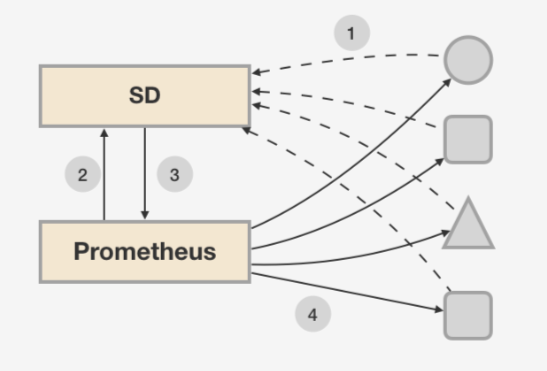
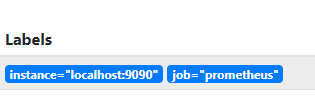

## 索引

查看每个组件的metric列表：

https://docs.signalfx.com/en/latest/integrations/agent/monitors/_monitor-config.html#monitor-list


### 正则

```
code=~"^(?:4..)$|^(?:5..)$"
code!~"^(?:4..)$|^(?:5..)$"
verb!~"WATCH|CONNECT"
client!~"kubelet.*|kube-scheduler.*|kube-controller.*|kube-apiserver.*|kube-proxy.*"
```


- variable

```
/job="([^test/].*)/.*"/
/job="(test/.*)/.*"/
```


### 常用查询

官方query例子：

https://prometheus.io/docs/prometheus/latest/querying/examples/

```bash
# sum是因为多标签有多个apiserver_request_count的数据
sum(rate(apiserver_request_count{job="test/idc-gz-k8s-test/api-server"}[5m]))

# success
sum by (code)>0 (rate(apiserver_request_count{code!~"^(?:4..)$|^(?:5..)$",job="test/idc-gz-k8s-test/api-server"}[5m]))
# error
sum by (code)>0 (rate(apiserver_request_count{code=~"^(?:4..)$|^(?:5..)$",job="test/idc-gz-k8s-test/api-server"}[5m]))

histogram_quantile(0.90, sum(rate(apiserver_request_latencies_bucket{verb!~"WATCH|CONNECT",job="$cluster/api-server"}[5m])) by (le, resource) ) / 1e+06

sum(increase(scheduler_total_preemption_attempts{job="$cluster/scheduler"}[1m])) by (result)
```


### relabel

——操作对象是meta label

- 保存至标签

```yml
  - source_labels: [__meta_kubernetes_service_name]
    separator: ;
    regex: (.*)
    action: replace
    target_label: service
    replacement: $1
```

- 新增标签

```yaml
  - target_label: endpoint
    replacement: http-metrics
```

- 过滤标签

```yml
  - source_labels: [__meta_kubernetes_service_label_k8s_app]
  	separator: ;
    regex: kube-controller-manager
    action: keep
    
  - source_labels: [__name__]
    regex: etcd_(debugging|disk|request|server).*
    action: drop
```


## metric基础

TSDB数据库存放格式：带有时间戳

```
<--------------- metric ---------------------><-timestamp -><-value->
http_request_total{status="200", method="GET"}@1434417560938 => 94355

http_requests_total{code="200",handler="alerts",instance="localhost:9090",job="prometheus",method="get"}=(20889@1518096812.326)
http_requests_total{code="200",handler="graph",instance="localhost:9090",job="prometheus",method="get"}=(21287@1518096812.326)
```


某一时刻的值定义如下

```
# HELP node_cpu Seconds the cpus spent in each mode.
# TYPE node_cpu counter
node_cpu{cpu="cpu0",mode="idle"} 362812.7890625
```

node_cpu当前指标metric name的名称、大括号中的标签则反映了当前样本的一些特征和维度、浮点数则是该监控样本的具体值。

```
api_http_requests_total{method="POST", handler="/messages"}
# json格式
{__name__="api_http_requests_total"，method="POST", handler="/messages"}
```


- count（计数器）

常见的监控指标，如http_requests_total，node_cpu都是Counter类型的监控指标。 一般在定义Counter类型指标的名称时推荐使用_total作为后缀。

```
rate(http_requests_total[5m])
查询当前系统中，访问量前10的HTTP地址：
topk(10, http_requests_total)
```


- gauge（仪表盘）

```
计算CPU温度在两个小时内的差异：
delta(cpu_temp_celsius{host="zeus"}[2h])

预测系统磁盘空间在4个小时之后的剩余情况：
predict_linear(node_filesystem_free{job="node"}[1h], 4 * 3600)
```


- summary：值分析，平均数，中位数

TYPE  summary

指标prometheus_tsdb_wal_fsync_duration_seconds的指标类型为Summary。 它记录了Prometheus Server中wal_fsync处理的处理时间，通过访问Prometheus Server的/metrics地址，可以获取到以下监控样本数据：

```
# HELP prometheus_tsdb_wal_fsync_duration_seconds Duration of WAL fsync.
# TYPE prometheus_tsdb_wal_fsync_duration_seconds summary
prometheus_tsdb_wal_fsync_duration_seconds{quantile="0.5"} 0.012352463
prometheus_tsdb_wal_fsync_duration_seconds{quantile="0.9"} 0.014458005
prometheus_tsdb_wal_fsync_duration_seconds{quantile="0.99"} 0.017316173
prometheus_tsdb_wal_fsync_duration_seconds_sum 2.888716127000002
prometheus_tsdb_wal_fsync_duration_seconds_count 216
```

从上面的样本中可以得知当前Prometheus Server进行wal_fsync操作的总次数count为216次，耗时sum2.888716127000002s。其中中位数（quantile=0.5）的耗时为0.012352463，9分位数（quantile=0.9）的耗时为0.014458005s。

**对样本的值value进行分析，样本标签为`quantile`**


- histogram：样本分布直方图，样本分布

TYPE histogram

```
# HELP prometheus_tsdb_compaction_chunk_range Final time range of chunks on their first compaction
# TYPE prometheus_tsdb_compaction_chunk_range histogram
prometheus_tsdb_compaction_chunk_range_bucket{le="100"} 0
prometheus_tsdb_compaction_chunk_range_bucket{le="400"} 0
prometheus_tsdb_compaction_chunk_range_bucket{le="1600"} 0
prometheus_tsdb_compaction_chunk_range_bucket{le="6400"} 0
prometheus_tsdb_compaction_chunk_range_bucket{le="25600"} 0
prometheus_tsdb_compaction_chunk_range_bucket{le="102400"} 0
prometheus_tsdb_compaction_chunk_range_bucket{le="409600"} 0
prometheus_tsdb_compaction_chunk_range_bucket{le="1.6384e+06"} 260
prometheus_tsdb_compaction_chunk_range_bucket{le="6.5536e+06"} 780
prometheus_tsdb_compaction_chunk_range_bucket{le="2.62144e+07"} 780
prometheus_tsdb_compaction_chunk_range_bucket{le="+Inf"} 780
prometheus_tsdb_compaction_chunk_range_sum 1.1540798e+09
prometheus_tsdb_compaction_chunk_range_count 780
```

Histogram指标直接反应了在不同区间内样本的个数，区间通过标签len进行定义。**样本名有后缀`_bucket`**

同时对于Histogram的指标，我们还可以通过`histogram_quantile()`函数计算出其值`value`的分位数。

**对样本的分布分析，值区间内落了多少样点。**


## PromQL

- **Instant vector** - a set of time series containing a single sample for each time series, all sharing the same timestamp
- **Range vector** - a set of time series containing a range of data points over time for each time series
- **Scalar** - a simple numeric floating point value
- **String** - a simple string value; currently unused


```bash
# 聚合操作符 Aggregation operators
# used to aggregate the elements of a single instant vector，瞬时向量
# resulting in a new vector of fewer elements with aggregated values

sum (calculate sum over dimensions) // 各个维度的和
min (select minimum over dimensions)
max (select maximum over dimensions)
avg (calculate the average over dimensions)
stddev (calculate population standard deviation over dimensions)
stdvar (calculate population standard variance over dimensions)
count (count number of elements in the vector)
count_values (count number of elements with the same value)
bottomk (smallest k elements by sample value)
topk (largest k elements by sample value)
quantile (calculate φ-quantile (0 ≤ φ ≤ 1) over dimensions)
```


```bash
# 聚合表达式 parameter is only required for count_values, quantile, topk and bottomk.
<aggr-op>([parameter,] <vector expression>) [without|by (<label list>)]
# 下面这个形式更易懂
<aggr-op> [without|by (<label list>)] ([parameter,] <vector expression>)

without用于从计算结果中移除这些标签，而保留其它标签。
by则正好相反，结果向量中只保留列出的标签，其余标签则移除。通过without和by可以按照样本的问题对数据进行聚合。

sum(http_requests_total) without (instance) 等价于
sum(http_requests_total) by (code,handler,job,method)

# 获取HTTP请求数前5位的时序样本数据，
topk(5, http_requests_total) # counter

quantile(0.5, http_requests_total) # 示找到当前样本数据中的中位数
```


`increase(v range-vector)`，其中参数v是一个区间向量，increase函数获取区间向量中的第一个后最后一个样本并返回其增长量。

```
# 因此，可以通过以下表达式Counter类型指标的增长率/s
increase(node_cpu[2m]) / 120

# 等价于
rate(node_cpu[2m])
```

`rate(v range-vector)`


- label选择

如果我们只需要查询所有http_requests_total时间序列中满足标签instance为localhost:9090的时间序列，则可以使用如下表达式：

```
http_requests_total{instance="localhost:9090"}
```


- 时间选择

```
s - 秒
m - 分钟
h - 小时
d - 天
w - 周
y - 年

# []选择范围
http_request_total{}[5m]

# 偏移
http_request_total{} offset 5m
http_request_total{}[1d] offset 1d
```


- histogram与summary函数

```
histogram_quantile(0.5, http_request_duration_seconds_bucket)
```


- 标签函数

```
label_replace(v instant-vector, dst_label string, replacement string, src_label string, regex string)

label_replace(up, "host", "$1", "instance",  "(.*):.*")
up{host="localhost",instance="localhost:8080",job="cadvisor"}    1
up{host="localhost",instance="localhost:9090",job="prometheus"}    1
up{host="localhost",instance="localhost:9100",job="node"} 1
```

```
label_join(v instant-vector, dst_label string, separator string, src_label_1 string, src_label_2 string, ...)
```


## Prometheus

Prometheus由go语言编写，因此编译后为独立的二进制文件。可以二进制文件部署，也可在docker、k8s中以容器形式运行。整个系统结构如下：


Prometheus Server是Prometheus组件中的核心部分，负责实现对监控数据的获取，存储以及查询。

Prometheus Server可以通过静态配置文件（.yml）管理监控目标，也可以配合使用**Service Discovery**的方式动态管理监控目标，并从这些监控目标中获取数据。Prometheus Server需要对采集到的监控数据进行存储，Prometheus Server内置一个TSDB时序数据库，将采集到的监控数据按照时间序列的方式存储在本地磁盘当中。

Exporter将监控数据通过HTTP服务的形式暴露给Prometheus Server，Prometheus Server访问该Exporter提供的Endpoint端点采集监控数据。Jobs定义具体的数据采集任务。对于没有内置支持Prometheus的Exporter，可以通过Prometheus提供的client，编写程序支持被Prometheus监控。

监控数据获取方式为pull模型，也支持push模式：exporter/jobs将数据缓存在**Pushgateway**经过中转传递给Prometheus server。


- 配置文件yml

默认的配置文件`prometheus.yml`如下，监听prom自身

```yml
# my global config
global:
  scrape_interval:     15s # Set the scrape interval to every 15 seconds. Default is every 1 minute.
  evaluation_interval: 15s # Evaluate rules every 15 seconds. The default is every 1 minute.
  # scrape_timeout is set to the global default (10s).

# Alertmanager configuration
alerting:
  alertmanagers:
  - static_configs:
    - targets:
      # - alertmanager:9093

# Load rules once and periodically evaluate them according to the global 'evaluation_interval'.
rule_files:
  # - "first_rules.yml"
  # - "second_rules.yml"

# A scrape configuration containing exactly one endpoint to scrape:
# Here it's Prometheus itself.
scrape_configs:
  # The job name is added as a label `job=<job_name>` to any timeseries scraped from this config.
  - job_name: 'prometheus'

    # metrics_path defaults to '/metrics'
    # scheme defaults to 'http'.
    static_configs:
    - targets: ['localhost:9090']
```


```
* job: node
    * instance 2: 1.2.3.4:9100
    * instance 4: 5.6.7.8:9100
```


### yml

配置文件示例说明：

```yaml
global:
    # 抓取目标实例的频率时间值，默认10s
    [ scrape_interval: <duration> | default = 10s ]

    # 一次抓取请求超时时间值，默认10s
    [ scrape_timeout: <duration> | default = 10s ]

    # 执行配置文件规则的频率时间值, 默认1m
    [ evaluation_interval: <duration> | default=1m ]

    # 当和外部系统通信时(federation, remote storage, Alertmanager), 这些标签会增加到度量指标数据中
    external_labels:
        [ <labelname>: <labelvalue> ... ]

# 规则文件指定规则文件路径列表。规则和警报是从所有匹配的文件中读取的
rule_files:
    [ - <filepath_glob> ...]

# 抓取配置的列表
scrape_configs:
    [ - <scrape_config> ... ]   

# 警报设置
alerting:
    alert_relabel_configs:
    [  - <relabel_config> ... ]
    alertmanagers:
    [ - <alertmanager_config> ... ]

# 设置涉及到未来的实验特征
remote_write:
    [url: <string> ]
    [ remote_timeout: <duration> | default = 30s ]
    tls_config:
    [ <tls_config> ]
    [proxy_url: <string> ]
    basic_auth:
    [user_name: <string> ]
    [password: <string>  ]
    write_relabel_configs:
    [ - <relabel_config> ... ]
        
```


- 跑成容器

Prometheus server

pushgateway

```bash
docker run -p 9090:9090 -v /etc/prometheus/prometheus.yml:/etc/prometheus/prometheus.yml prom/prometheus
```


```
metric_name{ label_name=value, ... }
```

metric_name:  `[a-zA-Z_:][a-zA-Z0-9_:]*`

label_name:  `[a-zA-Z_][a-zA-Z0-9_]*`

以`__`作为前缀的标签，是系统保留的关键字，只能在系统内部使用。底层实现中metric_name指标名称实际上是以`__name__=<metric name>`的形式保存在数据库中的，因此以下两种方式均表示的同一条time-series：

```
api_http_requests_total{method="POST", handler="/messages"}
{__name__="api_http_requests_total"，method="POST", handler="/messages"}
```


## grafana

```bash
# 下载deb安装包
# https://grafana.com/grafana/download?platform=linux
sudo dpkg -i grafana_<version>_amd64.deb

systemctl daemon-reload
systemctl start grafana-server
systemctl status grafana-server

# 开机自启
sudo systemctl enable grafana-server.service

# 更多阅读简洁的官方说明https://grafana.com/docs/installation/debian/
```


Dashboard控制面板，可以更换模板。里面最小面板panel，edit里面可以进行query和一些配置。

每个panel各自独立，选择自己DataSource，因此dashboard不与DataSource绑定

Row是一组相关panel的组织

**Query Inspector**可以展开相关的调试面板


## 告警alert

告警典型定义yaml：

```yaml
groups:
- name: example
  rules:
  - alert: HighErrorRate # 告警规则名
    expr: job:request_latency_seconds:mean5m{job="myjob"} > 0.5 # 告警条件表达式
    for: 10m # 评估时间
    labels:
      severity: page
    annotations:
      summary: High request latency
      description: description info
```


在prom中的配置

```
rule_files:
  [ - <filepath_glob> ... ]
```

默认情况下Prometheus会每分钟对这些告警规则进行计算，如果用户想定义自己的告警计算周期，则可以通过`evaluation_interval`来覆盖默认的计算周期：

```
global:
  [ evaluation_interval: <duration> | default = 1m ]
```


## alertmanager

为了能够让Alertmanager节点之间进行通讯，需要在Alertmanager启动时设置相应的参数。其中主要的参数包括：

- --cluster.listen-address string: 当前实例集群服务监听地址
- --cluster.peer value: 初始化时关联的其它alertmanager实例的侦听prom-server集群的服务地址

```
a1: alertmanager --cluster.listen-address="127.0.0.1:8001"
a2: alertmanager --cluster.listen-address="127.0.0.1:8002" --cluster.peer=127.0.0.1:8001 
a3: alertmanager --cluster.listen-address="127.0.0.1:8003" --cluster.peer=127.0.0.1:8001 

```


Prometheus告警配置

每个prom-server都配上alertmanager服务地址

```
alerting:
  alertmanagers:
  - static_configs:
    - targets:
      - 127.0.0.1:9093
      - 127.0.0.1:9094
      - 127.0.0.1:9095

```


```yml
global:
  # 持续多长时间未接收到告警后标记告警状态为resolved（已解决）
  [ resolve_timeout: <duration> | default = 5m ] 
  
  [ smtp_from: <tmpl_string> ] 
  [ smtp_smarthost: <string> ] 
  [ smtp_hello: <string> | default = "localhost" ]
  [ smtp_auth_username: <string> ]
  [ smtp_auth_password: <secret> ]
  [ smtp_auth_identity: <string> ]
  [ smtp_auth_secret: <secret> ]
  [ smtp_require_tls: <bool> | default = true ]
  
  [ slack_api_url: <secret> ]
  [ victorops_api_key: <secret> ]
  [ victorops_api_url: <string> | default = "https://alert.victorops.com/integrations/generic/20131114/alert/" ]
  [ pagerduty_url: <string> | default = "https://events.pagerduty.com/v2/enqueue" ]
  [ opsgenie_api_key: <secret> ]
  [ opsgenie_api_url: <string> | default = "https://api.opsgenie.com/" ]
  [ hipchat_api_url: <string> | default = "https://api.hipchat.com/" ]
  [ hipchat_auth_token: <secret> ]
  [ wechat_api_url: <string> | default = "https://qyapi.weixin.qq.com/cgi-bin/" ]
  [ wechat_api_secret: <secret> ]
  [ wechat_api_corp_id: <string> ]
  [ http_config: <http_config> ]

# 告警显示模板
templates:
  [ - <filepath> ... ]

# 告警路由（route）：根据标签匹配，确定当前告警应该如何处理；
route: <route>

receivers:
  - <receiver> ...

# 抑制规则（inhibit_rules）：合理设置抑制规则可以减少垃圾告警的产生
inhibit_rules:
  [ - <inhibit_rule> ... ]
```

Alertmanager中通过路由(Route)来定义告警的处理方式。路由是一个基于标签匹配的树状匹配结构。根据接收到告警的标签匹配相应的处理方式


- 路由

```
route:
  group_by: ['alertname']
  receiver: 'web.hook'
receivers:
- name: 'web.hook'
  webhook_configs:
  - url: 'http://127.0.0.1:5001/'
```


## exporter

所有的Exporter程序都需要按照Prometheus的规范，返回监控的样本数据。以Node Exporter为例，当访问/metrics地址时会返回以下内容：

```
# HELP node_cpu Seconds the cpus spent in each mode.
# TYPE node_cpu counter
node_cpu{cpu="cpu0",mode="idle"} 362812.7890625

# HELP node_load1 1m load average.
# TYPE node_load1 gauge
node_load1 3.0703125
```

```yml
# HELP <metrics_name> <doc_string>
# TYPE <metrics_name> <metrics_type>
```


需要特别注意的是对于histogram和summary类型的样本。需要按照以下约定返回样本数据：

- 类型为summary或者histogram的指标x，

  该指标所有样本的总数需要使用一个单独的x_count指标表示。所有样本的值的总和需要使用一个单独的x_sum指标表示。

- 对于类型为summary的指标x，其不同分位数quantile所代表的样本，需要使用单独的x{quantile="y"}表示。

- 对于类型histogram的指标x为了表示其样本的分布情况，每一个分布需要使用x_bucket{le="y"}表示，其中y为当前分布的上位数。同时必须包含一个样本x_bucket{le="+Inf"}，并且其样本值必须和x_count相同。

- 必须按照分位数quantile和分布le的值的递增排序。

```yml
# HELP http_request_duration_seconds A histogram of the request duration.
# TYPE http_request_duration_seconds histogram
http_request_duration_seconds_bucket{le="0.05"} 24054
http_request_duration_seconds_bucket{le="0.1"} 33444
http_request_duration_seconds_bucket{le="0.2"} 100392
http_request_duration_seconds_bucket{le="+Inf"} 144320
# ...
http_request_duration_seconds_sum 53423 # 样本值的和
http_request_duration_seconds_count 144320 # 样本总数


# HELP rpc_duration_seconds A summary of the RPC duration in seconds.
# TYPE rpc_duration_seconds summary
rpc_duration_seconds{quantile="0.01"} 3102
rpc_duration_seconds{quantile="0.05"} 3272
rpc_duration_seconds{quantile="0.5"} 4773
# ...
rpc_duration_seconds_sum 1.7560473e+07 # 样本值的和
rpc_duration_seconds_count 2693 # 样本总数
```


```
HTTP/1.1 200 OK
Content-Encoding: gzip
Content-Length: 2906
Content-Type: text/plain; version=0.0.4
Date: Sat, 17 Mar 2018 08:47:06 GMT
```


## 远程存储


需要实现adapter


## 服务发现



服务发现本质：通过SD获取动态target的地址，然后便可以去访问target抓取数据

SD并不是代理、中间人的角色。SD类似于HTTP重定向的功能


- 基于文件

通过基于文件的服务发现方式下，Prometheus会定时从文件中读取最新的Target信息，因此，你可以通过任意的方式将监控Target的信息写入即可。

```yml
global:
  scrape_interval: 15s
  scrape_timeout: 10s
  evaluation_interval: 15s
scrape_configs:
- job_name: 'file_ds'
  file_sd_configs:               # 基于文件发现targets
  - refresh_interval: 1m         # 循环读取文件间隔
  	files:
    - targets.json
    
---
# target.json 内容
[
  {
    "targets": [ "localhost:8080"],
    "labels": {
      "env": "localhost",
      "job": "cadvisor"
    }
  },
  {
    "targets": [ "localhost:9104" ],
    "labels": {
      "env": "prod",
      "job": "mysqld"
    }
  },
  {
    "targets": [ "localhost:9100"],
    "labels": {
      "env": "prod",
      "job": "node"
    }
  }
]
```


- 基于consul

https://yunlzheng.gitbook.io/prometheus-book/part-ii-prometheus-jin-jie/sd/service-discovery-with-consul


- 基于自带xxx_sd_config

`<kubernetes_sd_configs>`

Kubernetes SD configurations allow retrieving scrape targets from kubernetes‘ REST API and always staying synchronized with the cluster state.

通过api-server抓取数据的

```go
// SDConfig is the configuration for Kubernetes service discovery.
type SDConfig struct {
	APIServer          config_util.URL              `yaml:"api_server,omitempty"`
	Role               Role                         `yaml:"role"`
	HTTPClientConfig   config_util.HTTPClientConfig `yaml:",inline"`

    // 指定namespace
	NamespaceDiscovery NamespaceDiscovery           `yaml:"namespaces,omitempty"`

    // k8s标签选择器
	Selectors          []SelectorConfig             `yaml:"selectors,omitempty"`
}

        selectors:
        - role: "service"
          label: "foo=bar"
          field: "metadata.status=Running"
```


### 服务发现与relabel

relabel配置

```yml
# The source labels select values from existing labels. Their content is concatenated
# using the configured separator and matched against the configured regular expression
# for the replace, keep, and drop actions.
[ source_labels: '[' <labelname> [, ...] ']' ]
# Separator placed between concatenated source label values.
[ separator: <string> | default = ; ]
# Regular expression against which the extracted value is matched.
[ regex: <regex> | default = (.*) ]
# Action to perform based on regex matching.
[ action: <relabel_action> | default = replace ]

# Label to which the resulting value is written in a replace action.
# It is mandatory for replace actions. Regex capture groups are available.
[ target_label: <labelname> ]
# Replacement value against which a regex replace is performed if the
# regular expression matches. Regex capture groups are available.
[ replacement: <string> | default = $1 ]

# Modulus to take of the hash of the source label values.
[ modulus: <uint64> ]
```


对于线上环境我们可能会划分为:dev, stage, prod不同的集群。每一个集群运行多个主机节点，每个服务器节点上运行一个Node Exporter实例。Node Exporter实例会自动注册到Consul中，而Prometheus则根据Consul返回的Node Exporter实例信息动态的维护Target列表，从而向这些Target轮询监控数据。

然而，如果我们可能还需要：

按照不同的环境dev, stage, prod聚合监控数据？

对于研发团队而言，我可能只关心dev环境的监控数据，如何处理？

如果为每一个团队单独搭建一个Prometheus Server。那么如何让不同团队的Prometheus Server采集不同的环境监控数据？

面对以上这些场景下的需求时，我们实际上是希望Prometheus Server能够按照某些规则（比如标签）从服务发现注册中心返回的Target实例中有选择性的采集某些Exporter实例的监控数据。


默认情况下，当Prometheus加载Target实例完成后，这些Target时候都会包含一些默认的标签

Metadata标签的元数据，不会被写入到样本数据中：

- `__address__`：当前Target实例的访问地址
- `__scheme__`：采集目标服务访问地址的HTTP Scheme，HTTP或者HTTPS
- `__metrics_path__`：采集目标服务访问地址的访问路径
- `__param_`：采集任务目标服务的中包含的请求参数

样本数据中都会包含一个名为instance的标签，该标签的内容对应到Target实例的`__address__`。 这里实际上是发生了一次标签的重写处理。（将metadata写入到样本数据）

```
before relabel
__address__="localhost:9090"
__scheme__="xx"
// 更多meta label...

job="prometheus"
```

relabel后显示的标签：




## 监控kubernetes


# 动动手


先准备一份配置文件

```yml
# my global config
global:
  scrape_interval:     15s # Set the scrape interval to every 15 seconds. Default is every 1 minute.
  evaluation_interval: 15s # Evaluate rules every 15 seconds. The default is every 1 minute.
  # scrape_timeout is set to the global default (10s).

# Alertmanager configuration
alerting:
  alertmanagers:
  - static_configs:
    - targets:
      # - alertmanager:9093

# Load rules once and periodically evaluate them according to the global 'evaluation_interval'.
rule_files:
  # - "first_rules.yml"
  # - "second_rules.yml"

# A scrape configuration containing exactly one endpoint to scrape:
# Here it's Prometheus itself.
scrape_configs:
  # The job name is added as a label `job=<job_name>` to any timeseries scraped from this config.
  - job_name: 'prometheus'

    # metrics_path defaults to '/metrics'
    # scheme defaults to 'http'.

    static_configs:
    - targets: ['localhost:9090']
```

- 容器安装Prometheus（不建议，不能随意访问主机的端口获取如node_exporter数据）

run容器并挂载配置文件

```
docker run --name=prom -p 9090:9090 -d prom/prometheus
（外部挂载配置文件-v /mnt/hgfs/wf/win/docker_prom_config/:/etc/prometheus/）

docker start prom
docker exec -it prom /bin/sh
```

- 直接下载构建包（里面带有TSDB等），并运行

一些curl路径，获取prom相关信息

```
http://localhost:9090/targets
# :9090/metrics
# :9090/rules
# :9090/alerts
promQL输入: UP  可以查看运行的exporter
```


### node exporter

```bash
# https://prometheus.io/download/  找最新版本
curl -OL https://github.com/prometheus/node_exporter/releases/download/v0.18.1/node_exporter-0.18.1.linux-amd64.tar.gz
tar -xzf node_exporter-0.18.1.linux-amd64.tar.gz

# 运行
sudo cp node_exporter-0.18.1.linux-amd64.tar.gz/node_exporter /usr/local/bin/
node_exporter
# localhost:9100/metrics
```

指标说明：

https://yunlzheng.gitbook.io/prometheus-book/parti-prometheus-ji-chu/quickstart/prometheus-quick-start/use-node-exporter#chu-shi-node-exporter-jian-kong-zhi-biao


交给Prometheus收集，修改prom的配置文件，并重启prom

```yaml
scrape_configs:
  - job_name: 'prometheus'
    static_configs:
      - targets: ['localhost:9090']
  # 采集node exporter监控数据
  - job_name: 'node'
    static_configs:
      - targets: ['localhost:9100']
```


### cAdvisor

- 跑成容器

```shell
sudo docker run \
  --volume=/:/rootfs:ro \
  --volume=/var/run:/var/run:rw \
  --volume=/sys:/sys:ro \
  --volume=/var/lib/docker/:/var/lib/docker:ro \
  --publish=8090:8080 \
  --detach=true \
  --name=cadvisor \
  google/cadvisor
```

外面可以通过[host IP]:[8090]来访问cadvisor


### grafana	

windows: https://grafana.com/docs/grafana/latest/installation/windows/#install-with-windows-installer-recommended

添加数据源DataSource，导入自带Prometheus 2.0 stats的Dashboard


### alertmanager

下载二进制运行：https://prometheus.io/download/

配置文件如下：

```yml
global:
  resolve_timeout: 5m

route:
  group_by: ['alertname']
  group_wait: 10s
  group_interval: 10s
  repeat_interval: 1h
  receiver: 'web.hook'
receivers:
- name: 'web.hook'
  webhook_configs:
  - url: 'http://127.0.0.1:5001/'
inhibit_rules:
  - source_match:
      severity: 'critical'
    target_match:
      severity: 'warning'
    equal: ['alertname', 'dev', 'instance']
```

默认监听9093端口


关联到prome中，修改prom配置

```
alerting:
  alertmanagers:
    - static_configs:
        - targets: ['localhost:9093']
```

再给prom加上告警规则：

```yml
rule_files:
  # - "first_rules.yml"
  # - "second_rules.yml"
  - ../alert_rules/*.yml # load目录下的告警规则文件

---
# rule配置文件内容
groups:
- name: hostStatsAlert
  rules:
  - alert: hostMemUsageAlert
    expr: (node_memory_MemTotal_bytes - node_memory_MemAvailable_bytes)/node_memory_MemTotal_bytes > 0.50
    for: 1m
    labels:
      severity: page
    annotations:
      summary: "Instance {{ $labels.instance }} MEM usgae high"
      description: "{{ $labels.instance }} MEM usage above 50% (current value: {{ $value }})"
```

prome的:9090/alerts可以查看配置的告警规则，告警状态又pending变为firing后，告警信息就会发送给alertmanager


## k8s监控

### 集群内部部署

ConfigMap挂载prom config

Deployment部署

Service为nodePort

```yml
apiVersion: v1
kind: ConfigMap
metadata:
  name: prometheus-config
data:
  prometheus.yml: |
    global:
      scrape_interval:     15s 
      evaluation_interval: 15s
    scrape_configs:
      - job_name: 'prometheus'
        static_configs:
        - targets: ['localhost:9090']

---
apiVersion: apps/v1
kind: Deployment
metadata:
  labels:
    name: prometheus
  name: prometheus
spec:
  replicas: 1
  selector:
    matchLabels:
      app: prometheus
  template:
    metadata:
      labels:
        app: prometheus
    spec:
      containers:
      - name: prometheus
        image: prom/prometheus
        command:
        - "/bin/prometheus"
        args:
        - "--config.file=/etc/prometheus/prometheus.yml"
        ports:
        - containerPort: 9090
          protocol: TCP
        volumeMounts: 						# 挂载下面volume
        - mountPath: "/etc/prometheus"
          name: prometheus-config
      volumes: 								# configMap以volume挂载
      - name: prometheus-config
        configMap:
          name: prometheus-config

---
apiVersion: v1
kind: Service
metadata:
  name: prometheus
  labels:
    name: prometheus
spec:
  ports:
  - name: prometheus
    protocol: TCP
    port: 9090
    targetPort: 9090
  selector:
    app: prometheus
  type: NodePort
```

部署好了查看svc暴露的nodePort


- 配置kubernetes_sd_config服务发现，增加任务job_name

https://prometheus.io/docs/prometheus/latest/configuration/configuration/#kubernetes_sd_config


修改ConfigMap，增加监控job_name

```yml
apiVersion: v1
data:
  prometheus.yml: |-
    global:
      scrape_interval:     15s 
      evaluation_interval: 15s
    scrape_configs:

    - job_name: 'kubernetes-nodes'
      tls_config:
        ca_file: /var/run/secrets/kubernetes.io/serviceaccount/ca.crt
      bearer_token_file: /var/run/secrets/kubernetes.io/serviceaccount/token
      kubernetes_sd_configs:
      - role: node

    - job_name: 'kubernetes-service'
      tls_config:
        ca_file: /var/run/secrets/kubernetes.io/serviceaccount/ca.crt
      bearer_token_file: /var/run/secrets/kubernetes.io/serviceaccount/token
      kubernetes_sd_configs:
      - role: service

    - job_name: 'kubernetes-endpoints'
      tls_config:
        ca_file: /var/run/secrets/kubernetes.io/serviceaccount/ca.crt
      bearer_token_file: /var/run/secrets/kubernetes.io/serviceaccount/token
      kubernetes_sd_configs:
      - role: endpoints

    - job_name: 'kubernetes-ingress'
      tls_config:
        ca_file: /var/run/secrets/kubernetes.io/serviceaccount/ca.crt
      bearer_token_file: /var/run/secrets/kubernetes.io/serviceaccount/token
      kubernetes_sd_configs:
      - role: ingress

    - job_name: 'kubernetes-pods'
      tls_config:
        ca_file: /var/run/secrets/kubernetes.io/serviceaccount/ca.crt
      bearer_token_file: /var/run/secrets/kubernetes.io/serviceaccount/token
      kubernetes_sd_configs:
      - role: pod

kind: ConfigMap
metadata:
  name: prometheus-config
```


**授权**：配置RBAC，授予prom抓取target的权限

```yml
apiVersion: rbac.authorization.k8s.io/v1beta1
kind: ClusterRole
metadata:
  name: prometheus
rules:
- apiGroups: [""]
  resources:
  - nodes
  - nodes/proxy
  - services
  - endpoints
  - pods
  verbs: ["get", "list", "watch"]
- apiGroups:
  - extensions
  resources:
  - ingresses
  verbs: ["get", "list", "watch"]
- nonResourceURLs: ["/metrics"]
  verbs: ["get"]
---
apiVersion: v1
kind: ServiceAccount
metadata:
  name: prometheus
  namespace: default
---
apiVersion: rbac.authorization.k8s.io/v1beta1
kind: ClusterRoleBinding
metadata:
  name: prometheus
roleRef:
  apiGroup: rbac.authorization.k8s.io
  kind: ClusterRole
  name: prometheus
subjects:
- kind: ServiceAccount
  name: prometheus
  namespace: default
```


修改deployment，挂载serviceAccount、service、

```yml
spec:
 # ...
  template:
    metadata:
      labels:
        app: prometheus
    spec:
      serviceAccountName: prometheus
      serviceAccount: prometheus
```


### 手动

手动配置监控k8s的一个yaml示例：

  https://github.com/prometheus/prometheus/blob/2bd510a63e48ac6bf4971d62199bdb1045c93f1a/documentation/examples/prometheus-kubernetes.yml


