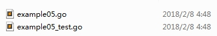
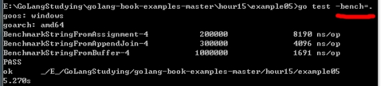
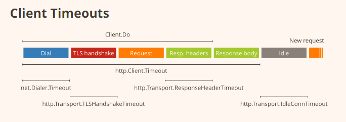

# 备忘录

map,slice,值类型，引用类型？

值拷贝，深拷贝

方法接受者：值类型与指针类型

默认的string等方法

反射


# 常用

|

GOROOT，go语言的安装目录（/go/）

PATH，golang可执行文件目录（%GOROOT/bin/，/go/bin/）

|

- 标识符identifier、关键字keyword、操作符operator
- 字面量literal

|

- 数组array，切片slice。对数组的包装，切片值相当于对底层某个数组的引用：指向数组元素的指针、切片长度、容量；

|

- 闭包（closure）：引用了外部变量的匿名函数。

  函数本身不存储任何信息，与引用环境结合后形成闭包有了记忆性。函数是编译期静态的概念，闭包是运行期动态概念。在某些编程语言中闭包closure也被称为【lambda表达式】

|工作目录GOPATH与包package

- `$GOPATH/src` 所有包源码都放在GOPATH路径src中
- 目录名（常用作包名），相对src路径的最后一级目录 `chapter08/.../.../base`  （最终代码存放位置`$GOPATH/src/chapter08/.../.../base/xx1.go`）

|go 命令

- go build，编译。在包路径下，可以无参编译。

  | -v   | 编译时显示包名       |
  | ---- | -------------------- |
  | -o   | 指定输出目录、文件名 |

- go run，编译并运行。不能编译依赖其他包的文件

- go install，编译安装。编译结果放在`$GOPATH/bin`中，编译生成中间文件放在`$GOPATH/pkg`中。基本同go build

- go get、go test


|占位符

```go
jgt := Point{10,30}
/*
%v 输出结构体 {10 30}
%+v 输出结构体显示字段名 {one:10 tow:30}
	%#v 输出结构体源代码片段 main.Point{one:10, tow:30}
	
%T 输出值的类型			 main.Point
	
%d 输出标准的十进制格式化 100
%t 输出格式化布尔值		 true
%p 输出一个指针的值   &jgt 对应 0xc00004a090

	%b 输出标准的二进制格式化 99 对应 1100011
	%c 输出定整数的对应字符  99 对应 c
	%x 输出十六进制编码  99 对应 63
	
%f 输出十进制格式化  99 对应 63
%.2f
	%e 输出科学技科学记数法表示形式  123400000.0 对应 1.234000e+08
	%E 输出科学技科学记数法表示形式  123400000.0 对应 1.234000e+08
	
%s 进行基本的字符串输出   "\"string\""  对应 "string"
	%q 源代码中那样带有双引号的输出   "\"string\""  对应 "\"string\""

	% 后面使用数字来控制输出宽度 默认结果使用右对齐并且通过空格来填充空白部分
%2.2f  指定浮点型的输出宽度 1.2 对应  1.20
	%*2.2f  指定浮点型的输出宽度对齐，使用 `-` 标志 1.2 对应  *1.20
 */

fmt.Sprintf("%02d", int(dt.Month()))  //零填充

x.Print("", v, "end\n") // 自动调用v.String()进行字符串拼接
x.Println("", v, "end")
```

```go
// 日志
debugLog := log.New(os.Stdout, "", log.LstdFlags|log.Lshortfile)
debugLog.Println("A debug message here")

debugLog.SetPrefix("[Info]")
debugLog.Println("A Info Message here ")

debugLog.SetFlags(log.LstdFlags)
debugLog.Println("A different prefix")

// 错误日志
debugLog = log.New(os.Stderr, "", log.LstdFlags|log.Lshortfile)
debugLog.Println("A err message here")
```


## 包管理

- godep

```
go get -u -v github.com/tools/godep

# 检测项目依赖，从GOPATH中复制到项目vendor目录中
godep save -v

# 网上拉去的项目，可能其没有将vendor中依赖上传，这个时候
godep restore
# 将Godeps目录中记录的依赖包下载到vendor中
```


## 编码rune,byte

golang字符串使用utf-8实现，但是要通过rune类型才可以UTF-8遍历

golang中string底层是通过byte，是ASCII字符编码

[]rune(stringA)

[]byte(stringA)


## 常用package

- flag，解析命令行参数

- strconv     Atoi()


# 环境配置

## 1.Linux安装

**Go**

 

Golang官网下载地址：[**https://golang.org/dl/**](https://golang.org/dl/)

复制对应版本链接

Cd下载目录，使用wget下载压缩包

`wget https://dl.google.com/go/go1.10.3.linux-amd64.tar.gz`

执行tar解压到/usr/loacl目录下，得到go文件夹

`tar -C  /usr/local  -zxvf  go1.10.3.linux-amd64.tar.gz`


```shell
export GOROOT=/usr/local/go
export PATH=$PATH:$GOROOT/bin

//或者一步完成
export path=$path:/usr/local/go/bin
```

 

查看环境变量

go env

go version  查看版本号


 **sublime**

Sublime官网查看最新版本链接 <http://www.sublimetext.com/3>

```shell
~$  wget  https://download.sublimetext.com/sublime_text_3_build_3176_x64.tar.bz2

~$  tar -xvvf  sublime_text_3_build_3176_x64.tar.bz2

//移动解压目录到opt/
~$  sudo mv sublime_text_3  /opt/     
//创建应用链接
~$	sudo ln  -s  /opt/sublime_text_3/sublime_text  /usr/bin/sublime
```


安装package control

View > Show Console 粘贴package安装python脚本

 

手动安装：下安装包


## 1.Windows

**go**

安装msi文件


## 2.配置sublime text

1 **Golang build**

 `package control - install - Golang build`

配置path和Gopath工作路径：`Preferences Preferences > Package Setting > Golang Config > Setting - User`

```json
{
    "PATH": "C:\\Go\\bin",        // go编译器安装路径
    "GOPATH": "E:\\GoProjects\\go_study"   // 项目路径
}
```


//GoSublime没有弄成功

2 **GoSublime**

下载GoSublime到Sublime Text *Packages* directory：

在packages下打开控制台

`git  clone  https://margo.sh/GoSublime`下载并自动解压

 

重启sublime，

配置"use_gs_gopath": true ,默认是false，// if set, whenever possible `GOPATH` will be set to `GS_GOPATH`.

 

tools/build with选择GoSublime即可

 


# 基础知识

## 反射、类型断言

```
value,ok := x.(T) 

switch kind:= obj.(type) {
case
}
```

```
reflect.Type

reflect.Value
```


## 包package

- 大小写权限标识符，包外引用格式：`fmt.Xxx()`，

- 自定义引用名

  ```go 
  import renameLib "xx/xxx/xx"
  renameLib.Add(a, b)
  
  ```
```
  


## 类型、变量

- 强制类型转换

type_name(var)


var s string

var i int

var float32

​```go
var (
	a int
    b string
)
```

 

`reflect.TypeOf(s)`

 

|赋值给未单独声明变量 x :=1


| `var ipv4 [4]uint8 = [4]uint8{192, 168, 0, 2}`


- 切片slice

相同类型的可变长度序列

|指针变量 x *int

 

|常量 const Name string = “Jack”

 |高级数据类型


```go
package main
import (
	"fmt"
	"reflect"
)

type Enum int
const (
	Zero Enum = 0
)

func main() {
	type Cat struct {}

	typeOfCat := reflect.TypeOf(Cat{})
	fmt.Println("Type:", typeOfCat.Name(), ", Kind:", typeOfCat.Kind()) // Cat, struct

	typeOfZero := reflect.TypeOf(Zero)
	fmt.Println("Type:", typeOfZero.Name(), ", Kind:", typeOfZero.Kind()) //Enum, int
}
```


## make

内建函数 make 用来为 slice，map 或 chan 类型分配内存和初始化一个对象(注意：只能用在这三种类型上)，跟 new 类似，第一个参数也是一个类型而不是一个值，跟 new 不同的是，make 返回类型的引用而不是指针，而返回值也依赖于具体传入的类型


## 指针、集合

两种指针：类型指针和切片

 len()  cap()

append()  copy()

```go
var ipv4 [4]uint8 = [4]uint8{192, 168, 0, 2} // 指定容量
var ips = []string{"192.168.0.1", "192.168.0.2"} //声明并初始化切片
ips = append(ips, "192.168.0.3") //为切片操作，一定要赋值回去

ips = make([]string 100)

//删除切片中的元素seq[index]
seq = append(seq[:index], seq[index+1:]...) //...表示将切片所有的元素整个添加在前一个后面
```


- map

  **声明后要初始化（分配内存，或者直接赋值）**
  
  
  
  delete(aMap, keyName)，map专用

```go
var ipSwitches = map[string]bool{} //声明空字典
a_map := make(map[string]int) //声明并定义

//声明并定义
m := map[string]string{
    "W": "forward"
    "A": "left"
}

ipSwitches["xxx"] = true
delete(ipSwitches, "xxx") // map专有函数
v, ok := a_map["a_key"]
```


## **流程控制**

- 没有do-while，只有一个更广义的for

- for和switch都可以包含一条标签(label)语句， 以标识需要终止或继续

- defer语句可以使我们更加方便地执行异常捕获和资源回收任务  

|switch不需要break语句跳出

```go
// 简写
if err := do(); err != nil {}

for ; step > 0; step-- {}

for {
    if xxx {
        break
    }
}

for i <= 10 {
    do()
}

switch a.(type) {
    case "a":
    doA()
    case "b":
    doB()
    case "c", "d", "e":
    doC()
    default:
    doXXX()
}


```


|循环更灵活（复杂），可以goto，break，continue到指定标签


```go
// 代码块与变量作用域，可以重新声明外层代码声明过的标识符
// v被多次声明
var v = "1, 2, 3"

func main() {
	v := []int{1, 2, 3}
	if v != nil {
		var v = 123
		fmt.Printf("%v\n", v) //123
	}
}
```

 

defer延迟执行，只能出现在函数内部

```go
func outerFunc() {
    defer fmt.Println("延迟执行")
    fmt.Println("outer内执行完毕")
}

func p() {
    for i :=0, i<5, i++ {
        defer func() {
            fmt.Println("%d", i)
        }() //匿名函数的写法很有意思，可以直接使用外部函数的变量
    }
}// 输出55555

func p() {
    for i :=0, i<5, i++ {
        defer func(n int) {
            fmt.Println("%d", n)
        }(i) //使用外部函数的变量，最好最为参数传入
    }
}// 输出43210，注意执行顺序


```

 

## 函数

"一等公民"，看做一种类型（或class——类）

|也可把函数视为结构体，实现接口


```go
func isEven(i int) bool {
    return i%2 == 0
}
```

void返回可以不写，可以有多个返回值且可以不带名称

```go
func getPizz() (int, string) {
    n := 3
    s := “very big Pizz”
    return n, s
}
func main() {
    num, name := getPizz()
    Fmt.Printf(“your PizzNum is %v of %v”, num, name )
}
```


不定参数函数

```go
func sumNums(nums...int) int {
	total := 0
	for _, num := range nums {
		total += num
	}
	return total
}
```

 

具名返回值

```go
func sayHi() (x, y string) {
	x = "Hi! "
	y = "I am Jack "
	
	return
}
```

 

函数本身可以作为调用函数的参数

```go
//定义类型type
type binOperator func(a int, b int) (int, error)
//定义具体函数
func myOprerator(a int, b int, theOptor binOperator) (int, error) {
    if theOptor == nil {
        err := errors.New("invalid !")
        return
    }
    return theOptor(a, b)
}


func anotherOne(f func() string) string {
	return f()	
}
func main() {
	f := func() string {
		return "I'm a func"
	}

	fmt.Println(anotherOne(f))
}

//函数名可以作为值，赋给变量
var f func()
f = binOperator
f(a, b)
```


- 匿名函数

```go
f := func(a int) {
    fmt.Println("hello", a)
}
f(101)

```


## 结构体与方法

普通结构体，指针结构体

```go
type T struct {}
var ins T //普通结构体
ins := new(T) //指针型
ins := &T{} //取地址实例化
```


|方法是函数的一种，与某个数据类型（结构体）关联在一起。

模拟面向对象语言的方法，关联的结构体称为“接受器”，方法的作用目标

- 指针类型接收器，方便传递指针，直接修改原对象
- 非指针类型接收器，复制内存，不改变原来的值。

```go
type myInt int

//my_i为接受者变量
func (my_i myInt) add(a int) myInt {
    my_i = my_i + myInt(a)
    return my_i
}

a := myInt(1)
b := a.add(2) //不影响a的值，因为myInt.add()接受者不为指针类型
fmt.Println(a, b)

//=======下面方法声明导致结果变化
func (my_i *myInt) add(a int) myInt {
    *my_i = *my_i + myInt(a)
    return *my_i
}
a := myInt(1) //a是myInt而不是*myInt
b := a.add(2) //等价于(&a).add(2)，自动转化了
fmt.Println(a, b)
```


- 方法与函数视为同一概念

```go
package main
import "fmt"

// 声明一个结构体
type class struct {
}
// 给结构体添加Do方法
func (c *class) Do(v int) {
	fmt.Println("call method do:", v)
}

// 普通函数的Do
func funcDo(v int) {
	fmt.Println("call function do:", v)
}

func main() {
    //声明一个函数
	var delegate func(int) 

	c := new(class)
	delegate = c.Do //把方法当函数赋值
	delegate(100)

	delegate = funcDo
	delegate(100)
}
```


- 匿名结构体

```go
struct {
	Name string `json:"name"`
	Password string `json:"password"`
}{name, password}
```


- 结构体内嵌可以简写

```go
type BasicColor struct { R, G ,B float32 }
type Color struct {
	Basic BasicColor
	Alpha float32
}
var c Color
c.Basic.R

// 简写
type Color struct {
	BasicColor // 子结构体成员展开到父结构体中
	Alpha float32
}

c.R // 完整写法： c.BasicColor.R
```


## 接口

- 接口，定义了一组方法


|空接口（数据）类型  `interface{}`

可以保持任何值；接口类型断言`t,ok := i.(T)`


```go
type Talk interface {
    Hello(name string) string
    Talk(text string) (string, bool, error)
}

//实现接口，1.定义一个数据类型，2.将所有的接口方法与之联系起来
//*myTalk才是接口的实现类
type myTalk string
func (talk *myTalk) Hello(name string) string {
    //implement
}
func (talk *myTalk) Talk(text string) (string, bool, error){
    //implement
}

//多态
var talk Talk = new(myTalk)
//接口类型判断
_, ok := talk.(*myTalk)
```


结构体内嵌，组合实现方法

```go
type Service interface {
    Start()
    Log(string)
}

type Logger struct {
}
func (g *Logger) Log(s string) {
    fmt.Println(s)
}

// Gammer包含一个实现了Log的结构体，再实现一个Start便是一个Service接口
type Gamer struct {
    Logger
}
func (g *Gamer) Start() {}

func main() {
    var s Service = new(Gamer)
    s.Start()
    s.Log("hello, logging now")
}
```


## **异常处理**

```go
err := errors.New("Something went wrong")
if err != nil {
    fmt.Println(err)
}
```


- 自定义错误

```go
//type error interface { Error() string }

type ParseE struct {
    Filename string
    Line int
}
//ParseE是error接口类型
func (e *ParseE) Error() string {
    return fmt.Sprintf("%s: %d", e.Filename, e.Line)
}

// 定义一个抛错误的函数
func newParseE(filename string, line string) error {
    return &ParseE{filename, line} //指针，初始化
}

func main() {
    var e error
    e = newParseE("main.go", 1)
    fmt.Println(e.Error()) //main.go:1
    
    switch detail := e.(type) {
        case *ParseE:
        	fmt.Println("its a parse error!")
        default:
        fmt.Println("other error!")
    }
}
```


- panic与recover

go没有异常系统，panic配合recover可以达到try/catch功能 

panic直接停止运行，debug比较适合使用，无需理会程序后面的逻辑，不需要return手动掐断

```go
func (){
    panic(errors.New("panic happend"))
}()

//检查recover，运行时恐慌时recover()返回非空，与defer配合使用
defer func() {
    if p := recover(); p != nil {
        fmt.Printf("recover panic: %s\n", p)
    }
}()

//
func (s *ss) Token(skipSpace bool, f func(rune) bool) (tok []byte, err error) {
    defer func() {
        if e :=recover(); e != nil {
            if se, ok := e.(scanError); ok {
                err = se.err
            } else {
                panic(e) //放行，扩散恐慌
            }
        }
    }()
    // ...
}
```


## **测试testing**

约定一：测试程序与被测代码在同一目录，而不是单独建立测试目录，测试文件名称以_test.go**结尾**

二：测试函数以Test**开头**

三：**“got-want”**对比输出结果

---

要点概述

```go
package main
import(
	"testing"
    "fmt"
)

func testP1(t *testing.T) {
    //...
}
func testP2(t *testing.T) {
    //...
}
//保证所有测试函数，按顺序执行
func TestAll(t *testing.T){
    t.Run("TestP1", testP1)
    t.Run("TestP2", testP2)
}

//总的测试程序入口，完成初始化等工作
func TestMain(m *testing.M) {
    fmt.Println("Tests begin...")
    m.Run() //必需调用，开启所有测试
}
```


---


```go
//example02.go
package example02

func Greeting(s string) string {
	return ("Hello " + s)
}
```

```go
//example02_test.go
package example02
import "testing"

func TestGreeting(t *testing.T) {
	got := Greeting("George")
	want := "Hello George"
	if got != want {
		t.Fatalf("Expected %q, got %q", want, got)
	}
}
```

**多个数据同时测试技巧**

 

```go
package example04

func translate(s string) string {
	switch s {
	case "en-US":
		return "Hello "
	case "fr-FR":
		return "Bonjour "
	case "it-IT":
		return "Ciao "
	default:
		return "Hello "
	}
}

func Greeting(name, locale string) string {
	salutation := translate(locale)
	return (salutation + name)
}
```

```go
//_test.go
package example04
import "testing"

// 定义测试的结构体
type GreetingTest struct {
	name   string
	locale string
	want   string
}
//结构体的数组
var greetingTests = []GreetingTest{
	{"George", "en-US", "Hello George"},
	{"Chloé", "fr-FR", "Bonjour Chloé"},
	{"Giuseppe", "it-IT", "Ciao Giuseppe"},
}

func TestGreeting(t *testing.T) {
	for _, test := range greetingTests {
		got := Greeting(test.name, test.locale)
		if got != test.want {
			t.Errorf("Greeting(%s,%s) = %v; want %v", test.name, test.locale, got, test.want)
		}
	}
}
```

**基准测试**

对基本的多种自带标准操作进行基准测试，使用自带基准测试框架

 

```go
//example05.go
package example05

import (
	"bytes"
	"strings"
)

func StringFromAssignment(j int) string {
	var s string
	for i := 0; i < j; i++ {
		s += "a"
	}
	return s
}

func StringFromAppendJoin(j int) string {
	s := []string{}
	for i := 0; i < j; i++ {
		s = append(s, "a")
	}
	return strings.Join(s, "")
}

func StringFromBuffer(j int) string {
	var buffer bytes.Buffer
	for i := 0; i < j; i++ {
		buffer.WriteString("a")
	}
	return buffer.String()
}
```

```go
package example05

import "testing"

func TestStringFromAssignment(t *testing.T) {
	got := StringFromAssignment(10)
	want := "aaaaaaaaaa"
	if got != want {
		t.Fatalf("StringFromAssignment(10) = %q, want %q", got, want)
	}
}

func TestStringFromAppendJoin(t *testing.T) {
	got := StringFromAppendJoin(10)
	want := "aaaaaaaaaa"
	if got != want {
		t.Fatalf("StringFromAppendJoin(10) = %q, want %q", got, want)
	}
}

func TestStringFromBuffer(t *testing.T) {
	got := StringFromBuffer(10)
	want := "aaaaaaaaaa"
	if got != want {
		t.Fatalf("StringFromBuffer(10) = %q, want %q", got, want)
	}
}

func BenchmarkStringFromAssignment(b *testing.B) {
	for n := 0; n < b.N; n++ {
		StringFromAssignment(100)
	}
}

func BenchmarkStringFromAppendJoin(b *testing.B) {
	for n := 0; n < b.N; n++ {
		StringFromAppendJoin(100)
	}
}

func BenchmarkStringFromBuffer(b *testing.B) {
	for n := 0; n < b.N; n++ {
		StringFromBuffer(100)
	}
}
```

标准的命令行运行go test，对Test开头测试函数运行：


对Benchmark开头测试函数运行：

 


**查看测试覆盖率**

Go test -**cover** exampelxx.go

对多少函数进行了测试（被测文件增加功能函数后，是否被测试到了，因为测试文件存在没有随之修改的情况）

 

# **重难点**

## **并发与并行**

并发（concurrency）：一个机器同时面临多个事情

 

并行（parallelism）：多个机器同时处理一个事情（这个事情被划分为多个部分，每个机器处理一个部分，可以并发去处理这个部分）

 

实现并发的方式有很多，Node.js、Nginx使用事件循环，JVM使用线程、Apache进程和线程、、Linux操作系统也使用进程和线程；而Golang使用Goroutine这一机制，Goroutine是一个并发抽象

## Goroutine

- 程序启动时，系统默认为main()创建一个goroutine
- 所有goroutine在main()结束时一同终止

```go
func slowFunc() {
	time.Sleep(time.Second * 2)
	fmt.Println("slowFunc() finished")
}

func main() {
	go slowFunc()

	fmt.Println("I'm straight run")

	time.Sleep(time.Second * 3) //不加这一行，main直接返回，slowFunc()得不到执行
}
```

 

 

 

## **通道**

- 通道channel是一种与Goroutine通信的技术

“不要使用共享内存来通信，而通过通信来共享内存”（通信实现共享内存、减少内存占用的目的）

- 通道发送方阻塞，直到数据被接收；接收方一般采用阻塞式。`<-ch`接收但不使用数据，通常通过阻塞收发实现goroutine间的同步。


`c:= make(chan string)` 

`c <- “hello world”`

`msg := <-c`

```go
func slowFunc() {
	time.Sleep(time.Second * 2)
	//fmt.Println(“slowFunc() finished”)
    c <- “slowFunc() finished”
}

func main() {
    c := make(chan string)
	go slowFunc()
	fmt.Println("I'm straight run")
    
msg := <-c    
fmt.Println(msg)

}
```

- 循环接收

  ```go
  for data := range ch {
      //...
      if data ==0 {
          break
      }
  }
  ```

  

Goroutine是非阻塞，立即返回，要阻塞Goroutine得使用其他手段（for循环等）

 

通道读写权限，

func onlyReadChannel(c <-chan string) {}

func onlyWriteChannel(c chan<- string) {}

func readAndWriteChannel(c chan string) {}

 

**select**

```go
select {
	case msg1 := <-channel1 :
		fmt.Println("channel1 received", msg1)
	case msg2 := <-channel2 :
		fmt.Println("channel2 received", msg2)
//func After(d Duration) <-chan Time
	case <-time.After(500 * time.Millisecond) :
		fmt.Println("no message received !")
}
```

 

select退出通道，根据信号，函数直接返回

```go
package main

import (
	"fmt"
	"time"
)

func sender(c chan string) {
	t := time.NewTicker(1 * time.Second)
	for {
		c <- "I'm sending a message"
		<-t.C   //停顿设定时间
	}
}

func main() {
	messages := make(chan string)
	stop := make(chan bool)
	go sender(messages)
	go func() {
		time.Sleep(time.Second * 2)
		fmt.Println("Time's up!")
		stop <- true
	}()  //匿名函数call

	for {
		select {
		case <-stop:
			return
		case msg := <-messages:
			fmt.Println(msg)
		}
	}
}
```

 

 

## 时间time

睡眠

time.Sleep(3 * time.Second)

 

通道中使用超时

```go
package main

import (
	"fmt"
	"time"
)

func main() {
	fmt.Println("You have two seconds to calculate 19 * 4")
	for {
		select {
//**特定时间向通道发送消息**
		case <-time.After(2 * time.Second):
			fmt.Println("Time's up! The answer is 76. Did you get it?")
			return
		}
	}

}
```

 

`倒计时，定时，定点`

周期执行计划任务ticker

```go
package main

import (
	"fmt"
	"time"
)

type Ticker struct {
    C <-chan Time // The channel on which the ticks are delivered.
	// others
}

func main() {
	c := time.Tick(5 * time.Second)
//每五秒打印一次，停不下来
	for t := range c {
		fmt.Printf("The time is now %v\n", t)
	}
}

// 其他用法
ticker := time.NewTicker(5*time.Second)
for range ticker.C {
    
} 

c := time.Tick(5 * time.Second)
for {
    <- c
    go f()
}

func main() {
    var ch chan int
    // 定时任务
    ticker := time.NewTicker(time.Second * 5)
    go func() {
        for range ticker.C {
        fmt.Println(time.Now().Format("2006-01-02 15:04:05"))
        }
        ch <- 1
    }()
    <-ch
}

```


定点任务例子：

```go
func CopyUserInfo() {
   for {
       
      // do something
      fmt.Println("userinfo copy to redis successfully")
      
      ticker := time.NewTicker(time.Hour * 12)
      <-ticker.C
   }

}

// 启动执行一次，此后每天零点执行
func startTimer(f func()) {
go func() {
    for {
        f()
        now := time.Now()
        // 计算下一个零点
        next := now.Add(time.Hour * 24)
        next = time.Date(next.Year(), next.Month(), next.Day(), 0,0,0,0,next.Location())
        t := time.NewTimer(next.Sub(now)) // 这里是倒计时
        <-t.C
    }
}()
}
```


- time.Timer,  time.Ticker,  有一个成员C，为chan类型

```go
package main

import (
	"fmt"
	"time"
)

func main() {
	ticker := time.NewTicker(time.Millisecond * 500)
	stopper := time.NewTimer(time.Second * 2)

	var i int
	for {
		// 多路复用通道
		select {
            
		case <-stopper.C: // 计时器到时了
			fmt.Println("stop")
			// 跳出循环
			goto StopHere

		case <-ticker.C: // 打点器触发了
			i++
			fmt.Println("tick", i)
		}
	}

	// 退出的标签，使用goto跳转，注意缩进
StopHere:
    fmt.Println("time out: done")

}
```

## 其他同步操作

atomic原子访问、sync.Mutex互斥锁、sync.WaitGroup等待组

```go
package main
import (
	"fmt"
	"sync"
)

var (
	count int
	countGuard sync.Mutex
)

func GetCount() int {
	countGuard.Lock()
	defer countGuard.Unlock()

	return count
}
func SetCount(c int) {
	countGuard.Lock()
	count = c
	countGuard.Unlock()
}

func main() {
	SetCount(1)
	fmt.Println(GetCount())
}
```

```go
package main
import (
	"fmt"
	"net/http"
	"sync"
)

func main() {

	// 声明一个等待组
	var wg sync.WaitGroup

	// 准备一系列的网站地址
	var urls = []string{
		"http://www.github.com/",
		"https://www.qiniu.com/",
		"https://www.golangtc.com/",
	}
    
	// 遍历这些地址
	for _, url := range urls {

		// 任务计数，并开启一个并发routine执行
		wg.Add(1)
		go func(url string) {

			// ！先处理等待组：使用defer，表示函数完成时将等待组值减1
			defer wg.Done()

			// 使用http访问提供的地址
			_, err := http.Get(url)
			fmt.Println(url, err)
		}(url)
	}

	// 等待所有的任务完成
	wg.Wait()
    
	fmt.Println("over")
}
```


## 并发同步例子

1. 并发打印，生产-消费

```go
package main
import (
	"fmt"
)

func printer(c chan int) {
	for {
		data := <-c

		if data == 0 {
			break
		}

		fmt.Println(data)
	}

	// 通知main已经结束循环（我搞定了！）
	c <- 0
}

func main() {
	c := make(chan int)
	
    //消费者
	go printer(c)
	
    //生产者
	for i := 1; i <= 5; i++ {
		c <- i
	}
	
	// 通知并发的printer结束循环（没数据啦！）
	c <- 0
	
	// 等待printer结束（搞定喊我！）
	<-c
}
```


任务队列，chan数据通信

```go
var tasks []string

buffCh := make(chan *ResultStruct, len(tasks))

var wg sync.WaitGroup
wg.add(len(tasks))

for _, task := range tasks {
    go func() {
        defer wg.Done()
        
        res := doTask(task)
        buffCh <- res
    }()
}

ch := make(chan interface{})

go func() {
    wg.Wait()
    close(ch)
} ()

var isTimeout bool
var dataNum int = len(tasks)
select {
case <-ch:
    isTimeout = false
case <-time.After(10 * time.Second):
    isTimeout = true
    dataNum = len(buffCh)
}

var res []*ResultStruct
for i:=0; i<dataNum; i++ {
    data := <- buffCh
    res = append(data)
}
```


```go
package pool

import (
	"sync"
)

// WorkFunc represents a function to invoke from a worker. The parameter is passed on the side
// to avoid creating closures and allocating.
type WorkFunc func(param interface{})

// GoroutinePool represents a set of reusable goroutines onto which work can be scheduled.
type GoroutinePool struct {
	queue          chan work      // Channel providing the work that needs to be executed
	wg             sync.WaitGroup // Used to block shutdown until all workers complete
	singleThreaded bool           // Whether to actually use goroutines or not
}

type work struct {
	fn    WorkFunc
	param interface{}
}

// NewGoroutinePool creates a new pool of goroutines to schedule async work.
func NewGoroutinePool(workers int, queueDepth int, singleThreaded bool) *GoroutinePool {
	gp := &GoroutinePool{
		queue:          make(chan work, queueDepth),
		singleThreaded: singleThreaded,
	}

	gp.AddWorkers(workers)
	return gp
}

// Close waits for all goroutines to terminate (and implements io.Closer).
func (gp *GoroutinePool) Close() error {
	if !gp.singleThreaded {
		close(gp.queue)
		gp.wg.Wait()
	}
	return nil
}

// ScheduleWork registers the given function to be executed at some point. The given param will
// be supplied to the function during execution.
//
// By making use of the supplied parameter, it is possible to avoid allocation costs when scheduling the
// work function. The caller needs to make sure that function fn only depends on external data through the
// passed in param interface{} and nothing else.
//
// A way to ensure this condition is met, is by passing ScheduleWork a normal named function rather than an
// inline anonymous function. It's easy for code in an anonymous function to have (or gain) an accidental
// reference that causes a closure to silently be created.
func (gp *GoroutinePool) ScheduleWork(fn WorkFunc, param interface{}) {
	if gp.singleThreaded {
		fn(param)
	} else {
		gp.queue <- work{fn: fn, param: param}
	}
}

// AddWorkers introduces more goroutines in the worker pool, increasing potential parallelism.
func (gp *GoroutinePool) AddWorkers(numWorkers int) {
	if !gp.singleThreaded {
		gp.wg.Add(numWorkers)
		for i := 0; i < numWorkers; i++ {
			go func() {
				for work := range gp.queue {
					work.fn(work.param)
				}

				gp.wg.Done()
			}()
		}
	}
}

```


# 时间time

```go
zoneLocation, _ := time.LoadLocation("Asia/Shanghai")
y, m, _ := time.Now().In(zoneLocation).Date()

// 获取当月10号，然后再获取上月10号
// 不能直接在当前日期上面AddDate(0, -1, 0)，比如10-31，减成9-31，依然是10月份
y, m, _ := nowInConfigZone().Date()
t := time.Date(y, m, 10, 0, 0, 0, 0, zoneLocation)
t = t.AddDate(0, -1, 0)
```


# go与操作系统

```go
// 创建一个接收os.Signal系统信号的通道
quit := make(chan os.Signal, 1)

// kill 默认会发送 syscall.SIGTERM 信号    
// kill -2 发送 syscall.SIGINT 信号，我们常用的Ctrl+C就是触发系统SIGINT信号    
// kill -9 发送 syscall.SIGKILL 信号，但是不能被捕获，所以不需要添加它    
// signal.Notify把收到的syscall.SIGINT或syscall.SIGTERM信号转发给quit    
signal.Notify(quit, syscall.SIGINT, syscall.SIGTERM)
<-quit
```


# CLI命令行

Go命令行程序_布史之铭-CSDN博客  https://blog.csdn.net/Gusand/article/details/103749022

```go
var (
	help bool
	user string
)

func init() {
	for i, arg := range os.Args {
		fmt.Printf("[%d]: %s\n", i, arg)
	}
	flag.BoolVar(&help, "h", false, "help")
	flag.StringVar(&user, "u", "admin", "admin name")

	flag.Parse()
	flag.Usage = func() {
		fmt.Fprintf(os.Stderr, `
Usage: command [-h help]
Options:
`)
		flag.PrintDefaults()
	}
	if help {
		flag.Usage()
		os.Exit(0)
	}
}

func main() {
	fmt.Printf("hello world")
}
```


# io文件处理

Golang读写文件的几种方式 - 简书  https://www.jianshu.com/p/7790ca1bc8f6

```go
// 读文件，io/ioutil
func ReadFile(filename string) ([]byte, error)

// 写文件
name := "./filename.txt"
file, _ := os.OpenFile(name, os.O_RDWR|os.O_CREATE|os.O_APPEND, 0644)
defer file.Close()

var sb bytes.Buffer
sb.WriteString("long text ...")
file.WriteString(sb.String())
```


# SQL数据库DB

标准库接口`database/sql`，驱动实现`go-sql-driver/mysql`

```go
var mysqlDB *sql.DB

func init() {
	dsn = "root:root@/db_name?charset=utf8"

	var err error
	mysqlDB, err = sql.Open("mysql", dsn)
    // ...
}
```


```go
//最大连接周期，超过时间的连接就close，要小于数据库设置的Conn最大时间
mysqlDB.SetConnMaxLifetime(100 * time.Second)
//设置最大连接数
mysqlDB.SetMaxOpenConns(100)
//设置最大闲置连接数
mysqlDB.SetMaxIdleConns(16)


// DSN, data source name
dsn := "username:pswd@tcp(localhost:3306)/dbname?charset=utf8&parseTime=True&loc=Local"
// golang-sql - mysql时区对应关系
// UTC - UTC  //loc默认UTC
// PRC - CST
// Local - CST // 北京Local为东八区
// GMT - GMT
```


## gorm

```
func setGormDB(db *gorm.DB) {
	// 最大负载
	db.DB().SetMaxOpenConns(100)
	// 预备用的闲置Conn
	db.DB().SetMaxIdleConns(10)
	// 单个连接最长时间，要小于数据库设置的最长生存时间
	db.DB().SetConnMaxLifetime(time.Hour)
}
```


```
`gorm:"foreignKey:xxx_name"`
`gorm:"primary_key;index;unique"`
```


```go
db.HasTable("tableName")

// 使用User结构体创建名为`deleted_users`的表
db.Table("deleted_users").CreateTable(&User{})

// - 多行结果Rows，通用
var users []User
rows, _ := db.Raw("SELECT * FROM users").Rows()
for rows.Next() {
    var user User
    db.ScanRows(rows, &user) // 结构体字段一一赋值
    users = append(users, user)
}

// 少数字段可以逐个赋值
rows, _ := db.Raw("SELECT id, name FROM users").Rows()
for rows.Next() {
    var id, name string
    rows.Scan(id, name) // 逐个字段赋值
    users = append(users, user)
}
```


分表后，需要指定table

```go
// 对于不存在的记录，用这个插入
err = s.db.Table(table).Create(target).Error

// 查找
if db.Table(table).First(&Event{}, "kube_index = ?", index).RecordNotFound() {}

// 更新全部字段，可以选择忽略某些Omit("update_at")

// 不要在分表的场景下使用Save更新
// 如果更新的记录主键不存在，或者记录没有任何字段变化，则插入模型对应的表名中User-》user，table指定无效表名
err = db.Table(table).Save(target).Error

// 使用updates，更新结构体，要用where指定主键
db.Table(table).Where("kube_index=?", dst.KubeIndex).Updates(dst)
// 使用 struct 更新时，只会将非零值字段刷新到数据库，若想更新所有字段，请使用map[string]interface{}
db.Table(table).Where("kube_index=?", dst.KubeIndex).Updates(map[string]interface{}{"name": ""}) // 刷新DB该记录的name为空
```


# web网络编程





## web基础在golang

- net/hhtp

```go
func main() {
	http.HandleFunc("/", handler)
	err := http.ListenAndServe(":8895", nil)
	if err != nil {
		fmt.Println("start http server error: ", err)
	}
}

func handler(w http.ResponseWriter, r *http.Request) {
	fmt.Fprintf(w, "hello")
}
```


- context

上下文，升级版的goroutine消息传递channel，方便父routine控制子routine


## fasthttp

```go
ctx *fasthttp.RequestCtx
ctx.QueryArgs().Peek()
ctx.UserValue("urlArg")
ctx.PostBody()
```


## beego

```bash
bee version
bee api apiproject
bee run  # 热发布，修改后无需再次启动程序
bee pack

# 自动化生成文档
bee run -gendoc=true -downdoc=true
```


注解路由，`[options,get]`里面逗号分隔，不能带空格！！

```go
// @router /staticblock/:key [options,get]
func (this *CMSController) StaticBlock() {

}

// 并在 router.go 中通过如下方式注册路由：
beego.Include(&CMSController{})
```


过滤，重定向

```go
beego.InsertFilter("/*", beego.BeforeRouter, FilterUser)

if ctx.Request.Method == "OPTIONS" {
    // ctx.Abort(200, "Network is ok")
    ctx.Output.Body([]byte("Network is ok"))
    return
}
```


## Json Patch

`type. JSONPatchType`           PatchType = "application/json-patch+json"

带上操作json，适合删除改变现有json格式：`[{"op":"remove", "path":"/metadata/annotations/key1" }]`

是一组操作。


`type.MergePatchType`          PatchType = "application/merge-patch+json"

直接覆盖替换，没有则创建，json要从`"metadata": {`开始


# 正则

```go
import "regexp"
myReg := regexp.MustCompile(`^\s+$`)
myReg.MatchString(str)
regexp.MatchString(exp, testStr)

regexp.MustCompile(`New size: (.*);`).FindStringSubmatch(testStr)
```


# pprof

```
"net/http"
_ "net/http/pprof"

go func(){
	http.ListenAndServe("0.0.0.0:6060", nil)
}()
```


// 浏览器查看并下载文件

```
go tool pprof -h
go tool pprof -http :1234 http://url/pprof/heap
```


// 分析文件，进入命令模式

```
go tool pprof xxxx.pb.gz
--help
--top
--ps
```


