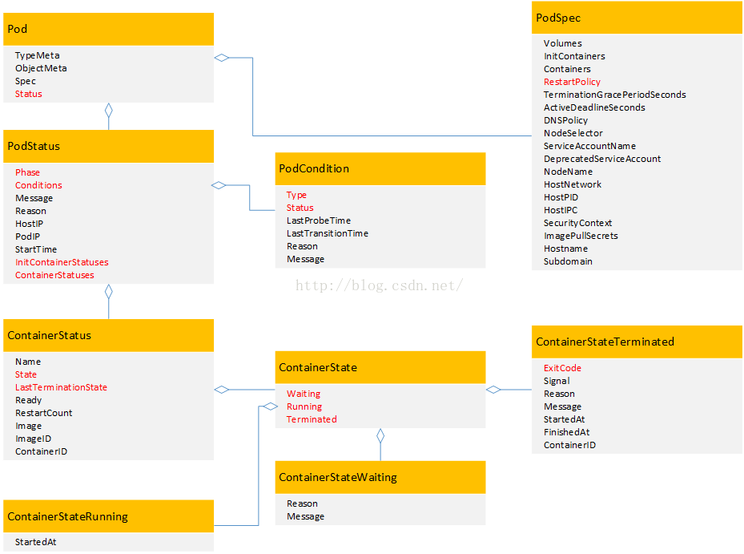
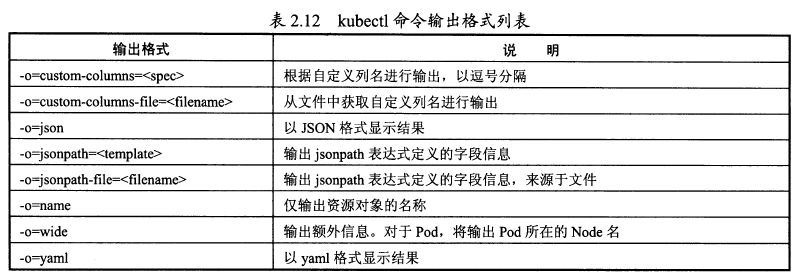
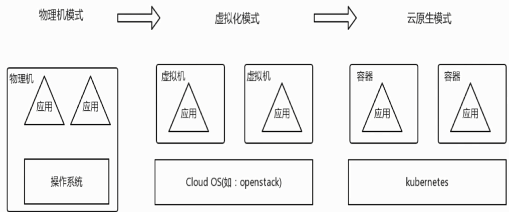
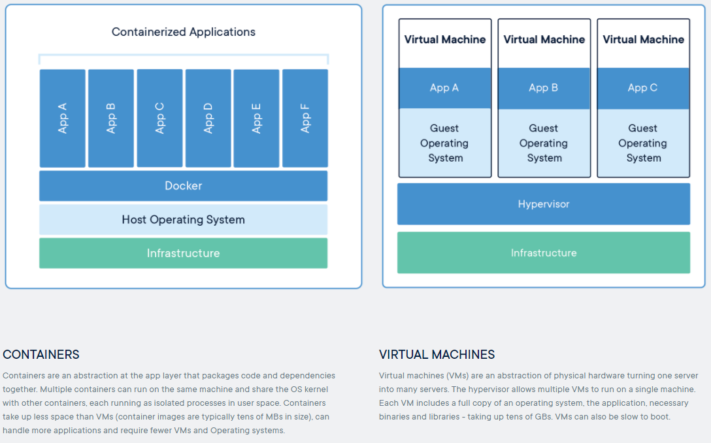
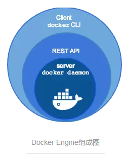
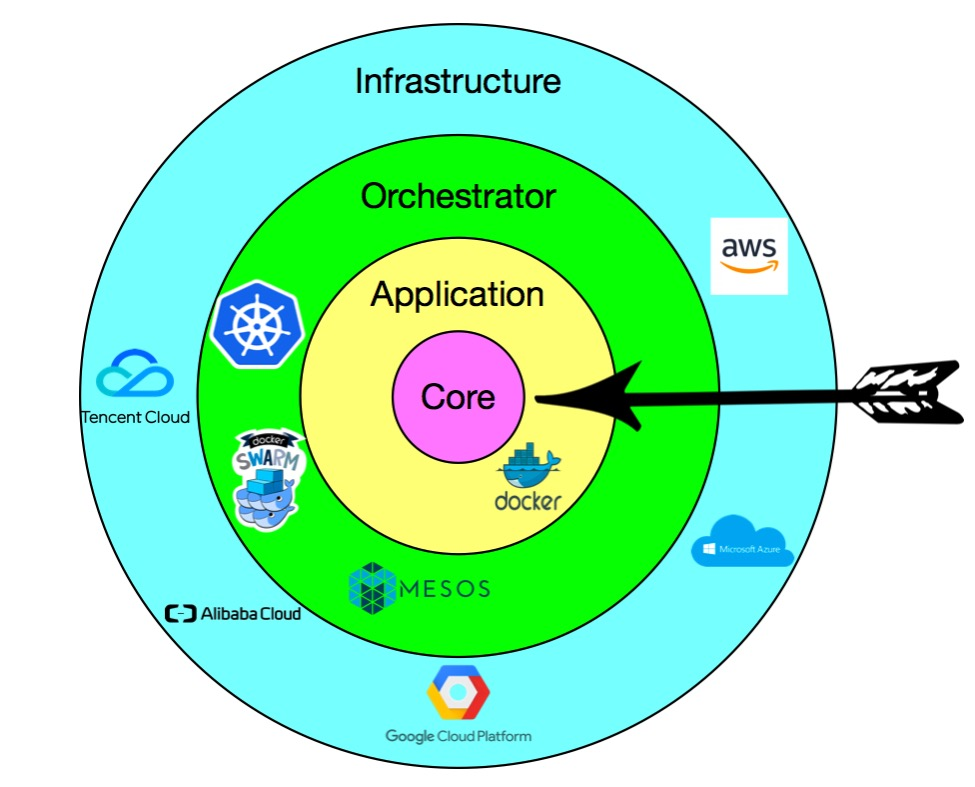
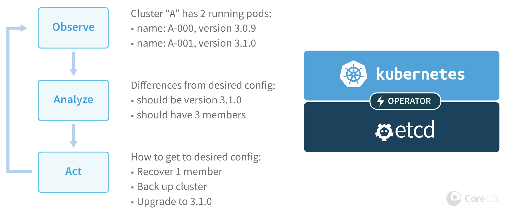
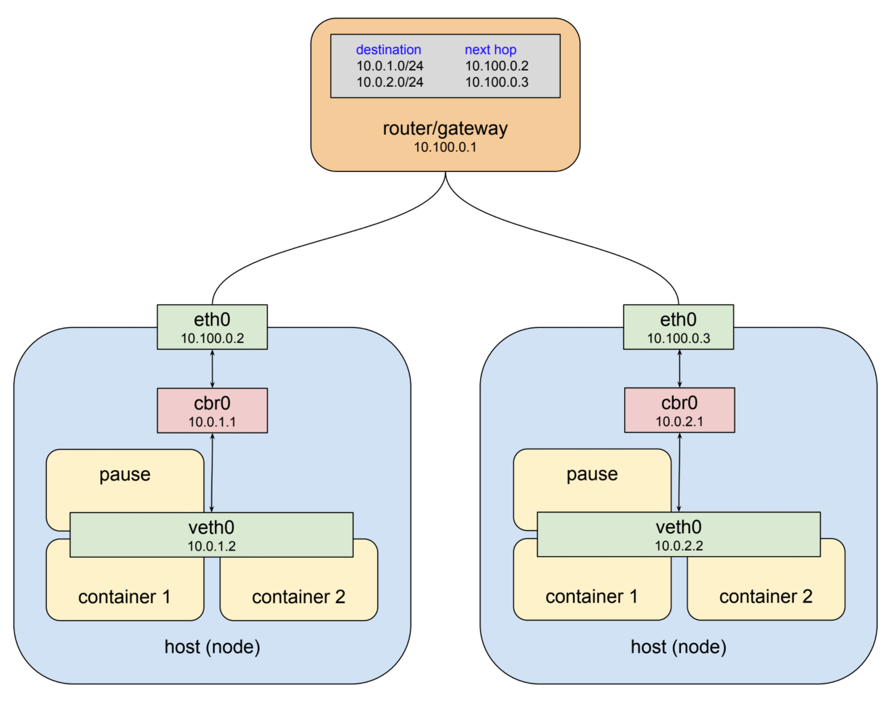
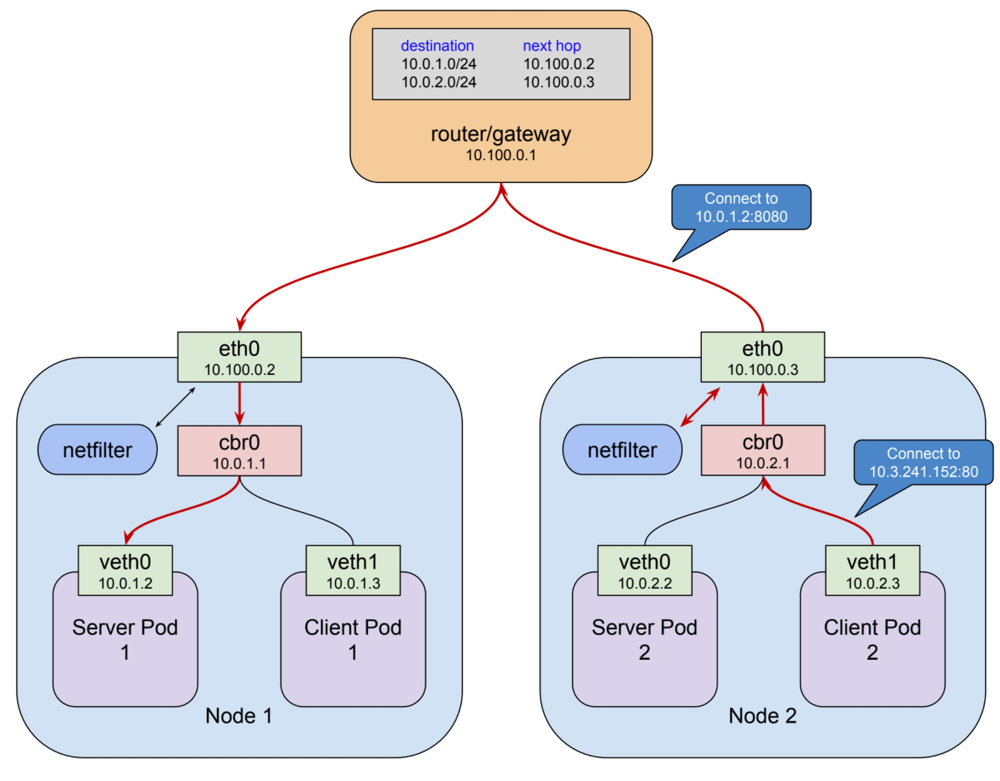

# 索引

```bash
# 重建一个pod
kubectl replace --force -f xxx.yaml
kbuectl edit deploy/xxx
```


## 生命周期



```go
type PodStatus struct {
	Phase PodPhase 				 // 一个
	Conditions []PodCondition    // 多个condition
	Reason string
    NominatedNodeName string
	HostIP string
	PodIPs []PodIP
	StartTime *metav1.Time
	QOSClass PodQOSClass
	InitContainerStatuses []ContainerStatus
	ContainerStatuses []ContainerStatus
	EphemeralContainerStatuses []ContainerStatus
}

// phase阶段：pod.Status.Phase
PodPending PodPhase = "Pending" 已经创建pod，但里面容器未没有全部创建，可能在下载镜像
PodRunning PodPhase = "Running" 容器都已创建，且至少有一个容器在运行，或启动、重启过程中
PodSucceeded PodPhase = "Succeeded" 所有container成功terminated，而且不会重启
PodFailed PodPhase = "Failed" 有容器退出为失败状态
PodUnknown PodPhase = "Unknown" 无法获取pod状态，可能网络不通

type PodCondition struct {
	Type   PodConditionType
	Status ConditionStatus
	LastProbeTime metav1.Time
	LastTransitionTime metav1.Time
	Reason string
	Message string
}
PodScheduled PodConditionType = "PodScheduled"
PodReady PodConditionType = "Ready"
PodInitialized PodConditionType = "Initialized"
PodReasonUnschedulable = "Unschedulable"
ContainersReady PodConditionType = "ContainersReady"

type ContainerStatus struct {
	Name string `json:"name" protobuf:"bytes,1,opt,name=name"`
	State ContainerState `json:"state,omitempty" protobuf:"bytes,2,opt,name=state"`
	LastTerminationState ContainerState
	Ready bool `json:"ready" protobuf:"varint,4,opt,name=ready"`
	RestartCount int32 `json:"restartCount" protobuf:"varint,5,opt,name=restartCount"`
	Image string `json:"image" protobuf:"bytes,6,opt,name=image"`
	ImageID string `json:"imageID" protobuf:"bytes,7,opt,name=imageID"`
	ContainerID string
	Started *bool
}
type ContainerState struct {
	Waiting *ContainerStateWaiting
	Running *ContainerStateRunning
	Terminated *ContainerStateTerminated
}


Added    EventType = "ADDED"
Modified EventType = "MODIFIED"
Deleted  EventType = "DELETED"
Error    EventType = "ERROR"
```


kubectl 打印pod的代码为

```
func printPod(pod *api.Pod, options printers.GenerateOptions) ([]metav1.TableRow, error) 
```

```
Pending
ContainerCreating
Running
Terminating
```


## Resource Quota

1. - Resource Quota是用来限制用户资源使用量的一种机制
   - Resource Quota应用在namespace上，并且每个namespace最多只能有一个ResourceQuota对象
   - 开启计算Resource Quota后，创建容器的时候必须配置计算资源请求或限制
   - 用户超额后禁止创建新的资源


作用资源对象：Pod, RC, configmap, secret


# docker命令

- 修改bash命令行格式

```bash
vim ~/.bashrc
#最后一行增加：
PS1="\[\e[32;40m\][\u@\h \W]\$\e[m "
# export PS1="..." 作用范围此次登录

sudo echo "PS1=\"\[\e[32;40m\][\u@\h \W]\\$\e[m \"" >> ~/.bashrc
source ~/.bashrc
```


`docker run --rm -v c:/Users:/data ubuntu ls /data`


```shell
docker ps
docker ps -a

docker run -it --rm ubuntu  //-t进入终端，-i获得交互式输入
```


- 常用命令

容器

```bash
#创建一个新的容器，并启动，运行一个命
docker run [OPTIONS] IMAGE [COMMAND] [ARG...]
--name="nginx-lb"

#创建一个新的容器但不启动它
docker create --name myrunoob nginx
docker start/stop/restart/kill/pause/unpause [OPTIONS] CONTAINER [CONTAINER...]
docker rm  #使用时查看详情[-f][-l][-v]

# 运行的container
docker ps
docker ps [-a][-q]
# 获取容器/镜像的元数据，详细信息
docker inspect
# top查看进程信息。容器运行时不一定有/bin/bash终端来交互执行top命令，而且容器还不一定有top命令
docker top xx
docker diff : 检查容器里文件结构的更改。

docker cp :用于容器与主机之间的数据拷贝。
```


镜像

```bash
docker image ls
docker pull
docker push
docker rmi
docker history : 查看指定镜像的创建历史。

docker commit :从容器创建一个新的镜像。
-a :提交的镜像作者；
-c :使用Dockerfile指令来创建镜像；
-m :提交时的说明文字；
-p :在commit时，将容器暂停。

docker build 命令用于使用 Dockerfile 创建镜像。
```


# k8s命令

```bash
# kubectl completion bash # 输出补全脚本
# sudo apt-get install bash-completion
source <(kubectl completion bash) # 自动补全设置

kubectl --help |grep xxx
kubectl options
kubectl cluster-info
kubectl config view (--flatten)

kubectl get cs # 查看组件
kubectl api-resources # 查看所有api资源
kubectl explain Deployment.spec

-o custom-columns='<header>:<jsonpath>[,<header>:<jsonpath>]...'
kubectl get pods -o custom-columns='name:metadata.name,node:spec.nodeName'
```


```bash
# 常用
kubectl get— 显示有关一个或多个资源的信息
kubectl describe—显示关于一个或多个资源的详细信息

kubectl apply—创建或选择一个资源
kubectl delete—删除一个或多个资源

kubectl logs—显示容器日志
kubectl exec -it container sh —进入容器中执行进程
# ls /var/run/secrets/kubernetes.io/serviceaccount/

# deployment
kubectl scale deployments/xxx --replicas=2
kubectl set image deployments/xxx xxx=xxx:v2
kubectl rollout undo deployments/xxx
```

apply

这一命令可以通过文件名或控制台输入，对资源进行配置。并且apply能够对集群资源进行声明式管理：如果资源不存在，apply将创建它；如果它存在，apply将更改它。此外，apply还能够添加Service到适用的资源或者通过添加Pod自动化弹性伸缩的Deployment。

请注意，你可以使用create来创建一个Deployment并且使用expose创建一个Service。但相对来说，无论对于文件本身还是之后需要重新使用来说，使用带有apply的YAML文件是更好选择。apply是创建和更新资源的“瑞士军刀”。


```
pods （po）
nodes（no）
services（svc）

deployments （deploy）
replicasets（rs）

daemonsets（ds）
statefulsets（sts）
jobs

cronjobs（cj）

persistentvolumes（pv）
persistentvolumeclaim （pvc）
```


```bash
# 本地开启 proxy 访问api server
kubectl proxy --port=8080

# 查看版本
kubectl version
# 根据文件创建resource
kubectl create -f filename
kubectl create -f filepath/
# create创建，可以串上多个file
kubectl create -f my-service.yaml -f my-rc.yaml
kubectl create -f <directory> # 目录下所有yaml

# expose将一个资源包括pod、Replication Controller、service、deployment等公开为一个新的service
kubectl expose deployment <deployName> --name=service-name --port=81 --target-port=80 --type=NodePort
# 

# cluster-info 查看集群信息
kubectl cluster-info
# config命令
kubectl config view

# get 查看
kubectl get nodes/pods/rc/ser --namespace=n [source_name] -o=wide/yaml 
# describe 高级查看
kubectl describe node/pod node_name # 不加name查所有
# explain 文档
kubectl explain pods

# 更新
kubectl set image deployment/name nginx=nginx:1.9.1
kubectl edit pod/po-nginx-btv4j  # 更新此资源，打开yaml
kubectl label pods my-pod new-label=newlabel
kubectl annotate pods my-pod icon-url=http://……
# delete删除
kubectl delete -f pod.yaml
kubectl delete po podname --now 

# deployment
kubectl run deployname -image=busybox --command -- ping baidu.com
kubectl expose deployment <name> --port=81 --type=NodePort --target-port=80 --name=service_name 

# exec 执行Pod里面的容器
kubectl exec -it <pod-name> -c <container-name> /bin/bash

# 高级命令
## patch
#如果一个容器已经在运行，这时需要对一些容器属性进行修改，又不想删除容器，或不方便通过replace的方式进行更新。kubernetes还提供了一种在容器运行时，直接对容器进行修改的方式，就是patch命令。 例如已存在一个pod的label为app=nginx1，如果需要在运行过程中，将其修改为app=nginx2。
kubectl patch pod podname -p '{"metadata":{"lables":{"app":"nginx1"}}}'

```


[flag]可选参数之：指定命令输出格式




# yaml

生成yaml文件

```bash
kubectl create deployment nginx --image=nginx -o yaml --dry-run  |less 
$ kubectl create -h |grep dry
      --dry-run=false: If true, only print the object that would be sent, without sending it
```


持久化、用于表示集群状态的实体，使用yaml文件描述对象


```yaml
apiVersion: v1
kind: Pod

metadata:

spec:

# 运行时字段
status:

```


```
// yaml表示
containers:
  - env:
    - name: app_name
      value: front
    - name: group_name
      value: sfad


// json表示
 "containers": [
            {
                "env": [
                    {
                        "name": "app_name",
                        "value": "front"
                    },
                    {
                        "name": "group_name",
                        "value": "sfad"
                    },
                    // ..
                ],
                "image": "",
                "imagePullPolicy": "IfNotPresent",
                "name": "front",
                // ...
],
```


# 背景：应用部署模式变迁

（~2000）物理单机|——》（2001~2009）虚拟化初期：IaaS基础设施服务|——》（2010）OpenStack出现，IaaS平台快速发展，服务多元化PaaS、SaaS，部署形式上云平台

同时，基于VM云计算成熟，缺点出现，（2013）容器的虚拟化技术出现，计算基本单元从VM变为容器。

云原生：应用的容器化和微服务化，以及容器作为应用部署、运行、管理的基本单位，借助容器管理自动化平台进行动态编排和资源优化利用。




由于容器的轻量化，容器能解决的根本问题就是提升效率和速度。Docker 宣称的是Build, Ship and Run anywhere，只是从速度、效率和可移植性来讲的。

但是，云计算一直要解决的是什么问题——水平扩展，水平扩展是不是就需要很多的结点。对了，Docker会成为云计算的基础架构，这才是docker这么火的根本原因。


VM：虚拟出硬件；

docker：在操作系统层面（硬件之上）对进程进行封装隔离

传统虚拟机技术是虚拟出一套硬件后，在其上运行一个完整操作系统，在该系统上再运行所需应用进程；

而容器内的应用进程直接运行于宿主的内核，**容器没有自己的内核，而是作为文件系统被挂载到内核上**，而且也没有进行硬件虚拟。因此容器要比传统虚拟机更为轻便；





- Docker-engine

通常我们提Docker的时候，都指的是Docker-engine，docker-engine就是运行在主机上的一个守护进程，类似于于Hyper-V的管理程序。



Docker-engine是C/S的架构，daemon就是它的server

daemon可以监听在某一个socket端口上，被远程CLI调用，也可以监听到unix本地socket之上供本地CLI

而client也可以操作本机的daemon和远程的daemon。当操作远程daemon的时候，需要在client后面跟IP、端口以及TLS证书。

- 容器是什么

　　谈到容器，很多人会把它当成是一个主机。这其实是错误的。容器在主机上（无论是什么操作系统的主机）就是一个进程，但是它有不同于普通的进程。

普通的进程之间是共用的CPU、内存、网络、PID等资源，而容器是隔离的进程，它运行在一个沙盒之中，同时还能限定它所使用的资源。

Docker最初原生只支持Linux系统的主机，借助于Linux Kernel的CGroup和Namespace虚拟化技术LXC，实现上面容器（主机进程）的隔离。因此，所谓的跨平台支持也只是通过Linux VM来远程操控。后来，Windows Server 2016已经加入了对Docker的原生支持。Docker从 0.7 版本以后开始去除 LXC，转而使用自行开发的 [libcontainer](https://github.com/docker/libcontainer)，从 1.11 开始，则进一步演进为使用 [runC](https://github.com/opencontainers/runc) 和 [containerd](https://github.com/containerd/containerd)。

CGroup可以控制进程使用多少资源，如：CPU、内存、磁盘IO速率等，Namespace用来隔离资源，如：PID、网络、主机名等。


-- -

Docker 包括三个基本概念

镜像（ Image  ）
容器（ Container  ）
仓库（ Repository  ）

- 镜像Image

操作系统分为内核和用户空间。对于 Linux 而言，内核启动后，会挂载  **root文件系统**为其提供用户空间支持。而 Docker 镜像（Image），就相当于是一个  root  文件系统。比如官方镜像  ubuntu:16.04  就包含了完整的一套 Ubuntu 16.04 最小系统的  root  文件系统。

**Docker 镜像是一个特殊的文件系统**，除了提供容器运行时所需的程序、库、资源、配置等文件外，还包含了一些为运行时准备的一些配置参数（如匿名卷、环境变量、用户等）。镜像不包含任何动态数据，其内容在构建之后也不会被改变。

因为镜像包含操作系统完整的  root  文件系统，其体积往往是庞大的，因此在 Docker 设计时，就充分利用 Union FS 的技术，将其设计为**分层存储**的架构。所以严格来说，镜像并非是像一个 ISO 那样的打包文件，镜像Image只是一个虚拟的概念，其实际体现并非由一个文件组成，而是由一组文件系统组成，或者说，由**多层文件**系统联合组成。

镜像构建时，会一层层构建，前一层是后一层的基础。每一层构建完就不会再发生改变，后一层上的任何改变只发生在自己这一层。比如，删除前一层文件的操作，实际不是真的删除前一层的文件，而是仅在当前层标记为该文件已删除。在最终容器运行的时候，虽然不会看到这个文件，但是实际上该文件会一直跟随镜像。因此，在构建镜像的时候，需要额外小心，每一层尽量只包含该层需要添加的东西，任何额外的东西应该在该层构建结束前清理掉。

- 容器Container

镜像（ Image  ）和容器（ Container  ）的关系，就像是面向对象程序设计中的`  类 ` 和  `实例`一样，镜像是静态的定义，容器是镜像运行时的实体。容器可以被创建、启动、停止、删除、暂停等。

**容器的实质是进程**，但与直接在宿主执行的进程不同，容器进程运行于属于自己的独立的命名空间namespace。因此容器可以拥有自己的root文件系统、自己的网络配置、自己的进程空间，甚至自己的用户 ID 空间。容器内的进程是运行在一个隔离的环境里，使用起来，就好像是在一个独立于宿主的系统下操作一样。这种特性使得容器封装的应用比直接在宿主运行更加安全。也因为这种隔离的特性，很多人初学 Docker 时常常会混淆**容器和虚拟机**。

镜像是多层存储，每一层是在前一层的基础上进行的修改；而容器同样也是多层存储，是在以镜像为基础层，加容器运行时的存储层。

容器不应该向其存储层内写入任何数据，容器存储层要保持无状态化。所有的文件写入操作，都应该使用 数据卷（Volume）、或者绑定宿主目录，在这些位置的读写会跳过容器存储层，直接对宿主（或网络存储）发生读写，其性能和稳定性更高。

- 仓库Repository

如果需要在其它服务器上使用这个**镜像**，我们就需要一个集中的存储、分发镜像的服务，Docker Registry 就是这样的服务。

一个 Docker Registry 中可以包含多个仓库（ Repository  ）；每个仓库可以包含多个标签（ Tag  ）；每个标签对应一个镜像。

通常，一个仓库会包含同一个软件不同版本的镜像，而标签就常用于对应该软件的各个版本。我们可以通过  `仓库名:标签` 的格式来指定具体是这个软件哪个版本的镜像。如果不给出标签，将以 ` latest ` 作为默认标签。

---

- Union FS（FileSystem）

每个镜像都由很多层次构成，Docker 使用 Union FS 将这些不同的层结合到一个镜像中去.通常 Union FS 有两个用途, 一方面可以实现不借助 LVM、RAID 将多个 disk 挂到同一个目录下；另一个更常用的就是将一个只读的分支和一个可写的分支联合在一起


---

- Docker 采用了  C/S  架构

包括客户端和服务端。Docker 守护进程 （Daemon）作为服务端接受来自客户端的请求，并处理这些请求（创建、运行、分发容器）。

Docker 守护进程一般在宿主主机后台运行，等待接收来自客户端的消息。Docker 客户端则为用户提供一系列可执行命令，用户用这些命令实现跟 Docker 守护进程交互。

客户端和服务端既可以运行在一个机器上，也可通过  socket  或者  RESTful API  来进行通信。


- Linux内核的命名空间namespaces和控制组cgroups

命名空间namespaces提供了最基础也是最直接的隔离，在容器中运行的进程不会被运行在主机上的进程和其它容器发现和用。

控制组cgroups是 Linux 容器机制的另外一个关键组件，负责实现资源的审计和限制。

- 终极目标是改进 2 个重要的安全特性：
  - 将容器的 root 用户映射到本地主机上的非 root 用户，减轻容器和主机之间因权限提升而引起的安全问题；
  - 允许 Docker **服务端**在非 root 权限下运行，利用安全可靠的子进程来代理执行需要特权权限的操作。这些子进程将只允许在限定范围内进行操作，例如仅仅负责虚拟网络设定或文件系统管理、配置操作等。

- 内核的能力机制Capability

能力机制（Capability）是 Linux 内核一个强大的特性，可以提供细粒度的权限访问控制。Linux 内核自 2.2 版本起就支持能力机制，它将权限划分为更加细粒度的操作能力，既可以作用在进程上，也可以作用在文件上。

默认情况下，Docker 启动的容器被严格限制只允许使用内核的一部分能力。

- LXC

Linux操作系统本身从操作系统层面就支持虚拟化技术，叫做Linux container，LXC。 Docker 底层的使用LXC技术，技术包括 命名空间（Namespaces）、控制组（Control groups）、Union 文件系统（Union file systems）。

让某些进程在彼此隔离的命名空间中运行。大家虽然都共用一个内核和某些运行时环境（例如一些系统命令和系统库），但是彼此却看不到，都以为系统中只有自己的存在，这种机制就是容器（Container）。利用命名空间namespaces来做权限的隔离控制，利用 cgroups 来做资源分配。

- 命名空间namespace

命名空间是 Linux 内核一个强大的特性。每个容器都有自己单独的命名空间，运行在其中的应用都像是在独立的操作系统中运行一样。命名空间保证了容器之间彼此互不影响。

包括PID命名空间、net、IPC、mnt、uts 、user命名空间

- 控制组

控制组（cgroups）是 Linux 内核的一个特性，主要用来对共享资源进行隔离、限制、审计等。只有能控制分配到容器的资源，才能避免当多个容器同时运行时的对系统资源的竞争。

- 联合文件系统

联合文件系统（UnionFS）是一种分层、轻量级并且高性能的文件系统，它支持对文件系统的修改作为一次提交来一层层的叠加，同时可以将不同目录挂载到同一个虚拟文件系统下


# Docker镜像仓库

docker login

`~/.docker/config.json`存放凭证，每个仓库只保存最新登录的账户token


仓库HTTPS协议，ca证书存放地址

`/etc/docker/cert.d/repositoryURL/ca.crt`


# Dockerfile与Docker指令

- 每一个dockerfile命令都会构建一个镜像层
- FROM scratch

不以任何镜像为基础而构建镜像

- RUN，用来执行shell命令

- docker build -t  nameOfMyimage  .

"."是指上下文环境？？？


- COPY

- CMD容器（进程）启动时的命令

- ```Dockerfile
  CMD [ "sh", "-c", "echo $HOME" ]
  ```

`ubuntu` 镜像默认的 `CMD` 是 `/bin/bash`，如果我们直接 `docker run -it ubuntu` 的话，会直接进入 `bash`

`docker run -it ubuntu cat /etc/os-release`。这就是用 `cat /etc/os-release`命令替换了默认的 `/bin/bash` 命令了

CMD两种语法sh -c，与exec，对pid1的影响，会不会触发容器重启策略[理解Docker容器的进程管理 - ilinux_one - 博客园](https://www.cnblogs.com/ilinuxer/p/6188303.html)


Docker 不是虚拟机，容器中的应用都应该以前台执行，容器内没有后台服务的概念。其启动程序就是容器应用进程，容器就是为了主进程而存在的，主进程退出，容器就失去了存在的意义，从而退出

- ENDPOINT，

  接受容器启动命令的参数，传给声明的命令

```Dockerfile
ENTRYPOINT [ "curl", "-s", "https://ip.cn" ]
```

或者执行初始化内容

```Dockerfile
...
ENTRYPOINT ["docker-entrypoint.sh"]
...
CMD [ "redis-server" ] #默认的启动命令，可以被替换
```


- ENV，定义dockerfile文件中的环境变量

`ENV <key> <value>`

`ENV <key1>=<value1> <key2>=<value2>...`

- ARG，和ENV目标一致，设置环境变量


- VOLUME

```Dockerfile
VOLUME /data
```

这里的 `/data` 目录就会在运行时自动挂载为匿名卷，任何向 `/data` 中写入的信息都不会记录进容器存储层，从而保证了容器存储层的无状态化。

```bash
docker run --rm -v c:/Users:/data ubuntu ls /data
```

基于的镜像[IMAGE]为ubuntu，启动命令[CMD]为：ls /data


- EXPOSE声明容器提供服务的端口，告诉容器使用者应该怎么去映射端口给外界访问

 `-p <宿主端口>:<容器端口>` 


- WORKDIR，指定一个目录为构建过程中的每一层镜像共享路径


- USER，切换用户

```Dockerfile
RUN groupadd -r redis && useradd -r -g redis redis
USER redis
RUN [ "redis-server" ]
```

- ONBUILD，嵌套的dockerfile指令


# Docker实用

- docker数据管理Volume


数据卷volumes ，挂载主机目录bind mounts

```bash
docker run -v f:/vol4containers:/home/wr2win
```

- 端口映射，外部访问容器

```bash
# 绑定宿主机端口 hostPort:containerPort 默认绑定本地所有IP
# 绑定宿主机IP及端口 ip:hostPort:containerPort
docker run -p 127.0.0.1:4000:4000 ubuntu bash
# 默认tcp协议，也可以指定udp
docker run --name=myxx -p 3000:3000 -p 5000:80 -p 4000:4000/udp -d xximage

# 除了docker ps -a 可以查到所有容器的port信息，还可以docker port
docker port CONTAINER [PRIVATE_PORT[/PROTO]]
```


## Ubuntu

```bash
docker stop vmgo
docekr commit vmgo vmgo_img:1.0
docker tag vmgo_img:1.0 xunwumizhi/vmgo
docker push xunwumizhi/vmgo

# 启动参数还是需要带上
docker run --name vmgo -p 8443:8443 -p 6443:6443 -p 10087:10087 -v e:/:/data -it vmgo_img:1.0 bash
```


## MySQL

```bash
# docker 中下载 mysql
docker pull mysql

#启动
docker run --name dockerMysql -p 3306:3306 -e MYSQL_ROOT_PASSWORD=root -d mysql

#进入容器
docker exec -it mysql bash

## MySQL的自身的操作
#登录mysql
mysql -u root -p


ALTER USER 'root'@'localhost' IDENTIFIED BY 'root';
#添加远程登录用户
CREATE USER 'liaozesong'@'%' IDENTIFIED WITH mysql_native_password BY 'Lzslov123!';
GRANT ALL PRIVILEGES ON *.* TO 'liaozesong'@'%';
```


# 第二部分 k8s-云原生时代的Linux

云原生时代的Linux OS：`kubectl`

Kubernetes——让容器应用进入大规模工业生产。




如果让我们自己从头设计一套容器管理平台，有如下几个方面是很容易想到的？？？：

- 分布式架构，保证扩展性；

- 逻辑集中式的控制平面 + 物理分布式的运行平面；

- 一套**资源调度**系统，管理哪个容器该分配到哪个节点上；

- 一套对容器内**服务**进行抽象和 HA 的系统。


## 架构及设计理念


---

Kubernetes主要由以下几个核心组件组成：

- etcd保存了整个集群的状态；
- apiserver提供了资源操作的唯一入口，并提供认证、授权、访问控制、API注册和发现等机制；
- controller manager负责维护集群的状态，比如故障检测、自动扩展、滚动更新等；
- scheduler负责资源的调度，按照预定的调度策略将Pod调度到相应的机器上；

controller manager包括这些控制器：

节点（Node）控制器。
副本（Replication）控制器：负责维护系统中每个副本中的pod。
端点（Endpoints）控制器：填充Endpoints对象（即连接Services＆Pods）。
Service Account和Token控制器：为新的Namespace 创建默认帐户访问API Token。


- kubelet负责维护容器的生命周期，同时也负责Volume（CVI）和网络（CNI）的管理；
- Container runtime负责镜像管理以及Pod和容器的真正运行（CRI）；


- kube-proxy负责为Service提供cluster内部的服务发现和负载均衡；


resource资源对象

- 服务（ services  ）

位于负载均衡器之后，将应用程序（？？？）定义为服务的一部分，对外提供访问；

service是容器组pod逻辑的高级抽象。

提供服务的这组进程包装到Pod中，进程间相互隔离，成为Pod中运行的一个容器

相关的一组pod映射为一个service

- labels，键值对K-V

service与pod通过label进行关联。service有label selector，通过选取标签来选中提供service的pod。

多种资源都可以拥有label


> 


### 概念、思想

API对象是K8s集群中的管理操作单元。K8s集群系统每支持一项新功能，引入一项新技术，一定会新引入对应的API对象，支持对该功能的管理操作。例如副本集Replica Set对应的API对象是RS。

每个API对象都有3大类属性：元数据metadata、规范spec和状态status。

metadata是用来标识API对象的，每个对象都至少有3个元数据：namespace，name和uid；除此以外还有各种各样的标签labels用来标识和匹配不同的对象，例如用户可以用标签env来标识区分不同的服务部署环境，分别用env=dev、env=testing、env=production来标识开发、测试、生产的不同服务。

spec描述了用户期望K8s集群中的分布式系统达到的理想状态（Desired State），例如用户可以通过复制控制器Replication Controller设置期望的Pod副本数为3；

status描述了系统实际当前达到的状态（Status），例如系统当前实际的Pod副本数为2；那么复制控制器当前的程序逻辑就是自动启动新的Pod，争取达到副本数为3。

K8s中所有的配置都是通过API对象的spec去设置的，也就是用户通过配置系统的理想状态来改变系统，这是k8s重要设计理念之一，即所有的操作都是声明式（Declarative）的而不是命令式（Imperative）的。声明式操作在分布式系统中的好处是稳定，不怕丢操作或运行多次，例如设置副本数为3的操作运行多次也还是一个结果，而给副本数加1的操作就不是声明式的，运行多次结果就错了。

- pod

Pod是K8s集群中所有业务类型的基础，可以看作运行在K8s集群中的小机器人，不同类型的业务就需要不同类型的小机器人去执行。目前K8s中的业务主要可以分为长期伺服型（long-running）、批处理型（batch）、节点后台支撑型（node-daemon）和有状态应用型（stateful application）；分别对应的小机器人控制器type为Deployment、Job、DaemonSet和StatefulSetsPetSet

- Replica Set，RS

RS是新一代RC，提供同样的高可用能力，区别主要在于RS后来居上，能支持更多种类的匹配模式。副本集对象一般不单独使用，而是作为Deployment的理想状态参数使用。

- deployment

部署表示用户对K8s集群的一次更新操作。部署是一个比RS应用模式更广的API对象，可以是创建一个新的服务，更新一个新的服务，也可以是滚动升级一个服务。滚动升级一个服务，实际是创建一个新的RS，然后逐渐将新RS中副本数增加到理想状态，将旧RS中的副本数减小到0的复合操作；这样一个复合操作用一个RS是不太好描述的，所以用一个更通用的Deployment来描述。以K8s的发展方向，未来对所有长期伺服型的的业务的管理，都会通过Deployment来管理。

- service

RC、RS和Deployment只是保证了支撑服务的微服务Pod的数量，但是没有解决如何访问这些服务的问题。一个Pod只是一个运行服务的实例，随时可能在一个节点上停止，在另一个节点以一个新的IP启动一个新的Pod，因此不能以确定的IP和端口号提供服务。要稳定地提供服务需要服务发现和负载均衡能力。服务发现完成的工作，是针对客户端访问的服务，找到对应的的后端服务实例。在K8s集群中，客户端需要访问的服务就是Service对象。每个Service会对应一个集群内部有效的虚拟IP，集群内部通过虚拟IP访问一个服务。在K8s集群中微服务的负载均衡是由Kube-proxy实现的。Kube-proxy是K8s集群内部的负载均衡器。它是一个分布式代理服务器，在K8s的每个节点上都有一个；这一设计体现了它的伸缩性优势，需要访问服务的节点越多，提供负载均衡能力的Kube-proxy就越多，高可用节点也随之增多。与之相比，我们平时在服务器端做个反向代理做负载均衡，还要进一步解决反向代理的负载均衡和高可用问题。

更多概念见：Kubernetes 设计理念 _ Kubernetes(K8S)中文文档_Kubernetes中文社区  http://docs.kubernetes.org.cn/249.html


- endpoint

EndPoint: 用于记录 service 和 pod 访问地址的对应关系。

Endpoints是实现实际服务的端点集合。

Kubernetes在创建Service时，根据Service的标签选择器（Label Selector）来查找Pod，据此创建与Service同名的EndPoints对象。当Pod的地址发生变化时，EndPoints也随之变化。Service接收到请求时，就能通过EndPoints找到请求转发的目标地址。

Service不仅可以代理Pod，还可以代理任意其他后端，比如运行在Kubernetes外部Mysql、Oracle等。这是通过定义两个同名的service和endPoints来实现的。

web服务器要连接kubernetes管理之外的数据库，有两种方式：一是直接连接数据库所在物理服务器IP，另一种方式就是借助kubernetes的Endpoints直接将外部服务器映射为kubernetes内部的一个服务。

　　简单认为：endpoint动态存储pod名字与pod ip对应关系的list，并提供将请求转发到实际pod上的能力


## 容器组-Pod


### 服务质量等级(QoS)  qosClass

- 想要给 Pod 分配 QoS 等级为 Guaranteed:

Pod 里的每个容器都必须有内存和 CPU的限制limits和请求requests，必须是一致。

```yaml
apiVersion: v1
kind: Pod
metadata:
  name: qos-demo
spec:
  containers:
  - name: qos-demo-ctr
    image: nginx
    resources:
      limits:
        memory: "200Mi"
        cpu: "700m"
      requests:
        memory: "200Mi"
        cpu: "700m"
```


结果：

```yaml
spec:
  containers:
    ...
    resources:
      limits:
        cpu: 700m
        memory: 200Mi
      requests:
        cpu: 700m
        memory: 200Mi
...
  qosClass: Guaranteed
```

- Pod 被分配了 QoS 等级为 Burstable 

  该 Pod 不满足 QoS 等级 Guaranteed 的要求。Pod 里至少有一个容器有内存或者 CPU 请求

- 给一个 Pod 配置 BestEffort 的 QoS 等级, 

  Pod 里的容器必须没有任何内存或者 CPU的限制或请求。

如下两个容器的Pod的qosClass为Burstable

```
apiVersion: v1
kind: Pod
metadata:
  name: qos-demo-4
spec:
  containers:

  - name: qos-demo-4-ctr-1
    image: nginx
    resources:
      requests:
        memory: "200Mi"

  - name: qos-demo-4-ctr-2
    image: redis
```


### Pod调度/PriorityClass


|RC，Deployment；DaemonSet、Job

- 全自动RC、Deployment

nodeSelector定向调度到指定标签的node上。nodeAffinity亲和性调度，nodeSelector的升级版

- DaemonSet，每个node上运行一份pod
- Job批处理调度

Kubernetes 1.8 及其以后的版本中可以指定 Pod 的优先级。优先级表明了一个 Pod 相对于其它 Pod 的重要性。当 Pod 无法被调度时，scheduler 会尝试抢占（驱逐）低优先级的 Pod，使得这些挂起的 pod 可以被调度。


Pod 生成后，会进入一个队列等待调度。scheduler 从队列中选择一个 Pod，然后尝试将其调度到某个节点上。如果没有任何节点能够满足 Pod 指定的所有要求，对于这个挂起的 Pod，抢占逻辑就会被触发。当前假设我们把挂起的 Pod 称之为 P。抢占逻辑会尝试查找一个节点，在该节点上移除一个或多个比 P 优先级低的 Pod 后， P 能够调度到这个节点上。如果节点找到了，部分优先级低的 Pod 就会从该节点删除。Pod 消失后，P 就能被调度到这个节点上了。

> 抢占式调度中pod优先级

一个PriorityClass对象

```
apiVersion: v1
kind: PriorityClass
metadata:
  name: high-priority
value: 1000000
globalDefault: false
description: "This priority class should be used for XYZ service pods only."
```

在pod中指定优先级对象

```
apiVersion: v1
kind: Pod
metadata:
  name: nginx
  labels:
    env: test
spec:
  containers:
  - name: nginx
    image: nginx
    imagePullPolicy: IfNotPresent
  priorityClassName: high-priority
```


### PodPreset给pod注入信息

### 使用env向容器暴露pod信息

```yaml
apiVersion: v1
kind: Pod
metadata:
  name: dapi-envars-fieldref
spec:
  containers:
    - name: test-container
      image: k8s.gcr.io/busybox
      command: [ "sh", "-c"]
      args:
      - while true; do
          echo -en '\n';
          printenv MY_NODE_NAME MY_POD_NAME MY_POD_NAMESPACE;
          printenv MY_POD_IP MY_POD_SERVICE_ACCOUNT;
          sleep 10;
        done;
      env:
        - name: MY_NODE_NAME
          valueFrom:
            fieldRef:
              fieldPath: spec.nodeName
        - name: MY_POD_NAME
          valueFrom:
            fieldRef:
              fieldPath: metadata.name
        - name: MY_POD_NAMESPACE
          valueFrom:
            fieldRef:
              fieldPath: metadata.namespace
        - name: MY_POD_IP
          valueFrom:
            fieldRef:
              fieldPath: status.podIP
        - name: MY_POD_SERVICE_ACCOUNT
          valueFrom:
            fieldRef:
              fieldPath: spec.serviceAccountName
  restartPolicy: Never
```

查看容器日志：

```
kubectl logs dapi-envars-fieldref
```

输出显示选定的环境变量的值：

```
minikube
dapi-envars-fieldref
default
172.17.0.4
default
```

想要知道为什么这些值会打印在日志中，请查看配置文件的 command 和 args 字段。当容器启动时，它将 5 个环境变量的值写到标准输出中。每十秒钟重复一次。


### 扩缩容scale

```
kubectl scale rc <name> --replicas=3
```

Horizontal Pod Autoscaler ,HPA基于CPU使用率自动扩缩容

```
kubectl autoscale rc <name> --min=1 --max=10 --cpu-percent=50
```


### 滚动升级rolling-update

Service集成了负载均衡器，可以将网络流量分配到Deployment暴露的所有Pod中。Service将使用Endpoints持续监控运行的Pod，以确保仅将流量分配到可用的Pod。

不影响应用可用性的情况下执行的更新如deployment、rolling-update

```bash
kubectl rolling-update <pod> -f <yaml>
kubectl rolling-update <pod> --image=xx:?.?

# 回滚
kubectl rolling-update <> --rollback
```


# k8s功能部分

## API Server

由master节点上的kube-apiserver进程提供此服务。`kubectl config view`可以查到集群服务地址`server: https://172.21.25.124:8443`

```bash
kubectl config view
curl -k --cert ~/.minikube/client.crt --key ~/.minikube/client.key https://172.21.25.124:8443 
# 完整
curl --cert /etc/kubernetes/server.crt --key /etc/kubernetes/server.key --cacert /etc/kubernetes/ca.crt https://10.255.4.17:60002/pi/v1/nodes


# 直接开启proxy，用HTTP查看
kubectl proxy --port=8080
	Starting to serve on 127.0.0.1:8080
# 查看api的所有path
curl 127.0.0.1:8080
```

- proxy api 接口，转发给某个Node，由kubelet响应

```bash
# .../api/v1/proxy/namespaces/{namespace}/pods/{name}
```


- list-watch

https://juejin.im/entry/5ad95f55f265da0b767d042d


- client-go：informer


https://github.com/daniel-hutao/k8s-source-code-analysis/blob/proxy/around/client-go/informer.md


- Cluster state store（集群状态存储）

Kubernetes默认使用etcd作为集群整体存储。etcd是一个简单的、分布式的、一致的key-value存储，主要被用来共享配置和服务发现。

etcd提供了一个CRUD操作的REST API，以及提供了作为注册的接口，以监控指定的Node。

集群的所有状态都存储在etcd实例中，并具有监控的能力，因此当etcd中的信息发生变化时，就能够快速的（通过api-server？）通知集群中相关的组件。


## etcd使用

```
ETCDCTL_API=3 etcdctl --cert=/var/lib/minikube/certs/etcd/peer.crt --key=/var/lib/minikube/certs/etcd/peer.key  --cacert=/var/lib/minikube/certs/etcd/ca.crt member list
```


## 权限模型、RBAC 

认证Authentication与授权Authorization

kubernetes 对于访问 API 来说提供了两个步骤的安全措施：认证和授权。

认证解决用户是谁的问题，授权解决用户能做什么的问题。

还有准入控制，除了k8s自身内置的准入控制，还有扩展方式admissionWebhooks


认证方式

- Token认证，如serviceAccount

 serviceaccounts 是面向 namespace 的，每个 namespace 创建的时候，kubernetes 会自动在这个 namespace 下面创建一个默认的 serviceaccounts；并且这个 serviceaccounts 只能访问该 namespace 的资源。

serviceaccounts 主要包含了三个内容：namespace、token 和 ca，每个 serviceaccounts 中都对应一个 secrets，namespace、token 和 ca 信息都是保存在 secrets 中且都通过 base64 编码的。namespace 指定了 pod 所在的 namespace，ca 用于验证 apiserver 的证书，token 用作身份验证，它们都通过 mount 的方式保存在 pod 的文件系统中，其三者都是保存在 `/var/run/secrets/kubernetes.io/serviceaccount/`目录下。


- 授权RBAC


role是包含了一组权限规则的资源。角色role可以由命名空间（namespace）内的Role对象定义，Kubernetes集群范围内有效的角色role则通过ClusterRole对象实现。

```yaml
kind: Role
apiVersion: rbac.authorization.k8s.io/v1beta1
metadata:
  namespace: default # Role是限定namespace的
  name: pod-reader
rules:
- apiGroups: [""] # 空字符串""表明使用core API group
  resources: ["pods"]
  verbs: ["get", "watch", "list"]

---
# 将用户"jane"视为一个pod-reader角色，从"default"命名空间中读取pod。
kind: RoleBinding
apiVersion: rbac.authorization.k8s.io/v1beta1
metadata:
  name: read-pods
  namespace: default
roleRef:
  kind: Role # 角色类型
  name: pod-reader
  apiGroup: rbac.authorization.k8s.io
subjects:
- kind: User # 被授予角色的主体类型User、Group、ServiceAccount
  name: jane
  apiGroup: rbac.authorization.k8s.io
```


角色绑定将一个角色中定义的各种权限授予一组用户。 角色绑定包含了一组相关主体（即subject, 包括用户——User、用户组——Group、或者服务账户——Service Account）以及对被授予角色role的引用。 在命名空间中可以通过`RoleBinding`对象授予权限，而集群范围的权限授予则通过`ClusterRoleBinding`对象完成。

```yaml
apiVersion: rbac.authorization.k8s.io/v1beta1
kind: ClusterRole
metadata:
  name: prometheus
rules:
- apiGroups: [""]
  resources:
  - nodes
  - nodes/proxy
  - services
  - endpoints
  - pods
  verbs: ["get", "list", "watch"]
- apiGroups:
  - extensions
  resources:
  - ingresses
  verbs: ["get", "list", "watch"]
- nonResourceURLs: ["/metrics"]
  verbs: ["get"]
---
apiVersion: v1
kind: ServiceAccount
metadata:
  name: prometheus
  namespace: default
---
apiVersion: rbac.authorization.k8s.io/v1beta1
kind: ClusterRoleBinding
metadata:
  name: prometheus
roleRef:
  apiGroup: rbac.authorization.k8s.io
  kind: ClusterRole
  name: prometheus
subjects:
- kind: ServiceAccount
  name: prometheus
  namespace: default
```


```
kubectl create role -h   #查看角色创建帮助
kubectl create rolebinding -h  #角色绑定创建帮助；
Usage:
  kubectl create rolebinding NAME --clusterrole=NAME|--role=NAME [--user=username] [--group=groupname]
  
```


## CRD

```yaml
## crd.yaml
apiVersion: apiextensions.k8s.io/v1beta1
kind: CustomResourceDefinition
metadata:
  # name must match the spec fields below, and be in the form: <plural>.<group>
  name: crontabs.stable.example.com
spec:
  # group name to use for REST API: /apis/<group>/<version>
  group: stable.example.com
  # list of versions supported by this CustomResourceDefinition
  version: v1beta1
  # either Namespaced or Cluster
  scope: Namespaced
  names:
    # plural name to be used in the URL: /apis/<group>/<version>/<plural>
    plural: crontabs
    # singular name to be used as an alias on the CLI and for display
    singular: crontab
    # kind is normally the CamelCased singular type. Your resource manifests use this.
    kind: CronTab
    # shortNames allow shorter string to match your resource on the CLI
    shortNames:
    - ct
    
---
# my-crontab.yaml
apiVersion: "stable.example.com/v1beta1"
kind: CronTab
metadata:
  name: my-cron-object
spec:
  cronSpec: "* * * * */5"
  image: my-awesome-cron-image

```

```shell
kubectl apply -f crd.yaml
kubectl get crd

kubectl proxy --port=8080
	Starting to serve on 127.0.0.1:8080
curl xxxx:8080
	"/apis/stable.example.com",
    "/apis/stable.example.com/v1beta1",
```

```shell
kubectl apply -f my-crontab.yaml

# 实例instance创建好了，可以查看，删除
kubectl get crontab(CronTab、ct)
kubectl delete ct/my-new-cron-object
```

删除整个CRD

```
kubectl delete crd/crontabs.stable.example.com
```


- 控制器与声明式API

```
apiVersion: apps/v1
kind: Deployment
metadata:
  name: test
spec:
  selector:
    matchLabels:
      app: test
  replicas: 2
  template:
    metadata:
      labels:
        app: test
    spec:
      containers:
      - name: nginx
        image: nginx:1.7.9
        ports:
        - containerPort: 80
```

上面的例子中，Deployment 资源创建之后，对应的 Deployment Controller 编排动作很简单，确保携带了 app=test 的 Pod 个数永远等于 2，Pod 由 template 部分定义

具体来说，K8s 里面是 kube-controller-manager 这个组件在做这件事，可以看下 K8s 项目的 pkg/controller 目录，里面包含了所有控制器，都以独有的方式负责某种编排功能，但是它们都遵循一个通用编排模式，即：调谐循环（Reconcile loop），其伪代码逻辑为：

```go
for {
    actualState := GetResourceActualState(rsvc)
    expectState := GetResourceExpectState(rsvc)
    if actualState == expectState {
    // do nothing
    } else {
    Reconcile(rsvc)
    }
}
```

对于用户来说，实现 CRD 扩展主要做两件事：

1. 编写 CRD 并将其部署到 K8s 集群里；

这一步的作用就是让 K8s 知道有这个资源及其结构属性，在用户提交该自定义资源的定义时（通常是 YAML 文件定义），K8s 能够成功校验该资源并创建出对应的 Go struct 进行持久化，同时触发控制器的调谐逻辑。

2. 编写 Controller 并将其部署到 K8s 集群里。

这一步的作用就是实现调谐逻辑。


- 概念

GVK（kind），GVR（resource）


## Operator

在Kubernetes中我们使用Deployment、DamenSet，StatefulSet来管理应用Workload，使用Service，Ingress来管理应用的访问方式，使用ConfigMap和Secret来管理应用配置。

我们在集群中对这些资源的创建，更新，删除的动作都会被转换为事件(Event)，Controller Manager负责监听这些事件并触发相应的任务来满足用户的期望。这种方式我们成为声明式，用户只需要关心应用程序的最终状态，其它的都通过Kubernetes来帮助我们完成，通过这种方式可以大大简化应用的配置管理复杂度。

从概念上来讲Operator就是针对管理特定应用程序的，在Kubernetes基本的Resource和Controller的概念上，以扩展Kubernetes api的形式。帮助用户创建，配置和管理复杂的有状态应用程序。从而实现特定应用程序的常见操作以及运维自动化。是一个感知应用状态的控制器

operator基于Kubernetes的以下两个概念构建：

- 资源：对象的状态定义
- 控制器：观测、分析和行动，以调节资源的分布


Operator 基于 Third Party Resources 扩展了新的应用资源，并通过控制器来保证应用处于预期状态。比如 etcd operator 通过下面的三个步骤模拟了管理 etcd 集群的行为：

1. 通过 Kubernetes API 观察集群的当前状态；
2. 分析当前状态与期望状态的差别；
3. 调用 etcd 集群管理 API 或 Kubernetes API 消除这些差别。




Operator 是一个感知应用状态的控制器，所以实现一个 Operator 最关键的就是把管理应用状态的所有操作封装到配置资源和控制器中。通常来说 Operator 需要包括以下功能：

- Operator 自身以 deployment 的方式部署【？】
- Operator 自动创建一个 Third Party Resources 资源类型，用户可以用该类型创建应用实例
- Operator 应该利用 Kubernetes 内置的 Serivce/ReplicaSet 等管理应用【？】
- Operator 应该向后兼容，并且在 Operator 自身退出或删除时不影响应用的状态
- Operator 应该支持应用版本更新
- Operator 应该测试 Pod 失效、配置错误、网络错误等异常情况


## 扩展API：kube-aggregator

希望将单个整体式APIserver划分为多个聚合的server。任何人都应该能够编写自己的聚合的API server以公开新的API。使用kube-aggregator暴露自定义的api

API Aggregation 允许在不修改 Kubernetes 核心代码的同时扩展 Kubernetes API，即将第三方服务注册到 Kubernetes API 中，这样就可以通过 Kubernetes API 来访问外部服务。

另一种扩展API的方式是针对CRD资源的扩展方式


## k8s网络




pod IP




pod -> service -> kube-proxy -> pod


可以通过type在ServiceSpec中指定一个需要的类型的 Service，Service的四种type:

Service提供常用的类型有：

- ClusterIP，也是默认方式。Service会分配一个集群内部的固定虚拟IP，实现集群内通过该IP来对POD进行访问。这个又有两类，上面说到的最普通的Service，ClusterIP还有一种是Headless Service，这种形式不会分配IP也不会通过kube-proxy做反向代理或者负载均衡，而是通过DNS提供稳定的网络ID来访问，DNS会将headless service的后端直接解析为POD的IP列表，这种主要是共StatefulSet类型使用。
- NodePort，这种类型的Service是除了使用ClusterIP的功能外还会映射一个宿主机随机端口到service上，这样集群外部可以通过宿主机IP+随机端口来访问。
- LoadBalancer：和nodePort类似，不过除了使用ClusterIP和NodePort之外还会向使用的公有云申请一个负载均衡器，从而实现集群外部通过LB来访问服务
- ExternalName：是Service的一种特例，此模式主要面对运行在集群外部的服务，通过它可以将外部服务映射到k8s集群，具备k8s内服务的一些特性，来为集群内部提供服务。


设计原则：pod为基本通信单位，每个pod都拥有一个独立的IP地址，无论是否在一个node上，都可以直接通过这个IP进行访问。pod的IP与端口，内外都是一致的。pod内的不同容器共享一个网络命令空间，容器绑定不同端口，像是一个VM内的不同进程，POD像是一台独立的虚拟机


- 回顾docker的网络：基于Linux如下技术：

  > network namespace网络命名空间（netns），不同netns协议栈（network stack）相互隔离

> veth设备对，是为了不同netns之间的通信


kubectl客户端访问api server，需要三个参数：--certificate-authority，--client-certificate，--client-key，指定--server的HTTPS地址

```bash
kubectl --server=https://172.21.25.124:8443 --certificate-authority=~\.minikube\ca.crt
--client-certificate=~\.minikube\client.crt --client-key=~\.minikube\client.key get nodes
```


### service


- ClusterIP：通过集群的内部 IP 暴露服务，选择该值，服务只能够在集群内部可以访问，这也是默认的 ServiceType。
- NodePort：通过每个 Node 上的 IP 和静态端口（NodePort）暴露服务。NodePort 服务会路由到 ClusterIP 服务，这个 ClusterIP 服务会自动创建。通过请求<NodeIP>:<NodePort>，可以从集群的外部访问一个 NodePort 服务。
- LoadBalancer：使用云提供商的负载局衡器，可以向外部暴露服务。外部的负载均衡器可以路由到 NodePort 服务和 ClusterIP 服务。
- ExternalName：通过返回 CNAME 和它的值，可以将服务映射到 externalName 字段的内容（例如， foo.bar.example.com）。 没有任何类型代理被创建，这只有 Kubernetes 1.7 或更高版本的 kube-dns 才支持。


k8s中有3种IP地址：

- Node IP： Node节点的IP地址，这是集群中每个节点的物理网卡的IP地址；
- Pod IP： Pod的IP地址，这是Docker Engine根据docker0网桥的IP地址段进行分配的，通常是一个虚拟的二层网络；
- Cluster IP：Service 的IP地址，这也是一个虚拟的IP，但它更像是一个“伪造”的IP地址，因为它没有一个实体网络对象，所以无法响应ping命令。它只能结合Service Port组成一个具体的通信服务端口，单独的Cluster IP不具备TCP/IP通信的基础。

在k8s集群之内，Node IP网、Pod IP网与Cluster IP网之间的通信采用的是k8s自己设计的一种编程实现的特殊的路由规则，不同于常见的IP路由实现


```yaml
apiVersion: apps/v1
kind: Deployment
metadata:
  name: my-nginx-app-deployment
spec:
  replicas: 3
  selector:
    matchLabels:
      app: my-nginx-app
  template:
    metadata:
      labels:
        app: my-nginx-app
    spec:
      containers:
      - name: nginx
        image: nginx
        ports:
        - containerPort: 80

---
apiVersion: v1
kind: Service
metadata:
  name: my-nginx-app-svc
  labels:
    name: my-nginx-app
spec:
  selector:
    app: my-nginx-app
  type: NodePort      #这里代表是NodePort类型的
  ports:
  - port: 80          # 这里的端口和clusterIP供内部访问, 如10.97.114.36:80,。
    targetPort: 80    # 端口一定要和container暴露出来的端口对应
    protocol: TCP
    nodePort: 32143   # 此端口供外部调用，不指定为随意分配一个node端口
```


查看结果：

```bash
$ curl localhost:32143

$ kubectl get pod
    NAME                                       READY   STATUS    RESTARTS   AGE
    my-nginx-app-deployment-7cc9dddd98-97l2x   1/1     Running   0          3m42s
    my-nginx-app-deployment-7cc9dddd98-bk8dh   1/1     Running   0          3m42s
    my-nginx-app-deployment-7cc9dddd98-xt9sg   1/1     Running   0          3m42s
  
$ kubectl get deploy
    NAME                      READY   UP-TO-DATE   AVAILABLE   AGE
    my-nginx-app-deployment   3/3     3            3           3m14s

$ kubectl get svc
    NAME               TYPE        CLUSTER-IP      EXTERNAL-IP   PORT(S)          AGE
    my-nginx-app-svc   NodePort    10.96.131.221   <none>        80:32143/TCP     10m
    
$ kubectl describe svc/my-nginx-app-svc
    # SVC定义了selector，自动生成endpoint
    Endpoints:                172.17.0.12:80,172.17.0.6:80,172.17.0.7:80

```


- 多端口service

有时候，一个容器应用提供多个端口服务，可以按下面这样定义：

```
apiVersion: v1
kind: Service
metadata:
  name: webapp
spec:
  ports:
  - name: web
    port: 8080
    targetPort: 8080
  - name: management
    port: 8005
    targetPort: 8005
  selector:
    app: webapp 
```


另一个例子是两个端口使用了不同的4层协议，即TCP和UDP

```cpp
apiVersion: v1
kind: Service
metadata:
  name: kube-dns
  namespace: kube-system
  labels:
    k8s-app: kube-dns
    kubernetes.io/cluster-service: "true"
    kubernetes.io/name: "KubeDNS"
spec:
  selector:
    k8s-app: kube-dns
  clusterIP: 10.10.10.100
  ports:
  - name: dns
    port: 53
    protocol: UDP
  - name: dns-tcp
    port: 53
    protocol: TCP
```


- Headless Service

有时不需要或不想要负载均衡，以及单独的 Service IP。 遇到这种情况，可以通过指定 Cluster IP（spec.clusterIP）的值为 "None" 来创建 Headless Service。

对这类 Service 并不会分配 Cluster IP，kube-proxy 不会处理它们，而且平台也不会为它们进行负载均衡和路由。仅依赖于Label Selector将后端的Pod列表返回给调用的客户端。


### Endpoint

api-server已初始化了一个endpoint，IP：port为master所在地址，kube-apiserver进程监听端口

```bash
$ kubectl get ep -A
NAMESPACE     NAME                      ENDPOINTS                                         
default       kubernetes                192.168.163.130:8443                              kube-system   kube-controller-manager   <none>                                           
kube-system   kube-scheduler            <none>     

$ sudo netstat -lntp |grep kube-
tcp 127.0.0.1:10257         0.0.0.0:*               LISTEN      4440/kube-controlle 
tcp 127.0.0.1:10259         0.0.0.0:*               LISTEN      4181/kube-scheduler 
tcp 127.0.0.1:10249         0.0.0.0:*               LISTEN      5973/kube-proxy     
tcp6 :::8443                 :::*                    LISTEN      3663/kube-apiserver 

tcp6 :::30525                :::*                    LISTEN      5973/kube-proxy     
tcp6 :::10251                :::*                    LISTEN      4181/kube-scheduler 
tcp6 :::10252                :::*                    LISTEN      4440/kube-controlle 
tcp6 :::10256                :::*                    LISTEN      5973/kube-proxy   
```


### kube-proxy

监听service和endpoint变化，为service配置负载均衡、生成路由规则

运行在每个Node上的kube-proxy进程其实就是一个智能的软件负载均衡器，它会负责把对Service的请求转发到后端的某个Pod实例上并在内部实现服务的负载均衡与会话保持机制。


### kube-dns

一个强烈推荐的集群插件 是 DNS 服务器。 DNS 服务器监视着创建新 Service 的 Kubernetes API，从而为每一个 Service 创建一组 DNS 记录。 如果整个集群的 DNS 一直被启用，那么所有的 Pod 应该能够自动对 Service 进行名称解析。
 例如，有一个名称为 "my-service" 的 Service，它在 Kubernetes 集群中名为 "my-ns" 的 Namespace 中，为 "my-service.my-ns" 创建了一条 DNS 记录。 在名称为 "my-ns" 的 Namespace 中的 Pod 应该能够简单地通过名称查询找到 "my-service"。 在另一个 Namespace 中的 Pod 必须限定名称为 "my-service.my-ns"。 这些名称查询的结果是 Cluster IP。
 Kubernetes 也支持对端口名称的 DNS SRV（Service）记录。 如果名称为 "my-service.my-ns" 的 Service 有一个名为 "http" 的 TCP 端口，可以对 "_http._tcp.my-service.my-ns" 执行 DNS SRV 查询，得到 "http" 的端口号。


### Ingress


### 容器网络


# Linux虚拟化技术LXC解析

Linux操作系统本身从操作系统层面就支持虚拟化技术，叫做Linux container，LXC。LXC的三个关键点：cgroup，namespace和unionFS。

虚拟化技术——LXC

------

- cgroup：

CGroups 全称control group，用来限定一个进程的资源使用，由Linux 内核支持，可以限制和隔离Linux进程组 (process groups) 所使用的**物理资源** ，比如cpu，内存，磁盘和网络IO，是Linux container技术的物理基础。

- namespace：

另一个维度的资源隔离技术，大家可以把这个概念和我们熟悉的C++和Java里的namespace相对照。如果CGroup设计出来的目的是为了隔离上面描述的**物理资源**，那么namespace则用来隔离PID(进程ID),IPC,Network等**系统资源**。

我们现在可以将Cgroup中的物理资源分配给特定的Namespace，每个Namespace里面的资源对其他Namespace都是透明的。container内的不同进程属于不同的Namespace，彼此透明，互不干扰。


- [namespaces]隔离

有了以上 6 种 namespace 从进程、网络、IPC、文件系统、UTS 和用户角度的隔离，一个 container 就可以对外展现出一个独立计算机的能力，并且不同 container 从 OS 层面实现了隔离。 然而不同 namespace 之间资源还是相互竞争的，仍然需要类似 ulimit 来管理每个 container 所能使用的资源 - cgroup。

- [cgroups]资源管理

1. Docker技术三大要点：cgroup, namespace和unionFS的理解 - SAP资深技术专家Jerry Wang的分享 - CSDN博客  https://blog.csdn.net/i042416/article/details/85161108
2. Linux的Namespace与Cgroups介绍 - 艾欧里亚ゞ - 博客园  https://www.cnblogs.com/wjoyxt/p/9935098.html


联合文件系统——UnionFS

------

Docker之Linux UnionFS - Jason的专栏 - CSDN博客  https://blog.csdn.net/xiangxizhishi/article/details/79441396

Docker基础技术：UnionFS （AUFS是UnionFS的一种实现） | | 酷 壳 - CoolShell  https://coolshell.cn/articles/17061.html


- 文件系统

  1. boot file system （bootfs）：包含操作系统boot loader 和 kernel。用户不会修改这个文件系统。一旦启动完成后，整个Linux内核加载进内存，之后bootfs会被卸载掉，从而释放出内存。同样内核版本的不同的 Linux 发行版，其bootfs都是一致的。
  2. root file system （rootfs）：包含典型的目录结构，包括 /dev, /proc, /bin, /etc, /lib, /usr, and /tmp

  


# Service Mesh 之 Istio

> Services for show, meshes for a pro.

Kubernetes中的应用将作为微服务运行，但是Kubernetes本身并没有给出微服务治理的解决方案，比如服务的限流、熔断、良好的灰度发布支持等。

- Istio定义

一个用来连接、管理和保护**微服务**的开放平台。 

服务网格（Service Mesh）这个术语通常用于描述构成这些应用程序的微服务**网络**以及应用之间的**交互**。

*随着规模和复杂性的增长，服务网格越来越难以理解和管理。它的需求包括服务发现、负载均衡、故障恢复、指标收集和监控以及通常更加复杂的运维需求，例如 A/B 测试、金丝雀发布、限流、访问控制和端到端认证等。*

**Istio 提供了一个完整的解决方案**，通过为整个服务网格提供行为洞察和操作控制来满足微服务应用程序的多样化需求

Istio提供一种简单的方式来建立已部署服务网络，具备负载均衡、服务间认证、监控等功能，而不需要改动任何服务代码。想要为服务增加对Istio的支持，您只需要在环境中部署一个sidecar，使用Istio控制面板功能配置和管理代理，拦截微服务之间的所有**网络通信**。

- 为什么需要Istio

随着微服务出现，微服务的连接、管理和监控成为难题。Kubernetes 可以处理多个容器的工作负载，但当涉及更复杂的需求时，需要像Istio这样的微服务网格。


# 实践：linux环境

虚拟方案要点：网络，文件交换，远程操控


## hyper-v创建虚拟机

快速创建中，下载系统，并安装。

下载压缩文件位置`C:\Users\<UserName>\AppData\Local\Temp`

`E7C30FAD7F662024EBBC491A785F0E727C41CDCD8CE678C0FC98985B5E1D8D3F.zip`

`livecd.ubuntu-desktop-hyperv.vhdx`

【快速创建】

- 虚拟硬盘VHDX存放操作系统，位置可在虚拟机设置中看到

`C:\Users\Public\Documents\Hyper-V\Virtual hard disks`

- 网络交换为default switch

最好启动前【移动】虚拟机存储


！不要设置自动登录


## VMware

workstation 15.5Pro，试用版可以直接下载，无需登录账号

https://www.vmware.com/cn/products/workstation-pro/workstation-pro-evaluation.html

自带玩具版VMware player

安装vmtools，传文件，调整分辨率

vmware虚拟机安装 ubuntu18.04.3设置静态IP - brazor的博客  https://blog.csdn.net/brazor/article/details/99414144


## virtual-box

待续


## 基础开发环境


手动修改网络，要配置DNS（nameserver）

```bash
cd /etc/NetworkManager

# 修改信息在如下目录文件中'Wired connection 1'
cd /system-connections
sudo cat 'Wired connection 1'
[ipv4]
address1=192.168.163.130/24,192.168.163.2
dns=192.168.163.2;
dns-search=
method=manual

```


- 文件交换

【通用】使用samba，文件夹右键——local network share——自动安装samba——配置文件夹权限认证

hyper-v的方式：先在hyper-v中快速创建一个虚拟硬盘，初始化、格式化、分离。配置中点击SCSI控制器，添加一个虚拟硬盘，作为文件交换盘，双击挂载到win、弹出。最后启动VM。不能热传输。

【VMware文件共享】，可以热更新

```shell
# 激活root
sudo passwd root

# Linux工具配置
apt-get update
apt install net-tools
ifconfig # 有设置静态IP？

apt install openssh-server
netstat -nlt |grep 22 # 查看openssh-server有没有运行，默认监听在22端口

# secureCRT 不要直接连root，无需勾选公钥

# 共享文件

```


后面配置环境变量，也给root的.bashrc配置一份


- docker

臭长的官方指令，或者脚本

https://docker_practice.gitee.io/zh-cn/install/ubuntu.html

授予权限

```bash
sudo groupadd docker
sudo gpasswd -a ${USER} docker
sudo systemctl restart docker
# 当前用户退出重新登录
docker ps

sudo chown -R $USER $HOME/.docker
```


- golang

```shell
sudo rm -rf /usr/local/go # 重装情况

sudo tar -C /usr/local -xzvf go$VERSION.$OS-$ARCH.tar.gz

sudo vim /etc/profile
# 添加变量
export GOROOT=/usr/local/go
export GOPATH=$HOME/gocode
export PATH=$PATH:$GOROOT/bin:$GOPATH/bin
source /etc/profile
```

https://www.cnblogs.com/hust-chenming/p/4943268.html


- 安装配置git

```

```


- k8s

参考官网文档：

https://kubernetes.io/docs/tasks/tools/install-minikube/

```bash
curl -Lo minikube https://storage.googleapis.com/minikube/releases/latest/minikube-linux-amd64 && chmod +x minikube
# 或者手动下载安装包，更名为minikube

sudo mkdir -p /usr/local/bin/
sudo install minikube /usr/local/bin/

sudo minikube start --vm-driver=none
<< EOF
Minikube also supports a --vm-driver=none option that runs the Kubernetes components on the host and not in a VM. Using this driver requires Docker and a Linux environment but not a hypervisor. It is recommended to use the apt installation of docker from Docker, when using the none driver. The snap installation of docker does not work with minikube
EOF


<< EOF
* minikube v1.5.2 on Ubuntu 18.04
* Running on localhost (CPUs=2, Memory=7173MB, Disk=11731MB) ...
* OS release is Ubuntu 18.04.3 LTS
* Preparing Kubernetes v1.16.2 on Docker '19.03.5' ...
  - kubelet.resolv-conf=/run/systemd/resolve/resolv.conf
* Downloading kubeadm v1.16.2
* Downloading kubelet v1.16.2
* Pulling images ...
* Launching Kubernetes ... 
* Configuring local host environment ...
* 
! The 'none' driver provides limited isolation and may reduce system security and reliability.
! For more information, see:
  - https://minikube.sigs.k8s.io/docs/reference/drivers/none/
* 
! kubectl and minikube configuration will be stored in /home/username
! To use kubectl or minikube commands as your own user, you may need to relocate them. For example, to overwrite your own settings, run:
* 
  - sudo mv /home/username/.kube /home/username/.minikube $HOME
  - sudo chown -R $USER $HOME/.kube $HOME/.minikube
* 
* This can also be done automatically by setting the env var CHANGE_MINIKUBE_NONE_USER=true
* Waiting for: apiserver
* Done! kubectl is now configured to use "minikube"
* For best results, install kubectl: https://kubernetes.io/docs/tasks/tools/install-kubectl/
EOF
# 仔细看上面说明

sudo mv /home/username/.kube /home/username/.minikube $HOME
sudo chown -R $USER $HOME/.kube $HOME/.minikube

minikube status
<< EOF
host: Running
kubelet: Running
apiserver: Running
kubeconfig: Configured
EOF

# 需要安装kubectl
sudo apt-get update && sudo apt-get install -y apt-transport-https
curl -s https://packages.cloud.google.com/apt/doc/apt-key.gpg | sudo apt-key add -
echo "deb https://apt.kubernetes.io/ kubernetes-xenial main" | sudo tee -a /etc/apt/sources.list.d/kubernetes.list
sudo apt-get update
sudo apt-get install -y kubectl

kubectl get nodes


# 重新启动，也是start命令
sudo minikube start --vm-driver=none

# 要带上--vm-driver=none，不带会出现如下情况
sudo minikube start
<< EOF
* minikube v1.5.2 on Ubuntu 18.04
* Automatically selected the '' driver
X Unable to determine a default driver to use. Try specifying --vm-driver, or see https://minikube.sigs.k8s.io/docs/start/
EOF
```


- VScode

本地VS打开`~/.ssh/config`

```
# VM ssh
Host ubuntuVM
    HostName 192.168.163.130
    User linuxUserName # 好像可以不要
```

密码登录连接，右下角弹出小心，点进去第一次会配置一些环境，然后输入密码`Setting up SSH Host ubuntuVM: ([details](command:opensshremotes.showDetails)) Initializing`

免密登录：

```
# 本地生成密钥对
ssh-keygen -t rsa -C "linuxUserName"
# ssh-keygen -t rsa -P '' -f ~/.ssh/vm_id_rsa

# 发送公钥
ssh-copy-id -i vm_id_rsa.pub linuxUserName@192.168.163.130
# 在VM查看，是否成功收到
$HOME/.ssh/authorized_keys

# 修改本地ssh配置config，添加密码信息
    PreferredAuthentications publickey
    IdentityFile ~/.ssh/vm_id_rsa
    
最终本地config文件：
# 其他host
# ......

# VM settings
Host ubuntuVM
	HostName 192.168.163.130
	IdentityFile ~/.ssh/vm_id_rsa
    PreferredAuthentications publickey
    User linuxUserName
```


## 语言环境

```
mkdir ~/programs
tar -C ~/programs -xf node-v10.16.0-linux-x64.tar.xz
# 备份
sudo cp /etc/profile /etc/profile.bak
sudo vim /etc/profile
sudo source /etc/profile

```


# 实践：Windows集群实践

## Windows调试命令

```powershell
netstat -aon | findstr "3306"

# 看看是谁
tasklist | findstr "pid"

tskill "pid"

# 查看端口映射
netsh interface portproxy show v4tov4
# 添加
netsh interface portproxy add v4tov4 listenaddress=172.21.25.21 listenport=1990 connectaddress=172.17.68.123 connectport=9090
# 删除
netsh interface portproxy delete v4tov4 listenaddress=172.21.25.21 listenport=1990
```


## minikube命令

```powershell
minikube status
minikube ip
minikube dashboard
minikube ssh # 登录到跑master虚拟机里面


minikube stop
minikube delete

minikube status
------------------------------
host: Running
kubelet: Running
apiserver: Running
kubectl: Correctly Configured: pointing to minikube-vm at 172.21.25.124


kubectl --server=https://172.21.25.124:8443 --certificate-authority=C:\Users\yuguoxiu\.minikube\ca.crt
--client-certificate=C:\Users\yuguoxiu\.minikube\client.crt --client-key=C:\Users\yuguoxiu\.minikube\client.key get nodes

# gitbash中测试，查看apiserver
$ curl -k --cert ~/.minikube/client.crt --key ~/.minikube/client.key https://172.21.25.124:8443
```


## kubectl动手

-  例子

```bash
// 创建一个名为goweb的Deployment，使用lingtony/goweb镜像，暴露8000端口，副本pod数为3
$ kubectl run goweb --image=lingtony/goweb  --port=8000 --replicas=3

// 查看创建的资源（deployment、pod）
$ kubectl get deployment 
$ kubectl get pod

// 创建svc，类型type为NodePort，通过Nodeport方式暴露服务
$ kubectl expose deployment goweb --name=gowebsvc --port=80  --target-port=8000  --type=NodePort

// 查看svc，可以看到NodePort随机分配的端口为31543
$ kubectl get svc

// 测试访问一下
$ curl <url>/info
Hostname: goweb-7d985d74c-kkzfj

# 清理
kubectl delete svc gowebsvc
kubectl get svc
kubectl get pod

kubectl delete deploy/goweb
kubectl get deploy
kubectl get pod
```


- 例子

制作镜像

创建一个目录hellonode，在里面新建文件server.js

```js
var http = require('http');

var handleRequest = function(request, response) {
  console.log('Received request for URL: ' + request.url);
  response.writeHead(200);
  response.end('Hello World from docker-desktop!');
};
var www = http.createServer(handleRequest);
www.listen(1880);
```

创建文件Dockerfile

```dockerfile
FROM node
EXPOSE 1880
COPY server.js .
CMD node server.js
```

```bash
#别忘了. 指定文件
docker build -t hello-node:v1 .
```

部署的deployment

```shell
# run 指定镜像部署就产生一个部署deployment
kubectl run hello-node --image=hello-node:v1 --port=1880 --replicas=3
# 查看pod
kubectl get deploy
kubectl get pods

# expose一个部署，对外提供service
kubectl expose deployment hello-node --name=my-node-svc \
--type=NodePort --port=80 --target-port=1880

#
kubectl get svc
    NAME          TYPE        CLUSTER-IP      EXTERNAL-IP   PORT(S)        AGE
    kubernetes    ClusterIP   10.96.0.1       <none>        443/TCP        38d
    my-node-svc   NodePort    10.107.83.178   <none>        80:30260/TCP   14s

kubectl cluster-info
    Kubernetes master is running at https://localhost:6445
    KubeDNS is running at https://localhost:6445/api/v1/namespaces/kube-system/services/kube-dns:dns/proxy

#通过api-server的ip地址:30260来访问这个svc了。svc会把请求映射到集群80端口，再负载均衡到实际的pod上

curl http://localhost:30260
```

也可以在yaml文件中指定对外暴露的nodePort

```bash
apiVersion: v1
kind: Service
metadata:
  name: my-nginx-app
  labels:
    name: my-nginx-app
spec:
  type: NodePort      #这里代表是NodePort类型的
  ports:
  - port: 80          # 这里的端口和clusterIP(10.97.114.36)对应，即10.97.114.36:80,供内部访问。
    targetPort: 80    # 端口一定要和container暴露出来的端口对应
    protocol: TCP
    nodePort: 32143   # 每个Node会开启，此端口供外部调用。
  selector:
    app: my-nginx-app
```


更新

```bash
# 更新镜像
response.end('\nHello World from docker-desktop! - v2!');
docker build -t hello-node:v2 .

kubectl set image deployment/hello-node hello-node=hello-node:v2
# 或者直接编辑deploymentde的yaml文件，更新什么就修改spec（期望）中的什么
	kubectl edit deployment/hello-node
kubectl scale deployment/hello-node --replicas=1

curl http://localhost:30260
```

```bash
#清理
kubectl get pods
    NAME                         READY     STATUS    RESTARTS   AGE
    hello-node-777568c5f-nwvbb   1/1       Running   0          1m

kubectl delete svc my-node-svc
kubectl delete deployment hello-node

# pod状态改变
kubectl get pods
    NAME                         READY     STATUS        RESTARTS   AGE
    hello-node-777568c5f-nwvbb   1/1       Terminating   0          3m
    # 彻底删除后，将查不到pod记录
kubectl get pods
	No resources found.
```


```bash
# 查看生成yaml
kubectl get deployment/hello-node -o=yaml
# rs 自动生成
kubectl get rs

# deployment的spec.selector.matchLabels与rs中labels匹配
kubectl get rs/hello-node-777568c5f -o=yaml

kubectl get pods --show-labels
```

