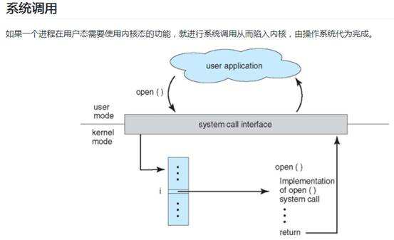
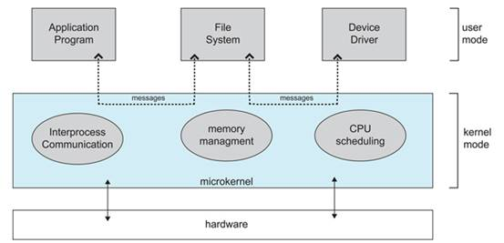
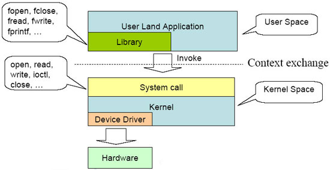
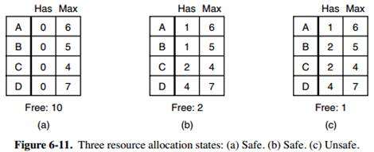
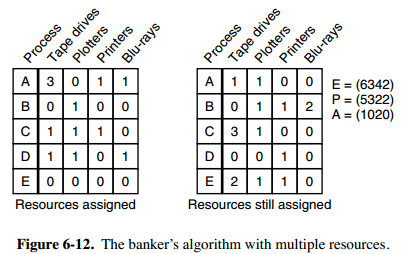
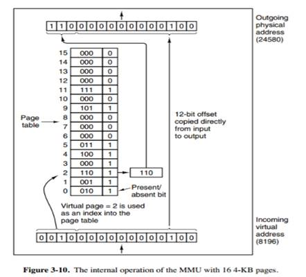
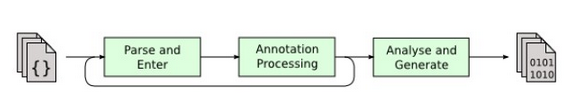
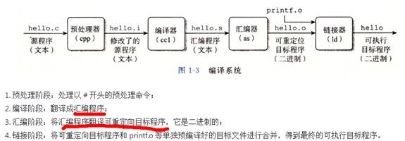
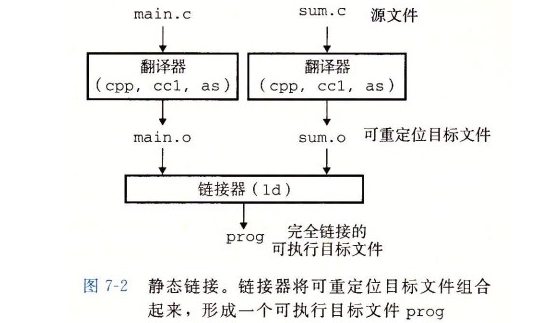
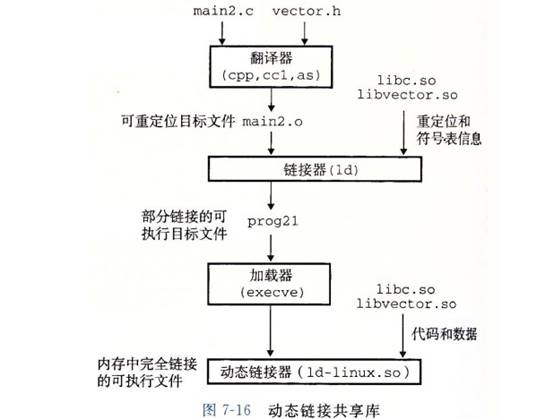

# C语言知识

## Hello C

```c
#include<stdio.h>
// C编译器接手前，需要预处理器处理这些头文件

int main(){

}
```


- 转义序列，进制

\n 换行

\r 回车符

\\ 转义\

\”

\b 退格

 

回车 \r 本义是光标重新回到本行开头

换行 \n 本义是光标往下一行（不一定到下一行行首）

```
32     // 十进制
040    // 八进制
0x20   // 十六进制
```

 

 

# 操作系统

- 操作系统的核心：资源管理

作业，处理器，存储器，外设，磁盘

- 分时系统：资源的利用按时间进行分割，用户轮流执行**时间片**

- CPU控制权转让方式：抢占式，非抢占式

- 内核

单内核：模块间通信是**通过调用其他模块函数**实现的，用户程序调用系统接口，通过软中断，进入核心态。

微内核：内核中大部分模块都是**独立的进程**，各模块之间通过**消息传递**进行通信；保证与硬件耦合的内核尽量小，其他模块依赖微内核而与硬件松耦合。

 

Linux采用单内核混合微内核设计方法。

 

 

**大内核和微内核**

\1. 大内核

大内核是将操作系统功能作为一个紧密结合的整体放到内核。由于各模块共享信息，因此有很高的性能。

 

\2. 微内核

由于操作系统不断复杂，因此将一部分操作系统功能移出内核，从而降低内核的复杂性。移出的部分根据分层的原则划分成若干服务，相互独立。

在微内核结构下，操作系统被划分成小的、定义良好的模块，只有微内核这一个模块运行在内核态，其余模块运行在用户态。因为需要频繁地在用户态和核心态之间进行切换，所以会有一定的性能损失。





 

 

**中断分类**

\1. 外中断

由 CPU 执行指令以外的事件引起，如 I/O 完成中断，表示设备输入/输出处理已经完成，处理器能够发送下一个输入/输出请求。此外还有时钟中断、控制台中断等。

\2. 异常

由 CPU 执行指令的内部事件引起，如非法操作码、地址越界、算术溢出等。

\3. 陷入

在用户程序中使用系统调用。

## 作业

**用户向计算机提交一项工作的基本单位**

 

**单道作业调度：**

先来先服务FCFS

短作业优先SJF

响应比优先

 

**多道作业调度：**

优先级调度、均衡调度

 

 

## 进程管理

进程是资源分配的基本单位，是程序的一次执行。（多个程序意味着多个进程，进程切换意味着程序切换（干别的事））

线程是独立调度的基本单位。一个进程中可以有多个线程，它们共享进程资源。

*QQ* *和浏览器是两个进程，浏览器进程里面有很多线程，例如 HTTP* *请求线程、事件响应线程、渲染线程等等，线程的并发执行使得在浏览器中点击一个新链接从而发起 HTTP* *请求时，浏览器还可以响应用户的其它事件。*

 

进程控制块 (Process Control Block, PCB) 描述进程的基本信息和运行状态，所谓的创建进程和撤销进程，都是指对 PCB 的操作。

 

 

**进程队列**：对多个进程进行管理维护

**进程调度算法：**

先进先出FIFO

基于优先级，多级队列

时间片轮转（Round Robin）分时系统

 

 

**进程通信：共享内存、消息传递**

**共享内存**：内存中有个共享存储区，各进程可以申请存储段，并提供关键字，然后建立共享存储区和进程逻辑地址空间的连接。之后拆除连接，共享存储区后处理。比如共享**信号量**，进行通信。

**消息传递**：消息缓冲区作为进程间通信基本单位，传递方式：直接通信，间接通信（使用信箱）

**管道****：**管道通信是基于Unix文件系统的共享文件模式（不同于共享内存），管道也是一个特殊文件。管道单向队列，是一个单向信道。无格式字节流。

**消息队列****，带缓冲区。**消息队列克服了信号传递信息少、管道只能承载无格式字节流以及缓冲区大小受限等缺点。

 

**套接字**，可用于不同机器间的进程通信。

 

 

 

 

**同步与互斥**

同步：多个进程按一定顺序执行；

互斥：多个进程在同一时刻只有一个进程能进入临界区。

 

**进程同步**机制：

信号量semaphore 及P、V操作：P检测是否为正，semaphore-1；V唤醒阻塞进程，semaphore+1恢复执行。P73

互斥时同一个信号量的PV在同一个进程中，同步时不在一个进程中。

 

**并发程序设计问题**：

生产者消费者，队列

```
#define N 100typedef int semaphore;
semaphore mutex = 1;//互斥信号量，排斥其他进程
 
semaphore empty = N;//同步信号量
semaphore full = 0;
 
void producer() {
    while(TRUE) {
        int item = produce_item();
 
        down(&empty);
        down(&mutex);
        insert_item(item);
        up(&mutex);
        up(&full);
    }
}
void consumer() {
    while(TRUE) {
        down(&full);
        down(&mutex);
        int item = remove_item();
        up(&mutex);
        up(&empty);
 
        consume_item(item);
    }
}
```

 

读者-写者问题

允许多个进程同时对数据进行读操作，但是不允许读和写以及写和写操作同时发生。

一个整型变量 count 记录在对数据进行读操作的进程数量，一个互斥量 count_mutex 用于对 count 加锁，一个互斥量 data_mutex 用于对读写的数据加锁。

```
typedef int semaphore;
semaphore count_mutex = 1;int count = 0;//控制读进程数量
semaphore data_mutex = 1;
 
void reader() {
    while(TRUE) {
        down(&count_mutex);
        count++; //当前进程要读
        if(count == 1) down(&data_mutex); // 如果是第一个读者，对数据进行加锁，防止写进程访问
        up(&count_mutex);
 
        read();
 
        down(&count_mutex);
        count--;  //当前进程读完
        if(count == 0) up(&data_mutex);
        up(&count_mutex);
    }
}
void writer() {
    while(TRUE) {
        down(&data_mutex);
        write();
        up(&data_mutex);
    }
}
```

 

 

 

**管程**：解决只用信号量和PV操作、同步问题的抽象数据类型，构成特殊的模块，是一种编程语言构件，任意时刻管程最多一个进程。

 

 

 

 

**一.****什么是内核态和用户态**

 

内核态：在内核空间执行，通常是驱动程序，中断相关程序，内核调度程序，内存管理及其操作程序。

 

用户态：用户程序运行空间。

 



 

**二.****什么是进程上下文与中断上下文**

 

1.进程上下文：

 

（1）进程上文：其是指进程由**用户态切换到内核态时**需要保存用户态时cpu寄存器中的值，进程状态以及堆栈上的内容，即保存当前进程的进程上下文，以便再次执行该进程时，能够恢复切换时的状态，继续执行。

 

（2）进程下文：其是指切换到内核态后执行的程序，即进程运行在内核空间的部分。

 

2.中断上下文：

 

（1）中断上文：硬件通过中断触发信号，导致内核调用中断处理程序，进入内核空间。这个过程中，硬件的一些变量和参数也要传递给内核，内核通过这些参数进行中断处理。中断上文可以看作就是硬件传递过来的这些参数和内核需要保存的一些其他环境（主要是当前被中断的进程环境。

 

（2）中断下文：执行在内核空间的中断服务程序。

 

**三.****为什么要进行不同之间状态的切换**

 

在现在操作系统中，内核功能模块运行在内核空间，而应用程序运行在用户空间。现代的CPU都具有不同的操作模式，代表不同的级别，不同的级别具有不同的功能，其所拥有的资源也不同；在较低的级别中将禁止使用某些处理器的资源。Linux系统设计时利用了这种硬件特性，使用了两个级别，最高级别和最低级别，内核运行在最高级别（内核态），这个级别几乎可以使用处理器的所有资源，而应用程序运行在较低级别（用户态），在这个级别的用户不能对硬件进行直接访问以及对内存的非授权访问。内核态和用户态有自己的内存映射，即自己的地址空间。

 

**当工作在用户态的进程想访问某些内核才能访问的资源时，必须通过系统调用或者中断切换到内核态，由内核代替其执行。**进程上下文和中断上下文就是完成这两种状态切换所进行的操作总称。我将其理解为保存用户空间状态是上文，切换后在内核态执行的程序是下文。

 

## 线程

**进程与线程区别：**

**拥有资源**：进程是资源分配的基本单位，但是线程不拥有资源，线程可以访问隶属进程的资源。

**调度**：线程是独立调度的基本单位，在同一进程中，线程的切换不会引起进程切换，从一个进程内的线程切换到另一个进程中的线程时，会引起进程切换。

**系统开销**：由于创建或撤销进程时，系统都要为之分配或回收资源，如内存空间、I/O 设备等，所付出的开销远大于创建或撤销线程时的开销。类似地，在进行进程切换时，涉及当前执行进程 CPU 环境的保存及新调度进程 CPU 环境的设置，而线程切换时只需保存和设置少量寄存器内容，开销很小。

**通信方面**：进程间通信 (IPC) 需要进程同步和互斥手段的辅助，以保证数据的一致性。而线程间可以通过直接读/写同一进程中的数据段（如全局变量）来进行通信。

 

举例：QQ 和浏览器是两个进程，浏览器进程里面有很多线程，例如 HTTP 请求线程、事件响应线程、渲染线程等等，线程的并发执行使得在浏览器中点击一个新链接从而发起 HTTP 请求时，浏览器还可以响应用户的其它事件。

 

### 死锁

一种发生在互相竞争进程/线程（？）间的现象，走独木桥

**必要条件：**

**互斥使用资源，**

**不可剥夺，**

**占有和等待，继续请求资源：**已经得到了某个资源的进程可以再请求新的资源

**环路等待：**有两个或者两个以上的进程组成一条环路，该环路中的每个进程都在等待下一个进程所占有的资源。

 

**死锁检测和解除**

**检测：**资源分配图是否可以完全化简

**解除：**系统重启，撤销进程，进程回退，剥夺资源

 

 

**死锁预防**

在程序**运行之前**预防发生死锁。

**（二）破坏占有和等待条件（零散请求）**

一种实现方式是规定所有进程在开始执行前请求所需要的全部资源。

**（四）破坏环路等待**

给资源统一编号，进程只能按编号顺序来请求资源，占有大号资源请求小号资源时，必需释放大号资源才能请求小号。

 

 

 

**死锁避免算法**

**单个资源的银行家算法**



一个小城镇的银行家，他向一群客户分别承诺了一定的贷款额度，算法要做的是判断对请求的满足**是否会进入**不安全状态，如果是，就拒绝请求；否则予以分配

**上图 c** **为不安全状态，请求后变为C****状态的请求会被拒绝，从而避免进入图 c** **中的状态。**

 

**多个资源的银行家算法**



上图中有五个进程，四个资源。左边的图表示已经分配的资源，右边的图表示还需要分配的资源。最右边的 E、P 以及 A 分别表示：总资源、已分配资源以及可用资源，注意这三个为向量，而不是具体数值，例如 A=(1020)，表示 4 个资源分别还剩下 1/0/2/0。

 

**检查一个状态是否安全的算法如下：**

查找右边的矩阵是否存在一行小于等于向量 A。如果不存在这样的行，那么系统将会发生死锁，状态是不安全的。

假若找到这样一行，将该进程标记为终止，并将其已分配资源加到 A 中。

重复以上两步，直到所有进程都标记为终止，则状态时安全的。

如果一个状态不是安全的，也需要拒绝进入这个状态。

 

 

## 存储（内存）管理

**段页式**

页：作业虚拟地址划分为虚页，主存划分虚页长度相等的页框。即**内存中的叫页框**

虚拟页地址到物理内存的**映射**，叫页变换表，页表

 

段：分段的做法是把每个表分成段，一个段构成一个独立的地址空间。每个段的长度可以不同，并且可以动态增长。

 

段页式：段划分程序加载内存，页表映射物理地址。程序的地址空间划分成多个拥有独立地址空间的段，每个段上的地址空间划分成大小相同的页。这样既拥有分段系统的共享和保护，又拥有分页系统的虚拟内存功能。地址重定向是通过页式虚拟内存实现。

 

**分页与分段的比较**

对程序员的透明性：分页透明，但是分段需要程序员显示划分每个段。

地址空间的维度：分页是一维地址空间，分段是二维的。

大小是否可以改变：页的大小不可变，段的大小可以动态改变。

出现的原因：分页主要用于实现虚拟内存，从而获得更大的地址空间；分段主要是为了使程序和数据可以被划分为逻辑上独立的地址空间并且有助于共享和保护。

 

 

**虚拟存储**

**虚拟存储管理**：利用程序的局部性原理，将存储管理中一次性载入的要求改进，把运行的部分程序载入内存，其他部分暂未运行放入磁盘。

**虚拟内存**的目的是为了让物理内存扩充成更大的逻辑内存，从而让程序获得更多的可用内存。为了更好的管理内存，操作系统将内存抽象成地址空间。每个程序拥有自己的地址空间，这个地址空间被分割成多个块，每一块称为一页。这些页被映射到物理存储，但不需要映射到连续的物理外存，也不需要所有页都必须在物理外存中。当程序引用到不在物理外存中的页时，由硬件执行必要的映射，缺页中断，将缺失的部分从外存装入内存并重新执行失败的指令。

**地址重定向**：逻辑地址被转换成物理地址

 

分页系统地址映射。内存管理单元（MMU）管理着地址空间和物理地址的转换，其中的页表（Page table）存储着页（程序地址空间）和页框（物理空间）的映射表。



上图的页表存放着 16 个页，这 16 个页需要用 4 个比特位来进行索引定位，也就是存储页面号，剩下 12 个比特位存储偏移量。

 

例如对于虚拟地址（0010 000000000100），前 4 位是存储页面号 2，读取表项内容为（110）。该页在内存中，并且页框的地址为 （110 000000000100）。

 

 

**页面淘汰置换算法**

在程序运行过程中，如果要访问的**页面不在内存**中，就发生缺页中断从而将该页调入内存中。此时如果内存已无空闲空间，系统必须从内存中调出一个页面到磁盘对换区中来腾出空间。

页面置换算法和缓存淘汰策略类似，可以将内存看成磁盘的缓存。在缓存系统中，缓存的大小有限，当有新的缓存到达时，需要淘汰一部分已经存在的缓存，这样才有空间存放新的缓存数据。页面置换算法的主要目标是使页面置换频率最低（也可以说缺页率最低）。

 

最佳算法，最不经常使用，先进先出，第二次机会，页面缓冲

 

 

## 文件管理

 

 

## 设备管理

**总线技术**

三总线结构（**系统总线，内存总线，****i/o****总线**）

DMA（不能完全脱离CPU，开始终止需要CPU参与）与通道技术（有自己的IO控制芯片，不需要CPU来控制）


 

**缓冲技术**

缓和**CPU****和IO****设备**速度不匹配问题

**单向缓冲，双向缓冲**，多缓冲区的**环形缓冲**，超大缓冲区的**缓冲池**

 

**设备分配**

先来先服务FCFS，基于优先级

 

 


# 编译原理

## 编译与解释

编译与解释执行：源码翻译成可执行文件再执行，脚本把一条条命令边读取边执行

两者结合：java，Python**编译**成虚拟机字节码，虚拟机再**解释执行，并非直接执行机器指令，**

 

## Java编译生成class

java生成字节码文件全过程：

Java 源码编译由以下三个过程组成：

**1****、源码分析和输入到符号表**

**2****、注解处理**

**3****、[语义分析](https://www.baidu.com/s?wd=语义分析&tn=44039180_cpr&fenlei=mv6quAkxTZn0IZRqIHckPjm4nH00T1Y4PH7hnj0vPW99myR4myn40ZwV5Hcvrjm3rH6sPfKWUMw85HfYnjn4nH6sgvPsT6KdThsqpZwYTjCEQLGCpyw9Uz4Bmy-bIi4WUvYETgN-TLwGUv3EnHT4P1RznW61P1cLPHnsnHmY)****和生成[class文件](https://www.baidu.com/s?wd=class文件&tn=44039180_cpr&fenlei=mv6quAkxTZn0IZRqIHckPjm4nH00T1Y4PH7hnj0vPW99myR4myn40ZwV5Hcvrjm3rH6sPfKWUMw85HfYnjn4nH6sgvPsT6KdThsqpZwYTjCEQLGCpyw9Uz4Bmy-bIi4WUvYETgN-TLwGUv3EnHT4P1RznW61P1cLPHnsnHmY)**

**[流程图](https://www.baidu.com/s?wd=流程图&tn=44039180_cpr&fenlei=mv6quAkxTZn0IZRqIHckPjm4nH00T1Y4PH7hnj0vPW99myR4myn40ZwV5Hcvrjm3rH6sPfKWUMw85HfYnjn4nH6sgvPsT6KdThsqpZwYTjCEQLGCpyw9Uz4Bmy-bIi4WUvYETgN-TLwGUv3EnHT4P1RznW61P1cLPHnsnHmY)****如下所示：**

[****](https://gss0.baidu.com/9vo3dSag_xI4khGko9WTAnF6hhy/zhidao/pic/item/4e4a20a4462309f7e9ea233b7a0e0cf3d7cad616.jpg)

 

最后生成的.[class文件](https://www.baidu.com/s?wd=class文件&tn=44039180_cpr&fenlei=mv6quAkxTZn0IZRqIHckPjm4nH00T1Y4PH7hnj0vPW99myR4myn40ZwV5Hcvrjm3rH6sPfKWUMw85HfYnjn4nH6sgvPsT6KdThsqpZwYTjCEQLGCpyw9Uz4Bmy-bIi4WUvYETgN-TLwGUv3EnHT4P1RznW61P1cLPHnsnHmY)由以下部分组成：

**[结构信息](https://www.baidu.com/s?wd=结构信息&tn=44039180_cpr&fenlei=mv6quAkxTZn0IZRqIHckPjm4nH00T1Y4PH7hnj0vPW99myR4myn40ZwV5Hcvrjm3rH6sPfKWUMw85HfYnjn4nH6sgvPsT6KdThsqpZwYTjCEQLGCpyw9Uz4Bmy-bIi4WUvYETgN-TLwGUv3EnHT4P1RznW61P1cLPHnsnHmY)****。**  包括[**class****文件**](https://www.baidu.com/s?wd=class文件&tn=44039180_cpr&fenlei=mv6quAkxTZn0IZRqIHckPjm4nH00T1Y4PH7hnj0vPW99myR4myn40ZwV5Hcvrjm3rH6sPfKWUMw85HfYnjn4nH6sgvPsT6KdThsqpZwYTjCEQLGCpyw9Uz4Bmy-bIi4WUvYETgN-TLwGUv3EnHT4P1RznW61P1cLPHnsnHmY)格式[**版本号**](https://www.baidu.com/s?wd=版本号&tn=44039180_cpr&fenlei=mv6quAkxTZn0IZRqIHckPjm4nH00T1Y4PH7hnj0vPW99myR4myn40ZwV5Hcvrjm3rH6sPfKWUMw85HfYnjn4nH6sgvPsT6KdThsqpZwYTjCEQLGCpyw9Uz4Bmy-bIi4WUvYETgN-TLwGUv3EnHT4P1RznW61P1cLPHnsnHmY)及各部分的数量与大小的信息

**[元数据](https://www.baidu.com/s?wd=元数据&tn=44039180_cpr&fenlei=mv6quAkxTZn0IZRqIHckPjm4nH00T1Y4PH7hnj0vPW99myR4myn40ZwV5Hcvrjm3rH6sPfKWUMw85HfYnjn4nH6sgvPsT6KdThsqpZwYTjCEQLGCpyw9Uz4Bmy-bIi4WUvYETgN-TLwGUv3EnHT4P1RznW61P1cLPHnsnHmY)****。**    对应于Java源码中声明与[**常量**](https://www.baidu.com/s?wd=常量&tn=44039180_cpr&fenlei=mv6quAkxTZn0IZRqIHckPjm4nH00T1Y4PH7hnj0vPW99myR4myn40ZwV5Hcvrjm3rH6sPfKWUMw85HfYnjn4nH6sgvPsT6KdThsqpZwYTjCEQLGCpyw9Uz4Bmy-bIi4WUvYETgN-TLwGUv3EnHT4P1RznW61P1cLPHnsnHmY)的信息。包含类/继承的超类/实现的接口的声明信息、域与方法声明信息和[**常量**](https://www.baidu.com/s?wd=常量&tn=44039180_cpr&fenlei=mv6quAkxTZn0IZRqIHckPjm4nH00T1Y4PH7hnj0vPW99myR4myn40ZwV5Hcvrjm3rH6sPfKWUMw85HfYnjn4nH6sgvPsT6KdThsqpZwYTjCEQLGCpyw9Uz4Bmy-bIi4WUvYETgN-TLwGUv3EnHT4P1RznW61P1cLPHnsnHmY)池

**方法信息。**  对应Java源码中语句和表达式对应的信息。包含字节码、异常处理器表、求值栈与局部变量区大小、求值栈的类型记录、调试符号信息

 

 

## C编译系统



 

## 静态链接

静态连接器以一组可重定向目标文件为输入，生成一个完全链接的可执行目标文件作为输出。链接器主要完成以下两个任务：

符号解析：每个符号对应于一个函数、一个全局变量或一个静态变量，符号解析的目的是将每个符号引用与一个符号定义关联起来。

重定位：编译器和汇编器生成从地址 0 开始的代码和数据节，链接器通过把每个符号定义与一个内存位置关联起来，从而重定位这些节，然后修改所有对这些符号的引用，使得它们指向这个内存位置。



 

## 动态链接

**依赖段氏内存存储管理**

 

静态库有以下两个问题：

当静态库更新时那么整个程序都要重新进行链接；

对于 printf 这种标准函数库，**如果每个程序都要有代码**，这会极大浪费资源。

**共享库**是为了解决静态库的这两个问题而设计的，在 Linux 系统中通常用 .so 后缀来表示，Windows 系统上它们被称为 DLL。它具有以下特点：

1.在给定的文件系统中一个库只有一个 .so 文件，所有引用该库的可执行目标文件都共享这个文件，它**不会被复制到引用它的可执行文件中**；

？2.在内存中，一个共享库的 .text 节的一个副本可以被不同的正在运行的进程共享。



 

 

 

 

 

 

 

 

 

 

 

 

 

 

 

 