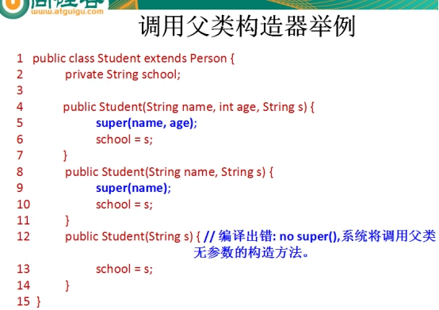
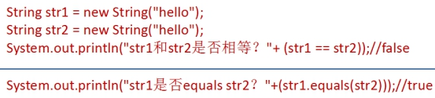
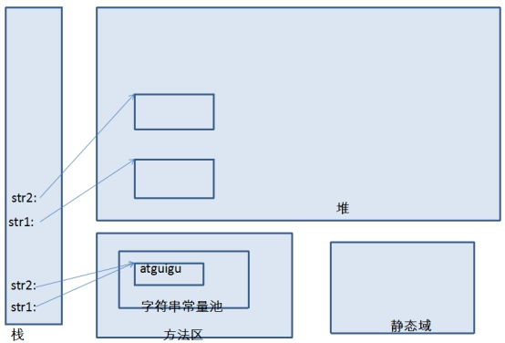
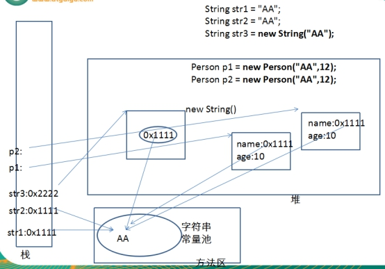
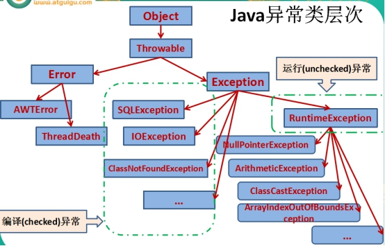
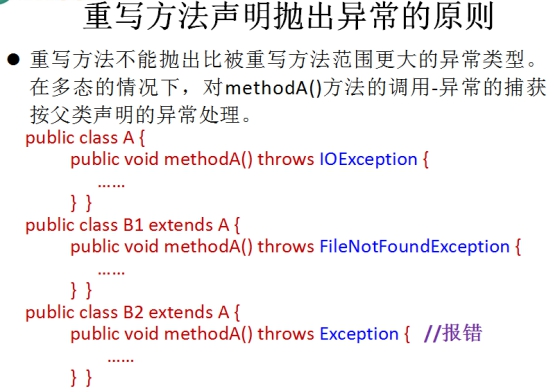
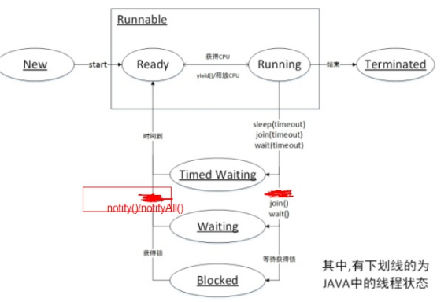
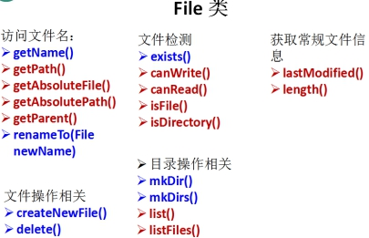

# 强化

自动数据类型转换

自动转换按从低到高的顺序转换。不同类型数据间的优先关系如下： 

低 ---------------------------------------------> 高

byte,short,char-> int -> long -> float -> double

---

- 包装类

包装类的“==”运算在不遇到算术运算的情况下不会自动拆箱

包装类的equals()方法不处理数据转型，和String的equals()不一样

 

Int a = Integer.parseInt("1024");

Int b = Integer.valueOf("1024").intValue();

---

- 类型转换

**向下转型错误**

包装类和数值不同类型时，直接转换编译错误

Double d = 3;         //错误

Double d=(double)3;	//编译通过

 

​        **byte** a1 = 2, a2 = 4, a3;

​        **short** s = 16;

​        a2 = s;//向下转，错误

​        a3 = a1 * a2;//得到int，转byte向下转错误


- 方法内的局部变量**使用前**必须初始化，声明的时候可以不用初始化

 


- 引用数据类型是引用传递（call by reference），基本数据类型是值传递（call by value）

值传递不可以改变原变量的内容和地址---》原因是java方法的形参传递都是传递原变量的副本，在方法中改变的是副本的值，而不适合原变量的

引用传递不可以改变原变量的地址，但可以改变原变量的内容---》原因是当副本的引用改变时，原变量的引用并没有发生变化，当副本改变内容时，由于副本引用指向的是原变量的地址空间，所以，原变量的内容发生变化。

 

结论：1.值传递不可以改变原变量的内容和地址；

​        2.引用传递不可以改变原变量的地址，但可以改变原变量的内容；

 

 

- 内部类

普通类（外部类）：权限只能用public、default（不写），其他属性修饰符abstract、final

（成员）内部类：可理解为外部类的成员，所以修饰类成员的public、protected、default、private、static等关键字都能使用。

 

局部内部类：出现在方法里的类，不能用上述关键词来修饰。

匿名内部类：给的是直接实现，类名都没有，没有修饰符。

 

 

Java一个源程序只能有一个public类存在，且类名与文件名相同。Java程序是从main方法开始执行的，public为类加载器提供入口，然后找到public类中的public static void main方法开始执行。如果存在多个public类，程序将不知道该从哪里执行。

 

不能在非静态内部类里面定义静态代码块

 

- 继承：初始化、遗产

Base base = new Son();	 //base只有method方法，son另有methodB方法

​        base.method();	//多态

​        base.methodB();	//错误，base没有此方法，无法多态

​        ((Son) base).methodB();		//正确，类型转换

 

- 初始化过程：

1.首先，初始化父类中的**静态成员变量和静态代码块**，按照在程序中出现的顺序初始化； 

2.然后，初始化子类中的静态成员变量和静态代码块，按照在程序中出现的顺序初始化； 

3.其次，初始化父类的**普通成员变量和代码块**，再执行**父类的构造方法**；

4.最后，初始化子类的普通成员变量和代码块，再执行子类的构造方法；

 

在一个子类被创建的时候，首先会在内存中创建一个父类对象，然后在父类对象外部放上子类独有的属性，两者合起来形成一个子类的对象。

子类对象**确实拥有**父类对象中所有的属性和方法，但是父类对象中的私有属性和方法，子类是**无法访问**到的，只是拥有，但不能使用。所以子类对象是绝对大于父类对象的。

 

 

**类初始化和类加载是两个概念！！！！！**

 

- 构造器

构造方法要可以用public, protected, private修饰，不可以有返回值，方法名与类名一致。

**构造器不能被继承**


- Abstract，interface

修饰类，抽象类，方法的权限默认为default

 

接口中方法权限默认public，**java 1.8**开始支持接口中定义静态方法

 

一个类中有抽象方法则必须申明为抽象类。

**抽象类：**

用abstract修饰，抽象类中可以没有抽象方法，但抽象方法肯定在抽象类中，且抽象方法定义时不能有方法体；

抽象类不可以实例化只能通过继承在子类中实现其所有的抽象方法；

抽象类如果不被继承就没有任何意义；

抽象类为子类定义了一个公共类型，封装了子类中的重复内容。

 

**接口:**

同Interface关键字定义接口，是特殊的抽象类因为类中只包含抽象方法；

接口中不能定义成员变量可以定义常量；

接口是其通过其他类使用implements关键字定义实现类，一个类一旦实现接口就必须实现其中的所有抽象方法，一个类可以实现多个接口，接口名之间用逗号隔开即可；

一个接口可以通过extends关键字继承另一个接口，与此同时继承了父类中的所有方法。

 

**接口**与抽象类区别：

1.在接口中只有方法的声明，没有方法体。

**2.在接口中只有常量****没有变量****，因为定义的变量，在编译的时候都会默认加上public static final** 

**3.在接口中的方法，永远都被public来修饰。**

4.接口中没有构造方法，也不能实例化接口的对象。

**5.接口可以实现多继承**

6.接口中定义的方法都需要有实现类来实现，如果实现类不能实现接口中的所有方法，.则实现类定义为抽象类。

 

抽象类可以定义普通成员变量而接口不可以，但是抽象类和接口都可以定义**静态常量**，只是接口的静态成员变量要用static final public 来修饰。

- Super、this

this的作用不仅有在类中表示该对象的引用，还可以在另一个构造器中调用另一个构造器

 

- final

变量初始化

final修饰的方法，不允许被子类覆盖。

final修饰的类，不能被继承。

final修饰的常量，不能改变值。

final修饰的引用类型，不能再指向别的东西，但是可以改变其中的内容。

 

String str1 = "hello";

这里的str1指的是方法区中的字符串常量池中的“hello”，编译时期就知道的； 

 

String str2 = "he" + new String("llo");

这里的str2必须在运行时才知道str2是什么，所以它是指向的是堆里定义的字符串“hello”，所以这两个引用是不一样的。

 

- static

被static修饰的变量称为静态变量，静态变量属于整个类，

而局部变量属于方法，只在该方法内有效，所以static不能修饰局部变量

- **Instanceof**

反射技术能获取对象运行时的类型信息，判断是否为某类实例

- **IO**

字符流是字节流根据字节流所要求的编码集解析获得的

可以理解为字符流=字节流+编码集

所以本题中和字符流有关的类都拥有操作编码集(unicode)的能力。


- Equals和==

在hashmap中，key值是不可能重复的，由hashCode和equals方法共同判断key值是否相等。即使两个对象的hashCode相同相等，也不能说他们的key值相等。

如果x.equals(y)返回true,那么这两个对象的hashCode返回的整数结果必然相同。如果x.equals(y)返回false,则不一定；

反之，hashCode返回的值不相等，则equals方法返回值一定不相等。hashCode返回值相等，则不一定

hashCode的值是可以相同的。

 

# 基础

单目乘除位关系，逻辑三目后赋值 

 

**单目**：单目运算符+ –(负数) ++ -- 等 

**乘除**：算数单目运算符* / % + - 

**位**：位移单目运算符<< >> 

**关系**：关系单目运算符> < >= <= == != 

**逻辑**：逻辑单目运算符&& || & | ^ 

**三目**：三目单目运算符A > B ? X : Y 

后：无意义，仅仅为了凑字数 

**赋值**：赋值=

 

- **算术运算符**

- **位运算符**


思考，为什么有补零右移>>>（无符号右移），没有无符号左移

 

统计二进制中1的个数，注意**负数**机内码为其补码

**1.** **public** **int** bitCount1(**int** x){  

\2.         **int** count = 0;  

\3.         **while**(x!=0){  

\4.             count+ = x&1;  

\5.             x = x>>>1;  

\6.         }  

\7.         **return** count;  

\8.   }  

 

**1.** **public** **int** bitCount2(**int** x){  

\2.       **int** count = 0;  

\3.       **while**(x!=0){  

\4.          **if**(x<0){  

\5.             count++;  

\6.          }  

\7.          x = x<<1;  

\8.       }  

\9.       **return** count;  

\10. } 

 

**1.** **public** **int** bitCount3( **int** x ){  

\2.        **int** count = 0;  

\3.        **while** ( x != 0 ){  

\4.          x &= x - 1;  

\5.          count++;  

\6.        }  

\7.        **return** count; 

\8. }

 

 

**逻辑运算符**

 

8、&和&&的区别？

答：&运算符有两种用法：(1)按位与；(2)逻辑与。

 

**逻辑与****&&**有个短路特点，前面为假，后面不计算。ans && (ans += Sum_Solution(n - 1));

 

 

**If(A** **instanceof** **B.class)**

x instanceof A：检验x是否为类A的实例对象，返回值为boolean型。

# 基本数据类型及常量池

byte     1字节   

short    2字节             char      2字节（C语言中是1字节）可以存储一个汉字  

int       4字节              float     4字节    

long     8字节              double  8字节

​                         

boolean  false/true(理论上占用1bit,1/8字节，实际处理按1byte处理)       

JAVA是采用Unicode编码。每一个字节占8位。你电脑系统应该是 32位系统，这样每个int就是 4个字节

 

**考一考1：**

**short** s = 1;

s = s+1;			 

 

 

short s1 = 1;

s1 += 1;    //编译正确，+=带有类型转换

 

s1+1运算结果也是int 型。s1+= 1;相当于s1 = (short)(s1 + 1);其中有隐含的强制类型转换。

 

**考一考2：**

4、float f=3.4;是否正确？

答:**不正确**。3.4是双精度数（double），因此需要强制类型转换float f =(float)3.4; 或者写成float f =3.4F。

 

Integer, Byte, Short, Long, Character对应值在[-128,127]中时，直接使用常量池，否则创建对象，Float, Double没有使用常量池

 

 

 

# **变量概念**

**字段**：包括类变量和实例变量。初始化可以在静态代码块、构造函数内进行，不必在声明时就初始化。

- *类变量*：同类共有static——静态变量、常量（static final）

- *实例变量*：每个实例各自持有

**局部变量**：方法体内变量，使用前必需初始化；

 

属性，bean中的概念，外界通过getter、setter方法访问

# **access访问权限**

Java权限修饰符public、protected、private置于**类的成员**定义前，用来限定对象对该类对象成员的访问权限。

| **修饰符**    | **类内部** | **同一个包** | **子类** | **任何地方** |
| ------------- | ---------- | ------------ | -------- | ------------ |
| **private**   | Yes        |              |          |              |
| **default**   | Yes        | Yes          |          |              |
| **protected** | Yes        | Yes          | Yes      |              |
| **public**    | Yes        | Yes          | Yes      | Yes          |

权限修饰符可以修饰其他：

对于class的权限修饰只可以用public和default。public类可以在任意地方被访问。default类只可以被同一个包内部的类访问。

 

# **构造器**

先有爸爸才有儿子：

New出爸爸，遗产传递给儿子。子类中所有的构造器**默认**都会访问父类中空参数的构造器。

当父类中没有空参数的构造器时，子类的构造器必须指定其他能new父类的构造器，**this(参数列表)**或者**super(参数列表)**语句指定调用本类或者父类中相应的构造器，且必须放在构造器的第一行。

 

如果子类构造器中既未显式调用父类或本类的构造器，且父类中又没有无参的构造器，则编译出错。下例子中，Person类没有无参的构造方法。

 

构造器（constructor）是否可被重写（override）？

答：构造器**不能被继承**，因此不能被重写，但可以被重载。

 

 

# **super**

 

在Java类中使用super来调用父类中的指定操作：

- super可用于访问父类中定义的属性

- super可用于调用父类中定义的成员方法

- super可用于在**子类构造方法中**调用父类的构造器，必须放在子类构造方法第一行

注意：

尤其当子父类出现同名成员时，可以用super进行区分

- super和this的用法相像，this代表本类对象的引用，super代表父类的内存空间的标识

 

 

# **方法多态**

多态性，是面向对象中最重要的概念，在java中有两种体现：

- 方法的重载(overload)和重写(overwrite)。

- 对象的多态性——向上，向下转型。可以直接应用在抽象类和接口上。

 

Java引用变量有两个类型：编译时类型和运行时类型。编译时类型由声明该变量时使用的类型决定，运行时类型由实际定义决定。

 

一个引用类型变量如果声明为父类的类型，但实际引用的是子类对象，那么该变量就不能再访问子类中添加的属性和方法，因为编译时无法确定实际类型。

​	Student m = new Student();

​	m.school = “pku”; 	//合法,Student类有school成员变量

​	Person e = new Student(); 

​	e.school = “pku”;	//非法,Person类没有school成员变量

 

 

**注意：**

方法具有多态性：

编译时：要查看引用变量所属的类中是否有所调用的方法。

运行时：调用实际对象所属的类中的重写方法。


**字段不具备多态性。**

若子类重写了父类方法，就意味着子类里定义的方法彻底覆盖了父类里的同名方法，系统将不可能把父类里的方法转移到子类中。

对于实例变量则不存在这样的现象，即使子类里定义了与父类完全相同的实例变量，这个实例变量依然**不可能覆盖**父类中定义的实例变量。

```java
public class TestFieldMethod {
	public static void main(String[] args) {
		Sub s = new Sub();
		System.out.println(s.count);//20
		s.display();//20
		
		Base b = s;
		System.out.println(b == s);//true
		System.out.println(b.count);//10,父类的字段
		b.display();//20，多态子类的方法
	}
}

class Base {
	int count = 10;
	public void display() {
		System.out.println(this.count);
	}
}
class Sub extends Base {
	int count = 20;
	public void display() {
		System.out.println(this.count);
	}
}
```

 

 

# **instanceof** ，==，散列函数

1. 使用==操作符检查"参数是否为这个对象的引用"；

2. 使用instanceof操作符检查"参数是否为正确的类型"；

 

instanceof是否是同类

   object.equals( o2)  同类引用是否指向同一实例对象，Object类是Java中的万类之祖，其中，equals()和hashCode()是2个非常重要的方法。equals()内部调用hashCode()

 

hashCode()使用哈希算法得到哈希值（散列码）：

哈希算法将任意长度的二进制值映射为较短的**固定长度**的二进制值，这个小的二进制值称为哈希值。

 

# **堆、栈、方法区、常量池**





 

 

# **关键字static**

使用范围：static可以修饰【属性、方法、代码块、内部类】。修饰后具有下面特点：

- 随类加载而加载
- 优先于对象存在
- 被修饰的成员，被所有对象共享
- 访问权限允许时，可不创建对象，直接被类调用

子类可以继承父类的静态方法！也可以拥有自己完全一样的静态方法，这时的行为称为**隐藏**。因为静态方法是在编译时确定了，没有多态的性质，即没有覆盖，重载一说，“只有普通的方法调用可以是多态的”。

 

静态代码块是在类加载时自动执行的，非静态代码块是在创建对象时自动执行的代码，不创建对象不执行该类的非静态代码块。

```java
public class Test {
	private static int[] fib = new int[40];
static{
        fib[1] = 1;   //静态方法不能调用非静态成员和方法，fib必须声明为静态变量
        fib[0] = 0;
        for(int i = 2; i < fib.length; i++) {
            fib[i] = fib[i - 1] + fib[i - 2];
        }
    }
    public static int Fibonacci(int n) {
        return fib[n];
    }
```

​    

# **Main，类加载**

public static void main(String[] args) {

}

   由于java虚拟机需要调用类的main()方法，所以该方法的访问权限必须是public，又因为java虚拟机在执行main()方法时不必创建对象，所以该方法必须是static的，该方法接收一个String类型的数组参数，该数组中保存执行java命令时传递给所运行的类的参数。

 

【问题】：如果main方法被声明为private会怎样？

答案：能正常编译，但运行的时候会提示”main方法不是public的”。

问题：如果去掉了main方法的static修饰符会怎样？

答案：程序能正常编译。运行时会抛NoSuchMethodError异常。

 

【问题】：**一个类**能拥有多个main方法吗？

​	可以，但只能有一个main方法拥有以下签名：Public static void main(String[] args）

否则程序将无法通过编译。编译器会警告你main方法已经存在。

【问题】：程序中可以允许**多个类**同时拥有都有main方法吗?

可以。当程序运行的时候，我们会指定运行的类名。JVM只会在你指定的类中查找main方法。因此多个类拥有main方法并不存在命名冲突的问题。

 

【问题】：静态变量在什么时候加载？编译期还是运行期？静态代码块加载的时机呢？

​	当类加载器将类加载到JVM中的时候就会创建静态变量，静态变量加载的时候就会分配内存空间。（加载-校验-准备-解析）

静态代码块的代码只会在类第一次**初始化**的时候执行一次。一个类可以有多个静态代码块，它并不是类的成员，也没有返回值，并且不能直接调用。静态代码块不能包含this或者super。静态代码块，通常被用初始化静态变量。

 

**类的生命周期：加载，连接（校验-准备-解析），初始化，使用，卸载**

# **Final**

修饰【类、属性、方法】，表示最终

- final类不能被继承，提高安全性、可读性。final类没有后，称为太监类   

- final变量，圣旨变量   static final全局常量，

- final方法不能被子类重写。如Object类中的getClass()


区分：	Final   finally: 处理异常。 finalize: 帮助进行垃圾回收。

 

 

 

 

# **abstract抽象类，接口**

①在接口中不可以有构造方法

在接口里写入构造方法时，编译器提示：Interfaces cannot have constructors。

②在抽象类中 可以有构造方法。

在抽象类中可以有构造方法，只是不能直接创建抽象类的实例对象，不过子类的构造方法执行时，会先执行父类的constructor

 

 

# **异常类**

 

Exception类

1. 运行时（unchecked不受检）异常类

运行时才发现的异常。一般是指编程时的逻辑错误，是程序员应该积极避免其出现的异常。java.lang.RuntimeException类及它的子类都是运行时异常。

对于这类异常，可以不作处理，因为这类异常很普遍，若全处理可能会对程序的可读性和运行效率产生影响。

 

2. 编译时（checked受检）异常类，编译时对可能会出错抛出异常代码进行处理，I/O

是指编译器要求必须处置的异常。即程序在运行时由于外界因素造成的一般性异常。编译器要求java程序必须捕获或声明所有编译时异常。

对于这类异常，如果程序不处理，可能会带来意想不到的结果。

 

 

 

 

 

异常处理：

Java提供的是异常处理的**抓抛模型**。

Java程序的执行过程中如出现异常，会生成一个异常类对象，该异常对象将被提交给Java运行时系统，这个过程称为抛出(throw)异常。

throw语句用来明确地抛出一个"异常"。

throws用来标明一个函数可能抛出的多种"异常"。

Finally为确保一段代码不管发生什么"异常"都被执行一段代码。

```java
class Demo{	
	public static void func(){
		try{
			throw  new Exception();//编译出错：没有处理异常，既没有抛，又没有抓
		}
		finally{
			System.out.println("B");
		}
	}
	public static void main(String[] args){
		try{
			func();
			System.out.println("A");
		}
		catch(Exception e){
			System.out.println("C");
		}
		System.out.println("D");
	}
}

//---------
class Demo{	
	public static void func(){
		try{
			throw  new Exception();
			System.out.println("A");  //编译出错，异常抛出后面的为无效语句
		}
		catch(Exception e){
			System.out.println("B");
		}
	}
	public static void main(String[] args){
		try{
			func();
		}
		catch(Exception e){
			System.out.println("C");
		}
		System.out.println("D");
	}
}

//---------
class Demo{
	public static void main(String[] args){
		try{
			throw new Exc1();
		}		
		catch(Exception e){
			System.out.println("Exception");
		}
		catch(Exc0 e){  //出错，子类异常应该放到前面
			System.out.println("Exc0");
		}
	}
}

//---------------
public class Demo{ 
	public static String output=""; 
	public static void foo(int i){ 
		try{ 
			if(i==1)
				throw new Exception(); 	
			output+="1"; 
		} 
		catch(Exception e){ 
			output+="2"; 
			//return; 
		} 
		finally{ 
			output+="3"; 
		} 
		output+="4"; 
	}
	public static void main(String args[]){ 
		foo(0);
		System.out.println(output);//134
		foo(1); 
		System.out.println(output);//134234，加上return为13423，finally执行后再return
	}
}
```

 

 

# **java多线程**

 **调度策略**：时间片运行，抢占式调度。

**阻塞**：当一个线程试图获取一个内部的对象锁（非java.util.concurrent库中的锁），而该锁被其他线程持有，则该线程进入阻塞状态，或者试图进入加锁区域。

**自旋锁**：不放弃CPU执行时间进入阻塞，空转。

**等待**：线程等待CPU调度一个条件，该线程进入等待状态。例如调用：Object.wait()、Thread.join()以及等待Lock或Condition。



 

 

**Thread的方法与同步（协同）锁**


**线程不安全示例**

**class** Ticket implements Runnable{    private  int tick = 100;    public void run(){    while(true){        if(tick>0){System.out.println(Thread.currentThread().getName()+“售出车票，tick号为："+ tick--);         }       else            break;     }  }} **public class**  TicketDemo{    public static void main(String[] args) {     Ticket t = new Ticket();     Thread t1 = new Thread(t);    Thread t2 = new Thread(t);    Thread t3 = new Thread(t);     t1.setName("t1窗口");     t2.setName("t2窗口");     t3.setName("t3窗口");     t1.start();     t2.start();     t3.start();    }}

```java
class Ticket implements Runnable{
    private  int tick = 100;
    public void run(){
        while(true){
                if(tick>0){
        System.out.println(Thread.currentThread().getName()+“售出车票，tick号为："+ tick--);
                 }
               else
                    break;
         }
    }
}

public class  TicketDemo{
    public static void main(String[] args) {

        Ticket t = new Ticket();

        Thread t1 = new Thread(t);
        Thread t2 = new Thread(t);
        Thread t3 = new Thread(t);
         t1.setName("t1窗口");
         t2.setName("t2窗口");
         t3.setName("t3窗口");
         t1.start();
         t2.start();
         t3.start();
    }
}
```

---

sleep() 和 wait() 有什么区别? 

答：sleep是线程类（Thread）的方法，导致此线程暂停CPU执行指定时间，但是监控状态依然保持，到时后会自动恢复。**调用sleep不会释放对象锁。**

wait是Object类的方法，对此对象**调用wait方法导致本线程放弃对象锁**，**进入等待此对象的等待锁定池**，只有针对此对象发出notify方法（或notifyAll）后本线程才进入对象锁定池**准备获得对象锁****（不一定能拿到锁）**进入运行状态。

**1.sleep(**long**)方法**

在指定时间内让当前正在执行的线程暂停执行，但不会释放“锁标志”。sleep(long)使当前线程进入计时等待状态，在指定时间内不会执行。

**2.wait()方法**

在其他线程调用对象的notify或notifyAll方法前，导致当前线程等待。线程会释放掉它所占有的“锁标志”，从而使别的线程有机会抢占该锁。当前线程必须拥有当前对象锁。如果当前线程不是此锁的拥有者，会抛出IllegalMonitorStateException异常。

唤醒当前对象锁的等待线程使用notify或notifyAll方法，也必须拥有相同的对象锁，否则也会抛出IllegalMonitorStateException异常。

waite()和notify()**必须在synchronized函数或synchronized　block中进行调用**。如果在non-synchronized函数或non-synchronized　block中进行调用，虽然能编译通过，但在运行时会发生IllegalMonitorStateException的异常。

**3.yield方法**

暂停当前正在执行的线程对象。yield()只是使当前线程重新回到可执行状态，所以执行yield()的线程有可能在进入到可执行状态后马上又被执行。

yield()只能使同优先级或更高优先级的线程有执行的机会。 

**4.join方法**

等待该线程终止。等待调用join方法的线程结束，再继续执行。如：t.join();//主要用于等待t线程运行结束，若无此句，main退出前线程可能都没有执行完毕。

 

**5.** **start()   run()**

前者：当前线程开启另一个线程，另一个线程执行它的run()，**线程一定要先开启start()不然没意义。**

后者：当前线程直接调用另一个线程类的run()，相当于普通方法调用，在当前线程顺序执行。

 

 

# **反射与class类**

反射Reflection : 被视为动态语言的关键，允许执行期间获取任何类的内部信息，并能直接操作任意对象的内部属性及方法。

Object类中定义了一个方法：

`public final Class getClass()`

- Class，本身是一个类

- Class对象只能由系统建立

- 一个类在JVM中只会有一个Class实例，由类加载时JVM自动为之创建

实例化Class类：

```java
Class clazz = String.class; //类名

Class clazz = "www.wulala.com".getClass(); //Object对象方法
Class clazz = Class.forName("java.lang.String"); //类的静态方法

Class clazz = this.getClass().getClassLoader().loadClass("java.lang.String"); //类加载器
```


# **泛型generic**

**泛型的几个重要使用**：1.在**集合中**使用泛型。2.自定义**泛型类**、3.**泛型方法**、4.**泛型接口**

- List<E>  是泛型接口

- ArrayList<E> 是泛型类

- static <T> void fromArrayToCollection(T[] a, Collection<T> c) {} 泛型方法


Element元素指集合里面元素的类型
Type类型指类的的泛型类型

 

List<String> l1 = new ArrayList<String>();

<?>允许所有泛型的引用调用

举例：

<? extends Number>     (无穷小 , Number]只允许泛型为Number及Number子类的引用调用

<? super Number>      [Number , 无穷大)只允许泛型为Number及Number父类的引用调用

<? extends Comparable> 只允许泛型为实现Comparable接口的实现类的引用调用

 

 

 

# **Enumeration枚举类**

**枚举类和普通类的区别：**

- 使用 enum 定义的枚举类默认继承了 java.lang.Enum 类

- 枚举类的**构造器**访问控制符只能使用 private 

- 枚举类的**所有实例**必须在枚举类中显式列出(, 分隔    ; 结尾)。列出的实例编译器会自动添加 public static final 修饰

 

```java
enum Season1 implements Info{
	SPRING("spring", "春暖花开"){
		public void show(){
			System.out.println("春天在哪里？");
		}
	},
	SUMMER("summer", "夏日炎炎"){
		public void show(){
			System.out.println("生如夏花");
		}
	},
	AUTUMN("autumn", "秋高气爽"){
		public void show(){
			System.out.println("秋天是用来分手的季节");
		}
	},
	WINTER("winter", "白雪皑皑"){
		public void show(){
			System.out.println("冬天里的一把火");
		}
	};
	
	private final String seasonName; //字段权限及安全性
	private final String seasonDesc;
	
	private Season1(String seasonName,String seasonDesc){
		this.seasonName = seasonName;
		this.seasonDesc = seasonDesc;
	}
	public String getSeasonName() {
		return seasonName;
	}
	public String getSeasonDesc() {
		return seasonDesc;
	}
	
	@Override
	public String toString() {
		return "Season [seasonName=" + seasonName + ", seasonDesc="
				+ seasonDesc + "]";
	}
//	public void show(){
//		System.out.println("这是一个季节");
//	}
}
```


枚举类对象实例的**属性**不应允许被改动, 所以应该使用 private final 修饰，且应该在构造器中为其赋值初始化

 

 

**打印线程状态枚举类的实例**

​		State[] stateOfThread = Thread.State.values();

​		for(State state : stateOfThread){

​			System.out.println(state);

​		}

 

 

# java.io.*



`java.io.File`类：**文件和目录的抽象表示形式**，与平台无关

`File` 能新建、删除、重命名**文件**及文件对应的**目录**，但File不**能访问文件内容**本身。如果需要访问文件内容本身，则需要使用输入/输出流。

`File`对象可以作为参数传递给流的构造函数。

 

4个父**类**：**字节流**InputStream、OutputStream；**字符流**Reader、Writer

byte是**字节**数据类型、有符号型的、占1个字节、大小范围为-128——127

char是**字符**数据类型、无符号型的、占**2个字节**（unicode码）、大小范围为0-65535

结论：只要是处理纯文本数据，就优先考虑使用**字符流**。 除此之外都使用字节流。

 

文件流**File**InputStream  /  FileOutputStream  /  FileReader  /  FileWriter

缓冲流**Buffered**InputStream / BufferedOutputStream / BufferedReader / BufferedWriter

**转换流**InputStreamReader  /  OutputStreamWriter字节流中的数据，转成字符流操作更高效。

 

标准输入/输出流

打印流（了解）PrintStream  /  PrintWriter

数据流（了解）DataInputStream  /  DataOutputStream

对象流    ----涉及序列化、反序列化ObjectInputStream  /  ObjectOutputStream

随机存取文件流RandomAccessFile


**文件流读入、输出**

```java
File file = new File("src/1.txt");
FileReader reader = new FileReader(file);

FileWriter writer = new FileWriter("c:\\1.txt");

try {
    int len = 0;
    Char[] buffer = new char[1024];
    while ((len = reader.read(buffer)) > 0) {
        writer.write(buffer, 0, len);
    }
} finally {
    if (reader != null) {
    	reader.close();
    }
    writer.close();
}
```

 

# **对象序列化**

序列化(Serialize)：用ObjectOutputStream类将一个Java对象写入IO流中

反序列化(Deserialize)：用ObjectInputStream类从IO流中恢复该Java对象

ObjectOutputStream和ObjectInputStream**不能序列化static和transient修饰的成员变量**

 

对象序列化机制允许把内存中的Java对象转换成二进制流，持久地保存在磁盘上，或通过网络将这种二进制流传输到另一个网络节点。当其它程序获取了这种二进制流，就可以恢复成原来的Java对象

序列化是 RMI过程的参数和返回值都必须实现的机制，而 RMI 是 JavaEE 的基础。因此序列化机制是 JavaEE 平台的基础

Serializable

Externalizable

```java
//序列化：网络传输、磁盘保存
Person p = new Person("老韩"，18);

ObjectOutputStream oos = new ObjectOutputStream(new FileOutputStream("test3.txt"));
oos.writeObject(p);
oos.flush();
oos.close();

//反序列化，得到对象
ObjectInputStream ois = new ObjectInputStream(new FileInputStream("test3.txt"));
Person p1 = (Person)ois.readObject();
ois.close();
```

 

 

 

 

 

 

 

 


