# **Java集合框架**

黄色Y的代表接口，绿色G的是抽象类，蓝色B的具体类。

继承实线—，实现接口为虚线---

 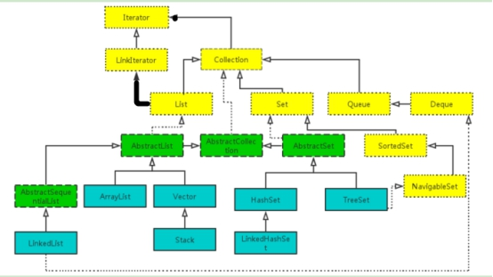

 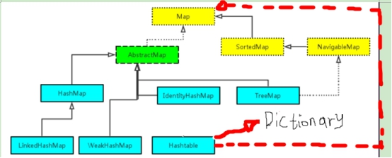

 

java.util 

类 Collections，同步包装集合

 

软件包 java.util.concurrent 

| **ConcurrentHashMap<K,V>**   | 支持获取的完全并发和更新的所期望可调整并发的哈希表。 |
| ---------------------------- | ---------------------------------------------------- |
| **ConcurrentLinkedQueue<E>** | 一个基于链接节点的无界线程安全[队列]。               |

 

 

## **List可伸缩数组，索引为数组下标**

基于数组实现的ArrayList和Vector，数据内存连续，中间增删操作慢。Vector线程安全，ArrayList线程不安全。

队列是一种特殊的线性表，它只允许在表的前端进行删除操作，而在表的后端进行插入操作。LinkedList类实现了Deque接口，因此我们可以把LinkedList当成Deque双向队列来用。

LinkedList基于双向列表实现，对数据索引需要从头遍历，查找慢，但插入元素时不需移动数据，效率高。LinkedList线程不安全。支持随机访问（get直接获取），但效率很低，每次重头遍历获取。

 

 

ArrayList() 
          构造一个初始容量为 10 的空列表。

`int newCapacity = oldCapacity + (oldCapacity >> 1);`   //扩容为原来的1.5倍

 

## **Map，索引为对象**

**HashMap、HashTable、TreeMap、WeakHashMap**

HashMap是HashTable轻量级实现。HashMap允许null键值（最多一个null）、不支持线程同步，HashTable反之，Hashtable 线程安全，因为它每个方法中都加入了Synchronize。继承关系不同

WeakHashMap弱引用对象key，不再被引用被GC掉，HashMap强引用，只用删除记录，key才会被GC。

 

从**ConcurrentHashMap**代码中可以看出，它引入了一个“分段锁”的概念，每个分段锁维护着几个桶（HashEntry），多个线程可以同时访问不同分段锁上的桶，从而使其并发度更高（并发度就是 Segment 的个数）。hash(k)%table.length

 

HashMap() 
          构造一个具有默认初始容量 (16) 和默认加载因子 (0.75) 的空 HashMap。

 

## **Set数学集**

| boolean | **containsKey**(Object key)            如果此映射包含对于指定键的映射关系，则返回 true。 |
| ------- | ------------------------------------------------------------ |
| boolean | **containsValue**(Object value)            如果此映射将一个或多个键映射到指定值，则返回 true。 |
| V       | **get**(Object key)            返回指定键所映射的值；如果对于该键来说，此映射不包含任何映射关系，则返回 null。 |
| V       | **put**(K key, V value)            在此映射中关联指定值与指定键。 |
| V       | **remove**(Object key)            从此映射中移除指定键的映射关系（如果存在）。 |

 

## **Collections**

提供多个synchronizedXxx()方法，将制定集合包装成线程同步的集合。


# **枚举和注解**

```java
enum Season1 implements Info{
	SPRING("spring", "春暖花开"){
		public void show(){
			System.out.println("春天在哪里？");
		}
	},
	SUMMER("summer", "夏日炎炎"){
		public void show(){
			System.out.println("生如夏花");
		}
	},
	AUTUMN("autumn", "秋高气爽"){
		public void show(){
			System.out.println("秋天是用来分手的季节");
		}
	},
	WINTER("winter", "白雪皑皑"){
		public void show(){
			System.out.println("冬天里的一把火");
		}
	};
	
	private final String seasonName;
	private final String seasonDesc;
	
	private Season1(String seasonName,String seasonDesc){
		this.seasonName = seasonName;
		this.seasonDesc = seasonDesc;
	}
	public String getSeasonName() {
		return seasonName;
	}
	public String getSeasonDesc() {
		return seasonDesc;
	}
	
	@Override
	public String toString() {
		return "Season [seasonName=" + seasonName + ", seasonDesc="
				+ seasonDesc + "]";
	}
}
```

 

 

Annotation 代码里的特殊标记, 这些标记可以在**编译, 类加载, 运行**时被读取, 并执行相应的处理. 通过使用 Annotation, 程序员可以在不改变原有逻辑的情况下, 在源文件中嵌入一些**补充信息**.

Annotation 可以像修饰符一样被使用, 可用于修饰包,类, 构造器, 方法, 成员变量, 参数, 局部变量的声明, 这些信息被保存在 Annotation 的 “name=value” 对中.

 

**1、JDK中的三个基本的注解：**

a、@Override：检查子类确实是覆盖了父类的方法。

b、@Deprecated：说明已经过时了。

c、@SuppressWarnings({ "unused", "deprecation" })：抑制程序中的警告。unused警告的类型。{}数组。”all”抑制所有警告。

 

**2、自定义注解的语法：**

​	`public @interface MyAnnotation{}`

 

**注解本质就是一个接口**，这个接口需要继承 Annotation接口。反编译javap为

`public interface MyAnnotation extends java.lang.annotation.Annotation {}`

 

注解本质上就是接口

​		`int age() default 0;`  **字段和方法融为一体**，统称为“属性”不叫“方法”

//创建一个注解类，注解的属性可以为各种原生类型

```java
public @interface MyAnnotation {
	int age() default 0;
	String name() default "";
	String sex() default "";
	String[] value();
	MyAnno anno();  //为注解的属性类型
	Color color();	//为枚举的属性类型
}
```

 

 

**元注解**

只能**用在注解上的注解**叫做元注解。（即：用于修饰注解的注解），说明自定义的注解的存活范围、生命周期。

 

**l** **@Retention**改变自定义的注解的存活范围，默认class。RetentionPolicy:

- SOURCE

- CLASS

- RUNTIME

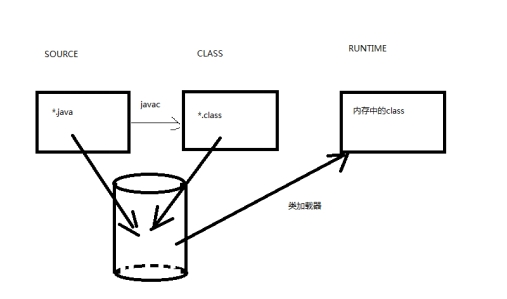

存活范围逐渐增大

 

**@Target**指定该注解能用在什么地方。ElementType：

- TYPE：

- METHOD：

- FIELD：

- ANNOTATION_TYPE

**@Documented**：如果@MyTest注解上面有@Documented注解，那么使用了@MyTest的注解的类的API文档中会出现@MyTest的信息。

**@Inherited**：作用，说明该注解可以被继承下去。

 

 

# **内部类**

内部特殊语法：

`outerClass.new InnerClass()`

内部类是一种编译现象，与虚拟机无关，编译内部类为独立字节码，两个类名用美元$分开

 

**局部内部类**：在方法体内部定义的类，不能用访问修饰符，作用域限定在方法体内，对外部世界完全隐藏起来。

 

**匿名内部类**：只需要创建某个类的一个实例对象，那么不必麻烦定义这个类，类名省掉，那么这个类为内部类，没有名字，匿名。

```java
//匿名内部类，实现Runnable的类没有名字
new Runnable() {run() {} }
```

匿名类没有类名，所以不能有构造器，如果构造器需要参数，需要将传递给超类的构造器，然后实例化是，直接使用超类字段。

 

**静态内部类**：内部类不需要外部类对象，可以减少引用；**静态方法中的局部类也需要定义为static**

`OuterClass.Inner inner = new OuterClass.Inner();`

 

# **并发**

## **Java线程**

有三种新建线程：

1. 实现 Runnable 接口；

2. 继承 Thread 类。

实现 Runnable 和 Callable 接口的类只能当做一个可以在线程中运行的任务，不是真正意义上的线程，因此最后还需要通过 Thread 来调用。可以说任务是通过线程驱动从而执行的。

3. 实现 Callable 接口；（带运行任务的返回值）

使用FutureTask将实现Callable接口的类，转成Runnable，再提交给线程Thread。 

`FutureTask(java.util.concurrent.Callable<V> callable)`

或者直接submit给线程池执行器`ThreadPoolExecutor.submit()`

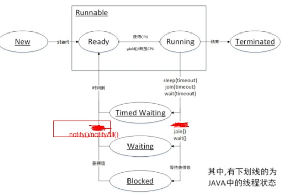

 

 

## **同步、异步与阻塞、非阻塞**

- 同步和异步说的是消息的通知机制，阻塞非阻塞说的是线程的状态 。

- JAVA NIO是同步非阻塞io。

 

- 同步就是烧开水，需要自己去轮询（每隔一段时间去看看水开了没），异步就是水开了，然后水壶会通知你水已经开了，你可以回来处理这些开水了。同步和异步是**相对于操作结果怎么通知询问线程，线程需不需要等待结果返回。**

- 阻塞就是说在煮水的过程中，你不可以去干其他的事情，非阻塞就是在同样的情况下，可以同时去干其他的事情。阻塞和非阻塞是**相对于线程是否被阻塞**。

 

其实，这两者存在本质的区别，它们的修饰对象是不同的。阻塞和非阻塞是指进程访问的数据如果尚未就绪，**进程是否需要等待**，简单说这相当于函数内部的实现区别，也就是未就绪时是直接返回还是等待就绪。

阻塞和非阻塞，同步和异步 总结 - banananana - 博客园  <https://www.cnblogs.com/George1994/p/6702084.html>

 

 

 

## **线程调度与同步方法**

**抢占式和协作式**

抢占式线程调度器确定一个线程轮到其CPU时间，会暂定当前线程，让其他线程占用CPU，不同优先级使用抢占式能有效防止饥饿。

协作式：会等待当前线程**自己暂停**，然后移交CPU控制权。相同优先级使用协作式较好。Java采用抢占式调度。

*一个java线程得以执行需要三个条件*：被CPU调度；获取执行时间；拿到对象的锁。

 

线程配合调度的方法：阻塞状态，显示放弃yield()不会放弃锁，休眠sleep()不放弃锁，等待连接其他线程join()，等待wait()/notify()、notifyAll()

**1.sleep()方法**

在指定时间内让当前正在执行的线程暂停执行，但**不会释放“锁标志”**。sleep()使当前线程进入*计时等待*状态，在指定时间内不会执行。

**2.wait()方法**

在其他线程调用对象的notify或notifyAll方法前，导致当前线程进入等待。线程**会释放**掉它所占有的“锁标志”，从而使别的线程有机会抢占该锁。

当前线程必须拥有当前对象锁。如果当前线程不是此锁的拥有者，会抛出IllegalMonitorStateException异常。唤醒当前对象锁的等待线程使用notify或notifyAll方法，也必须拥有相同的对象锁，否则也会抛出IllegalMonitorStateException异常。

waite()和notify()**必须在synchronized函数或synchronized　block中进行调用**。如果在non-synchronized函数或non-synchronized　block中进行调用，虽然能编译通过，但在运行时会发生IllegalMonitorStateException的异常。

**3.yield方法**

暂停当前正在执行的线程对象。yield()只是使当前线程放弃CPU，重新回到可执行状态，所以执行yield()的线程有可能在进入到可执行状态后马上又被执行。

yield()只能使同优先级或更高优先级的线程有执行的机会。

**4.join方法**

等待该线程终止。等待调用join方法的线程结束，再继续执行。如：t.join();//主要用于等待t线程运行结束，若无此句，main则会执行完毕，导致结果不可预测。

 

**线程返回信息**

1. 轮询

一直询问一个线程执行情况

2. 回调callback

让线程完成时反过来调用创建者，Callable对象配合executor提供的线程

 

## 包java.util.concurrent.locks 

为锁和等待条件提供一个框架的接口和类，它不同于*内置同步和监视器*。

| **接口摘要**      |                                                              |
| ----------------- | ------------------------------------------------------------ |
| **Condition**     | Condition 将 Object 监视器方法（wait、notify和 notifyAll）分解成截然不同的对象，以便通过将这些对象与任意 Lock实现组合使用，为每个对象提供多个等待 set（wait-set）。 |
| **Lock**          | Lock 实现提供了比使用 synchronized 方法和语句可获得的更广泛的锁定操作。 |
| **ReadWriteLock** | ReadWriteLock 维护了一对相关的锁，一个用于只读操作，另一个用于写入操作。 |
| **实现类**        | ReentrantLock， ReentrantReadWriteLock.ReadLock, ReentrantReadWriteLock.WriteLock |

 

## 同步方案：ReentrantLock与synchronized

```java
reentrantLock.lock();

try{
	//
}finally{
	reentrantLock.unlock();
}
```

 

- 配合条件对象使用

```java
conditon = lock.newCondition(); 

reentrantLock.lock();

try{
    //
    While(//)
    condition.await();
    //

    condition.signalAll();
}catch(Exception e){
	//
}finally{
	reentrantLock.unlock();
}
```


```java
Public synchronized void transfer() throws InterruptedException {

    While()
    wait();
    //
    notifyAll();
}
```

ReentrantLock支持两种获取锁的方式，一种是公平模型，一种是非公平模型。

一个线程在获取了锁之后，再次去获取了同一个锁，这时候仅仅是把状态值进行累加。释放锁后，仅仅是把状态值减了，只有线程A把此锁全部释放了，状态值减到0了，其他线程才有机会获取锁。当A把锁完全释放后，state恢复为0，然后会通知队列唤醒B线程节点，使B可以再次竞争锁。

非公平锁模型。当线程A执行完之后，要唤醒线程B是需要时间的，而且线程B醒来后还要再次竞争锁，所以如果在切换过程当中，来了一个线程C，那么线程C是有可能获取到锁的，如果C获取到了锁，B就只能继续等待。

 

 

 

**Synchronized使用的是内部锁：类锁和对象锁；**在静态方法中，我们一般使用类锁（如单例模式）；在实例方法中，我们一般使用对象锁，接下来，分析类锁和对象锁的区别和联系。

如果一个方法用synchronized关键字声明，那么，它表现的就像一个监视器方法。通过wait/notifyAll/nofify来访问条件变量

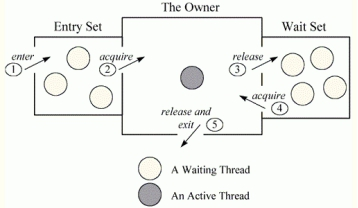

上图显示监视器为三个矩形。在该中心，一个大矩形包含一个线程，即监视器的所有者。在左边，一个小矩形包含entry set。在右边，另一个小矩形包含wait set。

 

**synchronized**它有一些功能性的限制：

- 它无法中断一个正在等待获得锁的线程，（放到wait set里面，出不去），也无法通过轮询得到锁（只能等待其他线程异步的notify），如果不想等下去，但没法得到锁，如果不能设定超时，则线程会一直等。

- 每个锁只有单一的条件，可能不够用。

 

## 线程池与执行器

· 减少创建线程和销毁线程的开销，重复利用已经创建的线程

· 提高响应速度，不需要等到线程创建就能立即执行

· 使用线程池可以进行统一分配，调优和监控

总的来说：降低资源消耗，提高响应速度，提高线程可管理性

 

类Executors可以创建线程池，线程池可以提供执行器，ThreadPoolExecutor实现类，有许多工厂方法构建线程池


- 类 Executors

**java.util.concurrent.Executors**

返回是`ThreadPoolExecutor implements ExecutorService`

 

- java.util.concurrent 接口ExecutorService

 

- 类java.util.concurrent.**ThreadPoolExecutor**


 

## **阻塞队列与同步器**

**尽量避免使用Lock和synchronized**

避免需要线程同步：

局部变量，对方法外部不可见，退出方法便撤销

构造函数一般不用担心线程安全问题，构造函数返回前，没有线程有这个对象的引用

加强类的不变性，加上private和final声明。

 

使用java.util.concurrent包中同步机制：同步器、阻塞队列、线程安全的集合等。

 

 

**阻塞队列中的方法 VS 非阻塞队列中的方法**

1.非阻塞队列中的几个主要方法：

　  add(E e):将元素e插入到队列末尾，如果插入成功，则返回true；如果插入失败（即队列已满），则会抛出异常；

　  remove()：移除队首元素，若移除成功，则返回true；如果移除失败（队列为空），则会抛出异常；

　　offer(E e)：将元素e插入到队列末尾，如果插入成功，则返回true；如果插入失败（即队列已满），则返回false；

　　poll()：移除并获取队首元素，若成功，则返回队首元素；否则返回null；

　　peek()：获取队首元素，若成功，则返回队首元素；否则返回null

 

　对于非阻塞队列，一般情况下建议使用offer、poll和peek三个方法，不建议使用add和remove方法。因为使用offer、poll和peek三个方法可以通过返回值判断操作成功与否，而使用add和remove方法却不能达到这样的效果。注意，非阻塞队列中的方法都没有进行同步措施。

 

`java.util.concurrent.ArrayBlockingQueue<E>`

2.阻塞队列中的几个主要方法：

　　阻塞队列包括了非阻塞队列中的大部分方法，上面列举的5个方法在阻塞队列中都存在，但是要注意这5个方法在阻塞队列中都进行了同步措施。除此之外，阻塞队列提供了另外4个非常有用的方法：

　　*put(E e)向队尾存入元素，如果队列满，则等待*

　　offer(E e,long timeout, TimeUnit unit)向队尾存入元素，如果队列满，则等待一定的时间，当时间期限达到时，如果还没有插入成功，则返回false；否则返回true；

 

　　*take()队首取元素，如果队列为空，则等待*

　　poll(long timeout, TimeUnit unit)从队首取元素，如果队列空，则等待一定的时间，当时间期限达到时，如果取到，则返回null；否则返回取得的元素；

 

 

**同步器：**

管理同步线程间的行为，

| **CountDownLatch**      | 一个同步辅助类，在完成一组正在其他线程中执行的操作之前，它允许一个或多个线程一直等待。 |
| ----------------------- | ------------------------------------------------------------ |
| **CyclicBarrier**       | 一个同步辅助类，它允许一组线程互相等待，直到到达某个公共屏障点 (common barrier point)。 |
| **Exchanger<V>**        | 可以在对中对元素进行配对和交换的线程的同步点。               |
| **SynchronousQueue<E>** | 一种阻塞队列，其中每个插入操作必须等待另一个线程的对应移除操作 ，反之亦然。 |
| **Semaphore**           | 一个计数信号量。信号量S，配合PV操作                          |

 

 

# **Java I/O**

 

以socket.read()为例子：

传统的BIO里面socket.read()，如果TCP RecvBuffer里没有数据，函数会一直阻塞，直到收到数据，读取并返回数据。

对于NIO，如果TCP RecvBuffer有数据，就把数据从网卡读到内存，并且返回给用户；反之则直接返回0。（等待数据过程是非阻塞的，线程可以干别的事）。

最新的AIO(Async I/O，异步IO)里面会更进一步：不但等待就绪是非阻塞的，就连数据从网卡到内存的过程也是异步的。

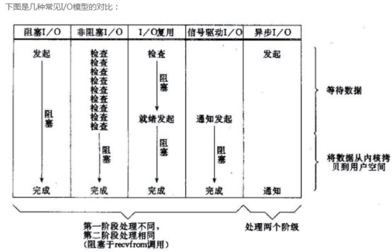

Java 的 I/O 操作类在包 java.io 下，大概有将近 80 个类，但是这些类大概可以分成四组，分别是：

基于字节操作的 I/O 接口：InputStream 和 OutputStream

基于字符操作的 I/O 接口：Writer 和 Reader

基于磁盘操作的 I/O 接口：File

基于网络操作的 I/O 接口：Socket，虽然 Socket 类并不在 java.io 包下

 

## Java 中的网络IO支持：

1. InetAddress：用于表示网络上的硬件资源，即 IP 地址；

2. URL：统一资源定位符，通过 URL 可以直接读取或者写入网络上的数据；

3. Sockets：使用 TCP 协议实现网络通信；

4. Datagram：使用 UDP 协议实现网络通信。

 

**1. InetAddress**

没有公有构造函数，只能通过静态方法来创建实例。

InetAddress.getByName(String host);

InetAddress.getByAddress(byte[] addr);

 

**2. URL**

可以直接从 URL 中读取字节流数据

URL url = new URL("http://www.baidu.com");

InputStream is = url.openStream();                           // 字节流

InputStreamReader isr = new InputStreamReader(is, "utf-8");  // 字符流

BufferedReader br = new BufferedReader(isr);

String line = br.readLine();

while (line != null) {

​    System.out.println(line);

​    line = br.readLine();

}

br.close();

isr.close();

is.close();

 

**3.Sockets**

- ServerSocket：服务器端类

- Socket：客户端类

- 服务器和客户端通过 InputStream 和 OutputStream 进行输入输出

```java
//服务器

ServerSocket ss = new ServerSocket(9999);
Socket s = ss.accept ();

InputStream in = s.getInputStream();
byte[] buf = new byte[1024];
int num = in.read(buf);//读入到buf里面
String str = new String(buf,0,num);
System.out.println(s.getInetAddress().toString()+”:”+str);

s.close();
ss.close();

 

//客户端
Socket s = new Socket(“192.168.40.165”,9999);

OutputStream out = s.getOutputStream();

out.write(“hello”.getBytes());

s.close();
```

 

## NIO概述

JAVA NIO是**非阻塞同步io**。

**软件包 java.nio** 

定义作为数据容器的缓冲区，并提供其他 NIO 包的概述。 

| **类摘要**       |                                              |
| ---------------- | -------------------------------------------- |
| Buffer           | 一个用于特定基本类型数据的容器。             |
| ByteBuffer       | 字节缓冲区。                                 |
| ByteOrder        | 字节顺序的类型安全枚举。                     |
| CharBuffer       | 字符缓冲区。                                 |
| DoubleBuffer     | double 缓冲区。                              |
| FloatBuffer      | float 缓冲区。                               |
| IntBuffer        | int 缓冲区。                                 |
| LongBuffer       | long 缓冲区。                                |
| MappedByteBuffer | 直接字节缓冲区，其内容是文件的内存映射区域。 |
| ShortBuffer      | short 缓冲区。                               |

 

 

 

**软件包 java.nio.channels** 

定义了各种通道，这些通道表示到能够执行 I/O 操作的实体（如文件和套接字）的连接；定义了用于多路复用的、非阻塞 I/O 操作的选择器。 

| **接口摘要**              |                                |
| ------------------------- | ------------------------------ |
| **ByteChannel**           | 可读取和写入字节的信道。       |
| **Channel**               | 用于 I/O 操作的连接。          |
| **GatheringByteChannel**  | 可从缓冲区序列写入字节的通道。 |
| **InterruptibleChannel**  | 可被异步关闭和中断的通道。     |
| **ReadableByteChannel**   | 可读取字节的通道。             |
| **ScatteringByteChannel** | 可将字节读入缓冲区序列的通道。 |
| **WritableByteChannel**   | 可写入字节的通道。             |

| **类摘要**              |                                                              |
| ----------------------- | ------------------------------------------------------------ |
| **Channels**            | 针对信道和流的实用工具方法。                                 |
| **DatagramChannel**     | 针对面向数据报套接字的可选择通道。                           |
| **FileChannel**         | 用于读取、写入、映射和操作文件的通道。                       |
| **FileChannel.MapMode** | 文件映射模式的类型安全的枚举。                               |
| **FileLock**            | 表示文件区域锁定的标记。                                     |
| **Pipe**                | 实现单向管道传送的通道对。                                   |
| **Pipe.SinkChannel**    | 表示 [Pipe](mk:@MSITStore:E:\API\java\API%20文档\JDK6API中文参考手册[沈东良制]\JDK6API中文参考手册[沈东良制].chm::/java/nio/channels/../../../java/nio/channels/Pipe.html) 的可写入结尾的通道。 |
| **Pipe.SourceChannel**  | 表示 [Pipe](mk:@MSITStore:E:\API\java\API%20文档\JDK6API中文参考手册[沈东良制]\JDK6API中文参考手册[沈东良制].chm::/java/nio/channels/../../../java/nio/channels/Pipe.html) 的可读取结尾的通道。 |
| **SelectableChannel**   | 可通过 [Selector](mk:@MSITStore:E:\API\java\API%20文档\JDK6API中文参考手册[沈东良制]\JDK6API中文参考手册[沈东良制].chm::/java/nio/channels/../../../java/nio/channels/Selector.html) 实现多路复用的通道。 |
| **SelectionKey**        | 表示 [SelectableChannel](mk:@MSITStore:E:\API\java\API%20文档\JDK6API中文参考手册[沈东良制]\JDK6API中文参考手册[沈东良制].chm::/java/nio/channels/../../../java/nio/channels/SelectableChannel.html) 在 [Selector](mk:@MSITStore:E:\API\java\API%20文档\JDK6API中文参考手册[沈东良制]\JDK6API中文参考手册[沈东良制].chm::/java/nio/channels/../../../java/nio/channels/Selector.html) 中的注册的标记。 |
| **Selector**            | [SelectableChannel](mk:@MSITStore:E:\API\java\API%20文档\JDK6API中文参考手册[沈东良制]\JDK6API中文参考手册[沈东良制].chm::/java/nio/channels/../../../java/nio/channels/SelectableChannel.html) 对象的多路复用器。 |
| **ServerSocketChannel** | 针对面向流的侦听套接字的可选择通道。                         |
| **SocketChannel**       | 针对面向流的连接套接字的可选择通道。                         |

 

**流与块**

I/O 与 NIO 最重要的区别是数据打包和传输的方式，I/O 以流的方式处理数据，而 NIO 以块的方式处理数据。

面向流的 I/O 一次处理一个字节数据：一个输入流产生一个字节数据，一个输出流消费一个字节数据。为流式数据创建过滤器非常容易，链接几个过滤器，以便每个过滤器只负责复杂处理机制的一部分。不利的一面是，面向流的 I/O 通常相当慢。

面向块的 I/O 一次处理一个数据块，按块处理数据比按流处理数据要快得多。但是面向块的 I/O 缺少一些面向流的 I/O 所具有的优雅性和简单性。（因此并不是所有流的InputStream都能拿到nio中的Channel）

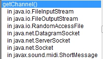

 

**通道**

通道 Channel 是对原 I/O 包中的流的模拟，可以通过它读取和写入数据。通道与流的不同之处在于，流只能在一个方向上移动(一个流必须是 InputStream 或者 OutputStream 的子类)，而通道是双向的，可以用于读、写或者同时用于读写。

通道包括以下类型：

FileChannel：从文件中读写数据；

DatagramChannel：通过 UDP 读写网络中数据；

SocketChannel：通过 TCP 读写网络中数据；

ServerSocketChannel：可以监听新进来的 TCP 连接，对每一个新进来的连接都会创建一个 SocketChannel。


**缓冲区**

发送给一个通道的所有数据都必须首先放到缓冲区中，同样地，从通道中读取的任何数据都要先读到缓冲区中。也就是说，不会直接对通道进行读写数据，而是要先经过缓冲区。

缓冲区实质上是一个数组，但它不仅仅是一个数组。缓冲区提供了对数据的结构化访问，而且还可以跟踪系统的读/写进程。

缓冲区包括以下类型：

ByteBuffer

CharBuffer

ShortBuffer

IntBuffer

LongBuffer

FloatBuffer

DoubleBuffer

缓冲区状态变量

capacity：最大容量；

position：当前已经读写的字节数；

limit：还可以读写的字节数。

 

Java NIO 由以下几个核心部分组成：

- **Channels、Buffers、Selectors**


NIO 的创建目的是为了让 Java 程序员可以实现高速 I/O 而无需编写自定义的本机代码。NIO 将最耗时的 I/O 操作(即填充和提取缓冲区)转移回操作系统，因而可以极大地提高速度。

**下面是JAVA NIO中的一些主要Channel的实现：**

FileChannel   DatagramChannel    SocketChannel   ServerSocketChannel

正如你所看到的，这些通道channel涵盖了UDP 和 TCP 网络IO，以及文件IO。

**以下是Java NIO里关键的Buffer实现：**

ByteBuffer。。

这些Buffer覆盖了你能通过IO发送的基本数据类型：byte, short, int, long, float, double 和 char。

 

**面向流与面向缓冲**

**阻塞与非阻塞IO**

Java NIO的非阻塞模式，使一个线程从某通道发送请求读取数据，但是它仅能得到目前可用的数据，如果目前没有数据可用时，就什么都不会获取，直至数据变的可以读取之前，同时该线程可以继续做其他的事情。

一个线程请求写入一些数据到某通道，但不需要等待它完全写入，这个线程同时可以去做别的事情。 ？？？

 

线程通常将非阻塞IO的空闲时间用于在其它通道上执行IO操作，所以一个单独的线程现在可以管理多个输入和输出通道（channel）。

 

 

**通道和缓冲区**

通道 和 缓冲区 是 NIO 中的核心对象，几乎在每一个 I/O 操作中都要使用它们。

通道是对原 I/O 包中的流的模拟。到任何目的地(或来自任何地方)的所有数据都必须通过一个 Channel 对象。一个 Buffer 实质上是一个容器对象。发送给一个通道的所有对象都必须首先放到缓冲区中；同样地，从通道中读取的任何数据都要读到缓冲区中。

Buffer 是一个对象， 它包含一些要写入或者刚读出的数据。 在 NIO 中加入 Buffer 对象，体现了新库与原 I/O 的一个重要区别。在面向流的 I/O 中，您将数据直接写读到 Stream 对象中。

缓冲区实质上是一个数组。通常它是一个字节数组，但是也可以使用其他种类的数组。但是一个缓冲区不 仅仅 是一个数组。缓冲区提供了对数据的结构化访问，而且还可以跟踪系统的读/写进程。

最常用的缓冲区类型是 ByteBuffer。

通道与流的不同之处在于通道是双向的。因为它们是双向的，所以通道可以比流更好地反映底层操作系统的真实情况。特别是在 UNIX 模型中，底层操作系统通道是双向的。

 

**读文件**

```java
FileInputStream fin = new FileInputStream( "readandshow.txt" );

FileChannel fcin = fin.getChannel(); 	//通过流得到通道

 
//下一步是创建缓冲区： 
ByteBuffer buffer = ByteBuffer.allocate( 1024 );

//最后，需要将数据从通道读到缓冲区中，如下所示： 
fcin.read( buffer );//buffer从通道中读数据，主语是buffer
```

 

**写文件**

```java
FileOutputStream fout = new FileOutputStream( "writesomebytes.txt" );
FileChannel fcout = fout.getChannel();

ByteBuffer buffer = ByteBuffer.allocate( 1024 );

//数据放入缓冲区
for (int i=0; i<message.length; ++i) {
	buffer.put( message[i] );
}
buffer.flip();	//写出数据前，需要调整缓冲区两个变量位置，position,limit。

//最后一步是写入通道：
fcout.write( buffer );		←  buffer写数据到通道
buffer.clear();				清空
```

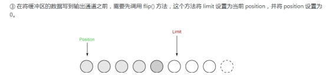

 

**缓冲区状态变量**

可以用三个值指定缓冲区在任意时刻的状态： 

- Position  缓冲读入数据的位置

- Limit		缓冲还有多少数据要写出，limit不超过position

- Capacity 缓冲区的 capacity 表明可以储存在缓冲区中的最大数据容量。

##  **面向服务器的NIO**


Java NIO是在jdk1.4开始使用的，它既可以说成“新I/O”，也可以说成非阻塞式I/O。下面是java NIO的工作原理：

1. 由一个专门的线程来处理所有的 IO 事件，selector并负责分发。 
2. 事件驱动机制：事件到的时候触发selector，而不是同步的去监视事件。 
3. 线程通讯：线程之间通过 wait,notify 等方式通讯。保证每次上下文切换都是有意义的。减少无谓的线程切换。

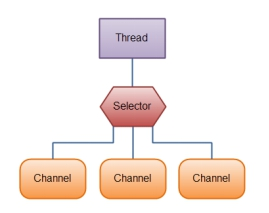

| 服务端接收客户端连接事件 | SelectionKey.OP_ACCEPT(16) |
| ------------------------ | -------------------------- |
| 客户端连接服务端事件     | SelectionKey.OP_CONNECT(8) |
| 读事件                   | SelectionKey.OP_READ(1)    |
| 写事件                   | SelectionKey.OP_WRITE(4)   |

如果服务端的selector上注册了读事件，某时刻客户端给服务端发送了一些数据，阻塞I/O这时会调用read()方法阻塞地读取数据，而NIO的服务端会在selector中添加一个读事件。

服务端的处理线程会轮询地访问selector，如果访问selector时发现有感兴趣的事件到达，则处理这些事件。而selector是异步获取事件

**选择器（Selectors）**

Java NIO的选择器允许一个单独的线程来监视多个输入通道，你可以在一个选择器中注册多个通道。这些通道里已经有可以处理的输入，或者选择已准备写入的通道。这种选择机制，使得一个线程来管理多个通道。

Selector允许单线程处理多个 Channel。如果你的应用打开了多个连接（通道），但每个连接的流量都很低，使用Selector就会很方便。例如，在一个聊天服务器中。

这是在一个单线程中使用一个Selector处理3个Channel的图示：

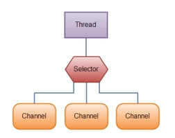)

要使用Selector，得向Selector注册Channel，然后调用它的select()方法。这个方法会一直阻塞到某个注册的通道有事件就绪。一旦这个方法返回，线程就可以处理这些事件，如新连接进来，数据接收等。

如果需要管理同时打开的成千上万个连接，这些连接每次只是发送少量的数据，例如聊天服务器，实现NIO的服务器可能是一个优势。同样，如果你需要维持许多打开的连接到其他计算机上，如P2P网络中，使用一个单独的线程来管理你所有出站连接，可能是一个优势。一个线程多个连接的设计方案如下图所示：

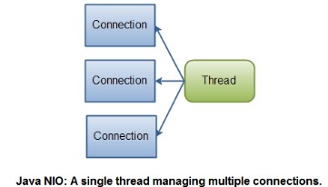

如果你有少量的连接使用非常高的带宽，一次发送大量的数据，也许典型的IO服务器实现可能非常契合。下图说明了一个典型的IO服务器设计：

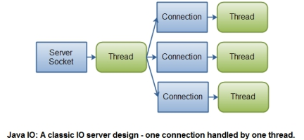

 

