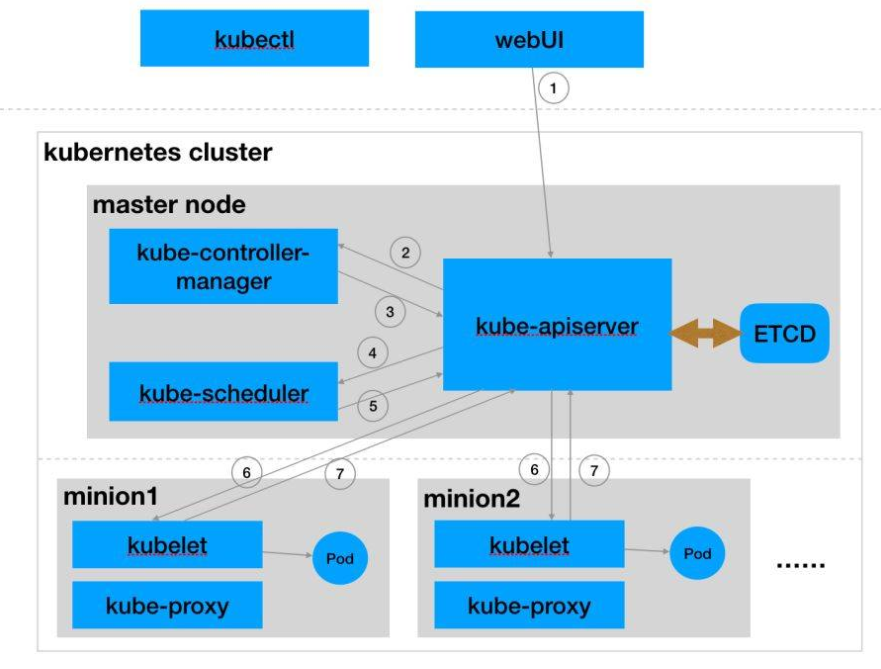

[TOC]


# k8s的通知模型list-watch

k8s系统运行基于声明式而非命令式。声明式可以简单理解为”告诉k8s要做什么“，k8s在收到用户的需求后，在自身的机制运作下满足用户的需求，而非告诉k8s执行怎么去做的命令。声明式一个熟悉的例子是SQL查询，用户只需要告诉DB查询的各种条件，而不用告诉它怎么遍历、过滤、聚合。同样，在k8s里面用户只需声明资源对象的最终命令即可。

k8s支撑声明式机制的核心组件是master主节点上的神经中枢apiserver、控制中枢controller manager、调度器scheduler，以及node工作节点上的kubelet。组件之间数据交互是协调各方工作的重要部分，那么在k8s里面数据交互是怎么一种方式？下面以典型pod创建过程





1（RS创建）  在api-server接收到来自用户的创建命令后，创建一个ReplicaSet对象存放在etcd中

2-3 （Pod创建） controller-manager通过list-watch机制获取到RS对象及事件后，驱动RS控制器工作，满足用户声明的需求，比如声明了2个pod，当前pod数量不为2，则controller负责将资源状态收敛于用户期望的状态。

4~5(Pod调度)`kube-scheduler`也会通过list-watch机制获取到新创建的 `v1.Pod`，然后根据调度算法为Pod选择最合适的节点。假定调度结果是两个Pod选择的是minion1和minion2，即刷新`v1.Pod`数据的 `spec.nodeName`字段为minion1和minion2的nodeName。

6-7（容器运行）后minion上的`kubelet`也会通过list-watch机制获取到调度完的 `v1.Pod`数据，然后通过`container.Runtime`接口创建Pod中指定的容器。并刷新ETCD中Pod的运行状态。

| 流程／Pod状态    | PodPhase | PodCondition                                          | 组件                                     |
| ---------------- | -------- | ----------------------------------------------------- | ---------------------------------------- |
| 1（RS创建）      | -        | -                                                     | 用户声明RS数据： 创建RS，无Pod           |
| 2～3 （Pod创建） | Pending  | -                                                     | kube-controller-manager: RS控制器创建Pod |
| 4～5(Pod调度)    | Pending  | PodScheduled=true                                     | Kube-scheduler: 调度器调度Pod成功        |
| 6～7（容器运行） | Running  | PodScheduled=true; PodInitialized=true; PodReady=true | kubelet: Work node上成功运行容器         |


可以从上面创建RS流程中看到，各个组件和kube-apiserver之间的数据推送都是通过list-watch机制来实现。所以理解list-watch机制是深入理解kubernetes的关键。


## list-watch

由组件向apiserver而不是etcd发起watch请求，在组件启动时就进行订阅，告诉apiserver需要知道什么数据发生变化。Watch是一个典型的发布-订阅模式。

组件向apiserver发起的watch请求是可以带条件的，例如，scheduler想要watch的是所有未被调度的Pod，也就是满足Pod.destNode=””的Pod来进行调度操作；而kubelet只关心自己节点上的Pod列表。apiserver向etcd发起的watch是没有条件的，只能知道某个数据发生了变化或创建、删除，但不能过滤具体的值。也就是说对象数据的条件过滤必须在apiserver端而不是etcd端完成。那么list是怎么回事呢？

kubernetes中结合watch请求增加了`list请求`，主要做如下两件事情:

1. watch请求开始之前，先发起一次list请求，获取集群中当前所有该类数据(同时得到最新的ResourceVersion)，之后基于最新的ResourceVersion发起watch请求。这样可以采取增量更新方式更新以获取的数据，不用一次watch
2. 当watch出错时(比如说网络闪断造成客户端和服务端数据不同步)，重新发起一次list请求获取所有数据，保证list获取数据和etcd中一致，再重新基于最新ResourceVersion来watch。

list目标是以便各组件更有效的watch，以及保证数据的一致性。下面将通过list-watch底层源码实现来进一步说明k8s的通知机制。


## 相关源码

组件的list-watch主要是通过client-go的Reflector和informer的组合来实现的。

Reflector负责list和watch增量更新资源数据。Informer负责响应变化。

list-watch具体代码执行流程可以参考：

https://github.com/daniel-hutao/k8s-source-code-analysis/blob/proxy/around/client-go/informer.md

由于client-go的Reflector帮我们实现了list-watch从api-server同步数据，对于开发人员主要关注事件处理逻辑，即Informer部分。通过 Informer(实际我们用到的都不是单纯的 informer，而是组合了各种工具的 sharedInformerFactory) 我们可以轻松 List/Get 某个资源对象，可以监听资源对象的各种事件(比如创建和删除)然后触发回调函数，完成逻辑处理。我们可以直接利用Informer来获取、查询k8s中的资源数据，以及注册响应时间的回调函数，添加处理逻辑。

每种资源都有其对应的informer，下面以pod informer为例，简单介绍informer的使用。

```go
    // 新建工厂SharedInformerFactory
	factory := informers.NewSharedInformerFactory(client, 0*time.Second)
	// 工厂生成informer
	podInformer := factory.Core().V1().Pods().Informer()
	// 也可以得到lister，获取到k8s资源
	podLister := factory.Core().V1().Pods().Lister()

	// 为informer注册事件处理逻辑
	podInformer.AddEventHandler(
		kubeCache.ResourceEventHandlerFuncs{
			AddFunc: func(obj interface{}) {
				// ...
			},
			UpdateFunc: func(old, cur interface{}) {
				// ...
			},
			DeleteFunc: func(obj interface{}) {
				// ...
			},
		},
	)
	
	// 启动单个informer，监听事件并响应
	stopCh := make(chan struct{})
	go podInformer.Run(stopCh)

	// 或者使用工厂factory start方法启动所有informer
	// factory.Start(stopCh)

	/* factory start方法代码如下   
	// Start initializes all requested informers.
    func (f *sharedInformerFactory) Start(stopCh <-chan struct{}) {
        f.lock.Lock()
        defer f.lock.Unlock()

        for informerType, informer := range f.informers {
            if !f.startedInformers[informerType] {
                go informer.Run(stopCh)
                f.startedInformers[informerType] = true
            }
        }
    }
    */
```


# 认证，授权以及RBAC

**k8s中的客户端访问有两类用户:**

1. 普通用户（Human User），一般是集群外访问，如 kubectl 使用的证书

2. service account: 如集群内的 Pod


**有什么区别呢？**

k8s 不会对 user 进行管理，并不存储 user 信息，你也不能通过调用k8s api来增删查这个 user。user 的增删操作都是在 k8s 外部进行，k8s 只做认证不做管理。


k8s 会对serviceaccount 进行管理，他的作用是给集群内运行的 pod 提供一种认证的方式，如果你这个 pod 想调用apiserver操作一些资源如获取 node列表，就需要绑定一个serviceaccount账户给自己，并为这个serviceaccount赋予一定的权限，这样就做到了实体和权限的分离，

**这两种授权管理都是通过 rbac来操作**


**作用范围：**

User独立在 K8S 之外，也就是说User是可以作用于全局的，跨 namespace，并且需要在全局唯一

ServiceAccount是K8S的一种资源，是存在于某个namespace之中的，在不同namespace中可以同名，代表了不同的资源。


在k8s早期版本中，集群间通信通过HTTP通信，权限管理并不完善安全性较低，后面开始使用HTTPS、TLS认证，以及RBAC基于角色访问控制。外部命令都是通过api-server组件传达的，使用它提供的HTTP RESTful形式API供外部调用，因此为了集群的安全性，需要需要对api-server的访问进行权限认证。

## 认证Authentication

api-server对于访问的认证方式，常用的有：证书和Token两种形式

api-server采用HTTPS对外提供访问，访问者提供证书以认证其合法性是较为好理解的形式。而使用Token认证方式主要采用ServiceAccount这种k8s资源。

- ServiceAccount Token

很多情况下我们希望pod能直接访问到api-server，比如部署在集群中的Prometheus监控应用，需要访问api-server采集k8s的监控数据。对于这种情况，k8s提供了一种简便的认证方式：ServiceAccount原生资源。在部署的时候给containers挂载ServiceAccount，那么容器`/var/run/secrets/kubernetes.io/serviceaccount/`目录下会生成`namespace`、`token` 和 `ca`，容器便可以访问api-server。

```yaml
# 一个serviceAccount Token例子
spec:
  containers:
	# ...
    volumeMounts:
    - mountPath: /var/run/secrets/kubernetes.io/serviceaccount
      name: default-token-7dgpf
      readOnly: true
  # ...
  serviceAccount: default
  serviceAccountName: default
```

ServiceAccount是限定namespace的，而每个namespace下有一个名为`default`的默认的ServiceAccount对象，这个ServiceAccount里有一个名为Tokens的可以作为Volume一样被Mount到Pod里的Secret，当Pod启动时这个Secret会被自动Mount到Pod的指定目录下，用来协助完成Pod中的进程访问API Server时的身份鉴权过程。


## 授权Authorization

RBAC（Role-Based Access Control）是基于角色的访问控制，通过自定义角色及其权限Role，并将其和具体的"用户" user，group，serviceaccounts 关联起来，达到对“用户“权限控制的目的。

k8s的RBAC方案包含三种资源：

- Role：角色，它其实是一组规则，定义了一组对 Kubernetes API 对象的操作权限；
- Subject：被作用者，包括 user，group，serviceaccounts，通俗来讲就是认证机制中所识别的用户；
- RoleBinding：定义了“被作用者”和“角色”的绑定关系，也就是将用户以及操作权限进行绑定；

k8s的RBAC 其实就是通过创建Role，通过 RoleBinding 将Role定义的权限授予Subject。下面是一个例子：

```yaml
kind: Role
apiVersion: rbac.authorization.k8s.io/v1beta1
metadata:
  namespace: default # Role是限定namespace的
  name: pod-reader
rules:
- apiGroups: [""] # 空字符串""表明使用core API group
  resources: ["pods"] # 能操作的资源对象
  verbs: ["get", "watch", "list"] # 权限动作

---
# 将用户"jane"视为一个pod-reader角色，从"default"命名空间中读取pod。
kind: RoleBinding
apiVersion: rbac.authorization.k8s.io/v1beta1
metadata:
  name: read-pods
  namespace: default
roleRef:
  kind: Role # 角色类型
  name: pod-reader
  apiGroup: rbac.authorization.k8s.io
subjects:
- kind: User # 被授予角色的主体类型名为jane的User
  name: jane
  apiGroup: rbac.authorization.k8s.io
```


Role可以是限定namespace的k8s的"Role"资源，也可以是在整个集群有效的“ClusterRole”资源，对于ClusterRole的权限授予需要使用ClusterRoleBinding来进行。一个例子：

```yaml
apiVersion: rbac.authorization.k8s.io/v1beta1
kind: ClusterRole
metadata:
  name: prometheus
rules:
- apiGroups: [""]
  resources:
  - nodes
  - nodes/proxy
  - services
  - endpoints
  - pods
  verbs: ["get", "list", "watch"]
- apiGroups:
  - extensions
  resources:
  - ingresses
  verbs: ["get", "list", "watch"]
- nonResourceURLs: ["/metrics"]
  verbs: ["get"]

---
apiVersion: rbac.authorization.k8s.io/v1beta1
kind: ClusterRoleBinding
metadata:
  name: prometheus
roleRef:
  apiGroup: rbac.authorization.k8s.io
  kind: ClusterRole
  name: prometheus
subjects:
- kind: ServiceAccount # 这里将ClusterRole权限授予prometheus的ServiceAccount资源
  name: prometheus
  namespace: default   # ServiceAccount是限定namespace的

---
# 一个ServiceAccount例子
apiVersion: v1
kind: ServiceAccount
metadata:
  name: prometheus
  namespace: default
```


​																							k8s的RBAC方案


# 扩展k8s资源

## 自定义k8s资源：CRD

允许定义自己的k8s资源，有些场景下我们需要使用在k8s基础资源上进行更高层次的抽象，比如定义一个etcd集群。CRD是k8s提供的一种无须修改源码便可k8s增加新资源类型的方式。一个CRD例子：

```yaml
## crd.yaml
apiVersion: apiextensions.k8s.io/v1beta1
kind: CustomResourceDefinition
metadata:
  # name must match the spec fields below, and be in the form: <plural>.<group>
  name: crontabs.stable.example.com
spec:
  # group name to use for REST API: /apis/<group>/<version>
  group: stable.example.com
  # list of versions supported by this CustomResourceDefinition
  version: v1beta1
  # either Namespaced or Cluster
  scope: Namespaced
  names:
    # plural name to be used in the URL: /apis/<group>/<version>/<plural>
    plural: crontabs
    # singular name to be used as an alias on the CLI and for display
    singular: crontab
    # kind is normally the CamelCased singular type. Your resource manifests use this.
    kind: CronTab
    # shortNames allow shorter string to match your resource on the CLI
    shortNames:
    - ct
```

`kubectl apply -f crd.yaml`便可在k8s中注册CronTab这一资源，通过`kubectl get crd`可以查看k8s中的自定义资源类型。同时k8s也为这一资源创建了操作的api

```bash
# 开启HTTP端口以供本地直接访问api
$ kubectl proxy --port=8080
	Starting to serve on xxx:8080
$ curl xxxx:8080
	"/apis/stable.example.com"
    "/apis/stable.example.com/v1beta1"
    
# 创建CRD后，也可以将其删除
$ kubectl delete crd/crontabs.stable.example.com
```


声明CRD后，便可以创建这一资源的实例，就像我们创建一个Deployment实例一样

```yaml
# my-crontab.yaml
apiVersion: "stable.example.com/v1beta1"
kind: CronTab                               # 实例的类型kind为自定义的CronTab
metadata:
  name: my-cron-object
spec:
  cronSpec: "* * * * */5"
  image: my-awesome-cron-image
```

```bash
kubectl apply -f my-crontab.yaml

# 实例instance创建好了，可以查看，删除
kubectl get crontab    # 查看CronTab实例，也可以用CronTab、或者缩写ct去get
kubectl delete ct/my-new-cron-object
```


## 深入CRD

待续...


## aggregator

待续...


