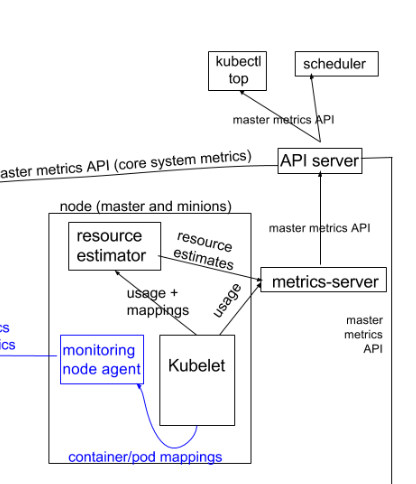

## Metrics Server

metrics server是k8s监控体系架构中的一个组件，负责从kubelets收集资源的metric监控指标。在apiserver中通过metric api将metric暴露给其他数据使用者。

这些监控指标的主要使用者为kubectl top、资源HPA、VPA。

https://github.com/kubernetes/community/blob/master/contributors/design-proposals/instrumentation/monitoring_architecture.md

