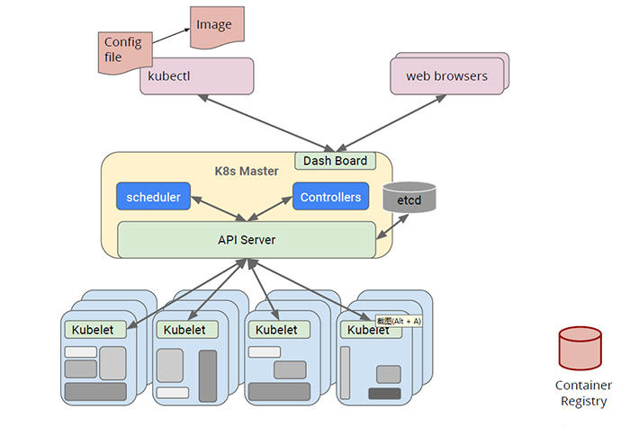

## Controller-Manager


声明式是k8s的核心特点之一，即告诉k8s做什么，而不用告诉k8s怎么去做。例如SQL是声明式的，只需要告诉SQL要查询的内容和筛选条件，数据库会自动完成遍历、过滤、聚合操作。

在k8s中声明式的“语法”是yaml文件，用户配置好期望的pod信息，k8s通过各种控制器controller来是pod达到用户所期望的状态。controller使资源状态收敛于期望状态的工作原理可用调谐循环（Reconcile loop）来粗略表示，如下代码：

```go
Reconcile(rsvc) {
	for {
        actualState := GetResourceActualState(rsvc)
        expectState := GetResourceExpectState(rsvc)
        if actualState == expectState {
            // do nothing
        } else {
            Reconcile(rsvc)
        }
	}  
}
```


对于k8s的build-in原生资源（Deployments, Statefulset, CronJob, ...），都有其对应的controller。Controller Manager是集群内部的控制中心，由负责不同资源的多个 Controller 构成，共同负责集群内的 Node、Pod 等所有资源的管理，比如当通过 Deployment 创建的某个 Pod 发生异常退出时，RS Controller 便会接受并处理该退出事件，并创建新的 Pod 来维持预期副本数。

几乎每种特定资源都有特定的 Controller 维护管理以保持预期状态，而 Controller Manager 的职责便是把所有的 Controller 聚合起来：

1. 提供基础设施降低 Controller 的实现复杂度
2. 启动和维持 Controller 的正常运行

可以这么说，Controller 保证集群内的特定资源保持预期状态，而 Controller Manager支撑起Controller的正常工作。


## Controller-Manager代码层面

通过上面介绍可以知道controller两个要素，管理的资源resource和协调的规则。k8s中资源的状态收敛通过事件处理handler来完成。

以 Deployment Controller 举例，在 `pkg/controller/deployment/deployment_controller.go` 的 `NewDeploymentController` 方法中，便包括了 Event Handler 的注册，对于 Deployment Controller 来说，只需要根据不同的事件实现不同的处理逻辑，便可以实现对相应资源的管理。

```go
func NewDeploymentController(dInformer appsinformers.DeploymentInformer, rsInformer appsinformers.ReplicaSetInformer, podInformer coreinformers.PodInformer, client clientset.Interface) (*DeploymentController, error) {
	// ...
	dInformer.Informer().AddEventHandler(cache.ResourceEventHandlerFuncs{
		AddFunc:    dc.addDeployment,
		UpdateFunc: dc.updateDeployment,
		// This will enter the sync loop and no-op, because the deployment has been deleted from the store.
		DeleteFunc: dc.deleteDeployment,
	})
	rsInformer.Informer().AddEventHandler(cache.ResourceEventHandlerFuncs{
		AddFunc:    dc.addReplicaSet,
		UpdateFunc: dc.updateReplicaSet,
		DeleteFunc: dc.deleteReplicaSet,
	})
	podInformer.Informer().AddEventHandler(cache.ResourceEventHandlerFuncs{
		DeleteFunc: dc.deletePod,
	})
	// ...
}
```

informer是controller负责管理对应资源的list-watch组件，通过api-server同步资源，在其中注册事件处理handler；informer+注册事件处理handler，构成一个抽象的controller概念。

informer工厂实例创建

```go
func NewSharedInformerFactoryWithOptions(client kubernetes.Interface, defaultResync time.Duration, options ...SharedInformerOption) SharedInformerFactory {
	factory := &sharedInformerFactory{
		client:           client,
		namespace:        v1.NamespaceAll,
		defaultResync:    defaultResync,
		informers:        make(map[reflect.Type]cache.SharedIndexInformer),
		startedInformers: make(map[reflect.Type]bool),
		customResync:     make(map[reflect.Type]time.Duration),
	}

	// Apply all options
	for _, opt := range options {
		factory = opt(factory)
	}

	return factory
}
```

单个controller的创建与维护在go-client中，方便用户自定义controller，而controller-manager维护的是原生资源的controller。

controller-manager负责所有控制器的初始化工作，整体代码主干流程如图所示：


```go
// Run runs the KubeControllerManagerOptions.  This should never exit.
func Run(c *config.CompletedConfig, stopCh <-chan struct{}) error {
    ...
   // Setup any healthz checks we will want to use.
    ... 
   // Start the controller manager HTTP server
   // unsecuredMux is the handler for these controller *after* authn/authz filters have been applied
   // ...
   run := func(ctx context.Context) {
      // ...
      controllerContext, err := CreateControllerContext(c, rootClientBuilder, clientBuilder, ctx.Done())
      // ...
      if err := StartControllers(controllerContext, saTokenControllerInitFunc, NewControllerInitializers(controllerContext.LoopMode), unsecuredMux); err != nil {
         klog.Fatalf("error starting controllers: %v", err)
      }
      controllerContext.InformerFactory.Start(controllerContext.Stop)
      controllerContext.ObjectOrMetadataInformerFactory.Start(controllerContext.Stop)
	  // ...
   }
    
   // 选主相关逻辑
   leaderelection.RunOrDie(context.TODO(), leaderelection.LeaderElectionConfig{
      ...
      Callbacks: leaderelection.LeaderCallbacks{
         // 选主完成后的执行入口函数run，它被声明为匿名函数。
         OnStartedLeading: run,
         ...
      },
   })
}
```

它的主要流程步骤：

1. 启动lead选主用的healthz checks

2. 启动控制管理器的http server

3. 选主完后启动run函数

```
// 启动每个控制器
StartControllers函数
// 启动资源监听
controllerContext.InformerFactory.Start(controllerContext.Stop)
controllerContext.ObjectOrMetadataInformerFactory.Start(controllerContext.Stop)
```


```go
// 所有控制器的初始化
func NewControllerInitializers(loopMode ControllerLoopMode) map[string]InitFunc {
   controllers := map[string]InitFunc{}
	// 各类原生资源 ...
   controllers["resourcequota"] = startResourceQuotaController
   controllers["namespace"] = startNamespaceController
	// ...
   controllers["deployment"] = startDeploymentController
   controllers["replicaset"] = startReplicaSetController
	// ...
   controllers["nodelifecycle"] = startNodeLifecycleController
   if loopMode == IncludeCloudLoops {
      controllers["service"] = startServiceController
      controllers["route"] = startRouteController
      controllers["cloud-node-lifecycle"] = startCloudNodeLifecycleController
      // TODO: volume controller into the IncludeCloudLoops only set.
   }
	// ..

   return controllers
}
```


## Scheduler调度器

调度是k8s容器编排重要一环。在Kubernetes中，Controller Manager负责Pod等副本管理，Kubelet负责拉起Pod，而Scheduler就是负责安排Pod到具体的Node。

Scheduler通过API Server提供的接口监听Pods，获取待调度pod，然后根据一系列的预选策略和优选策略，给合适的Node节点打分排序，然后将Pod调度到得分最高的Node节点上，然后由kubelet负责拉起Pod。



​																	k8s工作流程示意图


​																			pod调度的流程

1. 资源管控中心Controller Manager创建新的Pod，将该Pod加入待调度的Pod列表。
2. kube-scheduler通过API Server提供的接口监听Pods，获取待调度pod，经过预选和优选两个阶段对各个Node节点打分排序，为待调度Pod列表中每个对象选择一个最优的Node。
3. kube-scheduler将调度结果返回给apiserver，apiserver将Pod与Node的绑定信息写入etcd
4. 5. 6. kubelet通过API Server监听到kube-scheduler产生的绑定信息，获得Pod列表。kubelet下载Image并启动容器，然后由kubelet负责拉起Pod

如果Pod中指定了NodeName属性，则无需Scheduler参与，Pod会直接被调度到NodeName指定的Node节点


​													pod指定nodeName，则无需scheduler参与

一个问题：

某个pod，根据其spec信息，可以获取到它的nodeName，但实际上这个节点已经被删除，在k8s中不存在了？请问为什么会出现这种情况？

答：这种情况是pod已经指定了nodeName，调度过程不需要scheduler参与，而此时其指定的节点不存在，pod会一直处于pending状态，不能被拉起。pod指定node的调度方式， 因为没有scheduler的预选过程，其node的有效性不能得到保证。


### 调度流程

kube-scheduler的根本工作任务是根据各种调度算法将Pod绑定（bind）到最合适的工作节点，整个调度过程分为两步：

1. 预选，是强制性规则，遍历所有的Node，按照具体的预选策略Predicates筛选出符合要求的Node列表，如没有Node符合Predicates策略规则，那该Pod就会被挂起，直到有Node能够满足；
2. 优选，在第一步筛选的基础上，按照优选策略Priorites为待选Node打分排序，获取最优者；

通俗点说，调度的过程就是在回答两个问题：1. 候选有哪些？2. 其中最适合的是哪个？

代码描述如下：

```
while True:     
pods = get_all_pods()
for pod in pods:    
if pod.node == nil:       
        assignNode(pod)
```


### 预选策略Predicates

基于规则筛选出满足pod需求的node。预选策略可以分为几个方面：

1. 存储

NoDiskConflict：卷冲突判断，即如果该节点已经挂载了某个卷，其它同样使用相同卷的Pod将不能再调度到该节点。

NoVolumeZoneConflict：对于给定的某块区域，判断如果在此区域的节点上部署Pod是否存在卷冲突。

NoVolumeNodeConflict：对于某个指定节点，检查如果在此节点上部署Pod是否存在卷冲突。

MaxEBSVolumeCount：确保已挂载的EBS存储卷数量不超过设置的最大值（默认39），调度器会检查直接或及间接使用这种类型存储的PVC，累加总数，如果卷数目超过设最大值限制，则不能调度新Pod到这个节点上。

MaxGCEPDVolumeCount：同上，确保已挂载的GCE存储卷数量不超过预设的最大值（默认16）。

MaxAzureDiskVolumeCount：同上，确保已挂载的Azure存储卷不超过设置的最大值（默认16）。


2. Node匹配

CheckNodeCondition：校验节点是否准备好被调度，校验node.condition的condition type ：Ready，NetworkUnavailable，Node.Spec.Unschedulable

CheckNodeMemoryPressure：判断节点是否已经进入到内存压力状态，如果是则只允许调度内存为0标记的Pod。

CheckNodeDiskPressure：判断节点是否已经进入到磁盘压力状态，如果是，则不能调度新的Pod。

MatchNodeSelector：检查节点标签（label）是否匹配Pod指定的nodeSelector，是则通过预选。

PodToleratesNodeTaints：排斥性关系，即判断Pod不允许被调度到哪些节点。这里涉及到两个概念Taints（污点）和Toleration（容忍）。Node可以定义一或多个Taint，Pod可以定义一或多个Toleration，对于具有某个Taint的节点，只有遇到能容忍它的（即带有对应Toleration的）Pod，才允许Pod被调度到此节点，从而避免Pod被分配到不合适的节点。

PodFitsResources：检查节点是否有足够资源（如CPU、内存、GPU等）满足Pod的运行需求。
PodFitsHostPorts：检查Pod容器所需的HostPort是否已被节点上其它容器或服务占用。如果已被占用，则禁止Pod调度到该节点。
PodFitsHost：检查Pod指定的NodeName是否匹配当前节点。

3. 与其他pod的匹配

MatchInterPodAffinity：根据Pod之间的亲和性做判断。

4. pod自身拓扑分布、打散需要

EvenPodsSpread：描述符合条件的一组 Pod 在指定 TopologyKey 上的打散要求

CheckServiceAffinity：检查服务亲和性


### 优选策略Priorities

筛除不合适node是相对容易的事，而选择最优的node则需要考虑几个方面的要求：

1. 公平性：在调度Pod时需要公平的进行决策，每个节点都有被分配资源的机会，调度器需要对不同节点的使用作出平衡决策。
2. 资源高效利用：最大化群集所有资源的利用率，使有限的CPU、内存等资源服务尽可能更多的Pod。


**Node资源使用：**

- 优先打散

把 Pod 分到资源空闲率最高的节点上

- 优先堆叠

把 Pod 分配到资源使用率最高的节点上，资源使用率 = Request / Allocatable ，资源使用率越高，表示得分越高，会优先分配到高分数的节点

- 碎片率

Node 上的多种资源之间的资源使用率的差值，目前支持 CPU/Mem/Disk 三类资源, 假如仅考虑 CPU/Mem，那么碎片率的公式 = Abs[CPU(Request / Allocatable) - Mem(Request / Allocatable)] 
举一个例子，当 CPU 的分配率是 99%，内存的分配率是 50%，那么碎片率 = 99% - 50% = 50%，那么这个例子中剩余 1% CPU, 50% Mem，很难有这类规格的容器能用完 Mem。得分 = 1 - 碎片率，碎片率越高得分低。


**Pod均匀分布：**

降低因node故障，pod不可用的风险

ServiceSpreadingPriority：服务的打散分配


**Node亲和性：**

NodeAffinityPriority，这个是为了满足 Pod 和 Node 的亲和 & 反亲和

ServiceAntiAffinity，是为了支持 Service 下的 Pod 的分布要按照 Node 的某个 label 的值进行均衡。比如：集群的节点有云上也有云下两组节点，我们要求服务在云上云下均衡去分布，假设 Node 上有某个 label，那我们就可以用这个 ServiceAntiAffinity 进行打散分布；

NodeLabelPrioritizer，主要是为了实现对某些特定 label 的 Node 优先分配，算法很简单，启动时候依据调度策略 (SchedulerPolicy）配置的 label 值，判断 Node 上是否满足这个label条件，如果满足条件的节点优先分配

ImageLocalityPriority，节点亲和主要考虑的是镜像下载的速度。如果节点里面存在镜像的话，优先把 Pod 调度到这个节点上，这里还会去考虑镜像的大小，比如这个 Pod 有好几个镜像，镜像越大下载速度越慢，它会按照节点上已经存在的镜像大小优先级亲和


**Pod 亲和&反亲和**

- InterPodAffinityPriority

先介绍一下使用场景：第一个例子，比如说应用 A 提供数据，应用 B 提供服务，A 和 B 部署在一起可以走本地网络，优化网络传输；第二个例子，如果应用 A 和应用 B 之间都是 CPU 密集型应用，而且证明它们之间是会互相干扰的，那么可以通过这个规则设置尽量让它们不在一个节点上。

- NodePreferAvoidPodsPriority

用于实现某些 controller 尽量不分配到某些节点上的能力；通过在 node 上加 annotation 声明哪些 controller 不要分配到 Node 上，如果不满足就优先。


## Scheduler代码层面


1. 开始的时候，每个pod需要被调度添加到队列中；
2. 当新的pod被创建，它们也要被添加到队列中；
3. scheduler不断的从队列中取出pod调度；

Scheduler的功能组件如下图


​																			Scheduler组成部分


- policy

调度策略policy配置指定调度主流程中要用哪些过滤器 (Predicates)、打分器 (Priorities) 、外部扩展的调度器 (Extenders)，以及最新支持的 SchedulerFramwork 的自定义扩展点 (Plugins)。目前支持三种配置方式，配置文件 / 命令行参数 / ConfigMap。

- informer

以 List+Watch机制从kube-apiserver 获取调度需要的数据例如：Pods、Nodes、Persistant Volume(PV), Persistant Volume Specification(PVC) 等等，并将这些数据做一定的预处理后放入缓存Cache。

- Algorithm部分

Informer 将需要调度的 Pod 插入 Queue 中，Pipeline 会循环从 Queue Pop等待调度的 Pod 放入scheduler Pipeline 执行

Schedule Pipeline主要有三个主要阶段：Scheduler Thread，Wait Thread，Bind Thread。

1. Scheduler Thread 阶段: 图中表示了Schduler Thread阶段细分为Pre Filter -> Filter -> Post Filter-> Score -> Reserve，可以简单理解为 Filter -> Score -> Reserve；

   Filter 阶段用于选择符合 Pod Spec 描述的 Nodes；Score 阶段用于从 Filter 过后的 Nodes 进行打分和排序；Reserve 阶段将 Pod 跟排序后的最优 Node 的 NodeCache 中，表示这个 Pod 已经分配到这个 Node 上

2. Wait Thread 阶段: 这个阶段可以用来等待 Pod 关联的资源的 Ready 等待，例如等待 PVC 的 PV 创建成功，或者 Gang 调度中等待关联的 Pod 调度成功等等；

3. Bind Thread阶段: 将 Pod 和 Node关联结果通知给Kube APIServer，进行持久化到etcd


整个调度流水线只有在 Scheduler Thread 阶段是串行的一个 Pod 一个 Pod 的进行调度，在 Wait 和 Bind 阶段 Pod 都是异步并行执行。