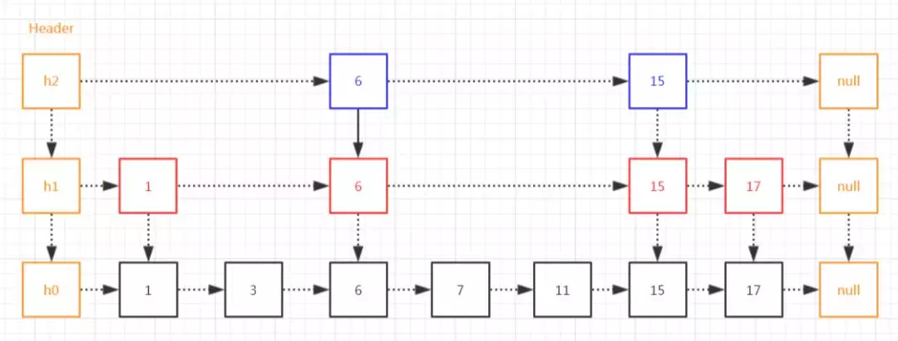

# 基础

Redis系列-我用1W字总结了所有的点，确定不了解一下吗？ - 掘金
https://juejin.cn/post/6991080701365846046
【备】万字长文，九大方面归纳总结Redis
https://mp.weixin.qq.com/s/cHgrs2QWEbp0Uj00W_St5w

# 数据类型

* key 类型：只能是string

```sh
DEL key
EXPIRE key seconds # 为给定 key 设置过期时间，以秒计。
TTL key # 以秒为单位，返回给定 key 的剩余生存时间

EXISTS key
RENAMENX key newkey # 仅当 newkey 不存在时，将 key 改名为 newkey
```

value 类型：

* String

GET SET MGET MSET

SETEX SETNX SETRANGE

INCR INCRBY DECR DECRBY APPEND

* Hash

```sh
HMSET runoobkey name "redis tutorial" likes 20 visitors 23000

HGETALL runoobkey

HKEYS key
HMGET key field1 [field2]
HGET key field
HSET key field value
```

* List
```sh
LPUSH key value1 [value2]
LSET key index value
LRANGE key start stop

RPUSH key value1 [value2]
RPUSHX key value # 如果列表不存在，操作无效。
RPOP key
```

LRANGE  切片时， start与offset都是下标，包含offset

* Set
```sh
SADD key member1 [member2]
SCARD key # 成员数
SMEMBERS key # 展示所有成员

SINTER key1 [key2] # 返回给定所有集合的交集
```

* Sorted Set
```sh
ZADD key score1 member1 [score2 member2]
ZCARD key # 成员数
ZCOUNT key min max
ZSCORE key member1
ZRANGE key stIndex edIndex [WITHSCORES]
ZREVRANGE key start stop [WITHSCORES] # 逆序，大到小

ZINCRBY key incrScore member1

ZREM key member [member ...]
```

- HyperLogLog
```sh
PFADD key element [element ...]
PFCOUNT key [key ...] # 可以统计多个key的值
```

## 跳表



查找区间内的所有元素，比红黑树方便，范围查询时，红黑树需要中序遍历

# rehash

key-V 数据放在字典中保存，底层用hash表(数组)实现，当hash冲突变多，需要扩容，Redis采用的扩容方式：

渐进式哈希，搞两张表慢慢腾挪

- 渐进式rehash带来的问题

渐进式rehash避免了redis阻塞，可以说非常完美，但是由于在rehash时，需要分配一个新的hash表，在rehash期间，同时有两个hash表在使用，会使得redis内存使用量突增，如果当前Redis结点的内存占用量达到maxmemory, 会触发内存淘汰机制，导致大量的Key被驱逐。
