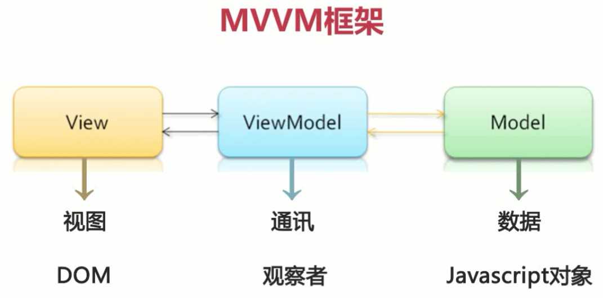
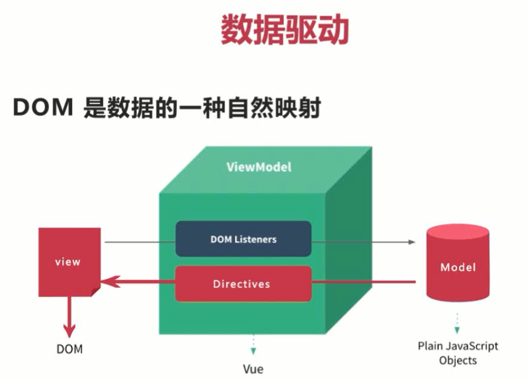
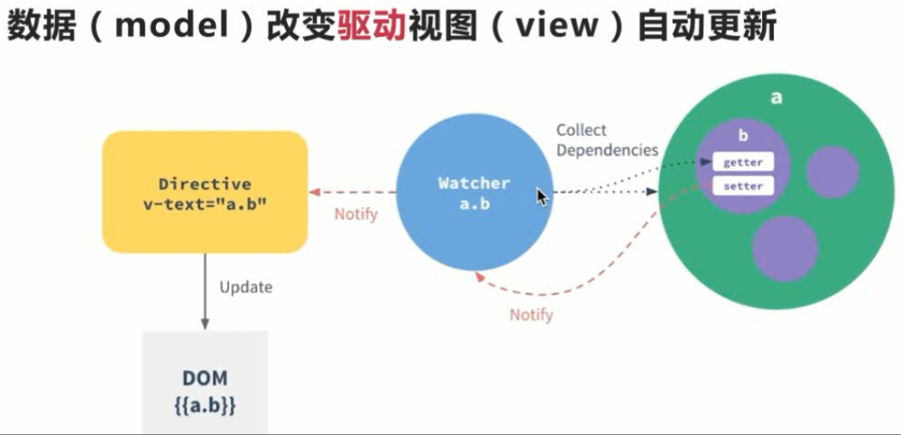
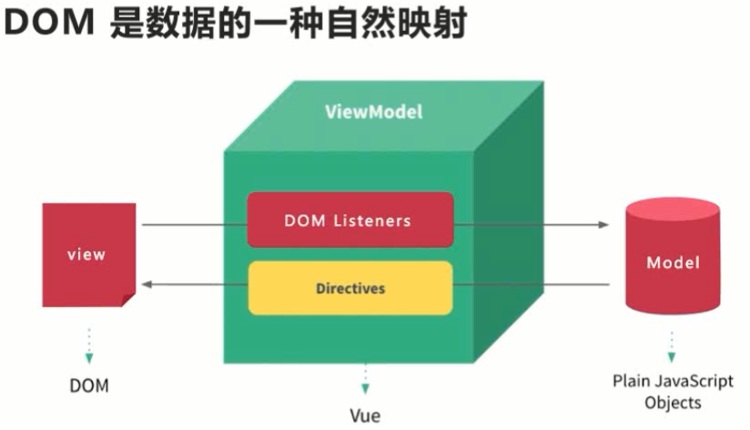
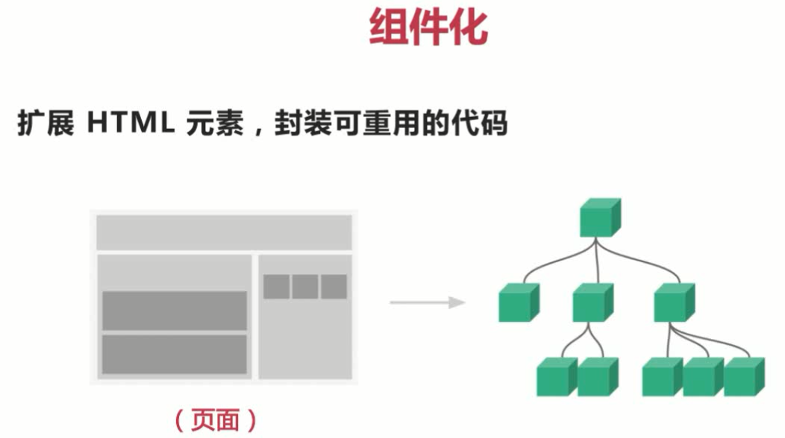
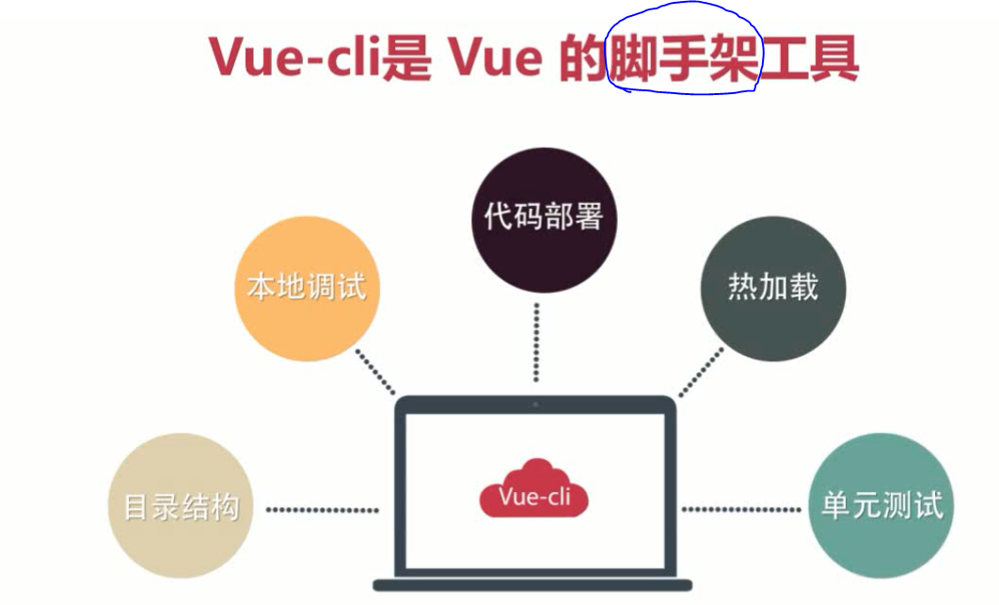
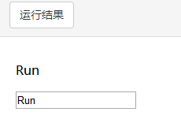
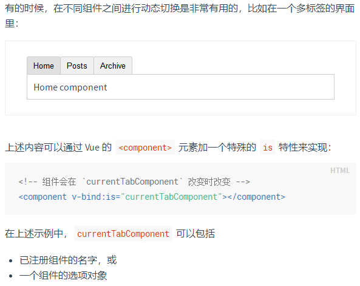

速查

```js
// 隐藏
:style="{visibility:isHidden}"
isHidden() {
	if(this.custom) return "";
	else return "hidden"
}
// 消失
:style="{display: 'none'}"

// 字符串处理，裁剪，分割
const values = this.opValue.trim().split(/\s+/)

// 裁剪结构体，按data的属性拷贝另一个大对象
const data; const value
for (const key in data) {
  data[key] = value[key]
}

// Promise简单说就是一个容器，里面保存着某个未来才会结束的事件（通常是一个异步操作）的处理结果，状态，异步操作按约定改变Promise状态，调用者按状态resolved,rejected提取Promise保存的数据
// Promise自身状态
new Promise((resolve, reject)=>{
	// ...
    if(){
       resolve(someData)
    } else {
        reject(errorData)
    }
})

//函数内部有异步操作，加上async标明，提醒调用者。async内部可以不用await，await取决于函数内部代码块是否要同步
async 最重要作用标记函数含有异步操作，返回的是Promise

await在async函数内，同步多个异步操作（Promise）的执行顺序

// 依赖于渲染完成的操作，比如：调用被渲染组件的方法，渲染后判断逻辑等，需要保证在下次更新后再操作
this.$nextTick(()=>{})
```


# 模块化

- import

```js
// 引入json
import xxx from 'xxx.json'

// 模块加载
// 在 ES6 之前，社区制定了一些模块加载方案，最主要的有 CommonJS 和 AMD 两种。后者加载对象，只能运行时确定
const { stat, exists, readfile } = require('fs') // 加载整个对象，检出某些属性

//ES6 模块的设计思想是尽量的静态化，使得编译时就能确定模块的依赖关系，以及输入和输出的变量。
export命令规定的是对外的接口，必须与模块内部的变量建立一一对应关系。
// 写法一
export var m = 1;

// 写法二
var m = 1;
export {m};

//
import * as circle from './circle' // 整体加载为circle接口集合
import { area } from './circle' // 加载指定接口
// export default就是输出一个叫做default的变量或方法
//export default命令用于指定模块的默认输出。显然，一个模块只能有一个默认输出，因此export default命令只能使用一次。所以，import命令后面才不用加大括号，因为只可能唯一对应export default命令。
```


# 细节

- null与undefined

对象只有被定义才有可能为 null，否则为 undefined。如果我们想测试对象是否存在，在对象还没定义时将会抛出一个错误。错误的使用方式：

```javascript
if (myObj !== null && typeof myObj !== "undefined") 
```

正确的方式是我们需要先使用 typeof 来检测对象是否已定义：

```javascript
if (typeof myObj !== "undefined" && myObj !== null) 
```


- var与let。var作用域可能会有问题

使用 var 关键字声明的变量不具备块级作用域的特性，它在 {} 外依然能被访问到。

```JavaScript
{ 
    var x = 2; 
}
// 这里可以使用 x 变量

、、、、、、、、、、、、、、、、、、、、、、、、
{ 
    let x = 2;
}
// 这里不能使用 x 变量
```


- href="#"与href="javascript:void(0)"的区别

**#** 包含了一个位置信息，默认的锚是**#top** 也就是网页的上端。

而javascript:void(0), 仅仅表示一个死链接。

在页面很长的时候会使用 **#** 来定位页面的具体位置，格式为：**# + id**。如果你要定义一个死链接请使用 javascript:void(0) 。


# 基础HTML

## 概念

- 元素，标签与内容

HTML文档由元素构成，元素由**开始-结束标签**与**元素内容**组成

- 属性

元素可以添加属性，

`<a href="http://www.runoob.com/">这是一个链接</a>`  href就是<a>的属性

属性总是以名称/值对的形式出现，**比如：name="value"**。 在某些个别的情况下，比如属性值本身就含有双引号，那么您必须使用单引号，例如：name='John "ShotGun" Nelson'

- 不要忘记结束标签

即使您忘记了使用结束标签，大多数浏览器也会正确地显示 HTML：因为关闭标签是可选的。但不要依赖这种做法。忘记使用结束标签会产生不可预料的结果或错误。

- HTML 空元素

没有内容的 HTML 元素被称为空元素。空元素是在开始标签中关闭的。推荐使用<br/>而不是<br>

## 区块

块级元素与内联元素。块级 (block-level)元素通常以新行开始和结束；内联(inline)元素不会另起一行

对应标签：<div>是块级元素，<span>是内联元素，这两个标签没有实际作用


## 常用标签

- 链接<a>

使用 target 属性，你可以定义被链接的文档在何处显示。`<a href="http://www.runoob.com/" target="_blank">访问菜鸟教程!</a>`， 打开空白页显示

### <head\>头部

<head> 元素包含了所有的头部标签元素。在 <head>元素中你可以插入脚本（scripts）, 样式文件（CSS），及各种meta信息。

可以添加在头部区域的元素标签为: **<title>**, <style>, <meta>, <link>, <script>, <noscript>, and <base>.

| 标签   | 描述                               |
| :----- | :--------------------------------- |
| title  | 定义了文档的标题                   |
| base   | 定义了页面链接标签的默认链接地址   |
| link   | 定义了一个文档和外部资源之间的关系 |
| meta   | 定义了HTML文档中的元数据           |
| script | 定义了客户端的脚本文件             |
| style  | 定义了HTML文档的样式文件           |

- 图像

 标签有两个必需的属性：src 和 alt。

- 表单<form>

下属标签<input>: 属性有<type>/<name>

type属性值有"text"/"password"/"radio"/"checkbox"/"submit"


## 常用全局属性

下面列出了适用于大多数 HTML 元素的属性：

| 属性  | 描述                                                         |
| :---- | :----------------------------------------------------------- |
| class | 为html元素定义一个或多个类名（classname）(类名从样式文件引入) |
| id    | 定义元素的唯一id                                             |
| style | 规定元素的行内样式（inline style）                           |
| title | 描述了元素的额外信息 (作为工具条使用)                        |

更多标准属性说明： [HTML 标准属性参考手册](https://www.runoob.com/tags/ref-standardattributes.html).


#  基础CSS


外虚线为轮廓outline属性


CSS 可以通过以下方式添加到HTML中:

1. 内联样式- 在HTML**标签中使用"style" 属性**

当特殊的样式需要应用到个别元素时，就可以使用内联样式。 使用内联样式的方法是在相关的标签中使用样式属性。样式属性可以包含任何 CSS 属性。以下实例显示出如何改变段落的颜色和左外边距。


2. 内部样式表 -在HTML文档**头部 <head>**使用<style> **元素** 来包含CSS

```HTML
<head>
	<!-- -->
    <style>
    .text-danger {
        width: 100px;
        height: 100px;
        background: red;
    }
    .active {
        width: 100px;
        height: 100px;
        background: green;
    }
    </style>
</head>
```


3. 外部引用 - 使用外部 CSS **文件**

最好的方式是通过外部引用CSS文件.


- CSS 规则由两个主要的部分构成：**选择器，以及声明**
- 直接选取某一标签的所有样式 `p{color:red;text-align:center;}`
- 如果你要在HTML元素中设置CSS样式，你需要在元素中设置"id" 和 "class"选择器。

id选择方式`#idName`

```css
<!DOCTYPE html>
<html>
<head>
<meta charset="utf-8"> 
<title>菜鸟教程(runoob.com)</title> 
<style>
#para1
{
	text-align:center;
	color:red;
} 
</style>
</head>

<body>
<p id="para1">Hello World!</p>
<p>这个段落不受该样式的影响。</p>
</body>
</html>
```

class选择方式`.className`

```html
<!DOCTYPE html>
<html>
<head>
<meta charset="utf-8"> 
<title>菜鸟教程(runoob.com)</title> 
<style>
.center
{
	text-align:center;
}
</style>
</head>

<body>
<h1 class="center">标题居中</h1>
<p class="center">段落居中。</p> 
</body>
</html>
```


# 基础JavaScript

## 概念

在 <head> 或者 <body> 中写JavaScript   <script>

您可以在 HTML 文档中放入不限数量的脚本。

脚本可位于 HTML 的 <body> 或 <head> 部分中，或者同时存在于两个部分中。

通常的做法是把函数放入 <head> 部分中，或者放在页面底部。这样就可以把它们安置到同一处位置，不会干扰页面的内容。


- 输出

JavaScript 可以通过不同的方式来输出数据：

1. 使用 **window.alert()** 弹出警告框。
2. 使用 **document.write()** 方法将内容写到 HTML 文档中。（注意会不会覆盖整个HTML）
3. 使用 **innerHTML** 操作 HTML 元素的内容。
4. 使用 **console.log()** 写入到浏览器的控制台。


- 语法

字面量、变量、操作符


- 代码拆行，**文本串中**使用 `\`拆行

- JS注释与其他编程语言一样`//`，HTML的注释为`<!--  -->`

  

- 数据类型

  **值类型(基本类型)**：字符串（String）、数字(Number)、布尔(Boolean)、对空（Null）、未定义（Undefined）、Symbol。

  **引用数据类型**：对象(Object)、数组(Array)、函数(Function)。

  > **注：**Symbol 是 ES6 引入了一种新的原始数据类型，表示独一无二的值。
  
  
  
- 声明变量类型

当您声明新变量时，可以使用关键词 "new" 来声明其类型：

```javascript
var carname = new String;
var x = new Number;
var y = new Boolean;
var cars = new Array;
var person = new Object;
```


- JavaScript 变量均为对象。当您声明一个变量时，就创建了一个新的对象。JavaScript 变量的生命期从它们被声明的时间开始。


- 变量作用域

全局变量：**函数外**声明的变量，网页上的所有脚本和函数都能访问它。（可以与函数构成闭包）

局部变量：**函数内**声明的变量（使用 var）是，所以只能在函数内部访问它。（该变量的作用域是局部的）。局部变量会在函数运行以后被删除。


- 封闭函数。

封闭函数是javascript中匿名函数的另外一种写法，创建一个一开始就执行而不用命名的函数。封闭函数可以创造一个独立的空间，在封闭函数内定义的变量和函数不会影响外部同名的函数和变量，可以避免命名冲突，在页面上引入多个js文件时，用这种方式添加js文件比较安全。


- 变量与函数的预解析

JavaScript解析过程分为两个阶段，先是编译阶段，然后执行阶段，在编译阶段会将function定义的函数提前，并且将var定义的变量声明提前，将它赋值为undefined。

```JavaScript
<script type="text/javascript">    
    fnAlert();       // 弹出 hello！
    alert(iNum);  // 弹出 undefined
    function fnAlert(){
        alert('hello!');
    }
    var iNum = 123;
</script>
```


## 对象类型及常用方法

### typeof 操作符


### constructor 对象属性

```JavaScript
"John".constructor                 // 返回函数 String()  { [native code] }
(3.14).constructor                 // 返回函数 Number()  { [native code] }
false.constructor                  // 返回函数 Boolean() { [native code] }
[1,2,3,4].constructor              // 返回函数 Array()   { [native code] }
{name:'John', age:34}.constructor  // 返回函数 Object()  { [native code] }
new Date().constructor             // 返回函数 Date()    { [native code] }
function () {}.constructor         // 返回函数 Function(){ [native code] }

//一种数据类型判断的方法
function isDate(myDate) {
    return myDate.constructor.toString().indexOf("Date") > -1;
}
```

### Array

`find()`, 传入查找条件的函数：

```
function check(arrayElement) {
	...
	return true or false
}
```


## 正则表达式

JS中的正则表达式：`/正则主题/可选的修饰符`，为字符串对象`var patt = /runoob/i`

search()、replace()

```
'   aseasf\n \n raf '.trim().split(/[\s\n]/)
'   aseasf\n \n raf '.trim().split(/\s+/)
"10.69.28.39      1.1.2.6↵1.1.1.1↵    1.1.2.1".split(/\s+/)
"10.69.28.39      1.1.2.6↵1.1.1.1↵    1.1.2.1".split(/[\s\n]/)
```


## 错误处理try、catch、finally、throw

```JavaScript
try {
    ...    //异常的抛出
} catch(e) {
    ...    //异常的捕获与处理
} finally {
    ...    //结束处理
}
    
function myFunction() {
    var message, x;
    message = document.getElementById("message");
    message.innerHTML = "";
    x = document.getElementById("demo").value;
    try { 
        if(x == "")  throw "值为空";
        if(isNaN(x)) throw "不是数字";
        x = Number(x);
        if(x < 5)    throw "太小";
        if(x > 10)   throw "太大";
    }
    catch(err) {
        message.innerHTML = "错误: " + err;
    }
}
```


## JSON

JavaScript Objective Notation，JS对象标记

{}包围的键值key:value对，value可以是任何对象。

一个json是一个JS对象，即一个{}为一个对象。

| 函数             | 描述                                           |
| :--------------- | :--------------------------------------------- |
| JSON.parse()     | 用于将一个 JSON 字符串转换为 JavaScript 对象。 |
| JSON.stringify() | 用于将 JavaScript 值转换为 JSON 字符串。       |

```javascript
var myObj = { "name":"runoob", "alexa":10000, "site":null };
for (x in myObj) {
document.getElementById("demo").innerHTML += x + "<br>";
}
//name
//alexa
//site

for (x in myObj) {
    document.getElementById("demo").innerHTML += myObj[x] + "<br>";
}
//runoob
//10000
//null
```


## 对象的prototype

```JavaScript
function Person(first, last, age, eyecolor) {
    this.firstName = first;
    this.lastName = last;
    this.age = age;
    this.eyeColor = eyecolor;
}
Person.prototype.name = function() {
	return this.firstName + " " + this.lastName;
};
```


## JQuery介绍

缩写：$()

选择器：$("p")、$("#my_id")、$(".my_class")


# JS补充

## 同步任务与异步任务

JavaScript 运行时，除了一个正在运行的主线程，引擎还提供任务队列（task queue），里面是各种需要当前程序处理的异步任务。

主线程会去执行所有的同步任务。等到同步任务全部执行完，就会去看任务队列里面的异步任务。如果满足条件，那么异步任务就重新进入主线程开始执行，这时它就变成同步任务了。等到执行完，下一个异步任务再进入主线程开始执行。一旦任务队列清空，程序就结束执行。

一旦异步任务重新进入主线程，就会执行对应的回调函数。如果一个异步任务没有回调函数，就不会进入任务队列，也就是说，不会重新进入主线程，因为没有用回调函数指定下一步的操作。

JavaScript 引擎怎么知道异步任务有没有结果，能不能进入主线程呢？答案就是引擎在不停地检查，一遍又一遍，只要同步任务执行完了，引擎就会去检查那些挂起来的异步任务，是不是可以进入主线程了。这种循环检查的机制，就叫做事件循环（Event Loop）

- 异步任务

onclick 等事件的毁掉函数，setTimeout，setInterval，ajax请求

- 异步任务的同步协调promise

每一个异步任务都返回一个promise对象

Promise 的最终结果只有两种。

异步操作成功，Promise 实例传回一个值（value），状态变为`fulfilled`。

异步操作失败，Promise 实例抛出一个错误（error），状态变为`rejected`。


- Promise.prototype.then()

Promise 实例的`then`方法，用来添加回调函数。

`then`方法可以接受两个回调函数，第一个是fulfilled状态的回调函数，第二个是`rejected`时的回调函数**（该参数可以省略）**。一旦状态改变，就调用相应的回调函数。

- `Promise.prototype.catch`

是`.then(null, rejection)`或`.then(undefined, rejection)`的别名，用于指定发生错误时的回调函数。


# ES6

## 块级作用域let、const

之前只有全局作用域、函数作用域


## 解构赋值

变量的解构赋值 - ECMAScript 6入门 [http://es6.ruanyifeng.com/#docs/destructuring#%E7%94%A8%E9%80%94](http://es6.ruanyifeng.com/#docs/destructuring#用途)

- 交换变量的值、

```javascript
let x = 1;
let y = 2;
[x, y] = [y, x];
```


- 返回多个值：函数只能返回一个值，要返回多个值可以放在数组、对象

```JavaScript
// 返回一个数组
function example() {
  return [1, 2, 3];
}
let [a, b, c] = example();

// 返回一个对象
function example() {
  return {
    foo: 1,
    bar: 2
  };
}
let { foo, bar } = example();
```


- 提取 JSON 数据

```javascript
let jsonData = {
  id: 42,
  status: "OK",
  data: [867, 5309]
};
let { id, status, data: number } = jsonData;

console.log(id, status, number);
// 42, "OK", [867, 5309]
```

上面代码可以快速提取 JSON 数据的值。


- **遍历** Map 结构

任何部署了 Iterator 接口的对象，都可以用`for...of`循环遍历。Map 结构原生支持 Iterator 接口，配合变量的解构赋值，获取键名和键值就非常方便。

```javascript
const map = new Map();
map.set('first', 'hello');
map.set('second', 'world');

for (let [key, value] of map) {
  console.log(key + " is " + value);
}
// first is hello
// second is world

// 获取键名
for (let [key] of map) {
  // ...
}

// 获取键值
for (let [,value] of map) {
  // ...
}
```


- 输入模块的指定方法

加载模块时，往往需要指定输入哪些方法。解构赋值使得输入语句非常清晰。

```javascript
const { SourceMapConsumer, SourceNode } = require("source-map");

```


## 字符串遍历器接口、字符串模板

indexOf()    includes()   startsWith()  endsWith()


## 函数

- 参数的默认值

ES6 允许为函数的参数设置默认值，即直接写在参数定义的后面。

```javascript
function log(x, y = 'World') {
  console.log(x, y);
}

log('Hello') // Hello World
log('Hello', 'China') // Hello China
log('Hello', '') // Hello
```

可以看到，ES6 的写法比 ES5 简洁许多，而且非常自然。下面是另一个例子。

```javascript
function Point(x = 0, y = 0) {
  this.x = x;
  this.y = y;
}

const p = new Point();
p // { x: 0, y: 0 }
```

除了简洁，ES6 的写法还有两个好处：首先，阅读代码的人，可以立刻意识到哪些参数是可以省略的，不用查看函数体或文档；其次，有利于将来的代码优化，即使未来的版本在对外接口中，彻底拿掉这个参数，也不会导致以前的代码无法运行。


- 箭头函数

[http://es6.ruanyifeng.com/#docs/function#%E7%AE%AD%E5%A4%B4%E5%87%BD%E6%95%B0](http://es6.ruanyifeng.com/#docs/function#箭头函数)


## 对象遍历

```js
var obj = {}
for(let key in obj)  {
	console.log('key:', key, 'value:', arr[key])
}
```


## 数组[ ]遍历

```javascript
for (let index of ['a', 'b'].keys()) {
  console.log(index);
}
// 0
// 1

for (const elem of ['a', 'b']) {
  console.log(elem);
}
// 'a'
// 'b'

for (let [index, elem] of ['a', 'b'].entries()) {
  console.log(index, elem);
}
// 0 "a"
// 1 "b"

// 传统的for in
var arr = ['a', 'b', 'c', 'd'];
for (var i in arr) {
  console.log('index:', i, 'value:', arr[i])
}
```


## 模块module体系

模块功能主要由两个命令构成：`export`和`import`。`export`命令用于规定模块的对外接口，`import`命令用于输入其他模块提供的功能。

一个模块就是一个独立的文件。该文件内部的所有变量，外部无法获取。如果你希望外部能够读取模块内部的某个变量，就必须使用`export`关键字输出该变量。下面是一个 JS 文件，里面使用`export`命令输出变量。

```javascript
// profile.js
var firstName = 'Michael';
var lastName = 'Jackson';
var year = 1958;

export { firstName, lastName, year };

import {} from "..."
```

上面代码在`export`命令后面，使用大括号指定所要输出的一组变量。


- export default时，import后面不用大括号，这样的规定能使双方知道怎么调用


## 编程规范

http://es6.ruanyifeng.com/#docs/style

- 建议不再使用`var`命令，而是使用`let`命令取代。

- `const`声明常量还有两个好处，一是阅读代码的人立刻会意识到不应该修改这个值，二是防止了无意间修改变量值所导致的错误。

  所有的函数都应该设置为常量。

- 静态字符串一律使用单引号或反引号，不使用双引号。动态字符串使用反引号。

- 使用数组成员对变量赋值时，优先使用解构赋值。函数的参数如果是对象的成员，优先使用解构赋值。

- 单行定义的对象，最后一个成员不以逗号结尾。多行定义的对象，最后一个成员以逗号结尾。

```javascript
// bad
const a = { k1: v1, k2: v2, };
const b = {
  k1: v1,
  k2: v2
};

// good
const a = { k1: v1, k2: v2 };
const b = {
  k1: v1,
  k2: v2,
};


```

另外，对象的属性和方法，尽量采用简洁表达法，这样易于描述和书写。

```javascript
var ref = 'some value';

// bad
const atom = {
  ref: ref,

  value: 1,

  addValue: function (value) {
    return atom.value + value;
  },
};

// good
const atom = {
  ref,

  value: 1,

  addValue(value) {
    return atom.value + value;
  },
};
```


# Vue

## 概念，抽象




数据驱动，组件开发

- 数据驱动



数据变化后，会驱动DOM随着变化，也就是说DOM是数据的映射






修改视图后，Vue监听到变化，修改数据Model

- 组件化



页面每个模块是一个组件，对应右图的绿框（为一个相互独立的Vue的viewModel）。而HTML的DOM树，每一个树节点为一个元素element（一个标签加内容）。即Vue自定义的标签（component）对应于HTML的标签（element）。

组件（Component）是 Vue.js 最强大的功能之一。组件可以扩展 HTML 元素，封装可重用的代码。组件系统让我们可以用独立可复用的小组件来构建大型应用，几乎任意类型的应用的界面都可以抽象为一个组件树。


页面上每个独立的可视/交互区域视为一个”组件“，每个组件对应一个工程目录，组件所需要的各种资源存在自己的目录就近维护。

组件自由组合构成一个完整的HTML页面。

- vue-cli



- Vue的webpack目录

1. package.json，项目配置，包括npm命令的转化等

依赖JS

2. src/

App.vue: 项目入口文件，我们也可以直接将组件写这里，而不使用 components 目录。

main.js: 项目的核心文件。


## 基础：Vue实例对象

- 当创建一个 Vue 实例时，你可以传入一个**选项对象**。

- 除了数据属性，Vue 实例还暴露了一些有用的实例属性与方法。它们都有前缀 `$`，以便与用户定义的属性区分开来。例如：

```JavaScript
var data = { a: 1 }
var vm = new Vue({
  el: '#example',
  data: data
})

vm.$data === data // => true
vm.$el === document.getElementById('example') // => true

// $watch 是一个实例方法
vm.$watch('a', function (newValue, oldValue) {
  // 这个回调将在 `vm.a` 改变后调用
})
```


- 生命周期钩子函数：每个 Vue 实例在被创建时都要经过一系列的初始化过程——例如，需要设置数据监听、编译模板、将实例挂载到 DOM 并在数据变化时更新 DOM 等。同时在这个过程中也会运行一些叫做**生命周期钩子**的函数，


- Vue.js 使用了基于 HTML 的模版语法，允许开发者声明式地将 DOM 绑定至底层 Vue 实例的数据。Vue.js 的核心是一个允许你采用简洁的模板语法来声明式的将数据渲染进 DOM 的系统。每个 Vue 应用都需要通过实例化 Vue 来实现。

```javascript

var vm = new Vue({
    el: '#vue_det',
    data: {
        site: "菜鸟教程",
        url: "www.runoob.com",
        alexa: "10000"
    },
    methods: {
        details: function() {
        return  this.site + " - 学的不仅是技术，更是梦想！";
        }
    }
})
```


**el**为这个Vue实例的ID，在\<div id = "vue_det">元素中被引用

**data** 用于定义属性，实例中有三个属性分别为：site、url、alexa

**methods** 用于定义的函数，可以通过 return 来返回函数值

**computed**，会缓存

**filter**，

**{{ }}** 用于输出对象属性和函数返回值


当一个 Vue 实例被创建时，它向 Vue 的响应式系统中加入了其 data 对象中能找到的所有的属性。当这些属性的值发生改变时，html 视图将也会产生相应的变化。


## 插值{{}}

- 文本差值Mustache
- v-bind绑定属性
- JS表达式，限定为单个表达式

```HTML
//mustache双大括号
{{ number + 1 }}
{{ ok ? 'YES' : 'NO' }}
{{ message.split('').reverse().join('') }}

//标签嵌入
<div v-bind:id="'list-' + id"></div>
```


## 指令概述

指令是带有 v- 前缀的特殊属性。指令用于在表达式的值改变时，将某些行为应用到 DOM 上。

**指令的参数**在指令后以冒号指明。

**动态参数：**从 2.6.0 开始，可以用方括号括起来的 JavaScript 表达式`[JS-exp]`作为一个指令的参数：

```
<a v-bind:[attributeName]="url"> ... </a>
<a v-on:[eventName]="doSomething"> ... </a>
```

动态参数预期会求出一个字符串,异常情况下值为 `null`

- 修饰符

指令应该以特殊方式绑定。例如，`.prevent` 修饰符告诉 `v-on` 指令对于触发的事件调用 `event.preventDefault()`：

```
<form v-on:submit.prevent="onSubmit">...</form>
```


- 常用指令

**v-bind** 指令被用来绑定 Vue与HTML 属性：

```HTML
<div id="app">
    <pre><a v-bind:href="url">菜鸟教程</a></pre>
</div>
    
<script>
    new Vue({
      el: '#app',
      data: {
        url: 'http://www.runoob.com'
      }
    })
</script>
```

`v-bind` 缩写

```HTML
<!-- 完整语法 -->
<a v-bind:href="url"></a>
<!-- 缩写 -->
<a :href="url"></a>
```


**v-on**用于监听 DOM 事件`v-on` 缩写

```HTML
<!-- 完整语法 -->
<a v-on:click="doSomething"></a>
<!-- 缩写 -->
<a @click="doSomething"></a>
```

Vue给监听的事件提供修饰符，用来处理一些细节

```HTML
<!-- 阻止单击事件冒泡 -->
<a v-on:click.stop="doThis"></a>
<!-- 提交事件不再重载页面 -->
<form v-on:submit.prevent="onSubmit"></form>
<!-- 修饰符可以串联  -->
<a v-on:click.stop.prevent="doThat"></a>
<!-- 只有修饰符 -->
<form v-on:submit.prevent></form>
<!-- 添加事件侦听器时使用事件捕获模式 -->
<div v-on:click.capture="doThis">...</div>
<!-- 只当事件在该元素本身（而不是子元素）触发时触发回调 -->
<div v-on:click.self="doThat">...</div>

<!-- click 事件只能点击一次，2.1.4版本新增 -->
<a v-on:click.once="doThis"></a>
```


**v-model** 指令用来在 input(text/checkbox/radio)、select、textarea等表单控件元素上创建双向数据绑定，根据表单上的值，自动更新绑定的元素的值。


- \<input> type=“text”

```HTML
<div id="app">
    <p>{{ message }}</p> <!-- 会随着输入内容进行变化-->
    <input v-model="message"> 
</div>
	
<script>
new Vue({
  el: '#app',
  data: {
    message: 'Runoob!'
  }
})
</script>
```




- \<input\> type=“text”、\<textarea>

```HTML
<!DOCTYPE html>
<html>
    <head>
        <meta charset="utf-8">
        <title>Vue 测试实例 - 菜鸟教程(runoob.com)</title>
        <script src="https://cdn.staticfile.org/vue/2.2.2/vue.min.js"></script>
    </head>
    <body>
        <div id="app">
          <p>input 元素：</p>
          <input v-model="message" placeholder="编辑我……">
          <p>消息是: {{ message }}</p>

          <p>textarea 元素：</p>
          <p style="white-space: pre">{{ message2 }}</p>
          <textarea v-model="message2" placeholder="多行文本输入……"></textarea>
        </div>

        <script>
        new Vue({
          el: '#app',
          data: {
            message: 'Runoob',
            message2: '菜鸟教程\r\nhttp://www.runoob.com'
          }
        })
        </script>
    </body>
</html>
```


- \<input\> type="checkbox"

```HTML
<!DOCTYPE html>
<html>
<head>
<meta charset="utf-8">
<title>Vue 测试实例 - 菜鸟教程(runoob.com)</title>
<script src="https://cdn.staticfile.org/vue/2.2.2/vue.min.js"></script>
</head>
<body>
<div id="app">
  <p>单个复选框：</p>
  <input type="checkbox" id="checkbox" v-model="checked">
  <label for="checkbox">{{ checked }}</label>
	
  <p>多个复选框：</p>
  <input type="checkbox" id="runoob" value="Runoob" v-model="checkedNames">
  <label for="runoob">Runoob</label>
    
  <input type="checkbox" id="google" value="Google" v-model="checkedNames">
  <label for="google">Google</label>
    
  <input type="checkbox" id="taobao" value="Taobao" v-model="checkedNames">
  <label for="taobao">taobao</label>
  <br>
  <span>选择的值为: {{ checkedNames }}</span>
</div>

<script>
new Vue({
  el: '#app',
  data: {
	checked : false,
    checkedNames: []
  }
})
</script>
</body>
</html>
```


一个v-指令复杂例子：

```HTML
<div id="app">
  <label for="r1">修改颜色</label><input type="checkbox" v-model="use" id="r1">
  <br><br>
  <div v-bind:class="{'class1': use}">
    v-bind:class 指令
  </div>
</div>
    
<script>
new Vue({
    el: '#app',
  data:{
      use: false
  }
});
</script>
```


其他非DOM交互、绑定的指令`v-`


## computed与watch的侦听异同

侦听某一个data，发生改变是执行其方法。

计算属性`computed: {}`

```HTML
<div id="example">
  <p>Original message: "{{ message }}"</p>
  <p>Computed reversed message: "{{ reversedMessage }}"</p>
</div>
```

```JavaScript
var vm = new Vue({
  el: '#example',
  data: {
    message: 'Hello'
  },
  computed: {
    // computed计算属性reversedMessage的getter函数
    reversedMessage: function () {
      // `this` 指向 vm 实例，要注意用this.message
      return this.message.split('').reverse().join('')
    }
  }
})
```

计算属性默认只有 getter ，不过在需要时你也可以提供一个 setter ：

```javascript
// ...
computed: {
  fullName: {
    // getter
    get: function () {
      return this.firstName + ' ' + this.lastName
    },
    // setter
    set: function (newValue) {
      var names = newValue.split(' ')
      this.firstName = names[0]
      this.lastName = names[names.length - 1]
    }
  }
}
// ...
```

现在再运行 `vm.fullName = 'John Doe'` 时，**setter 会被调用**，`vm.firstName` 和 `vm.lastName` 也会相应地被更新。


- 侦听器watch

虽然计算属性`computed: {}`在大多数情况下更合适，但有时也需要一个自定义的侦听器。这就是为什么 Vue 通过 `watch` 选项提供了一个更通用的方法，来响应数据的变化。当需要在数据变化时执行异步或开销较大的操作时，这个方式是最有用的。


## class与style绑定

`v-bind:class=“{active: isActive}”`


## 条件渲染v-if

- v-if

```html
<div v-if="awesome">Vue is awesome!</div>
<div v-else>Oh no 😢</div>
```

- v-show


## 列表渲染v-for

- v-for

- 过滤/处理列表结果
- \<template>中使用v-for
- 组件上使用v-for

```html
<my-component v-for="item in items" :key="item.id"></my-component>
```

你也可以用 `of` 替代 `in` 作为分隔符，因为它更接近 JavaScript 迭代器的语法：

```html
<div v-for="item of items"></div>
```


在select中常用，注意v-for和

```html
<select>
  <option v-for="option in options" :key="option.value" :value="option.value"> <!-- key必需有，但实际上选中的值赋给value -->
    元素内容{{ option.text }}
  </option>
</select>
```


示例：[https://cn.vuejs.org/v2/guide/list.html#%E5%9C%A8%E7%BB%84%E4%BB%B6%E4%B8%8A%E4%BD%BF%E7%94%A8-v-for](https://cn.vuejs.org/v2/guide/list.html#在组件上使用-v-for)


## 事件event处理v-on

响应方法在methods中定义，比较明晰


## 表单输入绑定v-model

你可以用 `v-model` 指令在表单： `<input>`、`<textarea>` 及 `<select>` 元素上创建双向数据绑定。它会根据控件类型自动选取正确的方法来更新元素。尽管有些神奇，但 `v-model` 本质上**不过是语法糖**。它负责监听用户的输入事件以更新数据，并对一些极端场景进行一些特殊处理。

```HTML
<input v-model="searchText">
```

等价于：

```HTML
<input
  <!-- 重点看v-bind的参数，一般都是标签的value属性-->
  v-bind:value="searchText"
  v-on:input="searchText = $event.target.value"
>
```


一个难理解的例子，注意其中为什么用v-bind，去掉会怎么样

```HTML
<!DOCTYPE html>
<html>
<head>
<meta charset="utf-8">
<title>Vue 测试实例 - 菜鸟教程(runoob.com)</title>
<script src="https://cdn.staticfile.org/vue/2.2.2/vue.min.js"></script>
</head>
<body>
<div id="app">
    <!--v-bind:value="selected"，等于选中的option的value-->
    <select v-model="selected">
      <option v-for="option in options" v-bind:value="option.value" :key="option.value">
        元素内容{{ option.text }}
      </option>
    </select>
    <span>Selected: {{ selected }}</span>
</div>

<script>
new Vue({
  el: '#app',
  data: {
    selected: 'A',
    options: [
      { text: 'One', value: 'A' },
      { text: 'Two', value: 'B' },
      { text: 'Three', value: 'C' }
    ]
  }
})
</script>
</body>
</html>
```


- 可以在组件标签上使用v-model，请注意组件自定义事件的写法


## 组件component

组件（Component）是 Vue.js 最强大的功能之一。组件可以扩展 HTML 元素，封装可重用的代码。


### 组件注册

组件系统让我们可以用独立可复用的小组件来构建大型应用，几乎任意类型的应用的界面都可以抽象为一个组件树。

- 定义组件名的方式有两种：

1. 使用 kebab-case

```
Vue.component('my-component-name', { /* ... */ })
```

当使用 kebab-case (短横线分隔命名) 定义一个组件时，你也必须在引用这个自定义元素时使用 kebab-case，例如 `<my-component-name>`。

2. 使用 PascalCase

```
Vue.component('MyComponentName', { /* ... */ })
```

当使用 PascalCase (首字母大写命名) 定义一个组件时，你在引用这个自定义元素时两种命名法都可以使用。也就是说 `<my-component-name>`和 `<MyComponentName>` 都是可接受的。注意，尽管如此，直接在 DOM (即非字符串的模板) 中使用时只有 kebab-case 是有效的。


- 全局注册

  所有实例都能用全局注册的组件


```JavaScript
// 注册
Vue.component('runoob', {
  template: '<h1>自定义组件!</h1>'
})
// 创建根实例
new Vue({
  el: '#app'
})
```


- 局部组件，这样组件只能在这个实例中使用：

全局注册往往是不够理想的。比如，如果你使用一个像 webpack 这样的构建系统，全局注册所有的组件意味着即便你已经不再使用一个组件了，它仍然会被包含在你最终的构建结果中。这造成了用户下载的 JavaScript 的无谓的增加。

```JavaScript
var ChildA = {
  template: '<h1>自定义组件A!</h1>'
}
var ChildB = {
  template: '<h1>自定义组件B!</h1>'
} 

// 创建根实例
new Vue({
  el: '#app',
  components: {
    // <runoob> 将只在父模板可用
    'runoob-a': ChildA,
    'runoob-b': ChildB
  }
})
```


- 模块系统中局部注册

然后你需要在局部注册之前导入每个你想使用的组件。例如，在一个假设的 `ComponentB.js` 或 `ComponentB.vue` 文件中：

```vue
<template>
    <component-a></component-a>
    <component-c></component-c>
</template>

<script>
    import ComponentA from './ComponentA'
    import ComponentC from './ComponentC'

    export default {
      components: {
        ComponentA,
        ComponentC
      },
      // ...
    }
</script>
   
```

现在 `ComponentA` 和 `ComponentC` 都可以在 `ComponentB` 的模板中使用了。


- 基础组件应该放在入口文件比如`src/main.js`中，全局注册

？？？？

webpack，require.context


- `data` 必须是一个函数

当我们定义这个 `<button-counter>` 组件时，你可能会发现它的 `data` 并不是像这样直接提供一个对象：

```
data: {
  count: 0
}
```

取而代之的是，**一个组件的 data 选项必须是一个函数**，因此每个**实例可以维护一份被返回对象的独立的拷贝**：

```
data: function () {
  return {
    count: 0
  }
}
```


- 组件只有单个根元素

当构建一个 `<blog-post>` 组件时，你的模板最终会包含的东西远不止一个标题：

```
<h3>{{ title }}</h3>
```

最最起码，你会包含这篇博文的正文：

```
<h3>{{ title }}</h3>
<div v-html="content"></div>
```

然而如果你在模板中尝试这样写，Vue 会显示一个错误，并解释道 **every component must have a single root element (每个组件必须只有一个根元素)**。你可以将模板的内容包裹在**一个父元素内**，来修复这个问题，例如：

```
<div class="blog-post">
  <h3>{{ title }}</h3>
  <div v-html="content"></div>
</div>
```


### 通过prop向子组件传递数据

不能向子组件直接传递数据，这也正是 prop 的由来。Prop 是你可以在组件上注册的一些自定义特性。当一个值传递给一个 prop 特性的时候，它就变成了那个组件实例的一个属性。

```JavaScript
Vue.component('blog-post', {
  props: ['title'],
  template: '<h3>{{ title }}</h3>'
})
```

```HTML
<blog-post title="My journey with Vue"></blog-post>
<blog-post title="Blogging with Vue"></blog-post>
<blog-post title="Why Vue is so fun"></blog-post>
```


- prop类型

数组形式

```JavaScript
props: ['title', 'likes', 'isPublished', 'commentIds', 'author']
```

或对象形式

```JavaScript
props: {
    title: String,
    likes: Number,
    isPublished: Boolean,
    commentIds: Array,
    author: Object,
    callback: Function,
    contactsPromise: Promise // or any other constructor
}
```


带类型检查：

```JavaScript
Vue.component('my-component', {
  props: {
    // 基础的类型检查 (`null` 和 `undefined` 会通过任何类型验证)
    propAName: Number,
    // 多个可能的类型
    propBName: [String, Number],
    // 必填的字符串
    propCName: {
      type: String,
      required: true
    },
    // 带有默认值的数字
    propDName: {
      type: Number,
      default: 100
    },
    // 带有默认值的对象
    propEName: {
      type: Object,
      // 对象或数组默认值必须从一个工厂函数获取
      default: function () {
        return { message: 'hello' }
      }
    },
    // 自定义验证函数
    propFName: {
      validator: function (value) {
        // 这个值必须匹配下列字符串中的一个
        return ['success', 'warning', 'danger'].indexOf(value) !== -1
      }
    }
  }
})
```


- 向子组件prop动态赋值

除了上面静态赋值以外，还可以动态赋值，赋值对象类型赋值：

**父**组件 `data` 里有一个数组：

```
new Vue({
  el: '#blog-post-demo',
  data: {
    posts: [
      { id: 1, title: 'My journey with Vue' },
      { id: 2, title: 'Blogging with Vue' },
      { id: 3, title: 'Why Vue is so fun' }
    ]
  }
})
```

并想要为每篇博文渲染一个**子**组件：

```
<blog-post
  v-for="post in posts"
  v-bind:title="post.title"
></blog-post>
```

使用 `v-bind` 来动态传递 prop。


- 传入一个对象所有属性作为prop传递

使用**不带参数**的 `v-bind=""` 

取代`v-bind:prop-name1="" v-bind:prop-name2=""`。例如，对于一个给定的对象 `post`：

```
post: {
  id: 1,
  title: 'My Journey with Vue'
}
```

下面的模板：

```
<blog-post v-bind="post"></blog-post>
```

等价于：

```
<blog-post
  v-bind:id="post.id"
  v-bind:title="post.title"
></blog-post>
```


### 非prop特性，子组件根元素

一个非 prop 特性是指传向一个组件，但是该组件并没有相应 prop 定义的特性。

因为显式定义的 prop 适用于向一个子组件传入信息，然而组件库的作者并不总能预见组件会被用于怎样的场景。这也是为什么组件可以接受任意的特性，而这些特性会被添加到这个组件的**根元素**上。

例如，想象一下你通过一个 Bootstrap 插件使用了一个第三方的 `<bootstrap-date-input>` 组件，这个插件需要用到一个 `data-date-picker` 特性。我们可以将这个特性添加到你的组件实例上：

```HTML
<bootstrap-date-input data-date-picker="activated"></bootstrap-date-input>
```

然后这个 `data-date-picker="activated"` 特性就会自动添加到 `<bootstrap-date-input>` 的根元素上。

- 替换或者合并已有的特性

想象一下 `<bootstrap-date-input>` 的模板是这样的：

```HTML
<input type="date" class="form-control">
```

为了给我们的日期选择器插件定制一个主题，我们可能需要像这样添加一个特别的类名：

```HTML
<bootstrap-date-input
  data-date-picker="activated"
  class="date-picker-theme-dark"
></bootstrap-date-input>
```

在这种情况下，我们定义了两个不同的 `class` 的值：

`form-control`，这是在组件的模板内设置好的

`date-picker-theme-dark`，这是从组件的父级传入的

对于绝大多数特性来说，从外部提供给组件的值会替换掉组件内部设置好的值。所以如果传入 `type="text"` 就会替换掉 `type="date"` 并把它破坏！庆幸的是，`class` 和 `style` 特性会稍微智能一些，即两边的值会被合并起来，从而得到最终的值：`form-control date-picker-theme-dark`。


- 禁用特性继承

？？？？？？

默认情况下父作用域的不被认作 props 的特性绑定将会“回退”且作为普通的 HTML 特性应用在子组件的根元素上。可通过设置 inheritAttrs 为 false，这些默认行为将会被去掉。注意：**这个选项不影响 class 和 style 绑定**。


### 向父组件传值：监听子组件事件，组件自定义事件

```HTML
//子类定义事件enlarge-text
<button v-on:click="$emit('enlarge-text')">
  Enlarge text
</button>
```

```html
//父类调用
<blog-post
  ...
  v-on:enlarge-text="postFontSize += 0.1"
></blog-post>
```


- 子类事件抛出一个值

```html
<button v-on:click="$emit('enlarge-text', 0.1)">
  Enlarge text
</button>
```


然后当在父级组件监听这个事件的时候，我们可以通过 `$event` 访问到被抛出的这个值：

```html

<blog-post
  ...
  v-on:enlarge-text="postFontSize += $event"
></blog-post>
```


- 组件上使用**v-model**

  自定义事件也可以用于创建支持 `v-model` 的自定义输入组件。
  
  一个组件上的 `v-model` **默认**会利用名为 `value` 的 prop 和名为 `input` 的事件，如果不止一个prop最好别用v-model缩写
  
  

v-model常规用法

```
<input v-model="searchText">
```

等价于：input为标签的事件，value为\<input>的属性

```
<input
  v-bind:value="searchText"
  v-on:input="searchText = $event.target.value"
>
```

searchText为父组件的数据


当用在组件上时，`v-model` 则会这样：

```
<custom-input
  v-bind:value="searchText"
  v-on:input="searchText = $event"
></custom-input>
```

为了让它正常工作，这个组件内的 `<input>` 必须：

- 将其 `value` 特性绑定到一个名叫 `value` 的 prop 上
- 在其 `input` 事件被触发时，将**新的值**通过自定义的 `input` 事件抛出

写成代码之后是这样的：

```
Vue.component('custom-input', {
  props: ['value'],
  template: `
    <input
      v-bind:value="value"
      v-on:input="$emit('input', $event.target.value)"
    >
  `
})
```


一个组件上的 `v-model` **默认**会利用名为 `value` 的 prop 和名为 `input` 的事件，现在可用 `v-model` 缩写：

```
<custom-input v-model="searchText"></custom-input>
```


- 自定义事件后，如果要缩写为v-model，使用

```js
Vue.component('base-checkbox', {
  //使用model属性
  model: {
    prop: 'checked',
    event: 'change'  
  },
  //props里面还要声明一遍
  props: {
    checked: Boolean
  },
  template: `
    <input
      type="checkbox"
      v-bind:checked="checked"
      v-on:change="$emit('change', $event.target.checked)"
    >
  `
})
```

现在在这个组件上使用 `v-model` 的时候：

```html
<base-checkbox v-model="lovingVue"></base-checkbox>
```

这里的 `lovingVue` 的值将会传入这个名为 `checked` 的 prop。同时当 `<base-checkbox>` 触发一个 `change` 事件并附带一个新的值的时候，这个 `lovingVue` 的属性将会被更新。

注意你仍然需要在组件的 `props` 选项里声明 `checked` 这个 prop。


## 访问组件实例this.$refs

DOM或组件标签中，需要使用ref属性，指向组件中name选项

```php+HTML
<Form ref="loginForm"  .... />  //这个组件有validate方法
```

```js
export default {
  name: 'LoginForm',
//...
    //调用组件实例的validate方法
      this.$refs.loginForm.validate(
          //校验完后的执行的回调函数
          (valid) => {
            if (valid) {
              this.$emit('on-success-valid', {
                userName: this.form.userName,
                password: this.form.password
              })
            }
          }
   	)
```


### 插槽slot

- #为(v-slot:)的缩写，需要注意

经常需要**向组件（标签）传递内容**，像这样：

```HTML
<alert-box>
  Something bad happened.
</alert-box>
```

幸好，Vue 自定义的 `<slot>` 元素让这变得非常简单：

```JavaScript
Vue.component('alert-box', {
  template: `
    <div class="demo-alert-box">
      <strong>Error!</strong>
      <slot></slot>
    </div>
  `
})
```

如你所见，我们只要在组件需要的地方加入插槽就行了——就这么简单！

父级模板里的所有内容都是在父级作用域中编译的；子模板里的所有内容都是在子作用域中编译的。当你想在一个插槽中使用数据时，例如：

```HTML
<navigation-link url="/profile">
  Logged in as {{ user.name }}
</navigation-link>
```

该插槽需要与动态内容出于相同的“作用域”。url与user作用域不一样，不能在内容（插槽）中访问url


```
<template v-slot=""></template>

// 具名插槽
<slot name="header"></slot>
<template v-slot:header=""></template>
```


### 动态组件 is




父作用域，切换不同组件。


- keep-alive缓存子组件状态


- 异步组件，需要用到时才加载


- 模板替代品

  ```html
  <script type="text/x-template" id="hello-world-template">
  	<!-- -->
  </script>
  ```

  ```javascript
  Vue.component('hello-world', {
    template: '#hello-world-template'
  })
  ```

  


## 过渡，动画

```HTML
<transition name = "nameoftransition">
   <div></div>
</transition>
```


## 混入

混入 (mixin) 提供了一种非常灵活的方式，来分发 Vue 组件中的可复用功能。一个混入对象可以包含任意组件选项。当组件使用混入对象时，所有混入对象的选项将被“混合”进入该组件本身的选项。


## 模板呈现渲染函数`render` 

Vue 推荐在绝大多数情况下使用模板来创建你的 HTML。然而在一些场景中，你真的需要 JavaScript 的完全编程的能力。这时你可以用**渲染函数**，它比模板更接近编译器。

- createElement别名h

render: function (createElement) {}


## 过滤器

用在两个地方

```HTML
<!-- 在双花括号中 -->
{{ message | capitalize }}

<!-- 在 `v-bind` 中 -->
<div v-bind:id="message | capitalize"></div>
```

```JavaScript
//组件选项中定义局部filter
filters: {
  capitalize: function (value) {
    if (!value) return ''
    value = value.toString()
    return value.charAt(0).toUpperCase() + value.slice(1)
  }
}
```


## 单文件组件  .vue


# Axios 来完成 ajax 请求


## 实例方法

```js
axios
    .get()
	.post()
//并发请求
	.all([func1(), func2()]).then(axios.spread(funcThen()))

//执行链
.then().catch()

//万金油请求方式
axios(config)

//请求config对象的常用字段
{
    url: '', method: '', headers: {}, 
    //url参数与报文主体数据
    params: {}, data: {}，
    // 检验返回码，promise将resolve或rejecte
    validateStatus: status => {return status == 200}
    transformRequest: [func () {},...], transformResponse: [func () {},..], 
}
```


## response响应结构

axios请求的响应包含以下信息：

```
{
  // `data` 由服务器提供的响应
  data: {},

  // `status`  HTTP 状态码
  status: 200,

  // `statusText` 来自服务器响应的 HTTP 状态信息
  statusText: "OK",

  // `headers` 服务器响应的头
  headers: {},

  // `config` 是为请求提供的配置信息
  config: {}
}
```


## 配置默认axiox.defaults.

```js
axiox.defaults.baseURL = '';
axios.defaults.headers.common['Authorization'] = AUTH_TOKEN;
axios.defaults.headers.post['Content-Type'] = 'application/x-www-form-urlencoded';
axios.defaults.timeout = 2500; //2.5秒
```


## 拦截器与错误处理

```js
//请求发出前拦截
axios.interceptors.request.use(config => {});

//response被then，catch前拦截
axios.interceptors.response.use(response => {});
```


```js
.catch(error => {
	//判断是否有返回报文response
	if (error.response) {
		error.response.status
	} else {
	
	}
	window.alert()
});

//或者在请求config中，配置validateStatus
```


# vue路由vue-router

## 路由实例、使用

- 路由命名

有时候，通过一个名称来标识一个路由显得更方便一些，特别是在链接一个路由，或者是执行一些跳转的时候。你可以在创建 Router 实例的时候，在 `routes` 配置中给某个路由设置名称。

```js
const router = new VueRouter({
  routes: [
    {
      path: '/user/:userId',
      name: 'user',
      component: User
    }
  ]
})
```

要链接到一个命名路由，可以给 `router-link` 的 `to` 属性传一个对象：

```html
<router-link :to="{ name: 'user', params: { userId: 123 }}">User</router-link>
```

这跟代码调用 `router.push()` 是一回事：

```js
router.push({ name: 'user', params: { userId: 123 }})
```

这两种方式都会把路由导航到 `/user/123` 路径。


- 命名视图-同级

有时候想同时 (同级) 展示多个视图，而不是嵌套展示，例如创建一个布局，有 `sidebar`(侧导航) 和 `main` (主内容) 两个视图，这个时候命名视图就派上用场了。你可以在界面中拥有多个单独命名的视图，而不是只有一个单独的出口。如果 `router-view` 没有设置名字，那么默认为 `default`。

```html
<router-view class="view one"></router-view>
<router-view class="view two" name="a"></router-view>
<router-view class="view three" name="b"></router-view>
```

一个视图使用一个组件渲染，因此对于同个路由，多个视图就需要多个组件。确保正确使用 `components` 配置 (带上 s)：

```js
const router = new VueRouter({
  routes: [
    {
      path: '/',
      components: {
        default: Foo,
        a: Bar,
        b: Baz
      }
    }
  ]
})
```


- 命名视图-嵌套

https://router.vuejs.org/zh/guide/essentials/named-views.html#%E5%B5%8C%E5%A5%97%E5%91%BD%E5%90%8D%E8%A7%86%E5%9B%BE


- 重定向redirect

```js
//静态重定向
const router = new VueRouter({
  routes: [
    { path: '/a', redirect: '/b' }
  ]
})

//重定向命名视图
const router = new VueRouter({
  routes: [
    { path: '/a', redirect: { name: 'foo' }}
  ]
})

//动态返回
const router = new VueRouter({
  routes: [
    { path: '/a', redirect: to => {
      // 方法接收 目标路由 作为参数
      // return 重定向的 字符串路径/路径对象
    }}
  ]
})

//
```


- URL别名`alias：''`

```js
const router = new VueRouter({
  routes: [
    { path: '/a', component: A, alias: '/b' }
  ]
})
```


## 动态路由匹配-传参

`$route.params.id`

```JavaScript
const User = {
  template: '<div>User {{ $route.params.id }}</div>'
}

const router = new VueRouter({
  routes: [
    // 动态路径参数 以冒号开头
    { path: '/user/:id', component: User }
  ]
})
```


**通过 props 与父组件解耦**

```js
const User = {
  props: ['id'],
  template: '<div>User {{ id }}</div>'
}
const router = new VueRouter({
  routes: [
    { path: '/user/:id', component: User, props: true },
  ]
})

    //其他情况 对于包含命名视图的路由，你必须分别为每个命名视图添加对应的`props` 选项：
    {
      path: '/user/:id',
      components: { default: User, sidebar: Sidebar },
      props: { default: true, sidebar: false }   
    }
```

props可以是其他模式：Boolean模式，对象模式，函数模式，


## router实例的导航方法

想要导航到不同的 URL，则使用 `router.push` 方法。这个方法会向 **history 栈**添加一个新的记录，所以，当用户点击浏览器后退按钮时，则回到之前的 URL。

当你点击 `<router-link>` 时，这个方法会在内部调用，所以说，点击 `<router-link :to="...">` 等同于调用 `router.push(...)`。

| 声明式                    | 编程式             |
| ------------------------- | ------------------ |
| `<router-link :to="...">` | `router.push(...)` |

该方法的参数可以是一个字符串路径，或者一个描述地址的对象。

`router.replace`

`router.go(n)`


## 导航守卫

```js
const router = new VueRouter({ ... })

router.beforeEach((to, from, next) => {
  // ...
})
```


# vuex状态管理


## 核心概念

“store”基本上就是一个容器，它包含着你的应用中大部分的**状态 (state)**。Vuex 和单纯的全局对象有以下两点不同：

1. Vuex 的状态存储是响应式的。当 Vue 组件从 store 中读取状态的时候，若 store 中的state发生变化，那么相应的组件也会相应地得到高效更新。
2. 你不能直接改变 store 中的state。改变 store 中的state的唯一途径就是显式地**提交 (commit) mutation**。这样使得我们可以方便地跟踪每一个状态的变化，从而让我们能够实现一些工具帮助我们更好地了解我们的应用。

```JS
// 如果在模块化构建系统中，请确保在开头调用了 Vue.use(Vuex)
const store = new Vuex.Store({
  state: {
    count: 0
  },
  mutations: {
    increment(state) {
      state.count++
    }
  }
})

//现在，你可以通过 store.state 来获取状态对象，以及通过 store.commit 方法触发状态变更：
store.state.count //0

store.commit('increment')
console.log(store.state.count) // -> 1
```


单一状态树，每个应用只包括一个store实例

- 将store注入到所有组件

直接放入vue实例，然后组件可以通过this.$store访问到

- 在 Vue 组件中获得 Vuex 状态，

计算属性**computed**中的函数返回，（这里不是为了操作state，只是获取state的值，要操作state别忘了需要使用commit）

```JS
const Counter = {
  template: `<div>{{ count }}</div>`,
  computed: {
    count () {
      return store.state.count
    }
  }
}
```

多个state时候，使用 `mapState` 辅助函数生成计算属性：

```js
// 在单独构建的版本中辅助函数为 Vuex.mapState
import { mapState } from 'vuex'

export default {
  // ...
  computed: mapState({
    // 把 `this.doneCount` 映射为 `this.$store.getters.doneTodosCount`
    doneCount: 'doneTodosCount'

    // 为了能够使用 `this` 获取局部状态，必须使用常规函数
    countPlusLocalState (state) {
      return state2.count + this.localCount
    }
  })
}
```


给 `mapState` 传一个字符串数组。当映射的计算属性的名称与 state 的子节点名称相同时

```js
computed: mapState([
  // 映射 this.count() 为 store.state.count
  'count',
   //...
])

```


## getter

 state 中派生出一些状态，例如对列表进行过滤并计数

```js
const store = new Vuex.Store({
  state: {
    todos: [
      { id: 1, text: '...', done: true },
      { id: 2, text: '...', done: false }
    ]
  },
  getters: {
    doneTodos: state => {
      return state.todos.filter(todo => todo.done)
    }
  }
})
```

Getter 会暴露为 `store.getters` 对象，你可以以属性的形式访问这些值：

```js
store.getters.doneTodos
```


在组件中，mapGetters([ ])，同mapState([ ])一致

```js
import { mapGetters } from 'vuex'

export default {
  // ...
  computed: {
  // 使用对象展开运算符将 getter 混入 computed 对象中
    ...mapGetters([
      'doneTodosCount',
      'anotherGetter',
      // ...
    ])
  }
}
```


## mutation与action

操作state，一个同步一个异步

```js
const store = new Vuex.Store({
  state: {
    count: 0
  },
    //同步，通过store.commit()触发
  mutations: {
    increment (state) {
      state.count++
    }
  },
    //异步，通过store.dispatch()触发
  actions: {
    increment (context) {
      context.commit('increment')
    }
  }
})
```

实例调用：

```js
this.$store.commit("increment",{})

```

或者映射为本地method

```JS

import { mapMutations } from 'vuex'
export default {
  // ...
  methods: {
    ...mapMutations([
      'increment', // 将 `this.increment()` 映射为 `this.$store.commit('increment')`

      // `mapMutations` 也支持载荷：
      'incrementBy' // 将 `this.incrementBy(amount)` 映射为 `this.$store.commit('incrementBy', amount)`
    ]),
    ...mapMutations({
      add: 'increment' // 将 `this.add()` 映射为 `this.$store.commit('increment')`
    })
  }
}
```


- action实例调用dispatch()

```JS
this.$store.dispatch()
```

