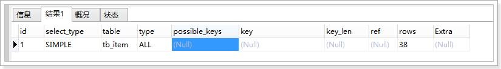
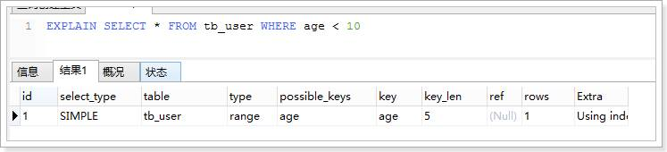

# 学习备忘

熟悉数据表结构设计（三范式、字段属性）

了解查询优化（索引的概念与创建、sql优化）

分页，分表，分库


```sql
-- distinct放在最前面
SELECT DISTINCT namespace, app_name FROM apps WHERE id='40';
```


自减更新

```
UPDATE table_xxx SET field_xxx = IF(field_xxx=0,0,field_xxx-1) WHERE id=111;
```


# 时间time类型

插入效率：datetime > timestamp > int

读取效率：int > timestamp > datetime

储存空间：datetime（8字节） > timestamp（4字节） = int


```sql
-- time转时间戳，
SELECT UNIX_TIMESTAMP(NOW());
-- 时间戳转time，10位精确到秒 SELECT UNIX_TIMESTAMP(NOW());
SELECT FROM_UNIXTIME(UNIX_TIMESTAMP(NOW()));
```


# 字符串函数

```
SELECT REPLACE("my_sql","_","-");
```


指定替换

```SQL
SELECT 'sql.study.com' AS `before`, CONCAT('mysql.',SUBSTRING_INDEX('sql.study.com', '.', -2)) AS `after`;
-- sql.study.com -> mysql.study.com
```

substring_index以分隔符截取子串，index为正，截取从头往后数到第index个分隔符为止，index为负数，截取从尾往前第index个分隔符为止。（子串不包括最后那个分隔符，中间的分隔符会保留）


# 显示变量

```mysql
SHOW VARIABLES LIKE '%time_zone%';
SELECT NOW();


-- 1.2 修改时区
set global time_zone = '+8:00';  -- 修改mysql全局时区为北京时间，即我们所在的东8区
set time_zone = '+8:00';  -- 修改当前会话时区
flush privileges;  -- 立即生效
```


```sql
SELECT TABLE_NAME FROM information_schema.TABLES WHERE TABLE_NAME LIKE 'xxxx_%' ORDER BY TABLE_NAME DESC;
```


#  索引

```SQL
SHOW INDEX FROM tblname;

创建单个索引
CREATE  INDEX  xx_index  ON  tablexx(xxname);
ALTER TABLE users ADD INDEX userName(userName);
ALTER TABLE users ADD INDEX password(password);

创建联合索引
联合索引顾名思义就是多个列组成的索引，比如
EXPLAIN select * from pre_sales_rfq where project_id = 1 and item_id = 1
ALTER TABLE users2 ADD INDEX userName_password(userName,password);

```


# 命令

```sql
create table xxx(
);

CREATE TABLE user_2020 SELECT * FROM user WHERE YEAR(created_at)=2020;


SHOW CREATE TABLE user;
desc <table_name>;
```


```
SELECT id, name, gender, score
FROM students
ORDER BY score DESC
LIMIT 3 OFFSET 0;
```

分页查询的关键在于，首先要确定每页需要显示的结果数量`pageSize`（这里是3），然后根据当前页的索引`pageIndex`（从1开始），确定`LIMIT`和`OFFSET`应该设定的值：

- `LIMIT`总是设定为`pageSize`；
- `OFFSET`计算公式为`pageSize * (pageIndex - 1)`。


# 分表分库场景

## 分页

- 允许选定跳页

比如获取第3页数据，则每个单元查出3页数据量，然后在内存中排序，返回第3页数据


- 只允许下一页

先找到上一页的time的最大/小值，作为第二页数据拉去的查询条件，只取一页数量的记录数，

这样服务层还是获得两页数据，再做一次排序，获取一页数据。

改进了不会因为页码增大而导致数据的传输量和排序量增大


# 基本概念

DBMS 数据库管理系统

 

Column 列，表由列组成； row行，一行表示一条记录（实体）

 

函数，SQL利用函数处理数据

 

JDBC连接数据库：jdbc:mysql://localhost:3306/productStore


 

## 引擎

MySQL有以下几种引擎：**ISAM****、MyISAM****、HEAP****（也称为MEMORY****）、InnoDB**

 

l **ISAM** 

**索引顺序访问方法**（*ISAM*, Indexed Sequential Access Method）该引擎在**读取数据**方面速度很快，而且不占用大量的内存和存储资源；但是ISAM不支持事务处理、不支持外来键、不能够容错、也不支持索引。该引擎在包括MySQL 5.1及其以上版本的数据库中不再支持。

 

l **MyISAM**

 该引擎基于ISAM数据库引擎，除了提供ISAM里所没有的索引和字段管理等大量功能，MyISAM还使用一种表格锁定的机制来优化多个**并发的读写**操作，但是需要经常运行OPTIMIZE TABLE命令，来恢复被更新机制所浪费的空间，否则碎片也会随之增加，最终影响数据访问性能。

MyISAM强调了**快速读取操作**，主要用于**高负载的****select****，这可能也是MySQL****深受Web****开发的主要原因：在Web****开发中进行的大量数据操作都是读取操作**，所以大多数虚拟主机提供商和Internet平台提供商（Internet Presence Provider，IPP）只允许使用MyISAM格式。

**MyISAM****支持全文本搜索，不支持事务**

*MyISAM**类型的**表**支持三种不同的存储结构：静态型、动态型、压缩型。*

***静态型\****：指定义的表列的大小是固定（即不含有：xblob**、xtext**、varchar**等长度可变的数据类型），这样MySQL**就会自动使用静态MyISAM**格式。使用静态格式的表的性能比较高，因为在维护和访问以预定格式存储数据时需要的开销很低；但这种高性能是以空间为代价换来的，因为在定义的时候是固定的，所以不管列中的值有多大，都会以最大值为准，占据了整个空间。*

***动态型\****：如果列（即使只有一列）定义为动态的（xblob, xtext, varchar**等数据类型），这时MyISAM**就自动使用动态型，虽然动态型的表占用了比静态型表较少的空间，但带来了性能的降低，因为如果**某个字段的内容发生改变则其位置很可能需要移动，（缺少冗余）**这样就会导致碎片的产生，随着数据变化的增多，碎片也随之增加，数据访问性能会随之降低。*

*对于因碎片增加而降低数据访问性这个问题，有两种解决办法：*

*a**、尽可能使用静态数据类型；*

*b**、经常使用optimize table table_name**语句整理表的碎片，恢复由于表数据的更新和删除导致的空间丢失。如果存储引擎不支持 optimize table table_name**则可以转储并重新加载数据，这样也可以减少碎片；*

***压缩型\****：如果在数据库中创建在整个生命周期内只读的表，则应该使用MyISAM**的压缩型表来减少空间的占用*

 

l **MEMORY**

**功能能等同于MYISAM****，**但数据放在内存而不是磁盘，操作速度更快，适合临时表

 

l **InnoDB**

**支持事务但不支持全文本搜索
**     该存储引擎为MySQL表提供了ACID事务支持、系统崩溃修复能力和多版本并发控制（即MVCC Multi-Version Concurrency Control）的行级锁；该引擎支持自增长（auto_increment）,自增长列的值不能为空，如果在使用的时候为空则自动从现有值开始增值，如果有但是比现在的还大，则直接保存这个值; 该引擎存储引擎支持外键（foreign key） ,外键所在的表称为子表而所依赖的表称为父表。InnoDB引擎在5.5后的MySQL数据库中为默认存储引擎。即MySQL5.5后默认支持事务。

 

 

## 视图

视图是虚拟的表。视图只包含使用时动态检索数据的查询SELECT。（可以理解为SQL语句的包装），视图是预先建立的查询语句,用起来就像使用表一样了

优势：简化复杂的SQL语句；使用表的组成部分；保护数据，可以给用户授予表的特定部分的访问权限

 

CREATE **VIEW** myfirstView AS

SELECT e.ename,e.sal,d.dname

FROM emp e JOIN dept d

ON e.deptno=d.deptno

将上面查询语句包装成一个虚拟表，只是可以查询出结果集的SQL，并不是真正的表，使用时可以看做一张表。

使用视图：

SELECT xxx

FROM myfirstView

WHERE xxxxx

 

## 存储过程

存储过程是预先写好并编译好的[SQL](https://www.baidu.com/s?wd=SQL&tn=44039180_cpr&fenlei=mv6quAkxTZn0IZRqIHckPjm4nH00T1dBPHKWuHc4rADkmHTsmhn30ZwV5Hcvrjm3rH6sPfKWUMw85HfYnjn4nH6sgvPsT6KdThsqpZwYTjCEQLGCpyw9Uz4Bmy-bIi4WUvYETgN-TLwGUv3EnHnsP1RvP1bv)程序。
 存储过程和函数区别：函数是预先写好的代码片断,有系统函数,也有自定义函数。


**CREATE PROCEDURE xxxxx()**

**BEGIN**

**xxxx**

**Xxxx**

**Xxx;**

**END;**

 

使用存储过程

**CALL xxxxx();**

## 游标

游标，对是检索出来的结果集进行(动态)滚动查看（后退、前进、最后一行），主要用于交互式应用。MySQL游标只能用于存储过程和函数。

JDBC中，ResultSet.next()

## 触发器

对下面DELETE; INSERT; UPDATE;

DML语句的自动响应，某些语句自动执行，SQL语句（或位于BEGIN和END之间的一组语句）：其他语句（包括DDL中的drop和truncate）不支持触发器。每一句前后可加入触发器，所以一个表最多6个触发器

 

CREATE TRIGGER newproduct AFTER INSERT ON products 

FOR EACH ROW SELECT ‘Product added ’;

每条插入语句执行后会显示‘Product added ’

## 关系运算

自然连接、笛卡尔积、集合运算

 

 

 

# 索引与散列

**本质——遍历转化为查找问题**

CREATE INDEX wula_index ON student(id);

 

首先不是任何时候都必须建索引，一般数据量较少（千级别）的数据表没必要建索引，全表查询即可，因为索引文件本身要消耗存储空间，同时索引会加重插入、删除和修改记录时的负担，另外，MySQL在运行时也要消耗资源维护索引，因此索引并不是越多越好。

在数据量较大时，选择索引字段有一个原则：字段重复率较低。**主键和索引是两个概念，主键是一种特殊的索引**

 

索引两大类型：（按检索策略划分，对搜索码k不处理和处理（散列技术））

**顺序索引** 基于值的顺序排列

**散列索引** 使用散列函数，将搜索码k进行地址映射，h(k)得到地址

索引评价指标：支持的访问类型，访问时间，插入时间，删除时间，空间开销。

用作查找的属性，**搜索码**

 

索引是对数据库表中**一列或多列**的值进行排序的一种结构，使用索引可快速访问数据库表中的特定信息。如果想按特定职员的姓来查找他或她，则与在表中搜索所有的行相比，索引有助于更快地获取信息。

例如这样一个查询：select * from table1 where id=10000。如果没有索引，必须遍历整个表，直到ID等于10000的这一行被找到为止；有了索引之后（比如使用B+搜索树）(必须是在ID这一列上建立的索引，即可在索引中查找。由于索引是经过某种算法优化过的，因而查找次数要少的多。

 

**顺序索引（不对查找码****key****进行处理）**

稠密索引和稀疏索引

多级索引，树结构的索引

索引自动生成：大多数数据库会在主键上自动创建一个索引。

### B+树索引

**B****树**

​    是一种M路搜索树（并不是二叉的）：

​    1.定义任意非叶子结点最多M个儿子；且M>2；

​    2.根节点儿子不少于2个，非叶子结点的儿子数为[M/2, M]；

​    3.所有叶子结点位于同一层；

4.每个节点孩子数比关键字多1个

​    

如：（M=3）


​    B树的搜索，从根结点开始，对结点内的关键字（有序）序列进行二分查找，如果

命中则结束，否则进入查询关键字所属范围的儿子结点；重复，直到所对应的儿子指针为

空，或已经是叶子结点；

 

**B****树的特性：**

​    1.关键字集合分布在整颗树中；

​    4.其搜索性能等价于在关键字全集内做一次二分查找；

​    5.自动层次控制；

​    由于限制了除根结点以外的非叶子结点，至少含有M/2个儿子，确保了结点的至少

利用率，其最底搜索性能为：


  

​    其中，M为设定的非叶子结点最多子树个数，N为关键字总数；

​    所以B-树的性能总是等价于二分查找（与M值无关），也就没有B树平衡的问题；

**删除查找操作：**

​    由于M/2~M的限制，在插入结点时，如果结点已满，需要将结点分裂为两个各占

M/2的结点；删除结点时，需将两个不足M/2的兄弟结点合并；

 

**H =** **log┌m/2┐((N+1)/2 )+1** **//****根节点，高度定义为****1**

 

 

**B+****树**

 B+树是B树的变体，也是一种多路搜索树：

​    其定义基本与B-树同，除了：

\1.     非叶子结点的子树指针与关键字个数相同；

​    4.**所有关键字都在叶子结点出现**；

​    2.非叶子结点K[i]的子树指针P[i]，指向关键字值**[**K[i], K[i+1])的子树（关键字可重复而B-树是开区间，不许重复）；

​    3.为所有叶子结点增加一个链指针；

​    

如：（M=3）


数据库索引采用B+树的主要原因是B树在提高了磁盘IO性能的同时并没有解决元素遍历的效率低下的问题。正是为了解决这个问题，B+树应运而生。B+树只要遍历叶子节点就可以实现整棵树的遍历。而且在数据库中基于范围的查询是非常频繁的，而B树不支持这样的操作（或者说效率太低）。

 

 

B+的特性：

​    1.所有关键字都出现在叶子结点的链表中（稠密索引），且链表中的关键字恰好

是有序的；

​    2.非叶子结点相当于是**叶子结点的索引**（稀疏索引），叶子结点相当于是存储

（关键字）数据的**数据层**；

​    3.更适合文件索引系统；稀疏索引+稠密索引，快速检索到关键字

一步步分析为什么B+树适合作为索引的结构 - CSDN博客 

https://blog.csdn.net/weixin_30531261/article/details/79312676

 

MyISAM和InnoDB的索引实现 - 立超的专栏 - 博客园 

https://www.cnblogs.com/zlcxbb/p/5757245.html

 

 

 

 

 

 

 

**散列索引**

桶，存储一条或多条记录的单位，通常一个桶就是一个磁盘块。

**散列冲突**：开放地址法，分离链

**动态散列**：桶可以分裂，合并

 

 

 

## 索引类型：

根据数据库的功能，可以在数据库设计器中创建四种索引：唯一索引、非唯一索引、主键索引和聚集索引。 尽管唯一索引有助于定位信息，但为获得最佳性能结果，建议改用主键或唯一约束。

**唯一索引：**

唯一索引是不允许其中任何两行具有相同索引值的索引。 当现有数据中存在重复的键值时，大多数数据库不允许将新创建的唯一索引与表一起保存。数据库还可能防止添加将在表中创建重复键值的新数据。例如，如果在 employee 表中职员的姓 (lname) 上创建了唯一索引，则任何两个员工都不能同姓。

**非唯一索引：**

非唯一索引是相对唯一索引，允许其中任何两行具有相同索引值的索引。 当现有数据中存在重复的键值时，数据库是允许将新创建的索引与表一起保存。这时数据库不能防止添加将在表中创建重复键值的新数据。

**主键索引：**

数据库表经常有一列或列组合，其值唯一标识表中的每一行。该列称为表的主键。 在数据库关系图中为表定义主键将自动创建主键索引，主键索引是唯一索引的特定类型。该索引要求主键中的每个值都唯一。当在查询中使用主键索引时，它还允许对数据的快速访问。

**聚集索引（也叫聚簇索引）：**

在聚集索引中，表中行的物理顺序与键值的逻辑（索引）顺序相同。一个表只能包含一个聚集索引。 如果某索引不是聚集索引，则表中行的物理顺序与键值的逻辑顺序不匹配。与非聚集索引相比，聚集索引通常提供更快的数据访问速度。

 

### 聚集索引、主键

https://www.cnblogs.com/s-b-b/p/8334593.html

打个比方，一个表就像是我们以前用的新华字典，聚集索引就像是拼音目录，而每个字存放的页码就是我们的数据物理地址，我们如果要查询一个“哇”字，我们只需要查询“哇”字对应在新华字典拼音目录对应的页码，就可以查询到对应的“哇”字所在的位置，而拼音目录对应的A-Z的字顺序，和新华字典实际存储的字的顺序A-Z也是一样的，如果我们中文新出了一个字，拼音开头第一个是B，那么他插入的时候也要按照拼音目录顺序插入到A字的后面，现在用一个简单的示意图来大概说明一下在数据库中的样子：


注：第一列的地址表示该行数据在磁盘中的物理地址，后面三列才是我们SQL里面用的表里的列，其中id是主键，建立了聚集索引。

**数据行的物理顺序与聚集索引列值的顺序相同**，如果我们查询id比较靠后的数据，那么这行数据的地址在磁盘中的物理地址也会比较靠后。而且由于物理排列方式与聚集索引的顺序相同，所以也就只能建立一个聚集索引了。

 

 

### 唯一索引

 

主键就是唯一索引，但是唯一索引不一定是主键，唯一索引可以为空，但是空值只能有一个，主键不能为空。

普通唯一索引：单个字段上建立唯一索引，需要此字段所在的列上不能有重复的值，属于二级索引。

复合唯一索引：多个字段上联合建立唯一索引，属于二级索引。

 

### 覆盖索引

查找的目标数据包含在索引中，如建立idx_colum1_colum2.

select colum1 from table where colum1 = ? and colum2 > ?

通过查询索引就能确定最终的数据，不用再利用叶子节点中存储的主键值去查询对应的数据。

覆盖索引的性能是极高的。

 

### 位图索引

位图：属性列取值有限，这个有限的范围就是位图，性别的位图：男，女，阶级的位图：有产者，无产者。

 

## 索引的SQL操作

**创建单个索引**

CREATE INDEX xx_index ON tablexx(xxname);

ALTER TABLE users ADD INDEX userName(userName);

ALTER TABLE users ADD INDEX password(password);

 

**创建联合索引**

联合索引顾名思义就是**多个列组成的索引**，比如

EXPLAIN select * from pre_sales_rfq where project_id = 1 and item_id = 1

ALTER TABLE users2 ADD INDEX userName_password(userName,password);

 

# 全文本搜索

Match()  Against()组合命令，Match()指定查找列名，Against()参数为串 ’ ’

对模糊查询的优化

 

SELECT note_text 

FROM products 

WHERE Match(note_text) Against(‘ sefa’);

//带查找条件

 

 

# 命令一览SQL大小写不敏感：

**SQL****：Structure Query Language****。（结构化查询语言）**

SQL被美国国家标准局（ANSI）确定为关系型数据库语言的美国标准，后来被国际化标准组织（ISO）采纳为关系数据库语言的国际标准。

 

各数据库厂商都支持ISO的SQL标准。普通话

各数据库厂商在标准的基础上做了自己的扩展。方言

 

**Sql****的分类**

**DDL****（Data Definition Language）：**数据定义语言**，用来定义数据库对象：库、表、列等；                                                           CREATE、 ALTER、DROP

**DML*****（Data Manipulation Language）：**数据操作语言**，用来定义数据库记录（数据）；                                                             INSERT、 UPDATE、 DELETE

DCL（Data Control Language）：**数据控制语言**，用来定义访问权限和安全级别；

**DQL*******（Data Query Language）：**数据查询语言**，用来查询记录（数据）。

SELECT

 

**数据控制DCL**

**GRANT**　　　--授予用户访问权限

**DENY**　　　--拒绝用户访问

**REVOKE**　　　--解除用户访问权限

--事务控制

**COMMIT**　　　--提交当前事务

**ROLLBACK**　　 --回滚当前事务

SET TRANSACTION　--定义当前事务数据访问特征

SET TRANSACTION ISOLATION LEVEL read uncommitted;

 

--程序化

**EXPLAN**　　　--为查询描述数据访问计划

 

**DECLARE**　　　--为查询设定游标

OPEN　　　--检索查询结果打开一个游标

FETCH　　　--检索一行查询结果

CLOSE　　　--关闭游标

 

**PREPARE**　　　--为动态执行准备SQL 语句

EXECUTE　　　--动态地执行SQL 语句

DESCRIBE　　 --描述准备好的查询

 

## 数据定义语言DDL

### * 操作库

​          创建

​                    **CREATE** DATABASE mydb1;

Create database mydb2 character set gbk;

Create database mydb3 character set gbk COLLATE gbk_chinese_ci;

 

​          查询

**SHOW** DATABASES;

SHOW CREATE DATABASE mydb2; --查看某个库创建信息

 

​          修改

**ALTER** database mydb2 character set utf8;

​          删除     

**DROP** database mydb3;

 

​          \* 其他：

select database();  --查看当前使用的数据库

**USE** mydb2;        --切换数据库

 

 

### * 操作表

​     \* 语法：

​               **create table** **表名(**

​                    **字段1** **字段类型,**

​                    **字段2** **字段类型,**

​                    **...**

​                    **字段n** **字段类型**

​               **);**

​                    

​     \* 常用数据类型：

​               int：整型

​               double：浮点型，例如double(5,2)表示最多5位，其中必须有2位小数，即最大值为999.99；

​               char：固定长度字符串类型； char(10) 'abc    '

​               varchar：可变长度字符串类型；varchar(10) 'abc'

​               text：字符串类型;

​               blob：字节类型；可以放image

​               date：日期类型，格式为：yyyy-MM-dd；

​               time：时间类型，格式为：hh:mm:ss

​               timestamp：时间戳类型 yyyy-MM-dd hh:mm:ss 会自动赋值

​               datetime:日期时间类型 yyyy-MM-dd hh:mm:ss

 

当前数据库中的所有表

**SHOW** TABLES;

查看表格的创建细节

SHOW CREATE TABLE user;

查看表的字段信息

**DESC** employee;

在上面员工表的基本上增加一个image列。

**ALTER** TABLE employee **ADD** image blob;

删除image列,一次只能删一列。

**ALTER** TABLE employee **DROP** image;

修改job列，使其长度为60。

**ALTER** TABLE employee **MODIFY** job varchar(60);

修改表名改为user。

**RENAME** TABLE employee TO user;

修改列名name为username

ALTER TABLE user **CHANGE** name username varchar(100);

修改表的字符集为gbk

ALTER TABLE user CHARACTER SET gbk;

 

删除表

DROP TABLE user ;

 

 

**演示恢复和备份**

create database tt;

use tt;

create table a

(

​     name varchar(20)

);

insert into a(name) values('aaaa');

select * from a;

-----看到a表有数据

 

对tt作备份操作，启动一个window命令行窗口，执行如下命令

mysqldump -uroot -p tt>c:\tt.sql

 

 

演示恢复

1.先删除库

drop database tt;

 

2.恢复tt库(1)

 2.1 为恢复库，要先创建库 create database tt;

 2.2 再恢复tt库 

​     **use tt;** 

​     **source c:\tt.sql**      **（source:****可以执行一个 sql****脚本）**

​     

 

3.恢复tt库(2)

 2.1 为恢复库，要先创建库 create database tt;

 2.2 恢复库  mysql -uroot -proot tt<c:\1.sql;  (window命令)

 

**mysqldump -uroot -p tt>c:\tt.sql**

**use tt;** 

​     **source c:\tt.sql**    

 

 

 

## 数据操作语言DML

DML是对表中的数据进行增、删、改的操作。不要与DDL混淆了。

INSERT 、UPDATE、 DELETE


USE mysql;

SELECT user FROM user;

 

CREATE USER wulala IDENTIFIED BY ‘gegege’;

DROP USER wulala;


### 插入操作：INSERT:

语法： **INSERT INTO** 表名（列名1，列名2 ...）**VALUES**(列值1，列值2...);

注意：列名与列值的类型、个数、顺序要一一对应。

可以把列名当做java中的形参，把列值当做实参。

值不要超出列定义的长度。

如果插入空值，请使用null

插入的日期和字符一样，都使用引号括起来。

练习 ：

create table emp(

id int,

name varchar(100),

gender varchar(10),

birthday date,

salary float(10,2),

entry_date date,

resume text

);

 

INSERT INTO emp(id,name,gender,birthday,salary,entry_date,resume)

**VALUES**(1,'zhangsan','female','1990-5-10',10000,'2015-5-5-','good girl');

 

INSERT INTO emp(id,name,gender,birthday,salary,entry_date,resume)

VALUES(2,'lisi','male','1995-5-10',10000,'2015-5-5','good boy');

 

INSERT INTO emp(id,name,gender,birthday,salary,entry_date,resume)

VALUES(3,'wangwu','male','1995-5-10',10000,'2015-5-5','good boy');

 

批量插入：

INSERT INTO emp VALUES

(4,'zs','m','2015-09-01',10000,'2015-09-01',NULL),

(5,'li','m','2015-09-01',10000,'2015-09-01',NULL),

(6,'ww','m','2015-09-01',10000,'2015-09-01',NULL);

### 修改操作 UPDATE:

将所有员工薪水修改为5000元。

**UPDATE** emp **SET** salary=5000 

将姓名为’zs’的员工薪水修改为3000元。

UPDATE emp SET salary=3000 WHERE name=’ zhangsan’;

将姓名为’aaa’的员工薪水修改为4000元,job改为ccc。

 UPDATE emp SET salary=4000,gender='female' WHERE name='lisi';

将wu的薪水在原有基础上增加1000元。

 UPDATE emp SET salary=salary+1000 WHERE gender='male';  

 

### 删除操作 DELETE:

语法 ： **DELETE FROM** 表名 【WHERE 列名=值】

 

练习 ：

删除表中名称为’zs’的记录。

DELETE FROM emp WHERE name=‘zs’;

删除表中所有记录。

DELETE FROM emp;

 

使用truncate删除表中记录。

TRUNCATE TABLE emp;

 

## drop、truncate和delete的区别

一：用法和区别

**drop**：drop table 表名

   删除内容和定义，并释放空间。执行drop语句，将使此表的结构一起删除。空间初始化

 

**truncate** (清空表中的数据)：truncate table 表名

   删除内容、释放空间但不删除表定义(也就是保留表的数据结构)。与drop不同的是,只是清空表数据而已。

   truncate不能删除像delete操作行数据。虽然只删除数据，但是比delete彻底，整个删除表数据。

 

**delete**：delete from 表名 （where 列名 = 值）

​    与truncate类似，delete也只删除内容、释放空间但不删除定义；但是delete即可以对行数据进行删除，也可以对整表数据进行删除。

 

二：注意

   1.delete语句执行删除的过程是每次从表中删除一行，并且同时将该行的删除操作作为事务记录在日志中保存，以便进行进行回滚操作。

   2.执行速度一般来说：drop>truncate>delete

   3.delete语句是数据库操作语言(dml)，这个操作会放到 rollback segement 中，事务提交之后才生效；如果有相应的 trigger，执行的时候将被触发。

   4.truncate、drop 是数据库定义语言(ddl)，操作立即生效，原数据不放到 rollback segment 中，不能回滚，操作不触发trigger。

   5.truncate语句执行以后，id标识列还是按顺序排列，保持连续；而delete语句执行后，ID标识列不连续

 

## 数据查询语言DQL

数据库执行DQL语句不会对数据进行改变，而是让数据库发送结果集给客户端。

**查询返回的结果集是一张虚拟表，表的列结构由SELECT****后面内容决定。**

 

查询关键字：SELECT 

语法： SELECT 列名 FROM表名

**WHERE --> GROUP BY -->HAVING--> ORDER BY--> LIMIT**

 

语法：

SELECT selection_list /*要查询的列名称*/

 FROM table_list /*要查询的表名称*/

 WHERE condition /*行条件*/

 GROUP BY grouping_columns /*对结果分组*/

 HAVING condition /*分组后的行条件*/

 ORDER BY sorting_columns /*排序*/

 LIMIT offset_start, row_count /*结果限定*/

 

 

### 1　基础查询SELECT

**SELECT \* FROM stu;**

**SELECT sid, sname, age FROM stu;**

 

### 2　条件查询WHERE

条件查询就是在查询时给出**WHERE**子句，可以配合使用如下**运算符及关键字**：

l =、**!=**、<>、<、<=、>、>=；

l BETWEEN…AND； 

l IN(set)；

l IS NULL； IS NOT NULL

l AND；

l OR；

l NOT； 

l ALL /ANY

 

查询性别为女，并且年龄50的记录

　　**SELECT \* FROM stu** 

**WHERE gender='female' AND ge<50;**

 

查询学号为S_1001，或者姓名为liSi的记录

**SELECT \* FROM stu** 

**WHERE sid ='S_1001' OR sname='liSi';**

 

查询学号为S_1001，S_1002，S_1003的记录（多条记录）

**SELECT \* FROM stu** 

**WHERE sid IN ('S_1001','S_1002','S_1003');**

 

查询学号不是S_1001，S_1002，S_1003的记录

**SELECT \* FROM tab_student** 

**WHERE s_number NOT IN ('S_1001','S_1002','S_1003');**

 

查询年龄为null的记录

**SELECT \* FROM stu**

**WHERE age IS NULL;**

 

查询年龄在20到40之间的学生记录

**SELECT \*** 

**FROM stu**

**WHERE age>=20 AND age<=40;**

或者

**SELECT \*** 

**FROM stu** 

**WHERE age BETWEEN 20 AND 40;**

 

查询性别非男的学生记录

**SELECT \*** 

**FROM stu**

**WHERE gender!='male';**

或者

**SELECT \*** 

**FROM stu**

**WHERE gender<>'male';**

或者

**SELECT \*** 

**FROM stu**

**WHERE NOT gender='male';**

 

查询姓名不为null的学生记录

**SELECT \*** 

**FROM stu**

**WHERE sname IS NOT NULL;**

或者

**SELECT \*** 

**FROM stu**

**WHERE NOT sname IS NULL;**

 

 

### 3　模糊查询LIKE

当想查询姓名中包含a字母的学生时就需要使用模糊查询了。模糊查询需要使用关键字LIKE。

通配符: 

_ 任意一个字符

​    %：任意0~n个字符

 

'%张%' '张_'

 

查询姓名由5个字母构成的学生记录

**SELECT \*** 

**FROM stu**

**WHERE sname LIKE '_____';**

模糊查询必须使用LIKE关键字。其中 “_”匹配任意一个字母，5个“_”表示5个任意字母。

 

查询姓名由5个字母构成，并且第5个字母为“i”的学生记录

**SELECT \*** 

**FROM stu**

**WHERE sname LIKE '____i';**

 

查询姓名以“z”开头的学生记录

**SELECT \*** 

**FROM stu**

**WHERE sname LIKE 'z%';**

其中“%”匹配0~n个任何字母。

 

查询姓名中第2个字母为“i”的学生记录

**SELECT \*** 

**FROM stu**

**WHERE sname LIKE '_i%';**

 

**查询姓名中包含“a****”字母的学生记录**

**SELECT \*** 

**FROM stu**

**WHERE sname LIKE '%a%';**

 

### 4　字段控制查询

**去除重复记录**

去除重复记录（两行或两行以上记录中系列的上的数据都相同），例如emp表中sal字段就存在相同的记录。当只查询emp表的sal字段时，那么会出现重复记录，那么想去除重复记录，需要使用DISTINCT：

**SELECT DISTINCT sal FROM emp;**

 

**查看雇员的月薪与佣金之和**

　　因为sal和comm两列的类型都是数值类型，所以可以做加运算。如果sal或comm中有一个字段不是数值类型，那么会出错。

**SELECT \*,sal+comm FROM emp;**

 

comm列有很多记录的值为NULL，因为任何东西与NULL相加结果还是NULL，所以结算结果可能会出现NULL。下面使用了把NULL转换成数值0的函数IFNULL：

**SELECT \*,sal+IFNULL(comm,0) FROM emp;**

 

**给列名添加别名**

在上面查询中出现列名为sal+IFNULL(comm,0)，这很不美观，现在我们给这一列给出一个别名，为total：

**SELECT \*, sal+IFNULL(comm,0) AS total FROM emp;**

给列起别名时，是可以省略AS关键字的：

**SELECT \*,sal+IFNULL(comm,0)  total FROM emp;**

 

### 5　排序order by xx ASC(默认升序) DESC

5.1　查询所有学生记录，按年龄升序排序

**SELECT \***

**FROM stu**

**ORDER BY sage ASC;**

或者

**SELECT \***

**FROM stu**

**ORDER BY sage;**

 

5.2　查询所有学生记录，按年龄降序排序

**SELECT \***

**FROM stu**

**ORDER BY age DESC;**

 

5.3　查询所有雇员，按月薪降序排序，如果月薪相同时，按编号升序排序

**SELECT \* FROM emp**

**ORDER BY sal DESC,empno ASC;**

 

### 6　聚合函数sum avg max min count

聚合函数是用来做**纵向运算的函数**：对某一项做运算

l COUNT()：统计指定列不为NULL的记录行数；

l MAX()：计算指定列的最大值，如果指定列是字符串类型，那么使用字符串排序运算；

l MIN()：计算指定列的最小值，如果指定列是字符串类型，那么使用字符串排序运算；

l SUM()：计算指定列的数值和，如果指定列类型不是数值类型，那么计算结果为0；

l AVG()：计算指定列的平均值，如果指定列类型不是数值类型，那么计算结果为0；

 

6.1　COUNT

当需要纵向统计时可以使用COUNT()。

l 查询emp表中记录数：

**SELECT COUNT(\*) AS cnt FROM emp;**

 

l 查询emp表中有佣金的人数：

**SELECT COUNT(comm) cnt FROM emp;**

注意，因为count()函数中给出的是comm列，那么只统计comm列非NULL的行数。

 

l 查询emp表中月薪大于2500的人数：

**SELECT COUNT(\*) FROM emp**

**WHERE sal > 2500;**

 

l 统计月薪与佣金之和大于2500元的人数：

**SELECT COUNT(\*) AS cnt FROM emp WHERE sal+IFNULL(comm,0) > 2500;**

 

l 查询有佣金的人数，有领导的人数：

**SELECT COUNT(comm), COUNT(mgr) FROM emp;**

 

6.2　SUM和AVG

当需要纵向求和时使用sum()函数。

l 查询所有雇员月薪和：

**SELECT SUM(sal) FROM emp;**

 

l 查询所有雇员月薪和，以及所有雇员佣金和：

**SELECT SUM(sal), SUM(comm) FROM emp;**

 

l 查询所有雇员月薪+佣金和：

**SELECT SUM(sal+IFNULL(comm,0)) FROM emp;**

 

l 统计所有员工平均工资：

**SELECT AVG(sal) FROM emp;**

 

6.3　MAX和MIN

l 查询最高工资和最低工资：

**SELECT MAX(sal), MIN(sal) FROM emp;**

 

### 7　分组查询，搭配聚合函数

 

**对查询结果进行分组**，需要使用GROUP BY子句，例如查询每个部门的工资和，这说明要使用部门来分组。

*注：凡和聚合函数同时出现的列名，一定要写在group by* *之后*

 


 

7.1　分组查询

l 查询每个部门的部门编号和每个部门的工资和：

**SELECT deptno, SUM(sal)**

**FROM emp**

**GROUP BY deptno;**

 

l 查询每个部门的部门编号以及每个部门的人数：

**SELECT deptno,COUNT(\*)**

**FROM emp**

**GROUP BY deptno;**

 

l 查询每个部门的部门编号以及每个部门工资大于1500的人数：

**SELECT deptno,COUNT(\*)**

**FROM emp**

**WHERE sal>1500**

**GROUP BY deptno;**

 

7.2　HAVING子句

l 查询工资总和大于9000的***部门编号\***以及***工资和\***：分组后还有过滤条件

**SELECT deptno, SUM(sal)**

**FROM emp**

**GROUP BY deptno**

**HAVING SUM(sal) > 9000;**

　　

​     注：having与where的区别:

​          1.having是在分组后对数据进行过滤.

​           where是在分组前对数据进行过滤

​          

2.having后面可以使用聚合函数(统计函数)

​     where后面不可以使用聚合函数。

WHERE是对分组前记录的条件，如果某行记录没有满足WHERE子句的条件，那么这行记录不会参加分组；而HAVING是对分组后数据的约束。

 


### 8　LIMIT 方言

LIMIT用来限定查询结果的起始行，以及总行数。

 

查询5行记录，起始行从0开始

**SELECT \* FROM emp LIMIT 0, 5;**

注意，起始行从0开始，即第一行开始！

 

查询10行记录，起始行从3开始

**SELECT \* FROM emp LIMIT 3, 10;**

 

分页查询

如果一页记录为10条，希望查看第3页记录应该怎么查呢？

l 第一页记录起始行为0，一共查询10行；

l 第二页记录起始行为10，一共查询10行；

l 第三页记录起始行为20，一共查询10行；

 

 

​     查询语句书写顺序：select – from- where- group by- having- order by-limit

​     查询语句执行顺序：from - where -group by - having - select - order by-limit   

 

 

 

## 数据的完整性，约束

作用：保证用户输入的数据保存到数据库中是正确的。

确保数据的完整性 = 在创建表时给表中添加约束

完整性的分类：

实体完整性:

域完整性:

引用完整性:

### 1、实体完整性

实体：即表中的一行(一条记录)代表一个实体（entity）

实体完整性的作用：标识每一行数据不重复。

**约束类型：** **主键约束（primary key****）** **唯一约束(unique)** **自动增长列(auto_increment)**

 

**1.1****主键约束（primary key****）**

注：每个表中要有一个主键。

**特点两个：数据唯一，且不能为null****，比UNIQUE****多一个不为null****要求**

 

第一种添加方式：

CREATE TABLE student(

id int primary key,

name varchar(50)

);

 

第二种添加方式：此种方式优势在于，可以创建联合主键

CREATE TABLE student(

id int,

name varchar(50),

primary key(id)

);

CREATE TABLE student(

classid int,

stuid int,

name varchar(50),

primary key(classid，stuid)

);

 

第三种添加方式：

CREATE TABLE student(

id int,

name varchar(50)

);

ALTER TABLE student ADD PRIMARY KEY (id);

 

**1.2****唯一约束(unique)****：
**     特点：数据不能重复。

CREATE TABLE student(

Id int primary key,

Name varchar(50) unique

);

 

 

**1.3****自动增长列(auto_increment)** 

 sqlserver数据库 (identity) oracle数据库( sequence)

 

给主键添加自动增长的数值，列只能是整数类型

CREATE TABLE student(

Id int primary key auto_increment,

Name varchar(50)

);

INSERT INTO student(name) values(‘tom’);

 

### 2、域完整性

域代表当前单元格，域完整性的作用：限制此单元格的数据正确，不对照此列的其它单元格比较

域完整性约束：数据类型 非空约束（not null） 默认值约束(default) 

check约束（mysql不支持）check(sex='男' or sex='女')

**1.1** **数据类型:****（数值类型、日期类型、字符串类型）**

 

**1.2** **非空约束：not null**

CREATE TABLE student(

Id int pirmary key,

Name varchar(50) not null,

Sex varchar(10)

);

INSERT INTO student values(1,’tom’,null);

 

**1.3** **默认值约束 default**

CREATE TABLE student(

Id int pirmary key,

Name varchar(50) not null,

Sex varchar(10) default ‘男’

);

insert into student1 values(1,'tom','女');

insert into student1 values(2,'jerry',default);

 

### 3、引用完整性（参照完整性）

```
外键约束：FOREIGN KEY 
```

例：

CREATE TABLE student(

sid int pirmary key,

name varchar(50) not null,

sex varchar(10) default ‘男’

);

 

create table score(

​     id int,

​     score int,

​     sid int , -- 外键列的数据类型一定要与主键的类型一致

​     CONSTRAINT fk_sid FOREIGN KEY(sid) REFERENCES student(id)

); --难懂

 

另外一种

create table ‘score’(

​     ‘id’ int,

​     ‘score’ int,

​     ‘sid’ int ,

​    FOREIGN KEY(`sid `) REFERENCES `student` (`id`)

);

(引号都可以不加)

 

 

## 多表查询（重要）

多表查询有如下几种：

l 合并结果集；**UNION** 、 **UNION ALL**

连接查询

Ø 内连接 **[INNER] JOIN ON** 

Ø 外连接 **OUTER JOIN ON**

² 左外连接 **LEFT [OUTER] JOIN**

² 右外连接 **RIGHT [OUTER] JOIN**

² 全外连接（MySQL不支持）FULL JOIN

Ø 自然连接 **NATURAL JOIN**

l 子查询

 

### 1　合并结果集

**针对相同类型结构的表，简单合并**

\1.    作用：合并结果集就是把两个select语句的查询结果合并到一起！

\2.    合并结果集有两种方式：

l UNION：去重复记录，例如：SELECT * FROM t1 **UNION** SELECT * FROM t2；

l UNION ALL：不去重复记录，例如：SELECT * FROM t1 UNION ALL SELECT * FROM t2。

\3.    要求：**被合并的两个结果：****column****数、column****类型必须相同。**


### 1.2　连接查询 （JOIN xxx ON xx=xx）

查询的结果也是合并的结果集，连接查询就是求出多个表的乘积，例如t1连接t2，那么查询出的结果就是t1*t2。


 

连接查询会产生笛卡尔积，假设集合A={a,b}，集合B={0,1,2}，则两个集合的笛卡尔积为{(a,0),(a,1),(a,2),(b,0),(b,1),(b,2)}。可以扩展到多个集合的情况。

那么多表查询产生这样的结果并不是我们想要的，很多错误信息。通常要查询的多个表之间都存在关联关系，那么就通过关联关系去除笛卡尔积。

你能想像到emp和dept表连接查询的结果么？emp一共14行记录，dept表一共4行记录，那么连接后查询出的结果是56行记录。

也就你只是想在查询emp表的同时，把每个员工的所在部门信息显示出来，那么就需要使用主外键来去除无用错误信息了。


 


　　**使用主外键关系做为条件来去除无用信息**

  SELECT * FROM emp,dept WHERE  emp.deptno=dept.deptno;  

在多表查询中，在使用列时必须指定列所从属的表，例如emp.deptno表示emp表的deptno列。

 


 

上面查询结果会把两张表的所有列都查询出来，也许你不需要那么多列，这时就可以指定要查询的列了。

  SELECT  emp.ename,emp.sal,emp.comm,dept.dname   FROM emp,dept   WHERE emp.deptno=dept.deptno;  

 


 

还可以为表指定别名，然后在引用列时使用别名即可。

  SELECT e.ename,e.sal,e.comm,d.dname   FROM emp AS e,dept AS d  WHERE e.deptno=d.deptno;  

 

 

 

 

**2.1**　**内连接**

**上面的连接语句就是内连接，但它不是SQL****标准中的查询方式**，可以理解为方言！SQL标准的内连接为：

  SELECT *   FROM emp e   INNER **JOIN**  dept d   ON e.deptno=d.deptno;  

INNER可以省略，MySQL默认的连接方式就是内连接

不使用WHERE，而是使用ON

 

 

**2.2**　**外连接（左连接、右连接）**

外连接的特点：查询出的结果存在不满足条件的可能。

左连接：

  SELECT * FROM emp e   **LEFT** OUTER **JOIN** dept d   **ON** e.deptno=d.deptno;  

OUTER可以省略

 

 

 

左连接是先查询出左表（即以左表为主），然后查询右表，右表中满足条件的显示出来，不满足条件的显示NULL。

这么说你可能不太明白，我们还是用上面的例子来说明。其中emp表中“张三”这条记录中，部门编号为50，而dept表中不存在部门编号为50的记录，所以“张三”这条记录，不能满足e.deptno=d.deptno这条件。但在左连接中，因为emp表是左表，所以左表中的记录都会查询出来，即“张三”这条记录也会查出，但相应的右表部分显示NULL。


 

**2.3**　**右连接**

右连接就是先把右表中所有记录都查询出来，然后左表满足条件的显示，不满足显示NULL。例如在dept表中的40部门并不存在员工，但在右连接中，如果dept表为右表，那么还是会查出40部门，但相应的员工信息为NULL。

  SELECT * FROM emp e   **RIGHT** OUTER **JOIN** dept d   **ON** e.deptno=d.deptno;  

 


 

 

**连接查询心得**：

连接不限与两张表，连接查询也可以是三张、四张，甚至N张表的连接查询。通常连接查询不可能需要整个笛卡尔积，而只是需要其中一部分，那么这时就需要使用条件来去除不需要的记录。这个条件大多数情况下都是使用主外键关系去除。

两张表的连接查询一定有一个主外键关系，三张表的连接查询就一定有两个主外键关系，所以在大家不是很熟悉连接查询时，首先要学会去除无用笛卡尔积，那么就是用主外键关系作为条件来处理。如果两张表的查询，那么至少有一个主外键条件，三张表连接至少有两个主外键条件*。*

 

**2.4****自然连接查询NATURAL JOIN**

大家也都知道，连接查询会产生无用笛卡尔积，我们通常使用**主外键关系**等式来去除它。而自然连接无需你去给出主外键等式，它会自动找到这一等式：也就是不需要ON条件。

l 两张连接的表中名称和类型完全一致的列作为条件，例如emp和dept表都存在deptno列，并且类型一致，所以会被自然连接找到！

当然自然连接还有其他的查找条件的方式，但其他方式都可能存在问题！

  SELECT * FROM emp NATURAL JOIN dept;  SELECT * FROM emp NATURAL LEFT JOIN dept;  SELECT * FROM emp NATURAL RIGHT JOIN  dept;  

 

 

 

### 2　子查询（非常重要）

一个select语句中包含另一个完整的select语句。

子查询就是嵌套查询，即SELECT中包含SELECT，如果一条语句中存在两个，或两个以上SELECT，那么就是子查询语句了。

l 子查询出现的位置：

Ø where后，作为条件；

Ø from后，作表；

l 当子查询出现在where后作为条件时，还可以使用如下关键字：

Ø any

Ø all

l 子查询结果集的形式：

Ø 单行单列（条件）

Ø 单行多列（条件，表）

Ø 多行单列（条件，表）

Ø **多行多列（表）,****放在FROM****后面**

 

 

 

 

 

 

 

**练习：**

**1.**    **工资高于JONES****的员工。**

分析：

查询条件：工资>JONES工资，其中JONES工资需要一条子查询。

 

第一步：查询JONES的工资

  SELECT sal FROM emp WHERE ename='JONES'  

 

第二步：查询高于甘宁工资的员工

  SELECT * FROM emp WHERE sal > (${第一步})  

 

结果：

  SELECT * FROM emp WHERE sal > (SELECT  sal FROM emp WHERE ename='JONES')  

 

**2****、查询与SCOTT****同一个部门的员工。**

 

SELECT * FROM emp WHERE deptno=(

SELECT deptno FROM emp WHERE ename=’SCOTT’);

 

**3****、工资高于30****号部门所有人的员工信息**

 

第一种

SELECT * FROM emp WHERE sal>(

SELECT **MAX**(sal) FROM emp WHERE deptno=30);

 

第二种：

第一步：查询30部门所有人工资

  SELECT sal FROM emp WHERE deptno=30;  

 

第二步：查询高于30部门所有人工资的员工信息

  SELECT * FROM emp WHERE sal > ALL (${第一步})  

 

结果：

  SELECT * FROM emp WHERE sal > **ALL** (SELECT sal FROM emp WHERE deptno=30)  

 

l **子查询作为条件**

l 子查询形式为多行单列（当子查询结果集形式为多行单列时可以使用**ALL**或**ANY**关键字）

 

**4****、查询工作和工资与MARTIN****（马丁）完全相同的员工信息**

第一步：查询出MARTIN的工作和工资

  SELECT job,sal FROM emp WHERE  ename='MARTIN'  

 

第二步：查询出与MARTIN工作和工资相同的人

  SELECT * FROM emp WHERE (job,sal) IN (${第一步})  

 

结果：

  SELECT * FROM emp WHERE (job,sal) **IN** (SELECT job,sal FROM emp WHERE  ename='MARTIN')  

 

**5****、有2****个以上直接下属的员工信息**

 

SELECT * FROM emp WHERE empno IN(

SELECT mgr FROM emp **GROUP BY** mgr HAVING COUNT(mgr)>=2);

 

**6****、查询员工编号为7788****的员工名称、员工工资、部门名称、部门地址**

 

查询列：员工名称、员工工资、部门名称、部门地址

查询表：emp和dept，分析得出，不需要外连接（外连接的特性：某一行（或某些行）记录上会出现一半有值，一半为NULL值）

条件：员工编号为**7788**

 

 

| SELECT e.ename, e.sal, d.dname, d.loc   FROM emp e, dept d   WHERE e.deptno=d.deptno AND e.empno=**7788;  --****方言版，后面很多方言** |
| ------------------------------------------------------------ |
| SELECT e.ename, e.sal,d.dname,d.loc  FROM emp e JOIN dept  d  ON e.deptno=d.deptno AND e.empno=7788;   --标准版 |

 

**分析：无需子查询，但可以用子查询进行优化**

第二步中的dept表表示所有行所有列的一张完整的表，这里可以优化，把dept替换成所有行、但只有dname和loc列的表，这需要子查询。

 

查询dept表中dname和loc，eptno，后面一个会作为条件，用来去除无用笛卡尔积。

  SELECT dname,loc,deptno FROM dept;  

 

  SELECT e.ename, e.sal, d.dname, d.loc   FROM emp e, (SELECT dname,loc,deptno FROM  dept) d   WHERE e.deptno=d.deptno AND e.empno=**7788**  

 

 

**3****、自连接:****自己连接自己，需要起别名区分**

求7369员工编号、姓名、经理编号和经理姓名

​      SELECT e1.empno , e1.ename,e2.mgr,e2.ename 

​      FROM emp e1, emp e2 

​      WHERE e1.mgr = e2.empno AND e1.empno = 7369;

 

练习：

  **求各个部门薪水最高的员工所有信息**

  Select  **e.\***  from emp e,

(select max(sal) maxsal,deptno from emp

group by deptno) a

where e.deptno = **a.deptno** AND e.sal =**a.maxsal;**

 

 

 

 

# 事务的概念

事务指逻辑上的一组操作，组成这组操作的各个单元，要么全部成功，要么全部不成功。数据库默认事务是自动提交的，也就是**发一条****sql****它就执行一条。**如果想多条sql放在一个事务中执行，则需要使用如下语句。

特点：

**原子性（Atomicity****）**

事务被视为不可分割的最小单元，事务的所有操作要么全部提交成功，要么全部失败回滚。

**一致性（Consistency****）**

数据在既有定义的规则下是有效的。

**隔离性（Isolation****）**

一个事务所做的修改在最终**提交以前，**对其它事务是不可见的，**互不影响**。

**持久性（Durability****）**

一旦事务提交，则其所做的修改将会永远保存到数据库中。即使系统发生崩溃，**事务执行的结果**也不能丢失。可以通过数据库备份和恢复来保证持久性。


 

 

 

**数据库开启事务命令**

start transaction + Commit  开启事务，最后提交事务

Rollback 回滚事务，撤销

 

 

**START TRANSACTION;--****开启事务**

DELETE FROM orderitems WHERE order_num = 20010；

SAVEPOINT delete1;

DELETE FROM orders WHERE order_num = 10010；

ROLLBACK TO delete1;

.......

.......

**COMMIT;--****提交**

 

## 隔离级别不够：脏读，不可重复读，幻读

1.**脏读**发生（读到另一个事务未提交的数据）

 

2.**不可重复读**问题的发生（这边事务没结束，读到了另一个事物提交后**更新的数据**，这边两次读取数据不一致）

 

3.发现表中可能会多出一条ddd的记录，这就发生了虚读，也就是在这个事务内读取了别的事务**插入的数据**（幻影数据）

 

 

## 隔离级别

\1. 未提交读（READ UNCOMMITTED） 

\2. 提交读（READ COMMITTED） 

\3. 可重复读（REPEATABLE READ） 

\4. 可串行化（SERIALIzABLE） 


 

set transaction isolation level read uncommitted; 

read committed;

repeatable read;

serializable;

START TRANSACTION;

........

COMMIT;

 

**多版本并发控制**

多版本并发控制（Multi-Version Concurrency Control, MVCC）是 MySQL 的 InnoDB 存储引擎实现隔离级别的一种具体方式，用于实现提交读和可重复读这两种隔离级别。而未提交读隔离级别总是读取最新的数据行，无需使用 MVCC；

可串行化隔离级别需要对所有读取的行都加锁，单纯使用 MVCC 无法实现。

 

# 封锁

## 封锁粒度

[](https://github.com/CyC2018/Interview-Notebook/blob/master/pics/1a851e90-0d5c-4d4f-ac54-34c20ecfb903.jpg)

 

**MySQL** **中提供了两种封锁粒度：行级、表级锁。**

应该尽量只锁定需要修改的那部分数据，而不是所有的资源。锁定的数据量越少，发生锁争用的可能就越小，系统的并发程度就越高。但封锁粒度越小，查找到锁定的范围需要时间多，系统开销大。

在选择封锁粒度时，需要在锁开销和并发程度之间做一个权衡。

 

## 封锁类型

\1. 读写锁

排它锁（Exclusive），简写为 X 锁，又称写锁。

共享锁（Shared），简写为 S 锁，又称读锁。

有以下两个规定：

一个事务对数据对象 A 加了 X 锁，就可以对 A 进行读取和更新。加锁期间其它事务不能对 A 加任何锁。

一个事务对数据对象 A 加了 S 锁，可以对 A 进行读取操作，但是不能进行更新操作。加锁期间其它事务能对 A 加 S 锁，但是不能加 X 锁。


\2. 意向锁

使用意向锁（Intention Locks）**表锁，**可以更容易地支持**多粒度封锁**（行和表）。

 

在存在行级锁和表级锁的情况下，事务 T 想要对表 A 加 X 锁，就需要先检测是否有其它事务对表 A 或者表 A 中的任意一行加了锁，那么就需要对表 A 的每一行都检测一次，这是非常耗时的。

 

意向锁在原来的 X/S 锁之上引入了 IX/IS，IX/IS 都是**表锁**，用来表示一个事务想要在表中的某个数据行上加 X 锁或 S 锁。有以下两个规定：

一个事务在获得某个数据行对象的 S 锁之前，必须先获得表的 IS 锁或者更强的锁；

一个事务在获得某个数据行对象的 X 锁之前，必须先获得表的 IX 锁。

通过引入意向锁，事务 T 想要对表 A 加 X 锁，只需要先检测是否有其它事务对表 A 加了 X/IX/S/IS 锁，如果加了就表示有其它事务正在使用这个表或者表中某一行的锁，因此事务 T 加 X 锁失败。

 

## 封锁协议：三级封锁协议

一级封锁协议

事务 T 要修改数据 A 时必须加 X 锁，直到 T 结束才释放锁。可以解决丢失修改问题，因为不能同时有两个事务对同一个数据进行修改，那么事务的修改就不会被覆盖。

 

二级封锁协议

在一级的基础上，要求读取数据 A 时必须加 S 锁，读取完马上释放 S 锁。可以解决读脏数据问题，因为如果一个事务在对数据 A 进行修改，根据 1 级封锁协议，会加 X 锁，那么就不能再加 S 锁了，也就是不会读入数据。

 

三级封锁协议

在二级的基础上，要求读取数据 A 时必须加 S 锁，直到事务结束了才能释放 S 锁。可以解决不可重复读的问题，因为读 A 时，其它事务不能对 A 加 X 锁，从而避免了在读的期间数据发生改变。

 

*2.* *两段锁协议*

加锁和解锁分为两个阶段进行。

可串行化调度是指，通过并发控制，使得并发执行的事务结果与某个串行执行的事务结果相同。

事务遵循两段锁协议是保证可串行化调度的充分条件。例如以下操作满足两段锁协议，它是可串行化调度。

 

MySQL 隐式与显示锁定

MySQL 的 InnoDB 存储引擎采用两段锁协议，会根据隔离级别在需要的时候自动加锁，并且所有的锁都是在同一时刻被释放，这被称为隐式锁定。InnoDB 也可以使用特定的语句进行显示锁定：

 

 

# InnoDB事务隔离实现

**多版本并发控制**

多版本并发控制（Multi-Version Concurrency Control, MVCC）是 MySQL 的 InnoDB 存储引擎实现隔离级别的一种具体方式，用于实现提交读和可重复读这两种隔离级别。可串行化隔离级别需要对所有读取的行都加锁，单纯使用 MVCC 无法实现。

 

*隔离级别*

*1.* *未提交读（READ UNCOMMITTED**）*

*2.* *提交读（READ COMMITTED**）*

*3.* *可重复读（REPEATABLE READ**）*

*4.* *可串行化（SERIALIzABLE**）*

 

版本号

系统版本号：是一个递增的数字，每开始一个新的事务，系统版本号就会自动递增。

事务版本号：事务开始时的系统版本号。

InooDB 的 MVCC 在每行记录后面都保存着两个隐藏的列，用来存储两个版本号：

 

创建版本号：指示创建一个数据行的快照时的系统版本号；

删除版本号：如果该快照的删除版本号大于当前事务版本号表示该快照有效，否则表示该快照已经被删除了。

 

undo 日志

InnoDB 的 MVCC 使用到的快照存储在 Undo 日志中，该日志通过回滚指针把一个数据行（Record）的所有快照连接起来。

 

***实现过程:\****以下实现过程针对可重复读隔离级别。*

*1. SELECT*

当开始新一个事务时，该事务的版本号肯定会大于当前所有数据行快照的创建版本号，理解这一点很关键。

*多个事务必须读取到同一个数据行的快照，并且这个快照是距离现在最近的一个有效快照。但是也有例外，如果有一个事务正在修改该数据行，那么它可以读取事务本身所做的修改，而不用和其它事务的读取结果一致。*

*把没有对一个数据行做修改的事务称为 T**，T* *所要读取的数据行快照的创建版本号必须小于 T* *的版本号，因为如果大于或者等于 T* *的版本号，那么表示该数据行快照是其它事务的最新修改，因此不能去读取它。*

*除了上面的要求，T* *所要读取的数据行快照的删除版本号必须大于 T* *的版本号，因为如果小于等于 T* *的版本号，那么表示该数据行快照是已经被删除的，不应该去读取它。*

*2. INSERT*

*将当前系统版本号作为数据行快照的创建版本号。*

*3. DELETE*

*将当前系统版本号作为数据行快照的删除版本号。*

*4. UPDATE*

*将当前系统版本号作为更新前的数据行快照的删除版本号，并将当前系统版本号作为更新后的数据行快照的创建版本号。可以理解为先执行 DELETE* *后执行 INSERT**。*

 

**Next-Key Locks****：锁定索引**

Next-Key Locks 是 MySQL 的 InnoDB 存储引擎的一种锁实现。MVCC 不能解决幻读的问题，Next-Key Locks 就是为了解决这个问题而存在的。在可重复读（REPEATABLE READ）隔离级别下，使用 MVCC + Next-Key Locks 可以解决幻读问题。

 

Record Locks

锁定的对象是记录的**索引**，而不是记录本身。

 

如果表没有设置索引，InnoDB 会自动在主键上创建隐藏的聚集索引，因此 Record Locks 依然可以使用。

 

Gap Locks

锁定**一个范围内的索引**，例如当一个事务执行以下语句，其它事务就不能在 t.c 中插入 15。

```
SELECT c FROM t WHERE c BETWEEN 10 and 20 FOR UPDATE;
```

**Next-Key Locks**它是 Record Locks 和 Gap Locks 的结合，不仅锁定一个记录，也锁定范围内的索引。在 user 中有以下记录：

```
|   id | last_name   | first_name   |   age |
|------|-------------|--------------|-------|
|    4 | stark       | tony         |    21 |
|    1 | tom         | hiddleston   |    30 |
|    3 | morgan      | freeman      |    40 |
|    5 | jeff        | dean         |    50 |
|    2 | donald      | trump        |    80 |+------|-------------|--------------|-------+
```

那么就需要锁定以下范围：

```
(-∞, 21]
(21, 30]
(30, 40]
(40, 50]
(50, 80]
(80, ∞)
```

 

 

 

# left join、right join、inner join的区别

left join(左联接) on返回包括左表中的所有记录和右表中联结字段相等的记录，以左表为基础
 right join(右联接) on返回包括右表中的所有记录和左表中联结字段相等的记录，以右表为基础
 inner join(等值连接) on只返回两个表中联结字段相等的行

 

**1.left join**

 

select * from A

left join B 

on A.aID = B.bID

 

结果如下:

**aID**　　　　　**aNum**　　　　　**bID**　　　　　**bName**

1　　　　　a20050111　　　　1　　　　　2006032401

2　　　　　a20050112　　　　2　　　　　2006032402

3　　　　　a20050113　　　　3　　　　　2006032403

4　　　　　a20050114　　　　4　　　　　2006032404

5　　　　　a20050115　　　　NULL　　　　　NULL

 

 

 

**2.right join**

 

select * from A

right join B 

on A.aID = B.bID

 

结果如下:

aID　　　　　aNum　　　　　bID　　　　　bName

1　　　　　a20050111　　　　1　　　　　2006032401

2　　　　　a20050112　　　　2　　　　　2006032402

3　　　　　a20050113　　　　3　　　　　2006032403

4　　　　　a20050114　　　　4　　　　　2006032404

NULL　　　　　NULL　　　　　8　　　　　2006032408

 

 

**3.inner join**

select * from A

Inner join B 

on A.aID = B.bID

 

结果如下:

aID　　　　　aNum　　　　　bID　　　　　bName

1　　　　　a20050111　　　　1　　　　　2006032401

2　　　　　a20050112　　　　2　　　　　2006032402

3　　　　　a20050113　　　　3　　　　　2006032403

4　　　　　a20050114　　　　4　　　　　2006032404

 

结果说明:

很明显,这里**显示出了** **A.aID = B.bID****的记录**.这说明inner join并不以谁为基础,它只显示符合条件的记录.

 

 

 

 

 

 


# 存储引擎

**InnoDB**

InnoDB 是 MySQL 默认的事务型存储引擎，只有在需要 InnoDB 不支持的特性时，才考虑使用其它存储引擎。

实现了四个标准的隔离级别，默认级别是可重复读（REPEATABLE READ）。在可重复读隔离级别下，通过多版本并发控制（MVCC）+ 间隙锁（next-key locking）实现可串行化，防止幻影读。

\1. 未提交读（READ UNCOMMITTED）

\2. 提交读（READ COMMITTED）   能解决**脏读**

\3. 可重复读（REPEATABLE READ）   能解决**不可重复读**

\4. 可串行化（SERIALIzABLE）        能解决**幻影读**

 

 

**主索引是聚簇索引**，在索引中保存了数据，从而避免直接读取磁盘，因此对查询性能有很大的提升。

内部做了很多优化，包括从磁盘读取数据时采用的可预测性读、能够加快读操作并且自动创建的自适应哈希索引、能够加速插入操作的插入缓冲区等。

支持真正的在线热备份。其它存储引擎不支持在线热备份，要获取一致性视图需要停止对所有表的写入，而在读写混合场景中，停止写入可能也意味着停止读取。

 

**MyISAM**

MyISAM 设计简单，数据以紧密格式存储。对于只读数据，或者表比较小、可以容忍修复操作，则依然可以使用 MyISAM。

MyISAM 提供了大量的特性，包括压缩表、空间数据索引等。

**不支持事务。但支持全文索引。**

 

**不支持行级锁，只能对整张表加锁**，读取时会对需要读到的所有表加共享锁，写入时则对表加排它锁。但在表有读取操作的同时，也可以往表中插入新的记录，这被称为并发插入（CONCURRENT INSERT）。

 

可以手工或者自动执行检查和修复操作，但是和事务恢复以及崩溃恢复不同，可能导致一些数据丢失，而且修复操作是非常慢的。

 

如果指定了 DELAY_KEY_WRITE 选项，在每次修改执行完成时，不会立即将修改的索引数据写入磁盘，而是会写到内存中的键缓冲区，只有在清理键缓冲区或者关闭表的时候才会将对应的索引块写入磁盘。这种方式可以极大的提升写入性能，但是在数据库或者主机崩溃时会造成索引损坏，需要执行修复操作。

 

**InnoDB与MyISAM比较**

事务：InnoDB 是事务型的，可以使用 Commit 和 Rollback 语句。

并发：MyISAM 只支持表级锁，而 InnoDB 还支持行级锁。

外键：InnoDB 支持外键。

备份：InnoDB 支持在线热备份。

崩溃恢复：MyISAM 崩溃后发生损坏的概率比 InnoDB 高很多，而且恢复的速度也更慢。

其它特性：MyISAM 支持压缩表和空间数据索引和全文索引

 

 

# 数据类型

**一、整型**

TINYINT, SMALLINT, MEDIUMINT, INT, BIGINT 分别使用 8, 16, 24, 32, 64 位存储空间，一般情况下越小的列越好。

 

**二、浮点数**

FLOAT 和 DOUBLE 为浮点类型，DECIMAL 为高精度小数类型。CPU 原生支持浮点运算，但是不支持 DECIMAl 类型的计算，因此 DECIMAL 的计算比浮点类型需要更高的代价。

 

**三、字符串**

主要有 CHAR 和 VARCHAR 两种类型，一种是定长的，一种是变长的。

*VARCHAR* *这种变长类型能够节省空间，因为只需要存储必要的内容。但是在执行 UPDATE* *时可能会使行变得比原来长，当超出一个页所能容纳的大小时，就要执行额外的操作。MyISAM* *会将行拆成不同的片段存储，而 InnoDB* *则需要分裂页来使行放进页内。VARCHAR* *会保留字符串末尾的空格，而 CHAR* *会删除。*

 

**四、时间和日期**

MySQL 提供了两种相似的日期时间类型：DATETIME 和 TIMESTAMP

\1. DATETIME

能够保存从 1001 年到 9999 年的日期和时间，精度为秒，使用 8 字节的存储空间。

它与时区无关。默认情况下，MySQL 以一种可排序的、无歧义的格式显示 DATETIME 值，例如“2008-01-16 22:37:08”，这是 ANSI 标准定义的日期和时间表示方法。

\2. TIMESTAMP

和 UNIX 时间戳相同，保存从 1970 年 1 月 1 日午夜（格林威治时间）以来的秒数，使用 4 个字节，只能表示从 1970 年 到 2038 年。它和时区有关，也就是说一个时间戳在不同的时区所代表的具体时间是不同的。

MySQL 提供了 FROM_UNIXTIME() 函数把 UNIX 时间戳转换为日期，并提供了 UNIX_TIMESTAMP() 函数把日期转换为 UNIX 时间戳。默认情况下，如果插入时没有指定 TIMESTAMP 列的值，会将这个值设置为当前时间。

应该尽量使用 TIMESTAMP，因为它比 DATETIME 空间效率更高。

 

 

 

# MySQL的索引按结构分类

**1. B+Tree** **索引**

B+Tree 索引是大多数 MySQL 存储引擎的默认索引类型。

B+Tree 索引适用于全键值、键值范围和键前缀查找，其中键前缀查找只适用于最左前缀查找。如果不是按照索引列的顺序进行查找，则无法使用索引。

InnoDB 的 B+Tree 索引分为**主索引和辅助索引**。主索引的叶子节点 data 域记录着完整的数据记录，这种索引方式被称为聚簇索引。因为无法把数据行存放在两个不同的地方，所以一个表只能有一个聚簇索引。辅助索引的叶子节点的 data 域记录着**主键**的值，可以用辅助索引查找到主键值，然后再用主索引中进行查找。


辅助索引


主索引（聚集索引）

 

**注意：搜索树，中序遍历是非递减的。**

 

**2.** **哈希索引**

InnoDB 引擎有一个特殊的功能叫“自适应哈希索引”，当某个索引值被使用的非常频繁时，会在 B+Tree 索引之上再创建一个哈希索引，这样就让 B+Tree 索引具有哈希索引的一些优点，比如快速的哈希查找。

哈希索引能以 O(1) 时间进行查找，但是失去了有序性，它具有以下限制：

无法用于排序与分组；

只支持精确查找，无法用于部分查找和范围查找；

 

-------------------------------------------------MyISAM------------------

**3.** **全文索引**

MyISAM 存储引擎支持全文索引，用于查找文本中的关键词，而不是直接比较是否相等。查找条件使用 MATCH AGAINST，而不是普通的 WHERE。

全文索引一般使用倒排索引实现，它记录着关键词到其所在文档的映射。

InnoDB 存储引擎在 MySQL 5.6.4 版本中也开始支持全文索引。

 

**4.** **空间数据索引（R-Tree****）**

MyISAM 存储引擎支持空间数据索引，可以用于地理数据存储。空间数据索引会从所有维度来索引数据，可以有效地使用任意维度来进行组合查询。

必须使用 GIS 相关的函数来维护数据。

 

 

# 分库分表

**水平切分**


水平切分又称为 Sharding，它是将同一个表中的记录拆分到**多个结构相同的表**中。当一个表的数据不断增多时，Sharding 是必然的选择，它可以将数据分布到集群的不同节点上，从而缓存单个数据库的压力。

 

**垂直切分**


垂直切分是将一张表按列切分成多个表，通常是按照**列的关系密集**程度进行切分，也可以利用垂直切分将经常被使用的列和不经常被使用的列切分到不同的表中。

在数据库的层面使用垂直切分将按数据库中表的密集程度部署到不同的库中。

 

Sharding 策略

哈希取模：hash(key) % NUM_DB

范围：可以是 ID 范围也可以是时间范围

映射表：使用单独的一个数据库来存储映射关系

Sharding 存在的问题及解决方案

\1. 事务问题

使用分布式事务来解决，比如 XA 接口。

 

\2. JOIN

可以将原来的 JOIN 查询分解成多个单表查询，然后在用户程序中进行 JOIN。

 

\3. ID 唯一性

使用全局唯一 ID：GUID。

为每个分片指定一个 ID 范围。

分布式 ID 生成器 (如 Twitter 的 Snowflake 算法)。

 

**数据同步**

解决问题：水平拓展，大规模mysql架构。一台服务器数据与其他服务器同步

 

**主从复制**

主要涉及三个线程：binlog 线程、I/O 线程和 SQL 线程。

 

**主库的binlog** **线程**：负责将主库上的数据更改情况写入二进制日志（binary log）中。

 

**I/O** **线程**：负责从主库上读取二进制日志文件，并写入从自己的中继日志（relay log）中。

**SQL** **线程**：从中继日志读取事件，并重放（执行SQL语句）到备库数据上。


 

**读写分离**

主服务器用来处理写操作以及实时性要求比较高的读操作，而从服务器用来处理读操作。

读写分离常用正向代理方式来实现，代理服务器接收应用层传来的读写请求，然后决定转发到哪个服务器。

 

**MySQL** **读写分离能提高性能的原因在于：**

主从服务器负责各自的读和写，极大程度缓解了锁的争用；

从服务器可以配置 MyISAM 引擎，提升查询性能以及节约系统开销；

增加冗余，提高可用性。

 

 

 

# 分布式与NoSQL数据库

NoSQL(NoSQL = Not Only SQL )，意即"不仅仅是SQL"。

|          | RDBMS                 | NoSQL              |
| -------- | --------------------- | ------------------ |
| 模式     | 预定义的模式          | 没有预定义的模式   |
| 查询语言 | 结构化查询语言（SQL） | 没有声明性查询语言 |
| 一致性   | 严格的一致性          | 最终一致性         |
| 事务     | 支持                  | 不支持             |
| 理论基础 | ACID                  | CAP, BASE          |
| 扩展     | 纵向扩展              | 横向扩展(分布式)   |

 

 

**NoSQL****的优点/****缺点**

| 优点                                         | 缺点                                                    |
| -------------------------------------------- | ------------------------------------------------------- |
| 1.易扩展  2.高性能  3.数据类型灵活  4.高可用 | 1.没有标准  2.没有存储过程  3.不支持sql  4.功能不够完善 |

 

**易扩展**

NoSQL数据库种类繁多，但是有一个共同的特点，都是去掉了关系型数据库的关系型特性。数据之间无关系，这样就非常容易扩展。也无形之间，在架构的层面上带来了可扩展的能力。

 

**大数据量，高性能**

NoSQL数据库都具有非常高的读写性能，尤其在大数据量下，同样表现优秀。这得益于它的无关系性，数据库的结构简单。一般MySQL使用Query Cache，每次表更新Cache就失效，是一种大粒度的Cache，针对web2.0的交互频繁的应用，Cache性能不高。而NoSQL的Cache是记录级的，是一种细粒度的Cache，所以NoSQL在这个层面上来说性能就要高很多了。

 

**灵活的数据模型**

NoSQL无需事先为要存储的数据建立字段，随时可以存储自定义的数据格式。而在关系型数据库里，增删字段是一件非常麻烦的事情。如果是非常大数据量的表，增加字段简直就是一个噩梦。这点在大数据量的web2.0时代尤其明显。

 

**高可用**

NoSQL在不太影响性能的情况下，就可以方便地实现高可用的架构。比如Cassandra、HBase模型，通过复制模型也能实现高可用。

 

 

**没有标准**

没有对NoSQL数据库定义的标准，所以没有两个NoSQL数据库是平等的。

 

**没有存储过程**

NoSQL数据库中大多没有存储过程。

 

**不支持SQL**

NoSQL大多不提供对SQL的支持：如果不支持SQL这样的工业标准，将会对用户产生一定的学习和应用迁移上的成本。

 

**支持的特性不够丰富，产品不够成熟**

现有产品所提供的功能都比较有限，不像MS SQL Server和Oracle那样能提供各种附加功能，比如BI和报表等。大多数产品都还处于初创期，和关系型数据库几十年的完善不可同日而语。

 

 

## 传统关系型数据库业务出现问题：

**集群分布式支持**。数据量巨大，对数据库存储的容量要求越来越高，单机无法满足需求，很多时候需要用集群来解决问题，而RDBMS由于要支持join，union等操作，一般不支持分布式集群。

其次，在大数据大行其道的今天，很多的数据都“**频繁读和增加，不频繁修改**”，而RDBMS对所有操作一视同仁，这就带来了优化的空间。

另外，互联网时代业务的不确定性导致数据库的**存储模式**也需要频繁变更，不自由的存储模式增大了运维的复杂性和扩展的难度。

 

NoSQL优点：模式自由、支持简易复制、简单的API、最终的一致性（非ACID）、大容量数据等。

 

关系型数据库严格遵循ACID理论。但当数据库要开始满足横向扩展、高可用、模式自由等需求时，需要对ACID理论进行取舍，不能严格遵循ACID。以CAP理论和BASE理论为基础的NoSQL数据库开始出现。


 

## 分布式系统理论CAP

分布式系统的核心理念是让多台服务器协同工作，完成单台服务器无法处理的任务，尤其是高并发或者大数据量的任务。分布式是NoSQL数据库的必要条件。

分布式系统由独立的服务器通过网络松散耦合组成的。每个服务器都是一台独立的PC机，服务器之间通过内部网络连接，内部网络速度一般比较快。因为分布式集群里的服务器是通过内部网络松散耦合，各节点之间的通讯有一定的网络开销。此外，因为网络传输瓶颈，单个节点的性能高低对分布式系统整体性能影响不大。比如，对分布式应用来说，采用不同编程语言开发带来的单个应用服务的性能差异，跟网络开销比起来都可以忽略不计。因此，分布式系统每个节点一般不采用高性能的服务器，而是使用性能相对一般的普通PC服务器。提升分布式系统的整体性能是通过横向扩展（增加更多的服务器），而不是纵向扩展（提升每个节点的服务器性能）实现。

分布式系统最大的特点是可扩展性，它能够适应需求变化而扩展。支持高并发访问和海量数据处理。分布式系统有良好的可扩展性，可以通过增加服务器数量来增强分布式系统整体的处理能力，以应对企业的业务增长带来的计算需求增加。

 

**2.2** **分布式存储的问题** **– CAP****理论**

如果我们期待实现一套严格满足ACID的分布式事务，很可能出现的情况就是系统的可用性和严格一致性发生冲突。在可用性和一致性之间永远无法存在一个两全其美的方案。由于NoSQL的基本需求就是支持分布式存储，严格一致性与可用性需要互相取舍，由此延伸出了CAP理论来定义分布式存储遇到的问题。CAP理论告诉我们：一个分布式系统不可能同时满足**一致性****(Consistency)****、可用性(Availability)****、分区容错性(Partitiontolerance)**这三个基本需求，并且最多只能满足其中的两项。

对于一个分布式系统来说，分区容错是基本需求，否则不能称之为分布式系统。因此架构师需要在C和A之间寻求平衡。

*C* *– Consistency* *–* *一致性（与ACID**的C**完全不同）*

一致性是指“all nodes see the same data at the same time”，即更新操作成功并返回客户端完成后，所有节点在同一时间的数据完全一致。

对于一致性，可以分为从客户端和服务端两个不同的视角。

从客户端来看，一致性主要指的是多并发访问时更新过的数据如何获取的问题。

从服务端来看，则是更新如何复制分布到整个系统，以保证数据最终一致。一致性是因为有并发读写才有的问题，因此在理解一致性的问题时，一定要注意结合考虑并发读写的场景。

从客户端角度，多进程并发访问时，更新过的数据在不同进程如何获取的不同策略，决定了不同的一致性。对于关系型数据库，要求更新过的数据能被后续的访问都能看到，这是强一致性。如果能容忍后续的部分或者全部访问不到，则是弱一致性。如果经过一段时间后要求能访问到更新后的数据，则是最终一致性。

 

*A* *– Availability* *–* *可用性*

可用性是指“Reads and writes always succeed”，即服务一直可用，而且是正常响应时间。对于一个可用性的分布式系统，每一个非故障的节点必须对每一个请求作出响应。也就是说，该系统使用的任何算法必须最终终止。当同时要求分区容忍性时，这是一个很强的定义：即使是严重的网络错误，每个请求必须完成。

好的可用性主要是指系统能够很好的为用户服务，不出现用户操作失败或者访问超时等用户体验不好的情况。在通常情况下，可用性与分布式数据冗余、负载均衡等有着很大的关联。

 

*P* *– Partition tolerance* *–* *分区容错性*

分区容错性是指“the system continues to operate despite arbitrary message loss or failureof part of the system”，即分布式系统在遇到某节点或网络分区故障的时候，仍然能够对外提供满足一致性和可用性的服务。

分区容错性和扩展性紧密相关。在分布式应用中，可能因为一些分布式的原因导致系统无法正常运转。好的分区容错性要求能够使应用虽然是一个分布式系统，但看上去却好像是一个可以运转正常的整体。比如现在的分布式系统中有某一个或者几个机器宕掉了，其它剩下的机器还能够正常运转满足系统需求，或者是机器之间有网络异常，将分布式系统分隔成未独立的几个部分，各个部分还能维持分布式系统的运作，这样就具有好的分区容错性。

 

 

## 分布式存储算法

 

**3.1****一致性算法** **– Paxos**

Paxos 算法解决的问题是一个分布式系统如何就某个值（决议）达成一致。一个典型的场景是，在一个分布式数据库系统中，如果各节点的初始状态一致，每个节点执行相同的操作序列，那么他们最后能得到一个一致的状态。为保证每个节点执行相同的命令序列，需要在每一条指令上执行一个“一致性算法”以保证每个节点看到的指令一致。一个通用的一致性算法可以应用在许多场景中，是分布式计算中的重要问题。因此从20世纪80年代起对于一致性算法的研究就没有停止过。**节点通信**存在两种模型：共享内存（Shared memory）和消息传递（Messages passing）。Paxos 算法就是一种基于消息传递模型的一致性算法。

 

**3.2****分区（Partitioning****）**

原来所有的数据都是在一个数据库上的，网络IO及文件IO都集中在一个数据库上的，因此CPU、内存、文件IO、网络IO都可能会成为系统瓶颈。而分区的方案就是把某一个表或某几个相关的表的数据放在一个独立的数据库上，这样就可以把CPU、内存、文件IO、网络IO分解到多个机器中，从而提升系统处理能力。主从模式，用于做读写分离；

 

**3.3****分片（Replication****）**

分区有两种模式，一种是主从模式，用于做读写分离；另外一种模式是分片模式，也就是说把一个表中的数据分解到多个表中。一个分区只能是其中的一种模式。

 

**3.4****一致性哈希（Consistent Hashing****）**

一致性哈希算法是分布式系统中常用的算法。比如，一个分布式的存储系统，要将数据存储到具体的节点上，如果采用普通的hash方法，将数据映射到具体的节点上，如key%N，key是数据的key，N是机器节点数，如果有一个机器加入或退出这个集群，则所有的数据映射都无效了，如果是持久化存储则要做数据迁移，如果是分布式缓存，则其他缓存就失效了。

一致性哈希基本解决了在P2P环境中最为关键的问题——如何在动态的网络拓扑中分布存储和路由。每个节点仅需维护少量相邻节点的信息，并且在节点加入/退出系统时，仅有相关的少量节点参与到拓扑的维护中。所有这一切使得一致性哈希成为第一个实用的DHT算法。

 

 

 

## NoSQL数据库的分类及Redis

| 分类                          | 数据模型                                                 | 优点                   | 缺点                                         | 典型应用场景                                   | 相应数据库 |
| ----------------------------- | -------------------------------------------------------- | ---------------------- | -------------------------------------------- | ---------------------------------------------- | ---------- |
| **键值**(Key-Value)存储数据库 | 哈希表，在这个表中有一个特定的键和一个指针指向特定的数据 | 查找速度快             | 数据无结构，只有String或二进制               | 内容缓存，处理大数据高访问负载，也用于日志系统 | Redis      |
| **列存储**  数据库            | 键仍然存在，但指向了多个列。这些列是由列家族来安排的。   | 查找速度快，可扩展性强 | 功能相对局限                                 | 分布式文件系统                                 | HBASE      |
| **文档型**  数据库            | Value为结构化数据（文档）                                | 表结构可变             | 查询性能不高                                 | Web应用                                        | MongoDB    |
| **图形**(Graph)  数据库       | 图结构                                                   | 利用图结构算法         | 很多时候需要计算整个图，结构不太好分布式集群 | 社交网络，推荐系统                             | Neo4j      |


 

**1. Redis**

1.1 介绍

Redis是一个开源的使用ANSI C语言编写、支持网络、可基于内存亦可持久化的日志型、Key-Value数据库，并提供多种语言的API。从2010年3月15日起，Redis的开发工作由VMware主持。从2013年5月开始，Redis的开发由Pivotal赞助。

1.2 适用场景

数据变化较少，执行预定义查询，进行数据统计的应用程序。需要提供数据版本支持的应用程序。例如：股票价格、数据分析、实时数据搜集、实时通讯、分布式缓存。

 

**5. HBase**

5.1 介绍

HBase是一个分布式的、面向列的开源数据库，该技术来源于Google论文“Bigtable：一个结构化数据的分布式存储系统”。就像Bigtable利用了Google文件系统（File System）所提供的分布式数据存储一样，HBase在Hadoop之上提供了类似于Bigtable的能力。它是一个适合于非结构化数据存储的数据库。另一个不同的是HBase基于列的而不是基于行的模式。

5.2适用场景

对大数据进行随机、实时访问的场合。例如： Facebook消息数据库。

 

 

NoSQL优秀应用实例1. 新浪微博 - Redis

\2. 淘宝数据平台 – Oceanbase,Tair（均为自研）

\3. 优酷运营数据分析 – HBase,MongoDB, Redis

\4. 豆瓣社区 – BeansDB（自研KV数据库）

 


 

 

***NewSQL\***

  是对各种新的可扩展/高性能数据库的简称。具有**NoSQL****对海量数据**的存储管理能力，保持了**传统数据库**支持ACID和SQL等特性。

NewSQL共同特点：支持关系数据模型；使用SQL作为其主要的接口。

 

 

# 数据库结构优化

一个好的数据库设计方案对于数据库的性能往往会起到事半功倍的效果。

需要考虑数据冗余、查询和更新的速度、字段的数据类型是否合理等多方面的内容。

## 将字段很多的表分解成多个表

对于字段较多的表，如果有些字段的使用频率很低，可以将这些使用率低字段分离出来形成新表。因为当一个表的数据量很大时，会由于使用频率低的字段的存在而变慢。

 

## 增加中间表

对于需要经常联合查询的表，可以建立中间表以提高查询效率。通过建立中间表，将需要通过联合查询的数据插入到中间表中，然后将原来的联合查询改为对中间表的查询。

 

## 增加冗余字段（索引）

设计数据表时应尽量遵循范式理论的规约，尽可能的减少冗余字段，让数据库设计看起来精致、优雅。但是，合理的加入冗余字段可以提高查询速度。

 

表的规范化程度越高，表和表之间的关系越多，需要连接查询的情况也就越多，性能也就越差。

 

**注意：**

**冗余字段的值在一个表中修改了，就要想办法在其他表中更新，否则就会导致数据不一致的问题。**

 

 

 

 

# SQL查询优化

## SQL索引优化

**1.** **使用索引，独立的列**

在进行查询时，索引列不能是表达式的一部分，也不能是函数的参数，否则无法使用索引。

 

例如下面的查询不能使用 actor_id 列的索引：

```
SELECT actor_id FROM sakila.actor WHERE actor_id + 1 = 5;
```

 

**2.** **使用多列索引**

在需要使用多个列作为条件进行查询时，使用多列索引比使用多个单列索引性能更好。例如下面的语句中，最好把 actor_id 和 film_id 设置为多列索引。

```
SELECT film_id, actor_ id FROM sakila.film_actor
WHERE actor_id = 1 AND film_id = 1;
```

 

**3.** **让选择性强的索引列放在前面**

让选择性最强的索引列放在前面，索引的选择性是指：不重复的索引值和记录总数的比值。最大值为 1，此时每个记录都有唯一的索引与其对应。选择性越高，查询效率也越高。

 

例如下面显示的结果中 customer_id 的选择性比 staff_id 更高，因此最好把 customer_id 列放在多列索引的前面。

```
SELECT COUNT(DISTINCT staff_id)/COUNT(*) AS staff_id_selectivity,COUNT(DISTINCT customer_id)/COUNT(*) AS customer_id_selectivity,COUNT(*) FROM payment;
 
staff_id_selectivity: 0.0001
customer_id_selectivity: 0.0373
COUNT(*): 16049
```

 

**4.** **前缀索引**

对于 BLOB、TEXT 和 VARCHAR 类型的列，必须使用前缀索引，只索引开始的部分字符。

对于前缀长度的选取需要根据索引选择性来确定。

 

**5.** **覆盖索引**

只索引包含所有需要查询的字段的值。

 

具有以下优点：

因为索引条目通常远小于数据行的大小，所以若只读取索引，能大大减少数据访问量。

一些存储引擎（例如 MyISAM）在内存中只缓存索引，而数据依赖于操作系统来缓存。因此，可以访问索引可以不使用系统调用（通常比较费时）。对于 InnoDB 引擎，若辅助索引能够覆盖查询，则无需访问主索引。

 

## EXPLAIN分析

在MySQL中可以使用EXPLAIN查看SQL执行计划，用法：EXPLAIN SELECT * FROM tb_item

 



**结果说明**

 

**a.**     **id**

SELECT识别符。这是SELECT查询序列号。这个不重要。

 

**b.**    **select_type**

表示SELECT语句的类型。

 

有以下几种值：

1、 SIMPLE
 表示简单查询，其中不包含连接查询和子查询。

2、 PRIMARY
 表示主查询，或者是最外面的查询语句。
 

3、 UNION
 表示连接查询的第2个或后面的查询语句。
 

4、 DEPENDENT UNION
 UNION中的第二个或后面的SELECT语句，取决于外面的查询。

5、 UNION RESULT
 连接查询的结果。

6、 SUBQUERY
 子查询中的第1个SELECT语句。
 

7、 DEPENDENT SUBQUERY
 子查询中的第1个SELECT语句，取决于外面的查询。

8、 DERIVED
 SELECT(FROM 子句的子查询)。

 

 

**c.**     **table**

表示查询的对象表。

 

**d.**    **type****（重要）**

表示表的连接类型。

以下的连接类型的顺序是从最佳类型到最差类型：

 

1、 system
 表仅有一行，这是const类型的特列，平时不会出现，这个也可以忽略不计。

2、 const
 数据表最多只有一个匹配行，因为只匹配一行数据，所以很快，常用于PRIMARY KEY或者UNIQUE索引的查询，可理解为const是最优化的。
 

3、 eq_ref
 mysql手册是这样说的:"对于每个来自于前面的表的行组合，从该表中读取一行。这可能是最好的联接类型，除了const类型。它用在一个索引的所有部分被联接使用并且索引是UNIQUE或PRIMARY KEY"。eq_ref可以用于使用=比较带索引的列。
 

4、 ref
 查询条件索引既不是UNIQUE也不是PRIMARY KEY的情况。ref可用于=或<或>操作符的带索引的列。
 

5、 ref_or_null
 该联接类型如同ref，但是添加了MySQL可以专门搜索包含NULL值的行。在解决子查询中经常使用该联接类型的优化。

 

上面这五种情况都是很理想的索引使用情况。


6、 index_merge
 该联接类型表示使用了索引合并优化方法。在这种情况下，key列包含了使用的索引的清单，key_len包含了使用的索引的最长的关键元素。

7、 unique_subquery
 该类型替换了下面形式的IN子查询的ref: value IN (SELECT primary_key FROM single_table WHERE some_expr) 
 unique_subquery是一个索引查找函数,可以完全替换子查询,效率更高。

8、 index_subquery
 该联接类型类似于unique_subquery。可以替换IN子查询,但只适合下列形式的子查询中的非唯一索引: value IN (SELECT key_column FROM single_table WHERE some_expr)

9、 range
 只检索给定范围的行,使用一个索引来选择行。
 

10、       index
 该联接类型与ALL相同,除了只有索引树被扫描。这通常比ALL快,因为索引文件通常比数据文件小。

11、       ALL
 对于每个来自于先前的表的行组合,进行完整的表扫描。（性能最差）

 

 

**e.**     **possible_keys**

指出MySQL能使用哪个索引在该表中找到行。

如果该列为NULL，说明没有使用索引，可以对该列创建索引来提高性能。

 

**f.**     **key**

显示MySQL实际决定使用的键(索引)。如果没有选择索引,键是NULL。

可以强制使用索引或者忽略索引：


**g.**     **key_len**

显示MySQL决定使用的键长度。如果键是NULL,则长度为NULL。

 

注意：key_len是确定了MySQL将实际使用的索引长度。

 

**h.**    **ref**

显示使用哪个列或常数与key一起从表中选择行。

 

**i.**      **rows**

显示MySQL认为它执行查询时必须检查的行数。

 

**j.**     **Extra**

该列包含MySQL解决查询的详细信息

- Distinct:MySQL发现第1个匹配行后,停止为当前的行组合搜索更多的行。
- Not exists:MySQL能够对查询进行LEFT JOIN优化,发现1个匹配LEFT JOIN标准的行后,不再为前面的的行组合在该表内检查更多的行。
- range checked for each record (index map: #):MySQL没有发现好的可以使用的索引,但发现如果来自前面的表的列值已知,可能部分索引可以使用。
- Using filesort:MySQL需要额外的一次传递,以找出如何按排序顺序检索行。
- Using index:从只使用索引树中的信息而不需要进一步搜索读取实际的行来检索表中的列信息。
- Using temporary:为了解决查询,MySQL需要创建一个临时表来容纳结果。
- Using where:WHERE 子句用于限制哪一个行匹配下一个表或发送到客户。
- Using sort_union(...), Using union(...), Using intersect(...):这些函数说明如何为index_merge联接类型合并索引扫描。
- Using index for group-by:类似于访问表的Using     index方式,Using index for group-by表示MySQL发现了一个索引,可以用来查     询GROUP BY或DISTINCT查询的所有列,而不要额外搜索硬盘访问实际的表。

 

 

 

 

 

## 少用模糊查询，使用全文本搜索

Match()  Against()组合命令，Match()指定查找列，Against()参数为串 ’ ’

对模糊查询的优化

SELECT note_text

FROM products 

WHERE Match(note_text) Against(‘ sefa’);

 

 

## 多表查询中的子查询优化

MySQL从4.1版本开始支持子查询，使用子查询进行SELECT语句嵌套查询，可以一次完成很多逻辑上需要多个步骤才能完成的SQL操作。

子查询虽然很灵活，但是执行效率并不高。执行子查询时，MYSQL需要创建临时表，查询完毕后再删除这些临时表，所以，子查询的速度会受到一定的影响。

 

优化：

可以使用连接查询（JOIN）代替子查询（where 方言多表查询产生临时表），**连接查询时不需要建立临时表**，其速度比子查询快。

 

 

**使用索引查询需要注意**

索引可以提供查询的速度，但并不是使用了带有索引的字段查询都会生效，有些情况下是不生效的，需要注意！

 

**使用LIKE****关键字的模糊查询时**

在使用LIKE关键字进行查询的查询语句中，如果匹配字符串的第一个字符为“%”，索引不起作用。只有“%”不在第一个位置，索引才会生效。

 


 


 

**使用联合索引的查询**

MySQL可以为多个字段创建索引，一个索引可以包括16个字段。对于联合索引，只有查询条件中使用了这些字段中第一个字段时，索引才会生效。

 


 


**可以使用上一个查询生成的联合索引userId_itemId**

 

 


 

**使用OR****关键字的查询**

查询语句的查询条件中只有OR关键字，且OR前后的两个条件中的列都是索引时，索引才会生效，否则，索引不生效。


 


# SQL插入数据的优化

插入数据时，影响插入速度的主要是索引、唯一性校验、一次插入的数据条数等。

 

插入数据的优化，不同的存储引擎优化手段不一样，在MySQL中常用的存储引擎有，MyISAM和InnoDB，两者的区别：

 

http://www.cnblogs.com/panfeng412/archive/2011/08/16/2140364.html

MyISAM是MySQL的默认存储引擎，基于传统的ISAM类型，支持全文搜索，但不是事务安全的，而且不支持外键。每张MyISAM表存放在三个文件中：frm 文件存放表格定义；数据文件是MYD (MYData)；索引文件是MYI (MYIndex)。

InnoDB是事务型引擎，支持回滚、崩溃恢复能力、多版本并发控制、ACID事务，支持行级锁定（InnoDB表的行锁不是绝对的，如果在执行一个SQL语句时MySQL不能确定要扫描的范围，InnoDB表同样会锁全表，如like操作时的SQL语句），以及提供与Oracle类型一致的不加锁读取方式。InnoDB存储它的表和索引在一个表空间中，表空间可以包含数个文件。

·     MyISAM是非事务安全型的，而InnoDB是事务安全型的。

·     MyISAM锁的粒度是表级，而InnoDB支持行级锁定。

·     MyISAM支持全文类型索引，而InnoDB不支持全文索引。

·     MyISAM相对简单，所以在效率上要优于InnoDB，小型应用可以考虑使用MyISAM。

·     MyISAM表是保存成文件的形式，在跨平台的数据转移中使用MyISAM存储会省去不少的麻烦。

·     InnoDB表比MyISAM表更安全，可以在保证数据不会丢失的情况下，切换非事务表到事务表（alter table tablename type=innodb）。

应用场景：

·     MyISAM管理非事务表。它提供高速存储和检索，以及全文搜索能力。如果应用中需要执行大量的SELECT查询，那么MyISAM是更好的选择。

·     InnoDB用于事务处理应用程序，具有众多特性，包括ACID事务支持。如果应用中需要执行大量的INSERT或UPDATE操作，则应该使用InnoDB，这样可以提高多用户并发操作的性能。

 

 

## MyISAM

### 禁用索引

对于非空表，插入记录时，MySQL会根据表的索引对插入的记录建立索引。如果插入大量数据，建立索引会降低插入数据速度。

 

为了解决这个问题，可以在批量插入数据之前禁用索引，数据插入完成后再开启索引。

 

禁用索引的语句：

*ALTER TABLE table_name DISABLE KEYS*

 

开启索引语句：

*ALTER TABLE table_name ENABLE KEYS*

 

对于空表批量插入数据，则不需要进行操作，因为MyISAM引擎的表是在导入数据后才建立索引。

### 禁用唯一性检查

唯一性校验会降低插入记录的速度，可以在插入记录之前禁用唯一性检查，插入数据完成后再开启。

 

禁用唯一性检查的语句：*SET UNIQUE_CHECKS = 0;*

 

开启唯一性检查的语句：SET UNIQUE_CHECKS = 1;

### 批量插入数据

插入数据时，可以使用一条INSERT语句插入一条数据，也可以插入多条数据。

 


 


 

第二种方式的插入速度比第一种方式快。

### 使用LOAD DATA INFILE

当需要批量导入数据时，使用LOAD DATA INFILE语句比INSERT语句插入速度快很多。

 

 

## InnoDB

### 禁用唯一性检查

用法和MyISAM一样。

### 禁用外键检查

插入数据之前执行禁止对外键的检查，数据插入完成后再恢复，可以提供插入速度。

 

禁用：SET foreign_key_checks = 0;

开启：SET foreign_key_checks = 1;

### 禁止自动提交

插入数据之前执行禁止事务的自动提交，数据插入完成后再恢复，可以提高插入速度。

 

禁用：SET autocommit = 0;

开启：SET autocommit = 1;

 

 

 

# 服务器优化

## 优化服务器硬件

服务器的硬件性能直接决定着MySQL数据库的性能，硬件的性能瓶颈，直接决定MySQL数据库的运行速度和效率。

 

需要从以下几个方面考虑：

1、 配置较大的内存。足够大的内存，是提高MySQL数据库性能的方法之一。内存的IO比硬盘快的多，可以增加系统的缓冲区容量，使数据在内存停留的时间更长，以减少磁盘的IO。

2、 配置高速磁盘，比如SSD。

3、 合理分配磁盘IO，把磁盘IO分散到多个设备上，以减少资源的竞争，提高并行操作能力。

4、 配置多核处理器，MySQL是多线程的数据库，多处理器可以提高同时执行多个线程的能力。

## 优化MySQL的参数

通过优化MySQL的参数可以提高资源利用率，从而达到提高MySQL服务器性能的目的。

 

MySQL的配置参数都在my.conf或者my.ini文件的[mysqld]组中，常用的参数如下：


 

要求：必须记忆至少3个。

 

 

 

 

 

 


