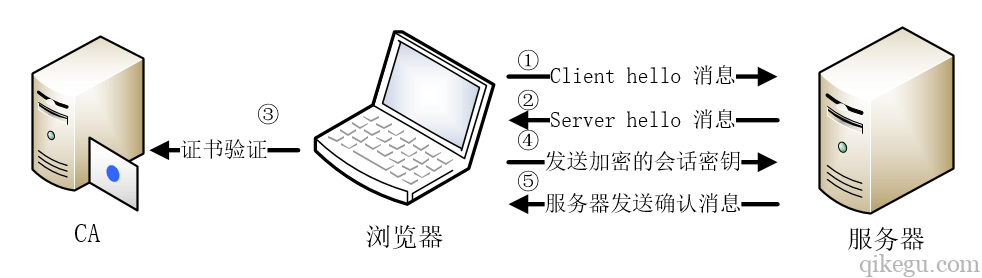

# HTTP

## HTTPS


CSR 即证书签名申请（Certificate Signing Request），获取 SSL 证书（crt），需要先生成 CSR 文件，CSR 包含了公钥和标识名称（Distinguished Name），将CSR提交给证书颁发机构（CA），CA会用自己私钥签名生成crt证书返回。

CRT中包含了key对应的公钥，将crt丢给client使用。

自签的情况：用自己的私钥key和自己的CSR，签名生成crt文件，而不再是提交给CA来生成CSR了。


key,crt,服务器的私钥和包含公钥的SSL证书，建立ssl连接，返回SSL证书给client。client用公钥（CA的公钥，或者key自签人的公钥）解密crt。




## HTTP

request headers

```
Accept: application/json
Accept-Encoding: gzip
```

response headers:

```
Content-Type: application/json
```

```
Content-Type: application/x-www-form-urlencoded ： 
<form encType="">中默认的encType，form表单数据被编码为key/value格式发送到服务器（表单默认的提交数据的格式）

multipart/form-data ： 需要在表单中进行文件上传时，就需要使用该格式
```

