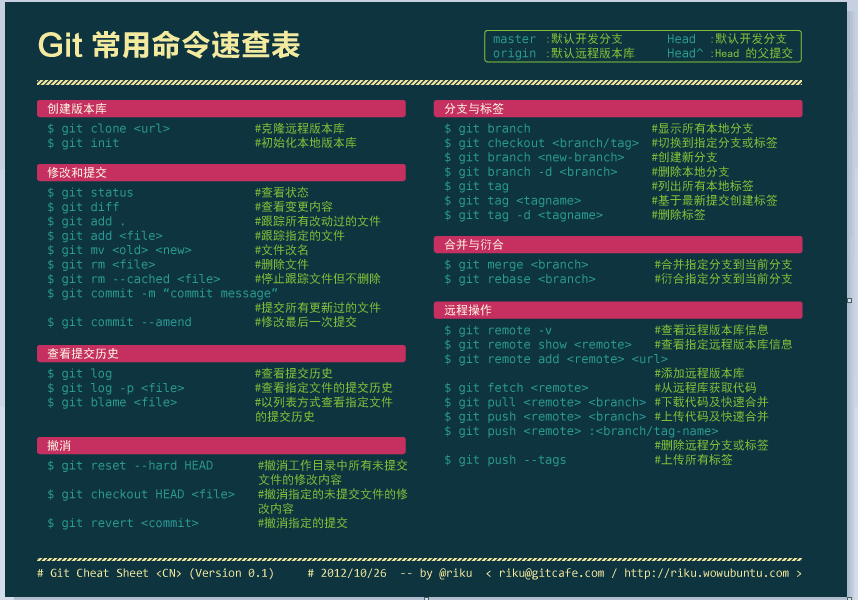
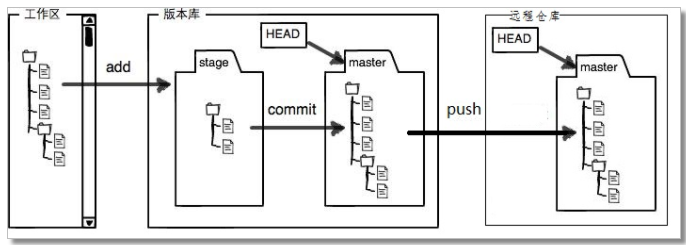
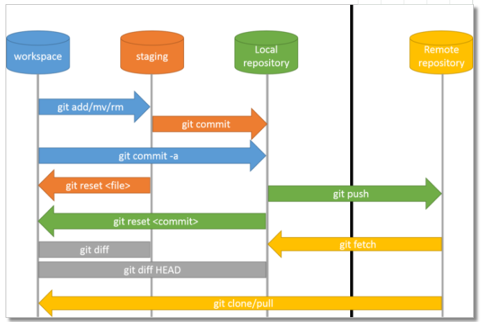
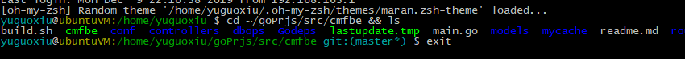

# 原理图

日常工作过程



- **工作区workspace** ，逻辑上是本地计算机，还没添加到repository的状态；
- **版本库-staging** 即图中的stage，是暂存区。修改已经添加进repository，但还没有作为commit提交，类似于缓存；
- **版本库-Local repository** 即版本库中master那个地方。到这一步才算是成功生成一个新版本；
- **远程仓库Remote repository** 。用来将本地仓库上传到网络，可以用于备份、共享、合作。本文将使用Github作为远程仓库的例子。


完整命令转换图




# 配置git与GitHub账号

```shell
git config --global user.name "lenove computer"
git config --global user.email "xxx@qq.com"

cd ~/.ssh
ssh-keygen -t rsa -C "你的邮箱"
# Enter file in which to save the key (/Users/kingboy/.ssh/id_rsa): 
# 命名私钥，默认是id_rsa
clip < ~/.ssh/id_rsa.pub  //将key复制到剪切板
```

然后上GitHub，【settings】-【SSH and GPG keys】，新建SSH-key


多账号设置

```shell
git config --global --list
# 取消全局用户设置
git config --global --edit
# git config --global --unset user.name

# 启动ssh-agent
eval `ssh-agent -s`
# 添加私钥
ssh-add ~/.ssh/gitlab_id_rsa
```

```
# config
Host github.com 
HostName github.com
User git
IdentityFile ~/.ssh/github_rsa
```

```bash
# 失败打开调试v，查看详情
ssh -Tv git@github.com
```


# 创建仓库

**【推荐】本地没有内容，用clone**

1. 首先GitHub创建Repository，获取SSH码

2. 在想存放目录下，打开bash，`git clone SSH码` 


**本地创建好了仓库，关联到GitHub**

1. 保存本地版本库

```shell
git init
git add -A
git commit -m "update message"
```

2. 关联远程仓库

上GitHub创建远程空Repository，别加任何东西

- 关联仓库， `git remote add origin SSH码`
- 上传local仓库至云端，`git push -u origin master`


# 进阶

版本日志

```shell
git clone -b vx.x url

git status
git diff
git branch -a
git checkout file.java

git branch
git checkout -b new_branch
git push --set-upstream origin feature/suffix_name

# 清理分支
# 先删远程
git push origin --delete feature/xx
# 删本地
git branch -d feature/xx
```


本地仓库不变，只修改远仓

```bash
git push --mirror [new_remote_repository_address]

git remote set-url origin [new_remote_repository_address]
```


- 标签

```shell
# 清理标签
git tag -d v1.0 #local
git push origin --delete v1.0 #远程仓库
git push --tags
git fetch --tags

# 新增
git tag v1.0 # 轻量
git tag -a v1.0 -m "第一次提交" # 附注

git tag
git show v1.0
# 与 git log 输出很像，都是一次commit

# 发现某个版本有bug，在那个tag版本上，开分支
git checkout -b [branchName] [tagName]
git reflog
```


```
git stash -a
git stash list

git stash pop
git stash apply, git stash drop
```


## 问题

.gitignore只能忽略那些原来没有被 track 的文件，如果某些文件已经被纳入了版本管理中，则修改 .gitignore 是无效的。
解决方法是先把本地缓存删除，然后再提交。

```bash
git rm -r --cached dir
git rm --cached file.txt
git rm -rf file.txt 

# 最后本地文件还没有忽略，必杀技
mv file.txt ../; ls
mv ../file.txt .
```


oh-my-zsh





# 开发

```bash
GitCommitLog=`git log --pretty=format:"hash: %h; %cD : %s" -n 1`

```


