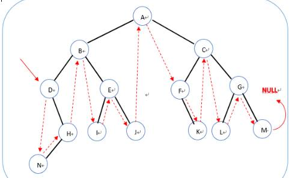
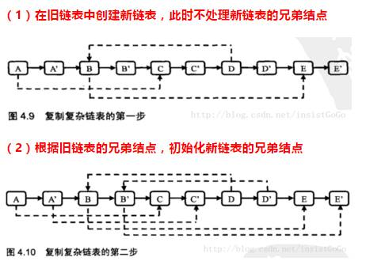
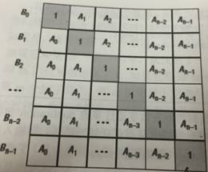

# 树

```
public class TreeNode {
  int val = 0;
  TreeNode left = null;
  TreeNode right = null;
```

 

```
  public TreeNode(int val) {
    this.val = val;
  }
}
```

 

## 63.中遍历，二叉搜索树的第k个结点

给定一颗**二叉搜索树**，请找出其中的第k大的结点。例如， 5 / \ 3 7 /\ /\ 2 4 6 8 中，按结点数值大小顺序第三个结点的值为4。

```
/*中序遍历第K个
**public class `Solution {
  int `count =` `0;
  int `K;
  TreeNode kNode =` null;
```

 

```
  TreeNode KthNode(TreeNode pRoot,` int `k){
    if(k==0)` return null;
    K = k;
    
    KthNode(pRoot);
    return `kNode;
  }
  
  void `KthNode(TreeNode root){
    if(root==null)` return;
    
    KthNode(root.left);
 
    count++;
    if(count==K){
      kNode = root;
      return;
    }
    ` `    
    KthNode(root.right);
  }
```

 

```
}
```

 

 

## 62.先遍历，序列化二叉树*

请实现两个函数，分别用来序列化和反序列化二叉树

**//** **先序遍历**

```
**public class `Solution {
  //返回节点后面的序列化，
  String Serialize(TreeNode root){
    StringBuilder sb =` new `StringBuilder();
    if(root!=null){
      sb.append(root.val+","); ` `//不能 +','，因为返回的是整数
      sb.append(Serialize(root.left));
      sb.append(Serialize(root.right));
    }
    else**
      sb.append("#,");
    
    return `sb.toString();
  }
  
  int index = -**1**;**
  TreeNode Deserialize(String str){
    
    String[] strs = str.split(",");      
    return `Deserialize(strs);
  }
  
  //返回子树根节点
  TreeNode Deserialize(String[] strs){    
    
    index++;
    TreeNode root =` null;
    
    if(!strs[index].equals("#")){
      root =` new `TreeNode(Integer.valueOf(strs[index]));
      root.left = Deserialize(strs);
      root.right = Deserialize(strs);
      
    }
    return `root;
  }
}
```

## 层遍历，从上往下打印二叉树

层序遍历

```
**import `java.util.ArrayList;
**public class `Solution {
  public `ArrayList<Integer> PrintFromTopToBottom(TreeNode root) {
    ArrayList<Integer> list =` new `ArrayList<Integer>();
    if(root==null)
      return `list;
    
    ArrayList<TreeNode> listOfNode =` new `ArrayList<TreeNode>();
    listOfNode.add(root);
    while(!listOfNode.isEmpty()){
      TreeNode temp = listOfNode.remove(0);` `//remove(int index) 返回E,remove(Object o) 返回boolean
      list.add(temp.val);
      if(temp.left!=null) ` `//不加此条件会怎样
        listOfNode.add(temp.left);
      if(temp.right!=null)
        listOfNode.add(temp.right);
    }
    return `list;
  }
  
}
```

 

## 层遍历，把二叉树打印成多行

从上到下按层打印二叉树，同一层结点从左至右输出。每一层输出一行。

```
/*
*/
**import `java.util.ArrayList;
**import `java.util.LinkedList;
```

 

```
//使用队列，在每一层最后加如null作为层区分
**public class `Solution {
  ArrayList<ArrayList<Integer> > Print(TreeNode pRoot) {
```

 

```
    ArrayList<ArrayList<Integer>> list =` new `ArrayList<ArrayList<Integer>>();
    if(pRoot==null)` return `list;
    
    LinkedList<TreeNode> queue =` new `LinkedList<TreeNode>();
    queue.add(pRoot);
    queue.add(null);
    
    while(queue.peek()!=null){
       //每层所有节点放入一个temp
      ArrayList<Integer> temp =` new `ArrayList<Integer>();    
      while(true){
        TreeNode peek = queue.poll();
        if(peek!=null){
          temp.add(peek.val);
          if(peek.left!=null)
            queue.add(peek.left);
          if(peek.right!=null)
            queue.add(peek.right);
        }
        else{
          queue.add(null);
          break;
        }
      }
      
      list.add(temp);
    }
    
    return `list;
  }
}
```

 

 

## 61.递归，按之字形顺序打印二叉树

请实现一个函数按照之字形打印二叉树，即第一行按照从左到右的顺序打印，第二层按照从右至左的顺序打印，第三行按照从左到右的顺序打印，其他行以此类推。

```
**import `java.util.ArrayList;
**import `java.util.Stack;
```

 

```
**public class `Solution {
**public `ArrayList<ArrayList<Integer> > Print(TreeNode pRoot) {
    ArrayList<ArrayList<Integer>> list =` new `ArrayList<ArrayList<Integer>>();
    if(pRoot==null)` return `list;
    
**//**奇数行放入栈s1，偶数行放入S2**
    Stack<TreeNode> s1 =` new `Stack<TreeNode>();
    Stack<TreeNode> s2 =` new `Stack<TreeNode>();
    
    s1.push(pRoot);
    while(!s1.isEmpty() || !s2.isEmpty()){
      ArrayList<Integer> temp1 =` new `ArrayList<Integer>();
      while(!s1.isEmpty()){
        TreeNode peek = s1.pop();
        temp1.add(peek.val);
        if(peek.left!=null)
          s2.add(peek.left);
        if(peek.right!=null)
          s2.add(peek.right);      
      }
      list.add(temp1);
      
      ArrayList<Integer> temp2 =` new `ArrayList<Integer>();
      while(!s2.isEmpty()){
        TreeNode peek = s2.pop();
        temp2.add(peek.val);
        if(peek.right!=null)
          s1.add(peek.right);      
        if(peek.left!=null)
          s1.add(peek.left);
      }
      if(!temp2.isEmpty())
        list.add(temp2);
    }
        
    return `list;
  }
}
```

 

## 59.分治递归，对称的二叉树

请实现一个函数，用来判断一颗二叉树是不是对称的。注意，如果一个二叉树同此二叉树的镜像是同样的，定义其为对称的。

```
**//**遍历的含义：访问所有节点的顺序**
**public class `Solution {
  boolean `isSymmetrical(TreeNode pRoot){
    return `isSymmetrical(pRoot,pRoot);
  }
  
  boolean `isSymmetrical(TreeNode p1,TreeNode p2){    
    if(p1==null `&& p2==null)` return true;
    if(p1==null `|| p2==null)` return false; ` `//递归终点判断
    
    if(p1.val!=p2.val)` return false;
    
//p1先访问左，再访问右，p2反之，然后同层判断是否相等
    return `isSymmetrical(p1.left,p2.right)
      && isSymmetrical(p1.right,p2.left);
  }
}
```

 

 

## 58.查找，二叉树的下一个结点

给定一个二叉树和其中的一个结点，请找出中序遍历顺序的下一个结点并且返回。注意，树中的结点不仅包含左右子结点，同时包含指向父结点的指针。` `

`  ` 

```
  public `TreeLinkNode GetNext(TreeLinkNode pNode){
    if(pNode==null)` return null;
    
    TreeLinkNode next =` null;
    //1.有右孩子
    if(pNode.right!=null){
      next = pNode.right;
      while(next.left!=null){
        next = next.left;
      }
      return `next;
    }
    
    //2.没有右孩子，一直找爸爸，第一个向右拐的长辈（是左孩子）
    next = pNode;
    while(next.next!=null){ 
      if(next==next.next.left)` return `next.next;//是其爸爸的左孩子
      next = next.next; 
    }
    
    //3.找到了根这里，也没找到，则返回空
    return null;
  }
}
```

 

## 后遍历，二叉树的深度*

输入一棵二叉树，求该树的深度。从根结点到叶结点依次经过的结点（含根、叶结点）形成树的一条路径，最长路径的长度为树的深度。

```
//后序，递归TreeDepth，输入当前点，输出节点深度
**public class `Solution {
  public int `TreeDepth(TreeNode root) {
    if(root==null)` return `0;
    
    int `leftSubDepth = TreeDepth(root.left);
    int `rightSubDepth = TreeDepth(root.right);
    
    return `Math.max(leftSubDepth+1,rightSubDepth+1);
  }
}
```

 

## 后遍历，平衡二叉树*

输入一棵二叉树，判断该二叉树是否是平衡二叉树。

 

```
//IsBalanced_Solution，判断当前节点子树是否为平衡树，递归判断每个节点构成子树是否为平衡树
//求节点左右孩子深度时，已经遍历所有孩子，再判断左右孩子是否是平衡子树，则又遍历了剩下孩子，多次遍历
/*
public class Solution {
```

 

```
    public boolean IsBalanced_Solution(TreeNode root) {
      if(root==null) return true;
      
      int leftSubDepth = TreeDepth(root.left);
      int rightSubDepth = TreeDepth(root.right);
      int distanceSubDepth = leftSubDepth - rightSubDepth;
      if(distanceSubDepth>1 || distanceSubDepth<-1) // <-1或者>1 要用或
        return false;
      
      return IsBalanced_Solution(root.left) && IsBalanced_Solution(root.right);
    }
    
  ` `//递归TreeDepth，输入当前节点，输出节点深度
  public int TreeDepth(TreeNode root) {
    if(root==null) return 0;
    
    int leftSubDepth = TreeDepth(root.left);
    int rightSubDepth = TreeDepth(root.right);
    
    return leftSubDepth>rightSubDepth ? (leftSubDepth+1):(rightSubDepth+1);
  }
  
}
*/
```

 

 

```
public class Solution {
```

 

```
  public boolean IsBalanced_Solution(TreeNode root) {
    int[] depth = {0};
    return TreeDepthFromLeaf(root,depth);
  }
  
  //输出该节点子树是否平衡，传入数组，递归得到当前借点到叶子的深度。
  //后序遍历，带记录的遍历**
  //每个节点都有对应的一个数组保存它的深度
  public boolean TreeDepthFromLeaf(TreeNode root,int[] depth) {
    if(root==null){
      depth[0] = 0;
      return true;
    }
    
    int[] left = {0};
    int[] right = {0};
   boolean flag = TreeDepthFromLeaf(root.left,left) && TreeDepthFromLeaf(root.right,right);
    if(flag ){
      int distance = left[0] - right[0];
      if(distance<=1 && distance>=-1){ //注意，-1<= distance <=1，要用并
        depth[0] = left[0]>right[0] ? (left[0]+1):(right[0]+1);
        return true;
      }
    }
    
    return false;
  }
}
```

 

```
/*后序优化
public class Solution {
  public boolean IsBalanced_Solution(TreeNode root) {
    return getDepth(root) != -1;
  }
   
  private int getDepth(TreeNode root) {
    if (root == null) {
      return 0;
    }
    int leftHeight = getDepth(root.left);
    if (leftHeight == -1) {
      return -1;
    }
    int rightHeight = getDepth(root.right);
    if (rightHeight == -1) {
      return -1;
    }
    return Math.abs(leftHeight - rightHeight) > 1 ? -1 : 1 + Math.max(leftHeight, rightHeight);
  }
}
```

 

```
*/
```

## 中遍历，二叉搜索树与双向链表

输入一棵二叉搜索树，将该二叉搜索树转换成一个排序的双向链表。要求不能创建任何新的结点，只能调整树中结点指针的指向。

 

```
**public class `Solution {
  
  //用两个类变量保存头，和刚加入的节点
  TreeNode nowNode =` null;
  TreeNode head =` null;
  
  public `TreeNode Convert(TreeNode pRootOfTree) {
    inOrderTraversal(pRootOfTree);
    return `head;
  }
  
  //中序遍历，但操作不在为打印，而是将当前节点加入链表
  public void `inOrderTraversal(TreeNode root){
    if(root ==` null)` return;
    
    inOrderTraversal(root.left);
    
    if(head ==` null){
      head = root;
      nowNode = root;
    }else{
      nowNode.right = root;
      root.left = nowNode;
      nowNode = root;
    }
    
    inOrderTraversal(root.right);
  }
}
```

 

## 先遍历，二叉树中和为K的路径

输入一颗二叉树和一个整数，打印出二叉树中结点值的和为输入整数的所有路径。路径定义为从树的根结点开始往下一直到叶结点所经过的结点形成一条路径。（先序）

```
**import `java.util.ArrayList;
**public class `Solution {  ` `  
**public `ArrayList<ArrayList<Integer>> FindPath(TreeNode root,int `target) {
 
    ArrayList<ArrayList<Integer>> listAll =` new `ArrayList<ArrayList<Integer>>();    
    if(root==null)` return `listAll;
    
    ArrayList<Integer> list =` new `ArrayList<Integer>();
    find(listAll,list,root,target);    
  
    return `listAll;
  }
```

 

```
  public void `find(ArrayList<ArrayList<Integer>> listAll,ArrayList<Integer> list,TreeNode root,int `target){
    list.add(root.val);
    if(root.left==null `&& root.right==null){
      if(root.val==target)
        listAll.add(list);
      return;
    }
         
    ArrayList<Integer> newList =` new `ArrayList<Integer>(list);` `//要开始分支了，新建一个list保存另一边的节点
    
    if(root.left!=null) find(listAll,list,  root.left, target-root.val); 
    if(root.right!=null) find(listAll,newList,root.right,target-root.val); 
  }
  
}
```

 

## 分治递归，判断二叉搜索树的后序遍历序列

输入一个整数数组，判断该数组是不是某**二叉搜索树**的后序遍历的结果。如果是则输出Yes,否则输出No。假设输入的数组的任意两个数字都互不相同。

```
**public class `Solution {
  public boolean `VerifySquenceOfBST(int `[] sequence) {
    if(sequence.length==0)` return false;
    return `VerifySquenceOfBST(sequence,0,sequence.length-1);
  }
  
  public boolean `VerifySquenceOfBST(int[] sequence,int `lo,int `hi){
    if(lo >= hi)` return true;
```

 

```
    int `lo2 = lo;
    for(int `i=lo;i<=hi;i++){
      if(sequence[i] >= sequence[hi]){
        lo2 = i;
        break;
      }
    }
    for(int `i=lo2+1;i<hi;i++){
      if(sequence[i] < sequence[hi])` return false;
    }
    return `VerifySquenceOfBST(sequence,lo,lo2-1) && VerifySquenceOfBST(sequence,lo2,hi-1);
  }
  
}
```

## 分治递归，二叉树的镜像

操作给定的二叉树，将其变换为源二叉树的镜像。

```
**public class `Solution {
  public void `Mirror(TreeNode root) {
    if(root==null)` return;
    if(root.left!=null `|| root.right!=null){
      TreeNode temp = root.left;
      root.left = root.right;
      root.right = temp;
      Mirror(root.left);
      Mirror(root.right);
    }
  }
}
```

## 分治递归，树的子结构

输入两棵二叉树A，B，判断B是不是A的子结构。（ps：我们约定空树不是任意一个树的子结构）

```
**public class `Solution {
  public boolean `HasSubtree(TreeNode root1,TreeNode root2) {
    if(root2==null `|| root1==null)` return false;
    boolean `result =` false;
    
    if(root1.val==root2.val)
      result = tree1HasTree2(root1,root2);
    if(!result)
      result = HasSubtree(root1.left,root2);
    if(!result)
      result = HasSubtree(root1.right,root2);
    return `result;
  }
  
  public boolean `tree1HasTree2(TreeNode root1,TreeNode root2){
    if(root2==null)` return true;
    if(root1==null)` return false;
    if(root1.val != root2.val)` return false;
    return `tree1HasTree2(root1.left,root2.left) && tree1HasTree2(root1.right,root2.right);
     
  }
}
```

## 分治递归，重建二叉树*

输入某二叉树的前序遍历和中序遍历的结果，请重建出该二叉树。假设输入的前序遍历和中序遍历的结果中都不含重复的数字。例如输入前序遍历序列{1,2,4,7,3,5,6,8}和中序遍历序列{4,7,2,1,5,3,8,6}，则重建二叉树并返回。

```
**public class `Solution {
  public `TreeNode reConstructBinaryTree(int `[] pre,int `[] in) {
    return `reConstructBinaryTree(pre,0,pre.length-1,in,0,in.length-1);
  }
  
  public `TreeNode reConstructBinaryTree(int[] pre,int `preStart,int `preEnd,int[] in,int `inStart,int `inEnd){
    if(preStart>preEnd || inStart>inEnd)
      return null;
    
    TreeNode root =` new `TreeNode(pre[preStart]);
    int `i =` `0;
    for(i=inStart;i<=inEnd;i++){
      if(root.val == in[i])
        break;
    }
    root.left = reConstructBinaryTree(pre,preStart+1,preStart+i-inStart,in,inStart,i-1);
    root.right = reConstructBinaryTree(pre,preStart+i-inStart+1,preEnd,in,i+1,inEnd);
    return `root;
  }
}
```

 

# 栈

## 栈的压入、弹出序列

输入两个整数序列，第一个序列表示栈的压入顺序，请判断第二个序列是否为该栈的弹出顺序。假设压入栈的所有数字均不相等。例如序列1,2,3,4,5是某栈的压入顺序，序列4，5,3,2,1是该压栈序列对应的一个弹出序列，但4,3,5,1,2就不可能是该压栈序列的弹出序列。（注意：这两个序列的长度是相等的）

```
**import `java.util.ArrayList;
**import `java.util.Stack;
```

 

```
**public class `Solution {
  public boolean `IsPopOrder(int `[] pushA,int `[] popA) {
    Stack<Integer> stack =` new `Stack<Integer>();
    int `cursor =` `0;
    for(int `i=0;i<pushA.length;i++){
      if(pushA[i]==popA[cursor]){
        cursor++;
        continue;
      }
      stack.push(pushA[i]);
    }
    while(!stack.empty()){
      if(stack.pop()!=popA[cursor])` return false;
      cursor++;
    }
    return true;
    
  }
}
```

## 包含min函数的栈

定义栈的数据结构，请在该类型中实现一个能够得到栈最小元素的min函数。

```
**import `java.util.Stack;
```

 

```
**public class `Solution {
```

 

```
  Stack<Integer> stack =` new `Stack<Integer>();
  Stack<Integer> minTable =` new `Stack<Integer>();
  public void `push(int `node) {
    stack.push(node);
    
    if(!minTable.empty()){
      int `nextMin = minTable.peek();
      nextMin = node < nextMin ? node:nextMin;
      minTable.push(nextMin);
    }else `minTable.push(node);
    
  }
  
  public void `pop() {
    if(stack.empty())` return;
    stack.pop();
    minTable.pop();
  }
  
  public int `top() {
    if(stack.empty())` return `0;
    return `stack.peek();
  }
  
  public int `min() {
    return `minTable.peek();
  }
}
```

 

 

 

 

## 用两个栈实现队列

用两个栈来实现一个队列，完成队列的Push和Pop操作。 队列中的元素为int类型。

```
**import `java.util.Stack;
```

 

```
**public class `Solution {
  Stack<Integer> in =` new `Stack<Integer>();
  Stack<Integer> out =` new `Stack<Integer>();
  
  public void `push(int `node) {
    in.push(node);
  }
  
  public int `pop() {
    //if(stack1.empty() && stack2.empty())
      //throw new RuntimeExpection("空队列不支持删除！");
    if(out.empty()){
      while(!in.empty()){
        out.push(in.pop());
      }
    }
    return `out.pop();
  }
}
```

## 从尾到头打印链表

输入一个链表，从尾到头打印链表每个节点的值。

```
**import `java.util.ArrayList;
**import `java.util.Stack;
**public class `Solution {
  public `ArrayList<Integer> printListFromTailToHead(ListNode listNode) {
    Stack<Integer> stack =` new `Stack<Integer>();
    ArrayList<Integer> list =` new `ArrayList<Integer>();
```

 

```
    while(null!= listNode){
      stack.push(listNode.val);
      listNode = listNode.next;
    }
    while(!stack.empty())
      list.add(stack.pop());
    return `list;
  }
}
```

 

# 链表

## 57.删除链表中重复的结点

在一个排序的链表中，存在重复的结点，请删除该链表中重复的结点，重复的结点不保留，返回链表头指针。 例如，链表1->2->3->3->4->4->5 处理后为 1->2->5

 

```
**public class `Solution {
  public `ListNode deleteDuplication(ListNode pHead){
    
    ListNode nowNode = pHead;
    ListNode preNode =` null;
    
    while(nowNode!=null){
      ListNode nextNode = nowNode.next;
      
      if(nextNode!=null `&& nowNode.val==nextNode.val){
        do{
          nextNode = nextNode.next;
        }while(nextNode!=null `&& nextNode.val==nowNode.val);
        
        nowNode = nextNode;
        if(preNode==null) pHead = nowNode;
        else `preNode.next = nowNode;
        
      }else{
        preNode = nowNode;
        nowNode = nowNode.next;
      }
    }
        
    return `pHead;
  }
  
//  //递归调用，返回删除重复后的头
//  public ListNode deleteDuplication(ListNode pHead){
//   if(pHead==null || pHead.next==null) return pHead;
//   
//   ListNode nextNode = pHead.next;
//   if(pHead.val==nextNode.val){
//     do{
//       nextNode = nextNode.next;
//     }while(nextNode!=null && nextNode.val==pHead.val);
//     return deleteDuplication(nextNode);
//   }else{
//     pHead.next = deleteDuplication(nextNode);
//     return pHead;
//   }
//  }
}
```

 

## 56.链表中环的入口结点*

一个链表中包含环，请找出该链表的环的入口结点。

```
**public class `Solution {
  
// 
//  public ListNode EntryNodeOfLoop(ListNode pHead){
//
//    ListNode p1 = pHead;
//    ListNode p2 = pHead;
//   while(p1!=null && p2.next!=null){
//     p1 = p1.next;
//     p2 = p2.next.next;
//     
//     if(p1==p2){
//       p1 = pHead;
//       while(p1!=p2){
//         p1 = p1.next;
//         p2 = p2.next;
//       }
//       return p1;
//     }
//   }
//   
//   return null;
//  }
```

 

```
  public `ListNode EntryNodeOfLoop(ListNode pHead){
    
```

`    ` //找到环中一点，然后测出环大小

```
    ListNode meetingNode = meetingInLoop(pHead);
    ListNode p1 = meetingNode;
    if(p1==null)` return null;
    
    int `loopSize =` `1;
    
    while(p1.next!=meetingNode){
      loopSize++;
      p1 = p1.next;
      
    }
 
     //先走出一个环的大小
    p1 = pHead;
    for(int `i=0;i<loopSize;i++)
      p1 = p1.next;
    
    ListNode p2 = pHead;
    while(p1!=p2){
      p1 = p1.next;
      p2 = p2.next;
    }
    return `p2;
  }
  
  public `ListNode meetingInLoop(ListNode pHead){
```

 

```
    ListNode p1 = pHead;
    ListNode p2 = pHead;
    
    while(p1!=null `&& p2.next!=null){
      p1 = p1.next;
      p2 = p2.next.next;
      
      if(p1==p2)` return `p1;
    }
    
    return null;
  }
}
```

 

## 两个链表的第一个公共结点

输入两个链表，找出它们的第一个公共结点。

```
//公共节点意味着后面节点也一致，不仅值相同，而且指向的节点也一致，遍历测量长度
**public class `Solution {
  public `ListNode FindFirstCommonNode(ListNode pHead1, ListNode pHead2) {
    if(pHead1==null `|| pHead2==null)` return null;
    
    int `num1 =` `1;
    int `num2 =` `1;
    ListNode nowNode = pHead1;
    while(true){
      nowNode = nowNode.next;
      if(nowNode!=null) num1++;
      else break;
    }
    nowNode = pHead2;
    while(true){
      nowNode = nowNode.next;
      if(nowNode!=null) num2++;
      else break;
    }
    
    if(num1>=num2){
      int `fasterStep = num1 - num2;
      for(int `i=0;i<fasterStep;i++)
        pHead1 = pHead1.next;
    }else{
      int `fasterStep = num2 - num1;
      for(int `i=0;i<fasterStep;i++)
        pHead2 = pHead2.next;
    }
    while(pHead1!=null){
      if(pHead1==pHead2)` return `pHead1;
      pHead1 = pHead1.next;
      pHead2 = pHead2.next;
    }
    
    return null;
  }
}
```

 

## 复杂链表的复制

输入一个复杂链表（每个节点中有节点值，以及两个指针，一个指向下一个节点，另一个特殊指针指向任意一个节点），返回结果为复制后复杂链表的head。（注意，输出结果中请不要返回参数中的节点引用，否则判题程序会直接返回空）



 

```
**public class `Solution {
  public `RandomListNode Clone(RandomListNode pHead){
    if(pHead==null)` return null;
    RandomListNode nowNode = pHead;
    
    //复制节点 A-B-C 变成 A-A'-B-B'-C-C'
    while(nowNode!=null){
      RandomListNode copyNode =` new `RandomListNode(nowNode.label);
      copyNode.next = nowNode.next;
      nowNode.next = copyNode;
      nowNode = copyNode.next;
    }
    
    //复制rondom
    nowNode = pHead;
    while(nowNode !=` null){
      if(nowNode.random!=null)  ` `//不加这个判断，空指针异常，null没有 .next属性
       nowNode.next.random = nowNode.random.next;
      nowNode = nowNode.next.next;
    }
    
```

​    //拆分

```
    RandomListNode pHead2 = pHead.next;
    nowNode = pHead2;
    RandomListNode preNode = pHead;
    while(nowNode!=null){
      preNode.next = nowNode.next;
      if(nowNode.next!=null)
        nowNode.next = nowNode.next.next;
      
      nowNode = nowNode.next;
      preNode = preNode.next;
    }
    
    return `pHead2;
  }
```

 

```
}
```

 

## 合并两个排序的链表

输入两个单调递增的链表，输出两个链表合成后的链表，当然我们需要合成后的链表满足单调不减规则。

```
**public class `Solution {
  public `ListNode Merge(ListNode list1,ListNode list2) {
    //递归实现,合并产生新链表
    if(list1==null){
      return `list2;
    }else if(list2==null)` return `list1;
    
    ListNode mergeNode =` null;
    if(list1.val<list2.val){
      mergeNode = list1;
      mergeNode.next = Merge(list1.next,list2);
    }else{
      mergeNode = list2;
      mergeNode.next = Merge(list1,list2.next);
    }
    return `mergeNode;
  }
}
```

## 反转链表

输入一个链表，反转链表后，输出链表的所有元素。

```
**public class `Solution {
  public `ListNode ReverseList(ListNode head) {
    ListNode pre =` null,root =` null;
    ListNode now = head;
    
    while(now!=null){
      ListNode temp = now.next;
      if(temp==null) root = now;
      now.next = pre;
      pre = now;
      now = temp;
    }
    return `root;
  }
}
```

 

## 链表中倒数第k个结点

输入一个链表，输出该链表中倒数第k个结点。

```
**public class `Solution {
  public `ListNode FindKthToTail(ListNode head,int `k) {
    if(head ==` null||k<=0)` return null;
    ListNode edNode = head;
    ListNode nowNode = head;
    
    for(int `i=1;i<k;i++){
      edNode = edNode.next;
      if(edNode==null)` return null;
    }
    
    while(edNode.next!=null){
      edNode = edNode.next;
      nowNode = nowNode.next;
    }
    return `nowNode;
  }
}
```

 

 

 

# 数组

## 顺时针打印矩阵

输入一个矩阵，按照从外向里以顺时针的顺序依次打印出每一个数字，例如，如果输入如下矩阵： 1 2 3 4 5 6 7 8 9 10 11 12 13 14 15 16 则依次打印出数字1,2,3,4,8,12,16,15,14,13,9,5,6,7,11,10.

```
**import `java.util.ArrayList;
**public class `Solution {
  public `ArrayList<Integer> printMatrix(int `[][] matrix) {
```

 

```
    int `X = matrix.length-1;
    int `Y = matrix[0].length-1;
```

 

```
    ArrayList<Integer> list =` new `ArrayList<Integer>();
    
```

​    //循环终止条件

```
    for(int `count=0;(2*count<X+1) && (2*count<Y+1);count++){
      printCircle(matrix,X,Y,list,count);
    }
    
    return `list;
  }
  
  public void `printCircle(int[][] matrix,int `X,int `Y,ArrayList list,int `count){
```

 

```
    for(int `i=count;i<=Y-count;i++)
      list.add(matrix[count][i]);
    
    for(int `i=count+1;i<=X-count;i++)
      list.add(matrix[i][Y-count]);
    
    if(count<X-count){
      for(int `i=Y-count-1;i>=count;i--)
        list.add(matrix[X-count][i]);
    }
    
    if(count<Y-count){
      for(int `i=X-count-1;i>=count+1;i--)
      list.add(matrix[i][count]);
    }
  }
```

 

```
}
```

 

## 调整数组顺序使奇数位于偶数前面

输入一个整数数组，实现一个函数来调整该数组中数字的顺序，使得所有的奇数位于数组的前半部分，所有的偶数位于位于数组的后半部分，并保证奇数和奇数，偶数和偶数之间的相对位置不变。

```
**public class `Solution {
  public void `reOrderArray(int `[] array) {
//    int st = 0,ed = array.length-1;
//    while(st<ed){
//      while((array[st]&1)==1) st++;
//      while((array[ed]&1)==0) ed--;
//      if(st<ed){
//        int temp = array[st];
//        array[st] = array[ed];
//        array[ed] = temp;
//      }    
//    }
//   
//上面为教材试题，不要求相对位置不变    
    int[] copy =` new int[array.length];
    int `numOfodd =` `0;
    for(int `i=0;i<array.length;i++){
      if((array[i]&1)==1){
        copy[numOfodd] = array[i];
        numOfodd++;
      }
    }
    for(int `i=0;i<array.length;i++){
      if((array[i]&1)==0){
        copy[numOfodd] = array[i];
        numOfodd++;
      }
      array[i] = copy[i];
    }
  }
}
```

# 队列

## 65.滑动窗口的最大值*

给定一个数组和滑动窗口的大小，找出所有滑动窗口里数值的最大值。例如，如果输入数组{2,3,4,2,6,2,5,1}及滑动窗口的大小3，那么一共存在6个滑动窗口，他们的最大值分别为{4,4,6,6,6,5}； 针对数组{2,3,4,2,6,2,5,1}的滑动窗口有以下6个： {[2,3,4],2,6,2,5,1}， {2,[3,4,2],6,2,5,1}， {2,3,[4,2,6],2,5,1}， {2,3,4,[2,6,2],5,1}， {2,3,4,2,[6,2,5],1}， {2,3,4,2,6,[2,5,1]}。

 

```
/**
 * 题目：滑动窗口的最大值
 * 思路：滑动窗口应当是队列，但为了得到滑动窗口的最大值，队列序可以从两端删除元素，因此使用双端队列。
 *   原则：
队列的第一个元素是滑动窗口中的最大值，保证前面的比后面大，若最大出站，则老二即位
```

 

```
 *   对新来的元素k
 *   1）把比k小的，直接移出队列（因为不再可能成为后面滑动窗口的最大值了!）
 *   2）k没有前面的大，有可能是老二直接加入，如何判断老大出窗口了没？队列记录下标，可以用当前入窗口的下标与老大下标之差，计算老大还在没 
 */
**import `java.util.ArrayList;
**import `java.util.LinkedList;
**public class `Solution {
  public `ArrayList<Integer> maxInWindows(int `[] num,` int `size){
    ArrayList<Integer> list =` new `ArrayList<Integer>();
    if(size>num.length || num==null `|| size<1)` return `list;
    
    LinkedList<Integer> deque =` new `LinkedList<Integer>();
    //初始化
    for(int `i=0;i<size;i++){
```

`      //删除所有比刚进入小的元素，保证老大、老二排排坐`

```
      while(!deque.isEmpty() && num[i]>num[deque.getLast()]){
        deque.removeLast();
      }
      deque.add(i);
    }
    list.add(num[deque.getFirst()]);
    
    for(int `i=size;i<num.length;i++){
      while(!deque.isEmpty() && num[i]>num[deque.getLast()] ){
        deque.removeLast();
      }
      deque.add(i);
      if(i-deque.getFirst()+1` `> size)
        deque.removeFirst();
      
      list.add(num[deque.getFirst()]);
    }
    
    return `list;    
  }
}
```

 

 

# 堆查找

## 64.     数据集的中位数

如何得到一个数据集的中位数？如果从数据流中读出奇数个数值，那么中位数就是所有数值排序之后位于中间的数值。如果从数据流中读出偶数个数值，那么中位数就是所有数值排序之后中间两个数的平均值。

```
**import `java.util.Comparator;
**import `java.util.PriorityQueue;
```

 

```
**public class `Solution {
  
  PriorityQueue<Integer> minHeap =` new `PriorityQueue<Integer>();
  PriorityQueue<Integer> maxHeap =` new `PriorityQueue<Integer>(11,new `Comparator<Integer>(){
    public int `compare(Integer o1, Integer o2) {
      return `o2.compareTo(o1);
    }
  });
  
  
  public void `Insert(Integer num){
    if(num==null)` return;   
```

 

```
    //**加入时的操作保证了后半部分最小不会小于前半部分所有**
    if((maxHeap.size()+minHeap.size())%2==0){
      //**偶数加入后半部分的最小堆，之前先加入前半部分滚一下，保证后半部分最小不会小于前半部分所有**
      maxHeap.offer(num);
      minHeap.offer(maxHeap.poll());           
    }
    else{
      //奇数加入
      minHeap.offer(num);
      maxHeap.offer(minHeap.poll());
    }
  }
```

 

```
  public `Double GetMedian() {   
    if((maxHeap.size()+minHeap.size())%2==0){
```

 

```
      return `(double)(minHeap.peek()+maxHeap.peek())/2;           
    }
    else{
      return `(double)minHeap.peek();
    }
  }
}
```

 

## 最小的K个数

输入n个整数，找出其中最小的K个数。例如输入4,5,1,6,2,7,3,8这8个数字，则最小的4个数字是1,2,3,4,。

```
**import `java.util.ArrayList;
**import `java.util.PriorityQueue;
**import `java.util.Comparator;
```

 

```
**public class `Solution {
  /*public ArrayList<Integer> GetLeastNumbers_Solution(int [] input, int k) {
```

 

```
    ArrayList<Integer> list = new ArrayList<Integer>();
    if(input.length<k) return list;
```

`    ` //快排思想

```
    int start = 0,end = input.length-1;
    int location = 0;
    while(location != k-1){
      location = partition(input,start,end);
      if(location > k-1) end = location-1;
      else if(location < k-1) start = location+1;
    }
    
    
    for(int i=0;i<k;i++){
      list.add(input[i]);
    }
        
    return list;
  }
  
  public int partition(int[] array,int lo,int hi){
    if(lo>=hi) return lo;
    int v = array[lo];
    int i = lo,j = hi+1;
    
    while(true){
      while(array[++i]<v) if(i==hi) break;
      while(array[--j]>v) if(j==lo) break;
      if(i>=j) break;
      int temp = array[i];
      array[i] = array[j];
      array[j] = temp;
    }
    int temp = array[j];
    array[j] = array[lo];
    array[lo] = temp;
    return j;
  }*/
  
  /*冒泡
  public ArrayList<Integer> GetLeastNumbers_Solution(int [] input, int k) {
    ArrayList<Integer> list = new ArrayList<Integer>();
    if(input.length<k) return list;
    
    for(int i=0;i<k;i++){
      for(int j=input.length-1;j>=i+1;j--){
        if(input[j]<input[j-1]){
          int temp = input[j];
          input[j] = input[j-1];
          input[j-1] = temp;
        }
      }
      list.add(input[i]);
    }
    
    return list;
  }*/
  
  public `ArrayList<Integer> GetLeastNumbers_Solution(int `[] input,` int `k) {
    ArrayList<Integer> list =` new `ArrayList<Integer>();
    if(input.length<k || k<=0)` return `list;
    
    PriorityQueue<Integer> maxHeap =` new `PriorityQueue<Integer>(k,new `Comparator<Integer>(){
      public int `compare(Integer a1,Integer a2){
        return `a2.compareTo(a1);
      }     
    });
    
    for(int `i=0;i<input.length;i++){
      if(maxHeap.size()!=k) maxHeap.offer(input[i]);
      else if(maxHeap.peek()>input[i]){
        maxHeap.poll();
        maxHeap.offer(input[i]);
      }
    }
    for(int `a:maxHeap)
      list.add(a);
    return `list;
  }
  ` `  ` ` 
}
```

 

 

 

 

# 查找

## 第一个只出现一次的字符

在一个字符串(1<=字符串长度<=10000，全部由字母组成)中找到第一个只出现一次的字符,并返回它的位置

```
**public class `Solution {
  public int `FirstNotRepeatingChar(String str) {
    char[] chars = str.toCharArray();
    int[] table =` new int[256];
    
    for(int `i=0;i<chars.length;i++) table[chars[i]]++;
    for(int `i=0;i<chars.length;i++)
      if(table[chars[i]]==1)` return `i;
    
    return `-1;
  }
}` `//采用ASCII作为映射key，对应数组下标
```

 

```
//import java.util.HashMap;
//public class Solution {
// public int FirstNotRepeatingChar(String str) {
//   HashMap <Character, Integer> map = new HashMap<Character, Integer>();
//   
//   for(int i=0;i<str.length();i++){
//     if(map.containsKey(str.charAt(i))){
//       int time = map.get(str.charAt(i));
//       map.put(str.charAt(i), ++time);
//     }
//     else {
//       map.put(str.charAt(i), 1);
//     }
//   }
//   for(int i=0;i<str.length();i++){
//     char c = str.charAt(i);
//     if (map.get(c) == 1) {
//       return i;
//     }
//   }
//   return -1;
// }
//}
```

 

 

## 55. 字符流中第一个不重复的字符

请实现一个函数用来找出字符流中第一个只出现一次的字符。例如，当从字符流中只读出前两个字符"go"时，第一个只出现一次的字符是"g"。当从该字符流中读出前六个字符“google"时，第一个只出现一次的字符是"l"。

```
**import `java.util.ArrayList;
**import `java.util.HashMap;
```

 

```
**public class `Solution {
  
```

   `//计数表`

```
  int[] table =` new int[256];
// HashMap<Character,Integer> map = new HashMap<Character,Integer>();
  
  ArrayList<Character> list =` new `ArrayList<Character>();
  //HashSet
  
  public void `Insert(char `ch){
    list.add(ch);
    table[ch]++;
    
//   if(map.containsKey(ch))
//     map.put(ch, map.get(ch)+1);
//   else
//     map.put(ch,1);
    
  }
  
  public char `FirstAppearingOnce(){
```

 

```
    for(char `ch:list){
      if(table[ch]==1)
        return `ch;
    }   
    return `'#';
  }
}
```

 

 

 

## 51.数组中重复的数字

在一个长度为n的数组里的所有数字都在0到n-1的范围内。 数组中某些数字是重复的，但不知道有几个数字是重复的。也不知道每个数字重复几次。请找出数组中任意一个重复的数字。 例如，如果输入长度为7的数组{2,3,1,0,2,5,3}，那么对应的输出是第一个重复的数字2。

```
**public class `Solution {
  ` //空间换时间，找到的数放入`duplication，length为范围
  public boolean `duplicate(int `numbers[],` int `length,` int[] duplication) {
    //duplication[0] = -1;
    //if(numbers.length!=length || numbers==null || length==0) return false;
```

 

```
    //boolean理论上1bit，实际用一个字节表示，boolean数组比int数组更省空间
    boolean[] table =` new boolean[length];
    for(int `i=0;i<length;i++){
      if(table[numbers[i]]){
        duplication[0] = numbers[i];
        return true;
      }
      table[numbers[i]] =` true;
    }
    return false;
  }
  
```

//时间换空间

```
// public boolean duplicate(int numbers[], int length, int[] duplication) {
//   if(numbers.length!=length) return false;
//   //boolean理论上1bit，实际用一个字节表示，boolean数组比int数组更省空间
//
//   for(int i=0;i<length;i++){
//     while(numbers[i]!=i){
//       if(numbers[i]==numbers[numbers[i]]){
//         duplication[0] = numbers[i];
//         return true;
//       }
//       int temp = numbers[i];
//       numbers[i] = numbers[numbers[i]];
//       numbers[numbers[i]] = temp;
//     }
//   }
//   return false;
// }
  
  
}
```

 

 

 

##  和为S的连续正数序列

小明很喜欢数学,有一天他在做数学作业时,要求计算出9~16的和,他马上就写出了正确答案是100。但是他并不满足于此,他在想究竟有多少种连续的正数序列的和为100(至少包括两个数)。没多久,他就得到另一组连续正数和为100的序列:18,19,20,21,22。现在把问题交给你,你能不能也很快的找出所有和为S的连续正数序列? Good Luck!

```
//双指针，对两个指针之间的数求和
**import `java.util.ArrayList;
**public class `Solution {
  public `ArrayList<ArrayList<Integer> > FindContinuousSequence(int `sum) {
    ArrayList<ArrayList<Integer>> listAll =` new `ArrayList<ArrayList<Integer>>();
    if(sum<3)` return `listAll;
    
    for(int `i=1,j =` `2;i<j;){
      int `result = (i+j)*(j-i+1)>>1;
      if(result<sum) j++;
      else if(result>sum) i++;
      else{
        ArrayList<Integer> list =` new `ArrayList<Integer>();
        for(int `k=i;k<=j;k++)
          list.add(k);
        listAll.add(list);
        i++;j++;
      }
    }
      
    return `listAll;
  }
}
```

## 和为S的两个数字

输入一个递增**排序的数组**和一个数字S，在数组中查找两个数，是的他们的和正好是S，如果有多对数字的和等于S，输出两个数的乘积最小的

```
**import `java.util.ArrayList;
**public class `Solution {
  public `ArrayList<Integer> FindNumbersWithSum(int `[] array,int `sum) {
    ArrayList<Integer> list =` new `ArrayList<Integer>();
    if(array.length<2)` return `list;
    
```

//重两头开始找

```
    int `lo,hi;
    lo =` `0;
    hi = array.length -` `1;   
    while(lo<hi){
      if(array[lo]+array[hi]==sum){
        list.add(array[lo]);
        list.add(array[hi]);
        return `list;
      }else if(array[lo]+array[hi]>sum){
        hi--;
      }else `lo++;
    }
        
    return `list;
  }
}
```

 

 

## 数字在排序数组中出现的次数

统计一个数字在**排序**数组中出现的次数。

 

```
//查找问题，排序数组,二分查找到边界的K
**public class `Solution {
  public int `GetNumberOfK(int `[] array ,` int `k) {
    if(array==null)` return `-1;
    
    int `first = findFirstK(array,k,0,array.length-1);
    int `last = findLastK(array,k,first,array.length-1);
    if(last!=-1` `&& first!=-1)
      return `last - first +1;
    return `0;
  }
  
  public int `findFirstK(int[] array,int `k,int `lo,int `hi){
    if(lo>hi)` return `-1;
    
    int `mid = (lo+hi)>>1;
    if(array[mid]==k){
      if(mid==0` `|| (mid>0` `&& array[mid-1]<k))` return `mid;` `//注意 或 运算不短路
      else `hi = mid -` `1;` `//前一个也为K，可以缩短查找区间
    }
    else if(array[mid]>k){
      hi = mid-1;
    }else{
      lo = mid+1;
    }
    return `findFirstK(array,k,lo,hi);
  }
  public int `findLastK(int[] array,int `k,int `lo,int `hi){
    if(lo>hi)` return `-1;
    
    int `mid = (lo+hi)>>1;
    if(array[mid]==k){
      if(mid==array.length-1` `|| (mid<array.length-1` `&& array[mid+1]>k))` return `mid;
      else `lo = mid +` `1;
    }
    else if(array[mid]>k){
      hi = mid-1;
    }else{
      lo = mid+1;
    }
    return `findLastK(array,k,lo,hi);
  }
}
```

 

 

## 连续子数组的最大和

**复习算法笔记专题，最大子数组**

 

```
**public class `Solution {
  public int `FindGreatestSumOfSubArray(int[] array) {
    if(array.length==0)` return `0;
    
    int `startAndSum = array[0];
    int `largest = startAndSum;
    
    for(int `i=1;i<array.length;i++){
      if(startAndSum<=0) startAndSum = array[i];
      else `startAndSum += array[i];
      
      if(startAndSum>largest) largest = startAndSum;
    }   
    return `largest;
  }
}
```

 

## 最小的K个数

输入n个整数，找出其中最小的K个数。例如输入4,5,1,6,2,7,3,8这8个数字，则最小的4个数字是1,2,3,4,。

```
**import `java.util.ArrayList;
**import `java.util.PriorityQueue;
**import `java.util.Comparator;
```

 

```
**public class `Solution {
  /*public ArrayList<Integer> GetLeastNumbers_Solution(int [] input, int k) {
```

 

```
    ArrayList<Integer> list = new ArrayList<Integer>();
    if(input.length<k) return list;
```

`    ` //快排

```
    int start = 0,end = input.length-1;
    int location = 0;
    while(location != k-1){
      location = partition(input,start,end);
      if(location > k-1) end = location-1;
      else if(location < k-1) start = location+1;
    }
    
    
    for(int i=0;i<k;i++){
      list.add(input[i]);
    }
        
    return list;
  }
  
  public int partition(int[] array,int lo,int hi){
    if(lo>=hi) return lo;
    int v = array[lo];
    int i = lo,j = hi+1;
    
    while(true){
      while(array[++i]<v) if(i==hi) break;
      while(array[--j]>v) if(j==lo) break;
      if(i>=j) break;
      int temp = array[i];
      array[i] = array[j];
      array[j] = temp;
    }
    int temp = array[j];
    array[j] = array[lo];
    array[lo] = temp;
    return j;
  }*/
  
  /*冒泡
  public ArrayList<Integer> GetLeastNumbers_Solution(int [] input, int k) {
    ArrayList<Integer> list = new ArrayList<Integer>();
    if(input.length<k) return list;
    
    for(int i=0;i<k;i++){
      for(int j=input.length-1;j>=i+1;j--){
        if(input[j]<input[j-1]){
          int temp = input[j];
          input[j] = input[j-1];
          input[j-1] = temp;
        }
      }
      list.add(input[i]);
    }
    
    return list;
  }*/
  
  public `ArrayList<Integer> GetLeastNumbers_Solution(int `[] input,` int `k) {
    ArrayList<Integer> list =` new `ArrayList<Integer>();
    if(input.length<k || k<=0)` return `list;
    
    PriorityQueue<Integer> maxHeap =` new `PriorityQueue<Integer>(k,new `Comparator<Integer>(){
      
      public int `compare(Integer a1,Integer a2){
        return `a2.compareTo(a1);
      }     
    });
    
    for(int `i=0;i<input.length;i++){
      if(maxHeap.size()!=k) maxHeap.offer(input[i]);
      else if(maxHeap.peek()>input[i]){
        maxHeap.poll();
        maxHeap.offer(input[i]);
      }
    }
    for(int `a:maxHeap)
      list.add(a);
    
    return `list;
  }
  ` `  ` ` 
}
```

 

## 数组中出现次数超过一半的数字

数组中有一个数字出现的次数超过数组长度的一半，请找出这个数字。例如输入一个长度为9的数组{1,2,3,2,2,2,5,4,2}。由于数字2在数组中出现了5次，超过数组长度的一半，因此输出2。如果不存在则输出0。

```
/*
public class Solution {
  public int MoreThanHalfNum_Solution(int [] array) {
    int N = array.length;
    if(N==0) return 0;
    
    int location = 0;
    int start = 0,end = N-1;
    while(location != N/2){
      location = partition(array,start,end);
      if(location<N/2) start = location+1;
      else if(location>N/2) end = location-1;
    }
    int result = array[location],count = 0;
    
    for(int i=0;i<N;i++){
      if(array[i]==result) count++;
      if(count > N/2) return result;
    }
    return 0;
    
    
  }
  
  public int partition(int [] array,int lo,int hi){
    if(lo>=hi) return lo;
    
    int i = lo,j = hi+1;
    int v = array[lo];
    
    while(true){
      while(array[++i]<v) if(i==hi) break;
      while(array[--j]>v) if(j==lo) break;
      if(i>=j) break;
      int temp = array[i];
      array[i] = array[j];
      array[j] = temp;
    }
    int temp = array[j];
    array[j] = array[lo];
    array[lo] = temp;
    return j;
  }
} */
```

 

```
**public class `Solution {
  public int `MoreThanHalfNum_Solution(int `[] array) {
    int `N = array.length;
    
    if(N==0)` return `0;
    int `count =` `1;
    int `winner = array[0];
    for(int `i=1;i<N;i++){
      if(winner!=array[i]) count--;
      else `count++;
      
      if(count==0){
        winner = array[i];
        count =` `1;
      }
    }
    count =` `0;
    for(int `i=0;i<N;i++){
      if(winner==array[i]) count++;
      if(count > N/2)` return `winner;
    }
        
    return `0;
  }
}
```

 

## 旋转数组的最小数字

把一个数组最开始的若干个元素搬到数组的末尾，我们称之为数组的旋转。 输入一个非递减排序的数组的一个旋转，输出旋转数组的最小元素。 例如数组{3,4,5,1,2}为{1,2,3,4,5}的一个旋转，该数组的最小值为1。 NOTE：给出的所有元素都大于0，若数组大小为0，请返回0。

```
**import `java.util.ArrayList;
**public class `Solution {
  public int `minNumberInRotateArray(int `[] array) {
    if(array.length==0)
      return `0;
    int `st =` `0,end = array.length-1,mid =` `0;
    while(true){
      if(end-st==1){
        break;
      }
```

`      ` //二分查找

```
      mid = (st + end) /` `2;
      if(array[st]<=array[mid])
        st = mid;
      else if(array[mid]<=array[end])
        end = mid;
    }
    return `array[end];
  }
}
```

 

## 二维数组中的查找

在一个二维数组中，每一行都按照从左到右递增的顺序排序，每一列都按照从上到下递增的顺序排序。请完成一个函数，输入这样的一个二维数组和一个整数，判断数组中是否含有该整数。

```
**public class `Solution {
  public boolean `Find(int `target,` int `[][] array) {
    int `x = array.length;
    int `y = array[0].length;
    
    if(x<1||y<1)` return false;
```

`    ` //查找思想，要么遍历，要么在顺序中二分检索

```
    for(int `i=(x-1);i>=0;i--){
      
      if(target>=array[i][0]){
        for(int `j=0;j<y;j++){
          if(target==array[i][j])` return true;
        }
      }else continue;
```

 

```
    }
```

 

```
    return false;
  }
}
```

 

 

 

 

# 递归，分治，DP

## 67.回溯法的递归表示，机器人运动范围 

地上有一个m行和n列的方格。一个机器人从坐标0,0的格子开始移动，每一次只能向左，右，上，下四个方向移动一格，但是不能进入行坐标和列坐标的数位之和大于k的格子。 例如，当k为18时，机器人能够进入方格（35,37），因为3+5+3+7 = 18。但是，它不能进入方格（35,38），因为3+5+3+8 = 19。请问该机器人能够达到多少个格子？

 

```
**public class `Solution {
  public int `movingCount(int `threshold,` int `rows,` int `cols){
    boolean[] visited =` new boolean[rows*cols];
        
    return `movingCount(threshold,rows,cols,0,0,visited);
  }
  
  public int `movingCount(int `threshold,` int `rows,` int `cols,int `i,int `j,boolean[] visited){
    int `count =` `0;
    
    if(i>=0&&i<rows && j>=0&&j<cols
        &&!visited[i*cols+j] && getSum(i,j)<=threshold){
      
      visited[i*cols+j] =` true;
      
      //以当前节点为起点可用数为： 当前1+以周围为起点可用数
      count =` `1` `+ movingCount(threshold,rows,cols,i,j+1,visited)
           + movingCount(threshold,rows,cols,i,j-1,visited)
           + movingCount(threshold,rows,cols,i+1,j,visited)
           + movingCount(threshold,rows,cols,i-1,j,visited);
    }
            
    return `count;
  }
```

 

```
  private int `getSum(int `i,` int `j) {
    int `sum =` `0;
    while(i>0){
      sum += i%10;
      i /=` `10;
    }
    while(j>0){
      sum += j%10;
      j /=` `10;
    }
    return `sum;
  }  ` `  
}
```

 

## 66.回溯法的递归表示，矩阵中的路径

请设计一个函数，用来判断在一个矩阵中是否存在一条包含某字符串所有字符的路径。路径可以从矩阵中的任意一个格子开始，每一步可以在矩阵中向左，向右，向上，向下移动一个格子。如果一条路径经过了矩阵中的某一个格子，则该路径不能再进入该格子。 例如 a b c e s f c s a d e e 矩阵中包含一条字符串"bcced"的路径，但是矩阵中不包含"abcb"路径，因为字符串的第一个字符b占据了矩阵中的第一行第二个格子之后，路径不能再次进入该格子。

  public class `Solution {`  `  **public boolean `hasPath(char[] matrix,` int  `rows,` int  `cols,` char[] str){`  `    **boolean**[] visited =` new boolean[matrix.length];`  `    **for**(**int `i=0;i<rows;i++){`  `      **for**(**int `j=0;j<cols;j++){`  `        **if**(hasPath(matrix,rows,cols,i,j,str,0,visited))`  `          **return true;`  `      }`  `    }`  `    //从所有起点开始找，都没有结果`  `    **return false;`  `  }`     `  **public boolean `hasPath(char[] matrix,` int  `rows,` int  `cols,int `i,int  `j,` char[] str,int `index,boolean[] visited){`  `    **if**(i<0||i>=rows || j<0||j>=cols || visited[i*cols+j] || matrix[i*cols+j]!=  str[index])`  `      **return false;`  `    **if**(index==str.length-1)` return true;`  `    `   `    visited[i*cols+j] =` true;`  `    //某个递归没有找到，则返回当前层，以另一方向为起点进行查找`  `    **if**(hasPath(matrix,rows,cols,i+1,j,str,index+1,visited)`  `    || hasPath(matrix,rows,cols,i-1,j,str,index+1,visited)`  `    || hasPath(matrix,rows,cols,i,j+1,str,index+1,visited)`  `    || hasPath(matrix,rows,cols,i,j-1,str,index+1,visited)`  `        ){`  `      **return true;`  `    }`  `    `   `    //当前层前后左右都没找到，还原此节点访问状态`  `    visited[i*cols+j] =` false;`  `        `   `    **return false;`  `  }`  `}`  

 

 

## 53.正则表达式匹配*

请实现一个函数用来匹配包括'.'和'*'的正则表达式。模式中的字符'.'表示任意一个字符，而'*'表示它前面的字符可以出现任意次（包含0次）。 在本题中，匹配是指字符串的所有字符匹配整个模式。例如，字符串"aaa"与模式"a.a"和"ab*ac*a"匹配，但是与"aa.a"和"ab*a"均不匹配

```
**public class `Solution {
```

 

```
//  public boolean match(char[] str, char[] pattern){
//   return new String(str).matches(new String(pattern));
//  }
    
  public boolean `match(char[] str,` char[] pattern){
    if(str==null `|| pattern==null)` return false;
    
    return `matchCore(str,0,pattern,0);
  }
  
  //判断两个**字符**是否匹配
  public boolean `matchCore(char[] str,int `strIndex,char[] pattern,int `patternIndex){
    if(strIndex==str.length && patternIndex==pattern.length)` return true;
    if(strIndex!=str.length && patternIndex==pattern.length)` return false;   
    //上面判断有漏网之鱼
    
    if(patternIndex+1<pattern.length && pattern[patternIndex+1]=='*'){   ` `//小心空指针异常
      if((strIndex!=str.length && str[strIndex]==pattern[patternIndex]) || (pattern[patternIndex]=='.'` `&& strIndex!=str.length)){ ` `//.*
        return `matchCore(str,strIndex+1,pattern,patternIndex)  ` `//str下一个与当前str相等
          || matchCore(str,strIndex+1,pattern,patternIndex+2)  ` `//str下一个与当前str不等
          || matchCore(str,strIndex,pattern,patternIndex+2); ` `//忽略通配
      }
      else**
        return `matchCore(str,strIndex,pattern,patternIndex+2);
    }
    else if((strIndex!=str.length && str[strIndex]==pattern[patternIndex]) || (pattern[patternIndex]=='.'` `&& strIndex!=str.length))
      return `matchCore(str,strIndex+1,pattern,patternIndex+1);
    
    return false;
  }
}
```

 

## 数组中的逆序对

在数组中的两个数字，如果前面一个数字大于后面的数字，则这两个数字组成一个逆序对。输入一个数组,求出这个数组中的逆序对的总数P。并将P对1000000007取模的结果输出。 即输出P%1000000007

```
//归并排序，合并时统计逆序对，从后向前进行合并
**public class `Solution {
  public int `InversePairs(int `[] array) {
    if(array==null)` return `0;
    int[] copy =new int[array.length];
    for(int `i=0,j=0;i<array.length;i++)
      copy[j++] = array[i];
    return `mergeSortAndCount(array,0,array.length-1);
  }
  
  public int `mergeSortAndCount(int `[] array,int `lo,int `hi) {
    if(lo==hi)` return `0;
    
    int `mid = (lo+hi)>>1;
    int `leftCount = mergeSortAndCount(array,lo,mid);
    int `rightCount = mergeSortAndCount(array,mid+1,hi);
    int `nowCount = merge(array,lo,mid,hi);
    
    return `(leftCount+rightCount+nowCount)%1000000007;
  }
  
  public int `merge(int[] array,int `lo,int `mid,int `hi){
    int[] temp =` new int[hi-lo+1];
    int `mid2 = mid - lo;` `//0~mid2
    int `hi2 = hi - lo; ` `//mid2+1~hi2
    for(int `k=lo,i=0;k<=hi;k++)
      temp[i++] = array[k];
    
    int `count =` `0;
    for(int `k=hi,i=mid2,j=hi2;k>=lo;k--){
      if(i==-1){
        array[k] = temp[j--];
        continue;
      }
      if(j==mid2){
        array[k] = temp[i--];
        continue;
      }
      
      if(temp[i]>temp[j]){
        count += j - mid2;
        count %=` `1000000007;
        array[k] = temp[i--];
      }else{
        array[k] = temp[j--];
      }
    }
    
    return `count;
  }
}
```

 

 

 

## 52.构建乘积数组

给定一个数组A[0,1,...,n-1],请构建一个数组B[0,1,...,n-1],其中B中的元素B[i]=A[0]*A[1]*...*A[i-1]*A[i+1]*...*A[n-1]。不能使用除法。



```
//B[i]可以看成两部分相乘
**public class `Solution {
  public int[] multiply(int[] A) {
    if(A==null)` return null;
    
    int[] B =` new int[A.length];
    B[0] =` `1;
    for(int `i=1;i<B.length;i++){
      B[i] = B[i-1] * A[i-1];
    }
    
    int `remained =` `1;
    for(int `i=A.length-2;i>=0;i--){
      remained *= A[i+1];
      B[i] *= remained;
    }
    
    return `B;
  }
}
```

 

## 求1+2+3+...+n

求1+2+3+...+n，要求不能使用乘除法、for、while、if、else、switch、case等关键字及条件判断语句（A?B:C）。

```
//公式里面有乘法；不能使用循环，那就只能递归了，输入N,返回1+2+3...n
**public class `Solution {
  public int `Sum_Solution(int `n) {
    int `sum = n;
    boolean `isContinue = n>0` `&& (sum += Sum_Solution(--n))>0;
    return `sum;
  }
}
```

 

## 数值的整数次方

给定一个double类型的浮点数base和int类型的整数exponent。求base的exponent次方。

```
**public class `Solution {
  public double `Power(double `base,` int `exponent) {
    int `n = Math.abs(exponent);
    if(n==0)` return `1.0;
    if(n==1)` return `base;
    
    double `result =` `0.0;
    result = Power(base,n >>` `1);
    result *= result;
    if((n&1)==1) result *= base;  //奇数快速判断
    if(exponent<0) result =` `1.0/result;
    return `result;
 }
}
```

## 斐波那契数列

大家都知道斐波那契数列，现在要求输入一个整数n，请你输出斐波那契数列的第n项。

n<=39

```
**public class `Solution {
/*  public int Fibonacci(int n) {
    if(n<=0) return 0;   
    int now = 1,pre = 0,result = 1;
    for(int i =1;i< n;i++){
      result = now + pre;
      pre = now;
      now = result;
      
    }
    return now;
  }
```

`*/`   //带记录的DP

```
  private static int[] fib =` new int[40];
  static{
    fib[1] =` `1;
    fib[0] =` `0;
    for(int `i =` `2; i < fib.length; i++) {
      fib[i] = fib[i -` `1] + fib[i -` `2];
    }
  }
  public int `Fibonacci(int `n) {
    return `fib[n];
  }
}
```

## 跳台阶

一只青蛙一次可以跳上1级台阶，也可以跳上2级。求该青蛙跳上一个n级的台阶总共有多少种跳法。

```
**public class `Solution {
  public int `JumpFloor(int `target) {
    if(target==1)` return `1;
    
    int `sum =` `0;
    int `now =` `1,pre =` `1;
    for(int `i=2;i<=target;i++){
      sum = now + pre;
      pre = now;
      now = sum;
    }
    return `sum;
  }
}
```

## 变态跳台阶

一只青蛙一次可以跳上1级台阶，也可以跳上2级……它也可以跳上n级。求该青蛙跳上一个n级的台阶总共有多少种跳法。

```
**public class `Solution {
  public int `JumpFloorII(int `target) {
    return `(int)Math.pow(2,target-1);
  }
}
```

 

## 矩形覆盖

我们可以用2*1的小矩形横着或者竖着去覆盖更大的矩形。请问用n个2*1的小矩形无重叠地覆盖一个2*n的大矩形，总共有多少种方法？

```
**public class `Solution {
  public int `RectCover(int `target) {
    if(target==1)` return `1;
    
    int `sum =` `0;
    int `now =` `1,pre =` `1;
    for(int `i=2;i<=target;i++){
      sum = now + pre;
      pre = now;
      now = sum;
    }
    return `sum;
  }
}
```

 

# 字符串

##  54.表示数值的字符串

请实现一个函数用来判断字符串是否表示数值（包括整数和小数）。例如，字符串"+100","5e2","-123","3.1416"和"-1E-16"都表示数值。 但是"12e","1a3.14","1.2.3","+-5"和"12e+4.3"都不是。

 

```
//剑指上面的思路，就是暴力匹配，没有啥技术含量
**public class `Solution {
  public boolean `isNumeric(char[] str) {
    if(str==null)` return false;
    
    int `lo =` `0;
    if(str[0]=='+'` `|| str[0]=='-') lo=1;
    lo = scanDigits(str,lo);
    
    if(lo == str.length)` return true;
    else{
      if(str[lo]=='.'){
        if(lo==str.length-1)` return false;
        lo = scanDigits(str,lo+1);
        
        if(lo == str.length)` return true;
        if(str[lo]=='e'` `|| str[lo]=='E')
          return `isExponential(str,lo+1);
        else return false;
      }
      if(str[lo]=='e'` `|| str[lo]=='E')
        return `isExponential(str,lo+1);
      else return false;
    }
  }
  
  //返回一串纯数字的下一位
  public int `scanDigits(char[] str,int `lo){
    while(lo<str.length && str[lo]>='0'` `&& str[lo]<='9')
      lo++;   
    return `lo;
  }
  
  //E,e后面没有. 根据后面是否全是纯数字可以直接判断
  public boolean `isExponential(char[] str,` int `i) {
    if(i==str.length)` return false;
    if(str[i]=='+'` `|| str[i]=='-') i++;
    if(i==str.length)` return false;
    i = scanDigits(str,i);
    
    return `i==str.length ?` true:false;
  }
  
}
```

 

 

## 50.把字符串转换成整数

将一个字符串转换成一个整数，要求不能使用字符串转换整数的库函数。 数值为0或者字符串不是一个合法的数值则返回0

```
**public class `Solution {
  public int `StrToInt(String str) {
    if(str.equals("") || str==null)` return `0;
    
    char[] cs = str.toCharArray();
    int `flag =` `1;
    int `sum =` `0;
    if(cs[0]=='-')
      flag = -1;
```

 

```
    for(int `i= cs[0]=='+'` `|| cs[0]=='-'` `?` `1:0;i<cs.length;i++){
      if(cs[i]<'0'` `|| cs[i]>'9')` return `0;
      sum = sum*10` `+ cs[i] -` `'0';
    }
    //判断是否溢出,未解决
    //if(flag==1 && (sum & 0x80000000)==0x80000000) return 0;
    return `flag*sum;
  }
}
```

## 翻转单词顺序列

牛客最近来了一个新员工Fish，每天早晨总是会拿着一本英文杂志，写些句子在本子上。同事Cat对Fish写的内容颇感兴趣，有一天他向Fish借来翻看，但却读不懂它的意思。例如，“student. a am I”。后来才意识到，这家伙原来把句子单词的顺序翻转了，正确的句子应该是“I am a student.”。Cat对一一的翻转这些单词顺序可不在行，你能帮助他么？

```
//先全部反转，再对空格间的单词依次反转
**public class `Solution {
  public `String ReverseSentence(String str) {
  
    char[] chars = str.toCharArray();
    reverse(chars,0,chars.length-1);
    
    ////处理空白间的字符
    int `blank = -1;   //开头的空格
    for(int `i=0;i<chars.length;i++){
      if(chars[i]==' '){         //找到第二个空格位置
        reverse(chars,blank+1,i-1);
        blank = i;
      }
    }
    //找到了最后一个空格
    reverse(chars,blank+1,chars.length-1);
    return new `String(chars);
  }
  
  public void `reverse(char[] chars,int `i,int `j){
    for(;i<j;i++,j--){
      char `temp = chars[i];
      chars[i] = chars[j];
      chars[j] = temp;
    }
  }
}
```

 

 

## 左旋转字符串

汇编语言中有一种移位指令叫做循环左移（ROL），现在有个简单的任务，就是用字符串模拟这个指令的运算结果。对于一个给定的字符序列S，请你把其循环左移K位后的序列输出。例如，字符序列S=”abcXYZdef”,要求输出循环左移3位后的结果，即“XYZdefabc”。是不是很简单？OK，搞定它！

```
/*
public class Solution {
  public String LeftRotateString(String str,int n) {
    int length = str.length();
    if(length==0) return "";
    n = n % length;
    StringBuffer sb = new StringBuffer(str.substring(0, n)); //长度为n-0,第二个参数不是结尾的下标
    StringBuffer sb1 = new StringBuffer(str.substring(n, str.length()));
    sb1.append(sb);
    
    return sb1.toString();
  }} */
```

 

```
//YX=(XTYT)T
**public class `Solution {
  public `String LeftRotateString(String str,int `n) {
    int `length = str.length();
    if(length==0)` return `"";
    n = n % length;
    char[] chars = str.toCharArray();
    
    for(int `i=0,j=n-1;i<j;i++,j--) swap(chars,i,j);
    for(int `i=n,j=length-1;i<j;i++,j--) swap(chars,i,j);
    for(int `i=0,j=length-1;i<j;i++,j--) swap(chars,i,j);
        
    return new `String(chars);
  }
  
  public void `swap(char[] chars,int `i,int `j){
    char `temp = chars[i];
    chars[i] = chars[j];
    chars[j] = temp;
  }
}
```

 

## 替换空格

请实现一个函数，将一个字符串中的空格替换成“%20”。例如，当字符串为We Are Happy.则经过替换之后的字符串为We%20Are%20Happy。

```
**public class `Solution {
    public `String replaceSpace(StringBuffer str) {
    char[] st = str.toString().toCharArray();
    StringBuffer result =` new `StringBuffer();
    for(int `i=0;i<st.length;i++){
      if(st[i]==' ')
        result.append("%20");
      else**
        result.append(st[i]);
    }   
    return `result.toString();
  }
}
```

 

 

# 位运算

## 不用加减乘除做加法

写一个函数，求两个整数之和，要求在函数体内不得使用+、-、*、/四则运算符号。

```
**public class `Solution {
  public int `Add(int `num1,int `num2) {
    int `sum,carry;
    do{
      sum = num1 ^ num2; //异或，不管进位，当前位结果
      carry = (num1 & num2) <<` `1; //加上进位
      num1 = sum;
      num2 = carry;
    }while(carry!=0);
    return `sum;
  }
}
```

 

 

## 数组中只出现一次的数字

一个整型数组里除了两个数字之外，其他的数字都出现了两次。请写程序找出这两个只出现一次的数字。

 

```
//num1,num2分别为长度为1的数组。传出参数
//将num1[0],num2[0]设置为返回结果
```

 

```
/*首先：位运算中异或的性质：两个相同数字异或=0，一个数和0异或还是它本身。
 * 依照这个思路，我们来看两个数（我们假设是AB）出现一次的数组。
当只有一个数出现一次时，我们把数组中所有的数，连着异或，成对儿出现的都异或为0，结果为AB异或的数。
我们首先还是先异或，剩下的数字肯定是A、B异或的结果，这个结果的二进制中的1，表现的是A和B中不同的位。
我们就取最右一位1所在的位数，假设是第3位，接着把原数分成两类，分组标准是第3位是否为1。A和B第三位一个为0，一个为1
则AB肯定不在一组。
然后把这两个组按照最开始的思路，依次异或，剩余的两个结果就是这两个只出现一次的数字
*/
**public class `Solution {
  public void `FindNumsAppearOnce(int[] array,` int[] num1,` int[] num2)  {
    int `length = array.length;
    if(length ==` `2){
      num1[0] = array[0];
      num2[0] = array[1];
      return;
    }
        
    int `bitResult =` `0;
    for(int `i =` `0; i < length; ++i){
      bitResult ^= array[i];
    }
    
    int `index = findLast1(bitResult);
    num1[0] =` `0;
    num2[0] =` `0;
    for(int `i =` `0; i < length; ++i){
      if(isBit1(array[i], index)){ ` `//{2,3,6,3,2}
        num1[0] ^= array[i];  
      }else{           ` `//{4,5,5}
        num2[0] ^= array[i];  
      }
    }
  }
   
```

//查找1的位置

```
  private int `findLast1(int `bitResult){
    int `index =` `0;
    while(((bitResult &` `1) ==` `0) && index <` `32){
      bitResult >>=` `1;
      index++;
    }
    return `index;
  }
   
  private boolean `isBit1(int `target,` int `index){
    return `((target >> index) &` `1) ==` `1;
  }
}
```

 

## 二进制中1的个数

输入一个整数，输出该数二进制表示中1的个数。其中负数用补码表示。

```
**public class `Solution {
  public int `NumberOf1(int `n) {
/*    int count = 0;
    while(n!=0){
      n = n & (n-1);
      count++;
    }
    return count;
    */
    return `Integer.bitCount(n);
  }
}
```

 

# 数论

## 45.     环约瑟夫环问题 孩子们的游戏(圆圈中最后剩下的数)

小朋友从0到m-1报数，m-1出圈，剩下人继续玩，下一个人从0报数，一直继续直到最后一人留下

```
删除为k编号，k=(m-1)%n
剩下编号对应：
K+1  0
K+2  1
....
y = (x+k+1)%n  k=(m-1)%n 代入得 y = (x+m)%n 则f(n) =[f(n-1)+m]%n
 
/*
public class Solution {
  public int LastRemaining_Solution(int n, int m) {
    if(n<1 || m <1) return -1;
    int last = 0; //数字从0 ~ n-1
    
    //f(n) =[ f(n-1)+m]%n, n>1
    for(int i=2;i<=n;i++){
      last = (last + m) % i;
    }    
    return last;
  }
}*/
```

 

```
**import `java.util.LinkedList;
**public class `Solution {
  public int `LastRemaining_Solution(int `n,` int `m) {
    if(n<1` `|| m<1)` return `-1;
    
    //中间删除操作很多，使用链表模拟,数字0~n-1
    LinkedList<Integer> list =` new `LinkedList<Integer>();
    for(int `i=0;i<n;i++)
      list.add(i);
    
    int `start =` `0;
    
    //最后队列只剩一个
    while(list.size()>1){
      //从0喊到m-1
      start = (start + m-1)%list.size();
      list.remove(start);
    }    
    return `list.getFirst();
  }
}
```

 

## 扑克牌顺子

LL今天心情特别好,因为他去买了一副扑克牌,发现里面居然有2个大王,2个小王(一副牌原本是54张^_^)...他随机从中抽出了5张牌,想测测自己的手气,看看能不能抽到顺子,如果抽到的话,他决定去买体育彩票,嘿嘿！！“红心A,黑桃3,小王,大王,方片5”,“Oh My God!”不是顺子.....LL不高兴了,他想了想,决定大\小 王可以看成任何数字,并且A看作1,J为11,Q为12,K为13。上面的5张牌就可以变成“1,2,3,4,5”(大小王分别看作2和4),“So Lucky!”。LL决定去买体育彩票啦。 现在,要求你使用这幅牌模拟上面的过程,然后告诉我们LL的运气如何。为了方便起见,你可以认为大小王是0。

```
//不排序，计算最大值与最小值差，使用HashSet判断重复，也可用计数数组
**import `java.util.HashSet;
**public class `Solution {
  public boolean `isContinuous(int `[] numbers) {
    if(numbers.length==0)` return false;
    
    HashSet<Integer> set =` new `HashSet<Integer>();
    int `max = -1;
    int `min =` `14;
    for(int `a:numbers){
      if(!set.add(a) && a!=0)` return false; //有重复数字且不是大小王
      if(a!=0){
        max = Math.max(max, a);
        min = Math.min(min, a);
      }
    }
    if(max-min<=4)` return true;   
    return false;
  }
}
```

 

## 丑数*

把只包含因子2、3和5的数称作丑数（Ugly Number）。例如6、8都是丑数，但14不是，因为它包含因子7。 习惯上我们把1当做是第一个丑数。求按从小到大的顺序的第N个丑数。

```
**public class `Solution {
  public int `GetUglyNumber_Solution(int `index) {
    if(index<=1)` return `index;
    
    int[] result =` new int[index];
    result[0] =` `1;
    
    //用三种下标，指示下一个数是乘以多少得来的，乘得越大，那么原来的数字越靠前
    int `m2,m3,m5;
    m2 = m3 = m5 =` `0;
    
    for(int `i=1;i<index;i++){
      result[i] = min(result[m2]*2,result[m3]*3,result[m5]*5);
      while(result[m2]*2<=result[i]) m2++;
```

`//if `(res[i] == res[t2] * 2) t2++;//实际上只后移一位`

```
      while(result[m3]*3<=result[i]) m3++;
      while(result[m5]*5<=result[i]) m5++;
      
    }
    
    return `result[index-1];
  }
  
  public int `min(int `a1,int `a2,int `a3){
    int `min = a1<a2 ? a1:a2;
    min = min<a3 ? min:a3;
    return `min;
  }
}
```

## 整数区间中1出现的次数

求出1~13的整数中1出现的次数,并算出100~1300的整数中1出现的次数？为此他特别数了一下1~13中包含1的数字有1、10、11、12、13因此共出现6次,但是对于后面问题他就没辙了。ACMer希望你们帮帮他,并把问题更加普遍化,可以很快的求出任意非负整数区间中1出现的次数。

计算1至n中数字X出现的次数 - nailperry - 博客园 

http://www.cnblogs.com/nailperry/p/4752987.html

 

```
**public class `Solution {
  public int `NumberOf1Between1AndN_Solution(int `n) {
    
    return `NumberOfXBetween1AndN_Solution(n,1);
  }
  
  //计算1~n中，数字x（1~9）出现的次数
  public int `NumberOfXBetween1AndN_Solution(int `n,int `x) {
    if(n<0||x<1||x>9)
      return `0;
    int `high,low,curr,tmp,i =` `1;
    high = n;
    int `total =` `0;
    while(high!=0){
      high = n/(int)Math.pow(10, i);// 获取第i位的前面数字
      
      tmp = n%(int)Math.pow(10, i);
      curr = tmp/(int)Math.pow(10, i-1);// 获取第i位数字
      low = tmp%(int)Math.pow(10, i-1);// 获取第i位的后面
      
      if(curr==x){
        total+= high*(int)Math.pow(10, i-1)+1+low;
      }else if(curr<x){
        total+=high*(int)Math.pow(10, i-1);
      }else{
        total+=(high+1)*(int)Math.pow(10, i-1);
      }
      i++;
    }
    return `total;    
  }
}
```

 

 

 

# 排列、排序Permutation

## 把数组排成最小的数

**改写排序规则**

输入一个正整数数组，把数组里所有数字拼接起来排成一个数，打印能拼接出的所有数字中最小的一个。例如输入数组{3，32，321}，则打印出这三个数字能排成的最小数字为321323。

```
**import `java.util.Arrays;
**import `java.util.Comparator;
```

 

```
**public class `Solution {
  public `String PrintMinNumber(int `[] numbers) {
    if(numbers.length==0)` return `"";
    
    String[] strs =` new `String[numbers.length];
    for(int `i=0;i<strs.length;i++) strs[i] = Integer.toString(numbers[i]);
    
    Arrays.sort(**strs**,new Comparator<String>(){
      public int `compare(String o1, String o2) {
        String s1 = o1 + o2;
        String s2 = o2 + o1;
        
        return `s1.compareTo(s2);
      }     
    });
    
    StringBuilder sb =` new `StringBuilder();
    for(String str : strs)
      sb.append(str);
    return `sb.toString();
  }
}
```

 

 

 

## 数组中的逆序对*

在数组中的两个数字，如果前面一个数字大于后面的数字，则这两个数字组成一个逆序对。输入一个数组,求出这个数组中的逆序对的总数P。并将P对1000000007取模的结果输出。 即输出P%1000000007

```
//归并排序，合并时统计逆序对，从后向前进行合并
**public class `Solution {
  public int `InversePairs(int `[] array) {
    if(array==null)` return `0;
    int[] copy =new int[array.length];
    for(int `i=0,j=0;i<array.length;i++)
      copy[j++] = array[i];
    return `mergeSortAndCount(array,0,array.length-1);
  }
  
  public int `mergeSortAndCount(int `[] array,int `lo,int `hi) {
    if(lo==hi)` return `0;
    
    int `mid = (lo+hi)>>1;
    int `leftCount = mergeSortAndCount(array,lo,mid);
    int `rightCount = mergeSortAndCount(array,mid+1,hi);
    int `nowCount = merge(array,lo,mid,hi);
    
    return `(leftCount+rightCount+nowCount)%1000000007;
  }
  
  public int `merge(int[] array,int `lo,int `mid,int `hi){
    int[] temp =` new int[hi-lo+1];
    int `mid2 = mid - lo;` `//0~mid2
    int `hi2 = hi - lo; ` `//mid2+1~hi2
    for(int `k=lo,i=0;k<=hi;k++)
      temp[i++] = array[k];
    
```

//从尾部向头部合并

```
    int `count =` `0;
    for(int `k=hi,i=mid2,j=hi2;k>=lo;k--){
      if(i==-1){
        array[k] = temp[j--];
        continue;
      }
      if(j==mid2){
        array[k] = temp[i--];
        continue;
      }
      
      if(temp[i]>temp[j]){
        count += j - mid2;
        count %=` `1000000007;
        array[k] = temp[i--];
      }else{
        array[k] = temp[j--];
      }
    }
    
    return `count;
  }
}
```

7531----57 ，13----1357

 

## 字符串的排列，回溯DFS*

输入一个字符串,按字典序打印出该字符串中字符的所有排列。例如输入字符串abc,则打印出由字符a,b,c所能排列出来的所有字符串abc,acb,bac,bca,cab和cba。

https://blog.csdn.net/puqutogether/article/details/41692307

算法笔记专题

```
**import `java.util.ArrayList;
**import `java.util.Collections;
**public class `Solution {
  public `ArrayList<String> Permutation(String str) {
    ArrayList<String> list=` new `ArrayList<String>();
    if `(str !=` null `&& str.length() >` `0) {
      PermutationHelper(str.toCharArray(),` `0, list);
      Collections.sort(res);
    }
    return `res;
  }
  
  public void `PermutationHelper(char[] chars,int `start,ArrayList<String> list){
    
    if `(start == chars.length-1) {
      String val =` new `String(chars);
```

`//手动去重`

```
      if(!list.contains(val))
        list.add(val);
      return;
    }
    
    for(int `i=start;i<chars.length;i++){
      if(i==start || chars[i] != chars[start]){   ` `//第一位固定情况，第一位与后面的不同进行交换
        swap(chars,i,start);
        PermutationHelper(chars,start+1,list);
        swap(chars,i,start);
      }
    }
  }
  void `swap(char[] str,` int `i,` int `j) {
    if `(i != j) {
      char `t = str[i];
      str[i] = str[j];
      str[j] = t;
    }
  }
}
 
  *//**判定是否交换，去重版本的交换条件*
  *boolean iSwap(char[] chars,int start,int i){*
    *for(;start<i;start++){*
      *if(chars[start]==chars[i]) return false;*
    *}*
    *return true;*
  *}*
```

 

 

 

 

 

 

 

 

 

 

 

 

 

 

 

 

 

 

 

 

 

 

 

 

 

 

 

 

 

 

 

 

 

 

 

 

 

 

 

 

 

 

 

 

 

 

 

 

 

 

 

 

 

 

 

 