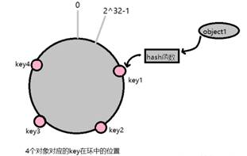

 

# 测试用例

空集，链表，队列

单个

边界

 

根结点如果不为空，深度为1，如果跟结点为空，则深度是0.

 

# 概念与本质

·递归有两种运行顺序：正向是迭代，反向为递归。递归本质是在方法栈中调用，可以在循环中使用栈，手动实现。

·树是图的退化形式，图的广度优先遍历等价于树的层遍历

·树的路径数量等于叶节点数量，先序遍历到叶节点，便得到一条路径

·树的分治分析

 

渐进符号θ，O见P26（复杂度稳定在中间变化不大，O为上界运行时间不好说）

 

 

满二叉树：   每一层都满，节点数2^h-1，h为树高，设根节点高度为1

完全二叉树：最深一层不满（最大最小堆）

二叉搜索树：中序遍历非递减（红黑树、B数）

 

 

 

# 数据结构

## 优先队列与堆

PriorityQueue  看看JDK的实现

 

### 斐波那契堆

一系列最小堆的集合，每个堆的根链表链在一块

 

## 树/二叉树

### 树的一些概念：

满二叉树：   每一层都满，节点数2^h-1，h为树高，设根节点高度为1

完全二叉树：最深一层不满（最大最小堆）

二叉搜索树：中序遍历非递减（红黑树、B数）

 

### 树的遍历

```java
void preOrderTraversal(Node root) {
    if (root == null) return;

    // Do something with the value

    System.out.println(root.value); 

    preOrderTraversal(root.left);  

    preOrderTraversal(root.right);
}

  void inOrderTraversal(Node root) {

​    if (root == null) return;


​    inOrderTraversal(root.left);


​    // Do something with the value

​    System.out.println(root.value); 

​    

​    inOrderTraversal(root.right);

  }

  void postOrderTraversal(Node root) {

​    if (root == null) return;

​    

​    postOrderTraversal(root.left);

​    

​    postOrderTraversal(root.right);

​    

​    // Do something with the value

​    System.*out*.println(root.value);  

  }

 

//非递归

  void levelOrderTraversal(Node root) {

​    if(root==null) return;

​    

​    ArrayList<Node> list = new ArrayList<Node>();

​    list.add(root);

​    

​    while(!list.isEmpty()){

​      Node temp = list.remove(0);

​      System.*out*.println(temp.value);

​      if(temp.left!=null) list.add(temp.left);

​      if(temp.right!=null) list.add(temp.right);       

​    }

}
```

 

## 散列表与散列技术

直接寻址，散列技术：将分散的关键字映射到紧凑的列表中。H(k)/N

通常的 hash 算法都是将 value 映射到一个 32 位的 key 值，然后取模决定存放桶的位置。

 

 

### 解决冲突方案：

开放地址：线性探测，平方探测，双散列

链接法：冲突项放在双向链表中

 

### 一致性哈希

分布式哈希（DHT）实现算法，设计目标是为了解决因特网中的热点(Hot spot)问题，初衷和CARP十分类似。一致性哈希修正了CARP使用的简单哈希算法带来的问题，使得分布式哈希（DHT）可以在P2P环境中真正得到应用。

比如你有 N 个 cache 服务器（后面简称 cache ），那么如何将一个对象 object 映射到 N 个 cache 上呢，你很可能会采用类似下面的通用方法计算 object 的 hash 值，然后均匀的映射到到 N 个 cache ：

hash(object)%N

上面取模的方法一般称为简单 hash 算法 。通过简单 hash 算法确实能够比较均匀地实现分布式布置（映射），但是我们来考虑下面两种情形：

1） 某个 cache 服务器 m down 掉了（在实际应用中必须要考虑这种情况），这样所有映射到 cache m 的对象都会失效，怎么办，需要把 cache m 从 cache 中移除，这时候 cache 是 N-1 台，映射公式变成了 hash(object)%(N-1) ；

2） 由于访问加重，需要添加 cache ，这时候 cache 是 N+1 台，映射公式变成了 hash(object)%(N+1) ；

1） 和 2） 意味着什么？这意味着无论是添加或移除 cache 服务器，突然之间几乎所有的 cache 都失效了。对于服务器而言，这是一场灾难，洪水般的访问都会直接冲向后台服务器；

为了解决上面的问题，我们引入一致性 Hash 算法（consistent hashing）。

第一步：先哈希

资源位置：

key1 = hash(object1); 

key2 = hash(object2);

key3 = hash(object3); 

key4 = hash(object4);



Cache服务器位置

keyA = hash(cacheA); 

keyB = hash(cacheB); 

keyC = hash(cacheC);

 

第二步：

顺时针定位，代替简单哈希里面取模定位


 

负载均衡考虑：

假如移除cacheB，cacheC负荷比cacheA大很多


解决方案：虚拟节点（节点分裂成虚拟的节点）

“虚拟节点”（ virtual node ）是实际节点在 hash 空间的复制品（ replica ），一实际个节点对应了若干个“虚拟节点”，这个对应个数也成为“复制个数”，“虚拟节点”在 hash 空间中以 hash 值排列。

仍以仅部署 cache A 和 cache C 的情况为例，在移除 cacheB 服务器图中我们已经看到， cache 分布并不均匀。现在我们引入虚拟节点，并设置“复制个数”为 2 ，这就意味着一共会存在 4 个“虚拟节点”， cache A1, cache A2 代表了 cache A ； cache C1, cache C2 代表了 cache C ；假设一种比较理想的情况，如图：


 

 

 

# 二叉搜索树（BST）

## AVL平衡二叉搜索树

定义：平衡二叉树或为空树,或为如下性质的二叉排序树:

 （1）左右子树深度之差的绝对值不超过1;

 （2）左右子树仍然为平衡二叉树.

平衡因子BF=左子树深度－右子树深度.

平衡二叉树每个结点的平衡因子只能是1，0，-1。若其绝对值超过1，则该二叉排序树就是不平衡的。

 

## 红黑树

\1.     每个节点不是红色就是黑色

\2.     根为黑

\3.     红节点孩子为黑

\4.     *叶节点为黑（旋转中不考虑叶子）*

\5.     从任意点出发，到后代叶节点的所有路径上，黑节点数目相同。

 

AVL是严格平衡树，因此在增加或者删除节点的时候，根据不同情况，旋转的次数比红黑树要多；红黑是弱平衡的，用非严格的平衡来换取增删节点时候旋转次数的降低；

所以简单说，搜索的次数远远大于插入和删除，那么选择AVL树，如果搜索，插入删除次数几乎差不多，应该选择RB树。

 

 

左旋，右旋：位置下降；是谁的旋转，左旋则旋转点左边不变，右旋同理


 

插入操作：插入节点标位红色。如果爸爸为红，二连红需要调整

*情况1：叔叔为红，上层一起变黑，让爷爷变红*


 

*情况2：二连红叔叔不为红，为爸爸的右孩子，爸爸左旋，然后转到情况3*


 

情况3：二连红，为爸爸左孩子，爷爷右旋，交换两辈颜色


 

【删除】部分省略，自行查看

 

 

 

 

 

 

 

 

 

 

 

 

# 字典树：B，B+，B*

## B树

 是一种M路搜索树（并不是二叉的）：

​    1.定义任意非叶子结点最多M个儿子；且M>2；

​    2.利用率限制，根节点儿子不少于2个，非叶子结点的儿子数为[M/2, M]；

​    3.所有叶子结点位于同一层；

4.每个节点孩子数比节点内关键字多1个

​    

如：（M=3）


​    B树的搜索，从根结点开始，对结点内的关键字（有序）序列进行二分查找，如果

命中则结束，否则进入查询关键字所属范围的儿子结点；重复，直到所对应的儿子指针为

空，或已经是叶子结点；

 

B树的特性：

​    1.关键字集合分布在整颗树中；

​    4.其搜索性能等价于在关键字全集内做一次二分查找；

​    5.自动层次控制；

​    由于限制了除根结点以外的非叶子结点，至少含有M/2个儿子，确保了结点的至少

利用率，其最底搜索性能为：


  

​    其中，M为设定的非叶子结点最多子树个数，N为关键字总数；

​    所以B-树的性能总是等价于二分查找（与M值无关），也就没有B树平衡的问题；

 

删除查找操作：满足M/2利用率

​    由于M/2~M的限制，在插入结点时，如果结点已满，需要将结点分裂为两个各占

M/2的结点；删除结点时，需将两个不足M/2的兄弟结点合并；

 

H = log┌m/2┐((N+1)/2 )+1 //根节点，高度定义为1

 

 

## B+

 B+树是B树的变体，也是一种多路搜索树：

​    其定义基本与B-树同，除了：

​    1.非叶子结点的子树指针与关键字个数相同；

​    2.非叶子结点K[i]的子树指针P[i]，指向关键字值[K[i], K[i+1])的子树（关键字可重复而B-树是开区间，不许重复）；

​    3.为所有叶子结点增加一个链指针；

​    4.所有关键字都在叶子结点出现；

​    

如：（M=3）


  B+的搜索与B-树也基本相同，区别是B+树只有达到叶子结点才命中（B树可以在

非叶子结点命中），其性能也等价于在关键字全集做一次二分查找；

   

B+的特性：

​    1.所有关键字都出现在叶子结点的链表中，且链表中的关键字恰好

是有序的；

​    2.非叶子结点相当于是叶子结点的索引（稀疏索引），叶子结点相当于是存储

（关键字）数据的数据层；

​    3.更适合文件索引系统；稀疏索引+稠密索引，快速检索到关键字

*一步步分析为什么B+树适合作为索引的结构 - CSDN博客* 

*https://blog.csdn.net/weixin_30531261/article/details/79312676*

 

 

 

通过以上介绍，大致将B树，B+树，B*树总结如下：

B树：有序数组+平衡多叉树；

B+树：有序数组链表+平衡多叉树；

B*树：一棵丰满的B+树。

 

“B+树还有一个最大的好处，方便扫库，B树必须用中序遍历的方法按序扫库，而B+树直接从叶子结点挨个扫一遍就完了，B+树支持*range-query范围查询*非常方便，而B树不支持。这是数据库选用B+树的最主要原因。

比如要查 5-10之间的，B+树一把到5这个标记，再一把到10，然后串起来就行了，B树就非常麻烦。B树的好处，就是成功查询特别有利，因为树的高度总体要比B+树矮。不成功的情况下，B树也比B+树稍稍占一点点便宜。

  

另外B树也好B+树也好，根或者上面几层因为被反复query，所以这几块基本都在内存中，不会出现读磁盘IO，一般已启动的时候，就会主动换入内存。”

Bucket Li："mysql 底层存储是用B+树实现的，知道为什么么。内存中B+树是没有优势的，但是一到磁盘，B+树的威力就出来了"。

 

 

## B*

1.在B+树的非根和非叶子结点再增加指向兄弟的指针；

 2.B*树定义了非叶子结点关键字个数至少为(2/3)*M，即块的最低使用率为2/3

（代替B+树的1/2）；

 

M=3


 

​    B+树的分裂：当一个结点满时，分配一个新的结点，并将原结点中1/2的数据

复制到新结点，最后在父结点中增加新结点的指针；B+树的分裂只影响原结点和父

结点，而不会影响兄弟结点，所以它不需要指向兄弟的指针；

​    B*树的分裂：当一个结点满时，如果它的下一个兄弟结点未满，那么将一部分

数据移到兄弟结点中，再在原结点插入关键字，最后修改父结点中兄弟结点的关键字

（因为兄弟结点的关键字范围改变了）；如果兄弟也满了，则在原结点与兄弟结点之

间增加新结点，并各复制1/3的数据到新结点，最后在父结点增加新结点的指针；

​    所以，B*树分配新结点的概率比B+树要低，空间使用率更高；

 

## B系树小结

​    二叉树：二叉树，每个结点只存储一个关键字，等于则命中，小于走左结点，大于

走右结点；

​    B-树：多路搜索树，每个结点存储M/2到M个关键字，非叶子结点存储指向关键

字范围的子结点；

​    所有关键字在整颗树中出现，且只出现一次，非叶子结点可以命中；

​    B+树：在B-树基础上，为叶子结点增加链表指针，所有关键字都在叶子结点

中出现，非叶子结点作为叶子结点的索引；B+树总是到叶子结点才命中；

​    B*树：在B+树基础上，为非叶子结点也增加链表指针，将结点的最低利用率

从1/2提高到2/3；

 

B系列树优点在于寻址少磁盘IO次数低，查找效率与平衡二叉树理论上是相等的


## B树分裂合并操作

https://blog.csdn.net/u013400245/article/details/52824744

 

插入时，保证不超过M-1个关键字，超过需要分裂成2路，提取中间作为父亲

删除，不足要合并，父亲要减少，下移给孩子。

 

 

 

 

 

 

# 图：有向图/无向图/加权图

## 图概念

和树一样，图也是由带子集的结点组成的，但和树不一样的地方在于，这些结点可以有多个父结点，两个结点之间可能地有比指针更多的信息，而且可能会有值和权重。边有方向的图被称为有向图，而只有双向指针的图被称为无向图。边上有权重的图被称为加权图。

图的表示

以及如何在现实的代码中实现它们，取决于你有的图的类型，比如连接完整的简单图可能用邻接矩阵来实现更好，而稀疏一些的图则可能用邻接链表来表示更好。

请注意，如果你是在实现加权图，很可能需要定义一个Edge类。

 

 

 

 

 

 

## 图算法

### 深度优先搜索DFS

递归遍历，无向图每个点都连通；对每个顶点进行DFS，有向图每个点不一定都连通


 

书上问题：

有向无环图上的拓扑排序，穿衣服问题。

强连通分量

 

 

 

 

 

 

 

### 广度优先搜索BFS

树的层次遍历一样，使用队列；对每个顶点进行DFS，有向图每个点不一定都连通

 


 

 

最短路径问题：两点间的距离最短

遍历顺序，距离短的先遍历

 

O（V+E）

 

### 最小生成树，无向图:

连接所有节点，整体权重最小。运用：电路设计中连接针脚，连线总长最短。

#### kruskal

贪心选最短边，如果遍历到的某边能将不同的树连接起来，那么有效，加入森林，合并两树。扩展森林。

 

图G=（V,E），算法复杂度O(ElgV)

#### prim

从横跨（S,V-S）的切割边中选取最小权边，并拓展节点集

图G=（V,E），算法复杂度O(ElgV)

 

 

 

### 单源最短路径，有向图

最小生成树问题：节点集整体权重最小，不保证两节点间距离最短；而最短路径问题：两点之间的最短路径。

如果计算起点到所有点的最短距离，这些边构成以起点为root的树。

 

 

Bellman-Ford

通用算法

O(VE)

 

dijkstra

权值非负，最小优先队列，复杂度依赖最小优先队列实现O（V^2）~O((V+E)lgV)

 

 

### 所有节点对最短路径，有向图

Floyd O(n^3)

动态规划的策略，怎么划分子问题的https://www.cnblogs.com/Ash-ly/p/5920953.html

 

有向图的传递闭包问题：

n个节点，求出所有节点对之间的最短路径，如果任意两点可达，那么两点间距离不会超过一个值，将权值变成1，那么这个值为n-1

 

 

### 最大流

不违反任何容量限制，计算源点到汇点（点到点，合理分配资源，使伤害最大化）

 

几个概念：流网络，残存网络，增广路径


引入切割概念，用来证明算法

 

 

 

Ford-Fulkerson方法框架

残存网络中是否存在增广路径，然后路径加上残存容量。关键在于增广路径的寻找

 

Edmonds-Karp O(VE^2)

增广路径寻找采用BFS

BFS找到的增广路径不一定是最短，要求每次加入当前最短,可用单源最短路径算法dijkstra,bellman-ford  最大流最小费用问题。

 

 

 

# 分治，动态规划DP，递归

DP通常用来解决最优化问题，这类问题中，我们通过做出一组选择来达到最优解。在做出每个选择同时，通常会生成与原问题形式相同的子问题。当多于一个选择子集都生成相同的子问题时，DP分析通常就会很有效，关键技术是对每一个这样的子问题都保持其解。

## DP与分治

子问题是否重复，或者说子问题是否依赖。分治是将问题划分为互不相交子问题。

规划，一般用来求解最优化问题。

## 最大子数组

算法导论上的分治算法效率nlogn，每个问题分为，全在左边，全在右边，跨中点

https://www.cnblogs.com/AlgrithmsRookie/p/5882379.html

 

 

DP子问题划分，考虑arr[n-1]可以加入结尾End[n-1]。

从后向前考虑，初始化的情况分别为arr[0]，以arr[0]结尾，即End[0] = arr[0]，最大和范围在[0,0]之内，即All[0]=arr[0]。End[i]以i结尾的最大区间和，All[i] = max{ End[i]，All[i-1] }

代码如下：

/* DP base version*/

\#define max(a,b) ( a > b ? a : b)

int Maxsum_dp(int * arr, int size){

​     int End[30] = {-INF};          |  All[i-1] |      end[i-1] arr[i]

​     int All[30] = {-INF};                           end[i]

​     End[0] = All[0] = arr[0];

 

​     for(int i = 1; i < size; ++i){

​          End[i] = max(arr[i],arr[i]+End[i-1]);

​          All[i] = max(End[i],All[i-1]);

​     }

​     return All[size-1];

}

 

//普通的循环实现

void Maxsum_location(int * arr, int size, int & start, int & end) //最大子数组两个指针传入

{

​     int maxSum = -INF;

​     int sum = 0;

​     start = 0; end = start; /* start记录每次当前起始位置 */

​     for(int i = 0; i < size; ++i){

​          if(sum < 0){

​              sum = arr[i];

​              start = i;   /* 更新最大区域起点 */

​          }else{              /*只要sum不小于零，start后面就有可能出现最大*/

​              sum += arr[i];

​          }

​          if(sum > maxSum){

​              maxSum = sum;

​              end = i;   //记下最大数组下标

​          }

​     }

}

 

 

其他难题：

最长公共子序列

两个字符串，公共的不连续字符序列

C[i,j] = 0 ，i=0或j=0; 

c[ i-1 , j-1 ]+1 ，xi=yj; 

max(c[i-1,j], c[i,j-1]) xi!=yj

P225

 

最优二叉搜索树

复杂，未看

 

 

 

# 贪心算法

DP结构为和式，子问题最优解组成全局问题最优解，DP简化，采用某种贪心策略。

## 活动选择问题

尽可能多地安排活动，贪心策略：选择最早结束活动

## 分数背包与01背包

## 哈夫曼编码

 

 

# 数论

## RSA公钥系统

公钥所有人知道，私钥只要自己知道

A向B发送信息，A使用B公钥加密信息，B收到使用私钥解密

A数字签名，使用A的私钥加密，B得到文件使用A的公钥解密

 

Message M = S(P(M)) = P(S(M))

 

# 字符串匹配

文本长度n，模式m

 

朴素算法：O((n-m+1)*m)

RK：计算模式某窗口长度的散列值θ(m)，同等长度文本进行散列，比较两者的散列值           O((n-m+1)*m)

 

KMP：预处理，计算已匹配信息数组next，θ(m); 匹配时间θ(n)

BM：http://www.ruanyifeng.com/blog/2013/05/boyer-moore_string_search_algorithm.html

坏字符与好后缀

 

 

有限自动机：

 

渐进符号θ，O见P26（复杂度稳定在中间变化不大，O为上界运行时间不好说）

 

# NP完全性

NP类问题：多项式时间内可以被证明的问题

P类问题：多项式时间内可以解决的问题

NP完全问题NPC：只有近似解

*NP包含P和NPC，P和NPC互斥*

 

NP完全问题

哈密顿回路：无向图经过所有顶点的回路

顶点覆盖问题：

旅行商TSP问题：经过一个哈密顿回路（每个城市经过一次），回到出发点，路费最低。

 

近似算法：

满足三角不等式的TSP，直达不会比路过其他点的费用高：

Prim得到最小生成树T -------先序遍历得到节点顺序--------按顺序连接节点得到旅行路线图

 

 

# 排序

## 比较类排序与非比较

比较类排序：通过比较来决定元素间的相对次序，其时间复杂度不能突破O(nlogn)，因此也称为非线性时间比较类排序。

非比较排序：不通过比较来决定元素间的相对次序，它可以突破比较排序的O(nlogn)下界，以线性时间运行，因此也称为线性时间非比较类排序。


 

稳定：如果a原本在b前面，而a=b，排序之后a仍然在b的前面。

不稳定：如果a原本在b的前面，而a=b，排序之后 a 可能会出现在 b 的后面。

时间复杂度：对排序数据的总的操作次数。反映当n变化时，操作次数呈现什么规律。

空间复杂度：是指算法在计算机内执行时所需存储空间的度量，它也是数据规模n的函数。


 


 

 

 

```go
package main

import (
	"fmt"
)

func main() {
	a := []int{6, 5, 2, 7, 4, 2, 1, 3, 4}
	// swap(a, 1, 2)
	// fmt.Println(a)
	// bubbleSort(a)
	// invertBubbleSort(a)
	// selectSort(a)
	// QuickSort(a)
	// a = mergeSort(a)
	heapSort(a)
	fmt.Println("a: ", a)
}

func bubbleSort(a []int) {
	for i := 0; i < len(a)-1; i++ {
		for j := 0; j < len(a)-1-i; j++ {
			if a[j] > a[j+1] {
				a[j], a[j+1] = a[j+1], a[j]
			}
		}
	}
}

func invertBubbleSort(a []int) {
	for i := 0; i < len(a)-1; i++ {
		for j := 0; j < len(a)-1-i; j++ {
			if a[j] < a[j+1] {
				a[j], a[j+1] = a[j+1], a[j]
			}
		}
	}
}

func selectSort(a []int) []int {
	for i := 0; i < len(a)-1; i++ {
		minIndex := i
		for j := i + 1; j < len(a); j++ {
			if a[j] < a[minIndex] {
				minIndex = j
			}
		}
		a[i], a[minIndex] = a[minIndex], a[i]
	}
	return a
}

// 归并排序
func mergeSort(a []int) []int {
	if len(a) <= 1 {
		return a
	}
	mid := len(a) / 2
	left := mergeSort(a[0:mid])
	right := mergeSort(a[mid:])
	return merge(left, right)
}

func merge(left, right []int) []int {
	res := []int{}
	l := 0
	r := 0
	// 默认左边小，右边大
	for l < len(left) && r < len(right) {
		if left[l] > right[r] {
			res = append(res, right[r])
			r++
		} else {
			res = append(res, left[l])
			l++
		}
	}
	res = append(res, left[l:]...)
	res = append(res, right[r:]...)
	return res
}

// QuickSort 快排
func QuickSort(a []int) {
	quickSort(a, 0, len(a)-1)
}

func quickSort(a []int, start, end int) {
	if start >= end {
		return
	}
	m := partition(a, start, end)
	quickSort(a, start, m-1)
	quickSort(a, m+1, end)
}

func partition(a []int, start, end int) int {
	b := a[start]  // 选第一个为值基准
	i := start + 1 // 大于等于b的第一个ndex
	for j := i; j <= end; j++ {
		if a[j] < b {
			a[j], a[i] = a[i], a[j]
			i++
		}
	}
	a[start], a[i-1] = a[i-1], a[start]
	return i - 1
}

func heapSort(a []int) {
	buildMaxHeap(a)
	for i := len(a) - 1; i > 0; i-- {
		// 模拟摘除
		a[i], a[0] = a[0], a[i]
		adjustHeap(a, 0, i-1)
	}
}

func buildMaxHeap(a []int) {
	// 每向一个树根增加一个节点，就需要调整树的结构
	for root := len(a)/2 - 1; root >= 0; root-- {
		adjustHeap(a, root, len(a)-1)
	}
}

// 调整子树平衡,root是调整的起点，lastIndex最后一个叶子的下标
func adjustHeap(a []int, root, lastIndex int) {
	l := root*2 + 1
	r := l + 1
	bigger := root
	if l <= lastIndex && a[l] > a[bigger] {
		bigger = l
	}
	if r <= lastIndex && a[r] > a[bigger] {
		bigger = r
	}

	if bigger != root {
		a[root], a[bigger] = a[bigger], a[root]
		adjustHeap(a, bigger, lastIndex)
	}
}

```

 

## 1.冒泡

  public static void bubbleSort(int[] a){

​    for(int i=0;i<a.length;i++){

​      for(int j=0;j<=a.length-2-i;j++){

​       if(a[j]>a[j+1])

​         *exch*(a,j,j+1);

​      }

​    }   

  }

 

 

 

## 2.选择排序

找到数组中的最小元素，将它与数组的第一个元素交换位置。再从剩下的元素中找到最小的元素，将它与数组的第二个元素交换位置。不断进行这样的操作，直到将整个数组排序。

   public static void SelectionSort(int[] a) {

​    int N = a.length;

​    for (int i = 0; i < N; i++) {

​      int min = i;

​      for (int j = i + 1; j < N; j++) {

​        if (*less*(a[j], a[min])) min = j;

​      }

​      *exch*(a, min, i);

​    }

  }

 

 

## 3.插入排序

  

  public static void InsertionSort(int[] a){

​    int N=a.length;

 

//剩下需要排的数

​    for(int i=1;i<N;i++){

​      for(int j=i;j>=1 && a[j]<a[j-1];j--)

​        *exch*(a,j,j-1);

​    }

  }//与前一个数比较，若比前一个小，则交换，交换后继续与前一个比较,保证前面排好序

//插入是原址排序，不另外开辟空间

 

## 4.希尔排序

对于大规模的数组，插入排序很慢，因为它只能交换相邻的元素，如果要把元素从一端移到另一端，就需要很多次操作。插入排序的推广，它与插入排序的不同之处在于，它会优先比较距离较远的元素。希尔排序又叫缩小增量排序。

希尔排序使用插入排序对间隔 h 的序列进行排序，如果 h 很大，那么元素就能很快的移到很远的地方。通过不断减小 h，最后令 h=1，就可以使得整个数组是有序的。


```
  public static void ShellSort(int[] a) {

​    int N = a.length;

​    int h = 1;

​    while (h < N / 3) {

​      h = 3 * h + 1; // 1, 4, 13, 40, ...

​    }

​    while (h >= 1) {     //40

​      for (int i = h; i < N; i++) {

​        for (int j = i; j >= h && *less*(a[j], a[j - h]); j -= h) {

​          *exch*(a, j, j - h);

​        }

​      }

​      h = h / 3; //13,4,1

​    }

  }
```

 

## 6.快速

private static void QuickSort(int[] a, int lo, int hi) {

​    if (hi <= lo) return; //递归一定要有终止条件

​    int j = *partition*(a, lo, hi);

​    *QuickSort*(a, lo, j - 1); //不能用j--,j不能变，下一句要用

​    *QuickSort*(a, j + 1, hi);

  }

  

  //以数组第一个数为界点

  private static int partition(int[] a, int lo, int hi) {

int v = a[lo];

​    int i = lo, j = hi+1;

​    while (true) {

​      while(a[++i]<v) if(i==hi) break; 

​      while(a[--j]>v) if(j==lo)break;

​      //必须在找到互换元素后，检查游标位置

​      if(i>=j) break;

​      *exch*(a, i, j);

​    }

​    *exch*(a, lo, j);//j,i是真实位置，上面条件为--j

​    return j;

  }

 

 

空间消耗：

首先就地快速排序使用的空间是O(1)的，也就是个常数级；而真正消耗空间的就是递归调用了，因为每次递归就要保持一些数据；

   最优的情况下空间复杂度为：O(logn) ；每一次都平分数组的情况

   最差的情况下空间复杂度为：O( n )  ；逆序，退化为插入排序的情况

不稳定的时间复杂度：

最坏O(n^2),最好O(nlog2n)

 

改进策略

（一）切换到插入排序

因为快速排序在小数组中也会调用自己，对于小数组，插入排序比快速排序的性能更好，因此在小数组中可以切换到插入排序。

（二）三取样

最好的情况下是每次都能取数组的中位数作为切分元素，但是计算中位数的代价很高。人们发现取 3 个元素并将大小居中的元素作为切分元素的效果最好。

（三）三向切分

对于有大量重复元素的数组，可以将数组切分为三部分，分别对应小于、等于和大于切分元素。

三向切分快速排序对于只有若干不同主键的随机数组可以在线性时间内完成排序。


public static void quick3WaySort(int[] a, int lo, int hi) {

​    if (hi <= lo) return;

int v = a[lo];    

 

int lt = lo, i = lo + 1, gt = hi; //lt为相等区起点，i为未知区起点，gt为未知区终点

​    

​    while (i <= gt) {

​      if (a[i]<v) *exch*(a, lt++, i++);

​      else if (a[i] > v) *exch*(a, i, gt--); //换后的a[i]大小未知

​      else i++;

​    }

​    *quick3WaySort*(a, lo, lt - 1);

​    *quick3WaySort*(a, gt + 1, hi);

}

 

 

## 5. 归并

public static void mergeSort(int[] a, int lo, int hi) {

​    if (lo==hi) return; //只剩下一个数字，返回

​    if(lo<0 || hi<0 || lo>hi) throw new RuntimeException("非法输入");

​    int mid = (lo + hi) / 2;

 

​     *mergeSort*(a, lo, mid);

​     *mergeSort*(a, mid + 1, hi);

​     *merge*(a, lo, mid, hi); 

}

 

private static void merge(int[] a, int lo, int mid, int hi) {

​    //不同于交换，这里直接开辟内存，保存原数组

​    int[] temp = new int[hi-lo+1];

​    int mid2 = mid-lo;

​    int hi2 = hi-lo;

  

​    for (int k=lo,i=0; k<=hi; k++) {

​      temp[i++] = a[k]; // 将数据复制到辅助数组

​     }    

​    for(int k=lo,i=0,j=mid2+1;k<=hi;k++){

​      //若某一半数组没有剩下数字，则直接复制另一半剩下的序列， i:0 ~ mid2 j:mid2+1 ~ hi2

​      if(i==mid2+1){

​        a[k] = temp[j++];

​        continue;

​      }

​      if(j==hi2+1){

​        a[k] = temp[i++];

​        continue;

​      }

​      if(temp[i]<temp[j])

​        a[k] = temp[i++];

​      else a[k] = temp[j++];

​    }

​    

  }

  

 

## 7.堆排序

最大堆为完全二叉树：最深一层不满（最大最小堆），那么有


leftNo = parentNo*2+1

rightNo = parentNo*2+2

 parentNo = (nodeNo-1)/2

 

```
public class HeapSort{

  public int[] heapSort(int[] A) {
    int lastIndex = A.length-1;
   //就地建最大堆
    buildMaxHeap(A, lastIndex);

    //开始排序，将堆顶最大值交换到相应位置
    while(lastIndex > 0){
      swap(A, 0, lastIndex);      

      //只剩一个元素，就不用调整堆了，排序结束
      if(--lastIndex == 0) break;

      adjustHeap(A,0,lastIndex);

    }
    return A;
  }


  public void buildMaxHeap(int[] arr, int lastIndex) {
     //最后一颗子树的下标
    int rootIndex = (lastIndex - 1) / 2;   

    while (rootIndex >= 0) {
      adjustHeap(arr, rootIndex, lastIndex);
      rootIndex--;
    }
  }

 

  //调整的子树至平衡，lastIndex用于判断左右孩子是否存在
  public void adjustHeap(int[] arr, int rootIndex, int lastIndex) {
    //子树左右孩子下标
    int leftChildIndex = rootIndex * 2 + 1; 
    int rightChildIndex = rootIndex * 2 + 2;
    int biggerIndex = rootIndex;

    

    //如果右孩子存在，则左孩子一定存在
    if(rightChildIndex <= lastIndex){

      if(arr[rightChildIndex] > arr[rootIndex] || arr[leftChildIndex] > arr[rootIndex]){

       biggerIndex = arr[rightChildIndex]>arr[leftChildIndex] ? rightChildIndex:leftChildIndex;

      }

    }

    else if(leftChildIndex <= lastIndex){//只有左孩子
      if(arr[leftChildIndex] > arr[rootIndex]) biggerIndex = leftChildIndex;
    }

    
   if(biggerIndex != rootIndex){
      swap(arr, biggerIndex, rootIndex);

      //将较小元素换下去，后面子树可能失衡，需要调整
      adjustHeap(arr, biggerIndex, lastIndex);
    }
  }

  public void swap(int[] arr, int biggerIndex, int rootIndex) {
    int temp = arr[rootIndex];
    arr[rootIndex] = arr[biggerIndex];
    arr[biggerIndex] = temp;
  }
}
```

 

 

## 1.  计数排序

计数排序不是基于比较的排序算法，其核心在于将输入的数据值转化为键存储在额外开辟的数组空间中。 作为一种线性时间复杂度的排序，计数排序要求输入的数据必须是有确定范围的整数。

 

8.4 算法分析

 

计数排序是一个稳定的排序算法。当输入的元素是 n 个 0到 k 之间的整数时，时间复杂度是O(n+k)，空间复杂度也是O(n+k)，其排序速度快于任何比较排序算法。当k不是很大并且序列比较集中时，计数排序是一个很有效的排序算法。

  //输入范围0~k

  private static int[] countSort(int[] array,int k){

​    int[] C=new int[k+1];//构造C数组,计数用

​    int[] B=new int[array.length];//构造B数组，存放结果

​    

​    for(int i=0;i<array.length;i++)

​      C[array[i]]+=1;// 统计A中各元素个数，存入C数组

 

​    for(int i=1;i<k+1;i++)  //记录A元素在排列后的位置

​      C[i] = C[i] + C[i-1];

​    

​    //遍历A数组，构造B数组

​    for(int i=0;i<=array.length-1;i++){ 

​      B[--C[array[i]]]=array[i]; //理论上位置1~array.length,但B下标从0开始       

​    }

​    return B;//将排序好的数组返回，完成排序    

  }

 

 

 

## 2.  桶排序

桶排序是计数排序的升级版。它利用了函数的映射关系，高效与否的关键就在于这个映射函数的确定。桶排序 (Bucket sort)的工作的原理：假设输入数据服从均匀分布，将数据分到有限数量的桶里，每个桶再分别排序（有可能再使用别的排序算法或是以递归方式继续使用桶排序进行排）。


 

 

 

 

## 3.  基数排序

基数排序是按照低位先排序，然后收集；再按照高位排序，然后再收集；依次类推，直到最高位。

 

# 查找

红黑树看TreeMap实现

 

 

 

 

 

# 全排列

## 字符串排列

import java.util.ArrayList;

import java.util.Collections;

public class Solution {

  

  public static ArrayList<String> Permutation(String str) {

​    ArrayList<String> res = new ArrayList<String>();

​    if (str != null && str.length() > 0) {

​      PermutationHelper(str.toCharArray(), 0, res);

​      //Collections.sort(res);

​    }

​    return res;

  }

  

  public static void PermutationHelper(char[] chars,int start,ArrayList<String> list){

   

   if (start == chars.length-1) {

​     String val = new String(chars);

​     //if(!list.contains(val))

​       list.add(val);

​      return;

​    }

   

//    for(int i=start;i<chars.length;i++){

//      if(i==start || chars[i] != chars[start]){   //第一个判定条件是第一位固定情况下，剩下情况

//        swap(chars,i,start);            

//        PermutationHelper(chars,start+1,list);

//        swap(chars,i,start);

//      }

//    }

   for(int i=start;i<chars.length;i++){

​     if(iSwap(chars,start,i)){   //第一个判定条件是第一位固定情况下，剩下情况

​       swap(chars,i,start);            

​       PermutationHelper(chars,start+1,list);

​       swap(chars,i,start);

​     }

   }

   

   

  }

  

  //判定是否交换，交换两个字符中间，是否有与被交换字符重复

  static boolean iSwap(char[] chars,int start,int i){

​    for(;start<i;start++){

​      if(chars[start]==chars[i]) return false;

​    }

​    return true;

  }

  static void swap(char[] str, int i, int j) {

​    if (i != j) {

​      char t = str[i];

​      str[i] = str[j];

​      str[j] = t;

​    }

  }

  

  

  public static void main(String[] args){

   String str = "abbc";

   ArrayList<String> list = Permutation(str);

   for(String s : list)

​     System.out.println(s);

  }

 }

 

 

 

 

 

# 位操作

要想处理位元，你必须先得知道在标记内部，数字是如何表示的——二进制补码和无格式二进制标记是一样的，只是负数要“进行位元翻转之后再加1”。

比如要想得到数字-1，你要从用8位二进制整数表示是00000001的1开始。对每一个位元进行翻转之后的结果是11111110，再加上1就是11111111，也就成了二进制补码中的-1。

左移位运算符“<<”会把位元移向左边，用0来补上移走之后的空位。

右移位运算符“>>”会把一个位模式向右移，但当向右移动负数时，它的作用在不同编程语言中也不一样，在Java中，右移位会用符号扩充的办法，用1来填充负数中的空位。

逻辑右移位运算符“>>>”是Java和Javascript中独有的，无论数值是多少，它都用0来填充空位。

设置某一位：可以用按位或运算符（|）。

num |= 1 << x; //这行代码将会设置位元x

清除某一位：可以用按位与运算符（&），并且用取反运算符（~）来屏蔽所有你不想清除的位元。

num &= ~(1 << x); //这会清除位元x

清除一直到i的所有有效位元：

num &= (1 << (i + 1)) -1;

切换某一位元：可以用按位异或运算符（^）

num ^= 1 << x; //这会切换位元x

获得一个位元：对你想检查的位元用按位与

bit = num & (1 << x);

 

 

 

# 海量数据处理

Hash映射到桶里面

Bit-map 已知数据大小范围，一个字节16位

Bloom filter 检测元素是否属于一个集合，hash+bit-map对一个元素使用多个hash，映射到多个桶中，存在对应某个桶出现零则肯定不在集合中，全为1也不确保元素就在集合中。支持插入，将映射的桶全置位1。不支持删除，删除要清零，会删除其他元素的信息。

 

倒排索引：正向索引，对每个文本数据建立索引，倒排：将文本数据放在对应索引词集合中

 

外排序：将巨量的待排序数据存放在外存中，排序时再一部分一部分载入内存

 

Trie树

字符串检索多叉树结构。统计和排序大量字符串，

 

MapReduce

云计算核心技术，简化并行计算的分布式编程模型。Map分割数据分发进行分布式计算，然后并发的reduce函数汇总结果。

 

 

TopK问题：海量数据中找出K个最值

一、全排序，效率低nlgn

二、堆，建立堆KlgK，遍历剩下（n-K），总复杂度nKlgK

三、分治方法，划分数据集，求每个数据集最K个

四、Hash先去重，然后堆处理或者分治排序。

 

 

重复问题：

位图发bitmap，O(n)时间

 

海量排序：

位图法bitmap

 

 

 

 

 

 

 

 

 

 

 

 

 

 