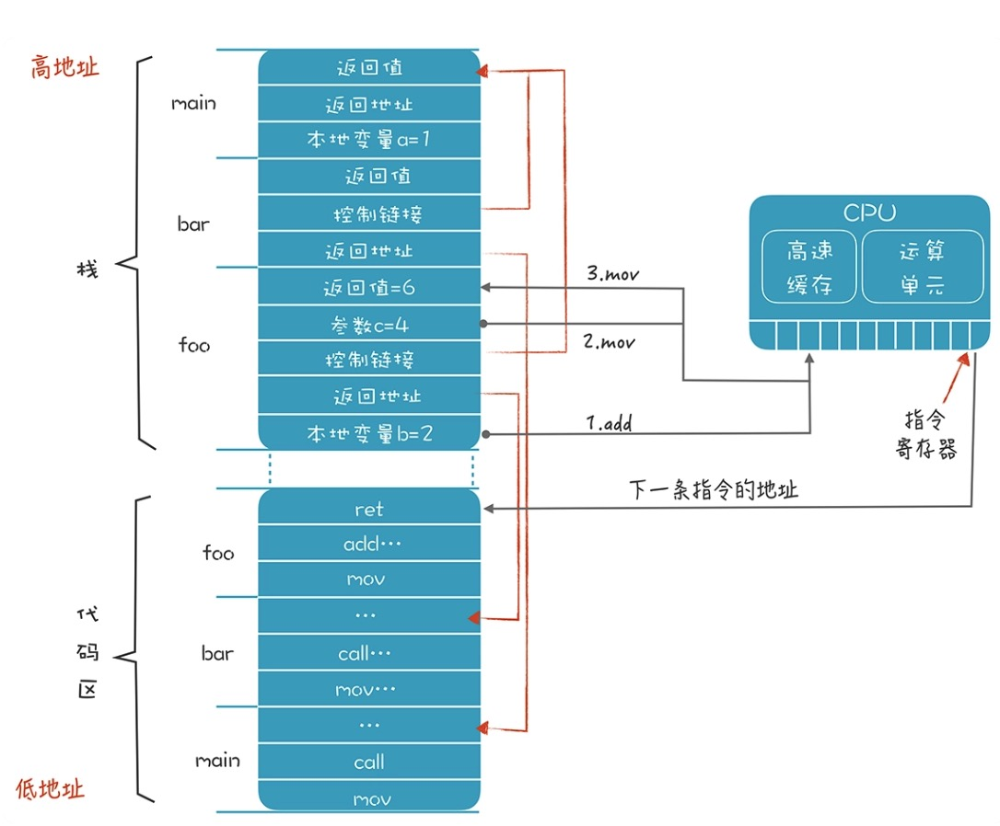

# 前端技术

词法，单词元素分割

语法分析，AST

语义分析

# 后端技术

具体语言 -> 中间代码（Intermediate Representation，IR）以及优化后的 IR -> 不同硬件的汇编代码

## 运行时

主要关注 CPU 内存 操作系统

### 运行时依赖的硬件

CPU 中主要关注 寄存器、高速缓存。

寄存器：CPU计算时临时存储的地方。高速缓存：批量读内存然后放入 高速缓存，提高CPU访问数据的速度。

内存：面对分配的内存，不同语言有不同的使用策略。通用的内存管理模式，以C语言为例：

地址由高到低
```
-- 内核空间
-- 环境变量

-- 栈：适合保存生存期比较短的数据，比如函数和方法里的本地变量

｜--
｜--

-- 堆：堆适合管理生存期较长的一些数据，这些数据在退出作用域以后也不会消失

-- 静态数据：保存程序中全局的变量和常量

-- 代码区：存放编译完成以后的机器码（汇编指令）
```

### 运行时依赖软件——操作系统

程序跟操作系统的关系比较微妙：一方面我们的程序可以编译成不需要操作系统也能运行，就像一些物联网应用那样，完全跑在裸设备上。

另一方面，有了操作系统的帮助，可以为程序提供便利，比如可以使用超过物理内存的存储空间，操作系统负责进行虚拟内存的管理。在存在操作系统的情况下，因为很多进程共享计算机资源，

### 运行细节

二进制由OS加载到内存代码区 -> 从低地址读取汇编代码指令顺序执行

栈 按作用域(函数)维度聚合为 帧，常见栈帧设计
```
高地址 -- 返回值    位置固定方便调用着拿数据
         入参数
         控制链接   上一个栈帧地址，方便访问上个作用域
         返回地址   执行完返回到哪个地址的指令继续执行
         本地变量1
低地址 -- 本地变量2
```

一个连续栈情况；每个栈桢的长度是不一样的
```
-- main -- 返回值
        -- 返回地址
        -- 本地变量 a...

-- bar -- 返回值
       -- 控制链接
       -- 返回地址

-- foo -- 返回值
       -- 入参
       -- 控制链接
       -- 返回地址
       -- 本地变量 f...
```


对应代码执行流程图
```c
int main(){
  int a = 1;
  bar();
}

int bar(){
    return foo(4) + 1;
}

int foo(int c){
    int b = 2;
    return b+c;
}
```

栈桢的大小和结构在编译时就能决定

在运行时，栈桢作为活动记录，不停地被动态创建和释放，这类维护工作可由操作系统完成

## 汇编
