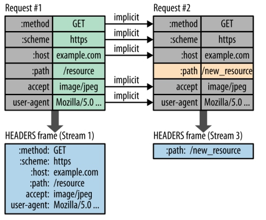

# 网络协议

| 七层       | 五层       | TCP/IP四层 | 每层的协议                                                   |
| ---------- | ---------- | ---------- | :----------------------------------------------------------- |
| 应用层     | 应用层     | 应用层     | DNS、FTP、TELNET远程终端、SMTP、POP3、IMAP、MIME、DHCP动态主机配置、SNMP简单网络管理协议 |
|            |            |            |                                                              |
| 表示层     |            |            |                                                              |
| 会话层     |            |            |                                                              |
| 运输层     | 运输层     | 运输层TCP  | TCP、UDP、ARQ                                                |
| 网络层     | 网络层     | 网络层IP   | IP、ARP、ICMP、IGMP、VPN、NAT                                |
| 数据链路层 | 数据链路层 | 网络接口层 |                                                              |
| 物理层     | 物理层     |            |                                                              |

下层协议为上层提供服务，上层协议可以基于底层协议设计

​	一个协议的实现需要依赖协议所在层次的下一层功能。简单的说，如果TCP需要依赖网际层协议IP，那么它就是传输层的协议。

​	如果RIP需要依赖传输层的UDP，那至少它应该是被定义在UDP之上的协议，但我认为它并不能算是应用层协议。举个例子，ICMP是网络层协议，但它需要依赖IP承载

​	**严格意义上说，根本就没有明确定义过这些协议的位置。学习这些协议关键是掌握它们在网络中的功能和如何应用它们。**

 

状态码：

202 Accepted，  400 Bad Request，  404 not found， 301 moved permanently，302 moved temporarily

 

 

## **1. 五层协议**

**应用层**：为特定应用程序提供数据传输服务，例如 HTTP、DNS 等。数据单位为报文。

 

**运输层**：提供的是**进程间**的通用数据传输服务。由于应用层协议很多，定义通用的运输层协议就可以支持不断增多的应用层协议。运输层包括两种协议：传输控制协议 TCP，提供面向连接、可靠的数据传输服务，数据单位为报文段；用户数据报协议 UDP，提供无连接、尽最大努力的数据传输服务，数据单位为用户数据报。TCP 主要提供完整性服务，UDP 主要提供及时性服务。（端到端）

 

**网络层**：为**主机间**提供数据传输服务，而运输层协议是为主机中的进程提供服务。网络层把运输层传递下来的报文段或者用户数据报封装成分组。（点到点）

 

**数据链路层**：网络层针对的还是主机之间的数据传输服务，而主机之间可以有很多链路，链路层协议就是为同一链路的节点提供服务。数据链路层把网络层传来的分组封装成帧。

 

**物理层**：考虑的是怎样在传输媒体上传输数据比特流，而不是指具体的传输媒体。物理层的作用是尽可能屏蔽传输媒体和通信手段的差异，使数据链路层感觉不到这些差异。

 

## **2. OSI**

其中表示层和会话层用途如下：

**表示层**：数据压缩、加密以及数据描述，这使得应用程序不必担心在各台主机中数据内部格式不同的问题。

**会话层**：建立及管理会话。

 

五层协议没有表示层和会话层，而是将这些功能留给应用程序开发者处理。

 

## **3. TCP/IP**

它只有四层，相当于五层协议中数据链路层和物理层合并为网络接口层。

 

现在的 TCP/IP 体系结构不严格遵循 OSI 分层概念，应用层可能会直接使用 IP 层或者网络接口层。

 

 

TCP/IP 协议族是一种沙漏形状，中间小两边大，IP 协议在其中占用举足轻重的地位。

 

 

## 4.数据在各层之间的传递过程

在向下的过程中，需要添加下层协议所需要的首部或者尾部，而在向上的过程中不断拆开首部和尾部。

 

数据链路层控制信息被分成两部分（帧首部，帧尾部），放到数据帧头尾。

 

 

 

 

 

# **交换方式**

- 电路交换到分组交换

电路交换：虚电路方法，分组数据像数据流一样顺序发送。

分组交换：路由；数据报方法，网络层。

存储转发思路：报文交换（**整个**报文传给下个节点，依次转发），分组交换（**报文分组**，每组进行报文交换）

 

# **物理层**

宽带接入技术：

非对称数字用户线ADSL，用数字技术对现有模拟电话用户线进行改造；

光纤同轴混合网HFC，基于有线电视网；

FFTx光纤到户，光——光分路器——光电装换ONU。

 

# **数据链路层**

局域网内通信（同一个网络），不涉及网络层（不经过路由器），属于数据链路层范围

 

数据链路层使用的信道：点对点信道，广播信道

## *点对点*

网络适配器：包括数据链路层和物理层功能

 

三个基本问题：封装成帧、透明传输，差错检测。

**成帧**：控制字符SOH、EOT表示帧开始和结尾；

**透明传输**：帧数据中的SOH、EOT进行转义，前面加上ESC

**差错检测**：循环冗余检验CRC（只能实现无比特差错，其他传输差错不能解决）。

 

**点对点协议PPP：用户与ISP通信所使用的数据链路层协议，****PPPoE** **。**

 

## *广播及协议*

数据链路层在局域网

**以太网是最为著名的局域网，逻辑上为总线网（物理上可能为总线网（传统的以太网）或星型以太网）**

特点：共享信道

 

**以太网标准：MAC协议（媒体接入控制）**

 

**适配器（一般集成了数据链路层和物理层功能），PC上适配器为网卡**

 

1. CSMA/CD载波监听多点接入/碰撞检测

​	同一时间**只能一台计算机发送数据**，否则信息干扰，不允许多个同时发送。

​	发送前检测信道，空闲立即发送；边发送边检测，一发现碰撞就停止发送。

2. CSMA/CA

   **WLAN无线局域网**使用CSMA/CA碰撞避免，不能使用碰撞检测（无线信道特点），只要开始发送，完整一帧必须发送完毕，一旦发生碰撞，这段时间信道资源就被浪费，因此WLAN尽量减少碰撞发生

 

## *以太网扩展*

1. **物理层扩展：集线器+光纤**

2. 数据链路层扩展：

- **网桥 P95，使各个网的碰撞域隔开**		

- **以太网交换机：多接口的网桥**

- **虚拟局域网：局域网提供的一种服务，能让不在一条交换机上的PC处于逻辑上的局域网内，避免广播风暴。**

 

集线器、网桥、交换机、虚拟局域网

# IP网络层

​	网络层向上只提供简单灵活的、无连接的、尽最大努力交互的数据报服务。

​	使用 **IP 协议**，可以把异构的物理网络连接起来，使得在网络层看起来好像是一个统一的网络。

网络连接在各层实现：

- 物理层：**转发器**

- 数据链路层：**网桥、交换机**

- 网络层：**路由器**

- 网络层以上：**网关，协议转换**

 

**与 IP 配套的协议（注意，可能并不属于网络层）**

 

## ARP

地址解析协议 ARP（Address Resolution Protocol）

​	同一局域网内，由IP地址找到MAC地址

​	每个主机都有一个 ARP 高速缓存，里面有**本局域网**上的各主机和路由器的 IP 地址到硬件地址的映射表。

​	但是 ARP 高速缓存中没有该 IP 地址到 MAC 地址的映射，此时主机 A 通过**广播**的方式发送 ARP 请求分组，主机 B 收到该请求后会发送 ARP 响应分组给主机 A 告知其 MAC 地址，随后主机 A 向其高速缓存中写入主机 B 的 IP 地址到 MAC 地址的映射。

## ICMP

网际控制报文协议 ICMP（Internet Control Message Protocol）**

为了**有效转发**IP数据报，**提高交付成功**机会：ICMP差错报告报文，询问报文。

 

​	ICMP报文装在IP数据报的数据部分。ICMP差错报告报文：IP数据报首部的校验和并不检验IP数据报内容，不能保证ICMP传输后不产生差错，所以需要ICMP差错报告。

​	ICMP询问报文：主机向另一个主机询问信息。

​	ICMP应用举例：分组网间探测PING应用，应用层直接使用网络层协议ICMP。（没用到TCP/UDP）

Java.net.InetAddress.isReachable(timeout)  

Linux有另一种探测网络连通的命令：traceroute

## 子网划分

为什么要划分子网？

IP地址有两种：有分类的三级IP地址：网络号，子网号，主机号。子网掩码。

CIDR无分类IP地址：IP/前缀位数

IP地址分为五类，A类保留给政府机构，B类分配给中等规模的公司，C类分配给任何需要的人，D类用于组播，E类用于实验，各类可容纳的地址数目不同。

IPv4地址分为A,B,C,D,E类:

A类:1.0.0.0~126.255.255.255,默认子网掩码255.0.0.0 

(其中127.0.0.0~127.255.255.255为环回地址,用于本地环回测试等用途)；

B类:128.0.0.0~191.255.255.255,默认子网掩码255.255.0.0；

C类:192.0.0.0~223.255.255.255,默认子网掩码255.255.255.0；

D类:224.0.0.0~239.255.255.255,一般于用**组播**

E类:240.0.0.0~255.255.255.255(其中255.255.255.255为全网广播地址),E类地址一般用于研究用途..

 

**IPv4中还有一种私有地址,即比如内部局域网所用的地址,分别为:**

10.0.0.0~10.255.255.255；A类中保留的，西电内部IP长这样

172.16.0.0~172.31.0.0；B类

192.168.0.0~192.168.255.255     c类中保留的

 

**无分类编址**

**128.14.35.7/20 表示前20位是网络前缀**

## **IP数据报格式与MAC帧格式**

 

 

1-4字节：版本；首部长度；区分服务；**总长度**，整个数据报长度。

5-8分片有关的信息，数据链路层规定了帧数据字段最大长度，IP数据报总长不能超过MTU，	过长的IP报得分片处理。

**标识**：分片后的数据报具有相同标识，以供能重新组装。

**标志**：是否还有分片。

**片偏移**：在原始数据报中的偏移位置。

9-12**生存时间（可存活时间）**：TTL，它的存在是为了防止无法交付的数据报在互联网中不断兜圈子。以路由器跳数为单位，当 TTL 为 0 时就丢弃数据报。

**协议**：指出携带的数据使用何种协议，应该上交给哪个过程处理，例如 ICMP、TCP、UDP 等。

**首部检验和**：只校验首部，因为数据报每经过一个路由器，都要重新计算检验和，因此检验和不包含数据部分可以减少计算的工作量。

13-16源地址, 17-20目的地址，IP地址，32位，共4个字节

 

## **路由及协议（**注意，可能并不属于网络层）

**路由结构**

路由器从功能上可以划分为：路由选择和分组转发。

分组转发结构由三个部分组成：交换结构、一组输入端口和一组输出端口。

 

​	从数据报的首部提取目的主机的 IP 地址 D，得到目的网络地址 N。网络地址和IP地址是两个概念。

​	若 N 就是与此路由器直接相连的某个网络地址，则进行直接交付；

​	若路由表中有到达网络 N 的路由，则把数据报传送给路由表中所指明的下一跳路由器；

​	上面情况都不存在，若路由表中有一个默认路由，则把数据报传送给路由表中所指明的默认路由器；否则报告转发分组出错。

 

 

 

​	**分层次的路由选择协议：内部路由协议(RIP,OSPF)，外部路由协议(BRP)。自治系统（autonomous system，AS）内部使用自己的独立路由协议，各自治系统间采用另一种独立路由协议。**

 

**内部路由协议：**

**1.** **RIP**：

​	距离（跳数）算法**bellman—Ford**，单源最短路径。设X为AB最短路径上一点，则A->X,X->B也都分别是AX，XB的最短路径。

 

​	RIP 是一种基于距离向量的路由选择协议。距离是指跳数，直接相连的路由器跳数为 1。跳数最多为 15，超过 15 表示不可达。RIP 按固定的时间间隔仅和相邻路由器交换自己的路由表，经过若干次交换之后，所有路由器最终会知道到达**本自治系统**中任何一个网络的最短距离和下一跳路由器地址。

 

距离向量算法：见P153

 

​	RIP 协议实现简单，开销小。但是 RIP 能使用的最大距离为 15，限制了网络的规模。并且当网络出现故障时，要经过比较长的时间才能将此消息传送到所有路由器。

 

**2.** **OSPF open shortest path first开放最短路径优先：采用的Dijkstra**

 

 

**外部路由（网关）协议BGP：**

AS 之间的路由选择很困难，主要是由于：

- 互联网规模很大；

- 各个 AS 内部使用不同的路由选择协议，无法准确定义路径的度量；

- AS 之间的路由选择必须考虑有关的策略，比如有些 AS 不愿意让其它 AS 经过。

- BGP 只能寻找一条比较好的路由，而不是最佳路由。

 

每个 AS 都必须配置 BGP 发言人，通过在两个相邻 BGP 发言人之间建立 TCP 连接来交换路由信息。

 

 

## **网络地址转换NAT与虚拟专用网VPN**

局域网内专用地址只能为本地地址，不能作为全球地址，IP不可被寻址。

VPN是**特殊的局域网**

 

VPN：本机构专用局域网，利用公用的互联网作为本机构通信载体，IP隧道技术

 

 

 

 

如果专用网主机**同时想与互联网其他主机通信**，专用网主机就得有个全球地址

NAT（NAPT网络地址与端口号转换，用上了**上层的端口号**）并不严格属于网络层技术

**NAT路由器**可能将几个不同的专用地址转为相同全球地址，但端口不一样，即把内部主机对外为一个进程，使得多个专用网内部的主机共用一个全球 IP 地址。使用端口号的 NAT 也叫做网络地址与端口转换 NAPT。

 

*共用一个全球IP地址，使用端口号区分内部的不同主机*

# **运输层**

面向通信的最高层，也是面向用户的最底层。互联时，只有主机的协议栈在运输层，而网络核心在路由、分组转发只用到下三层（物理层，数据链路层，网络层）功能。

为什么需要运输层：

1. 因为通信终端不是主机，而是主机中的进程，运输层是端到端的通信；

2. 网络层IP数据报首部校验和，只校验首部是否出现差错，而不检查内容，所以运输层需要对数据内容进行差错检测。

 

## **UDP**

用户数据报协议 UDP（User Datagram Protocol），无连接。只在IP数据报服务基础上增加端到端和差错检测功能。

面向报文：一次交付一个完整的报文（不管报文多长多短）。对IP传上的报文，UDP去除首部后就直接交付上层。

有差错检测但没有拥塞控制。IP数据报检验和只校验首部，UDP把首部和数据部分一起校验。

 

不向上下层进行传递

## **TCP**

**面向连接，**软件层面的抽象连接，并不是物理上的

**全双工**，进行双方随时可以发送数据，TCP连接两端都设有发送、接收缓存。

**面向字节流，上面数据当做字节流处理。InputStream，直接可以对上面数据流进行处理。**

 

**TCP的连接，软件所提供的一种抽象！！！！**

套接字socket = IP地址：端口号   （socket含义很多，注意区分背后的意思）

TCP连接 ::= {**socket1**，**socket2**} 

 

**全双工的可靠传输原理及实现**

停止等待协议：发送方等待接收方的接收确认，超时未收到接收确认，发送发重传。自动重传请求ARQ

连续ARQ

 

## **TCP报文**

 

 

端口号：16位表示

 

**序号** ：字节流第一个字节的编号，例如序号为 301，表示第一个字节的编号为 301。

**确认号** ：期望收到的下一个报文段的序号。例如 B 正确收到 A 发送来的一个报文段，序号为 501，携带的数据长度为 200 字节，因此 B 期望下一个报文段的序号为 701，B 发送给 A 的确认报文段中确认号就为 701。

**数据偏移** ：指的是数据部分距离报文段起始处的偏移量，实际上指的是首部的长度。

**紧急URG：**

**确认 ACK** ：当 ACK=1 时**确认号**字段有效，否则无效。TCP 规定，在连接建立后所有传送的报文段都必须把 ACK 置 1。

**推送PSH:**

**同步 SYN** ：在连接建立时用来同步序号。当 SYN=1，ACK=0 时表示这是一个连接请求报文段。若对方同意建立连接，则响应报文中 SYN=1，ACK=1。

**终止 FIN** ：用来释放一个连接，当 FIN=1 时，表示此报文段的发送方的数据已发送完毕，并要求释放运输连接。

**窗口** ：窗口值作为接收方**让发送方**设置其发送窗口的依据。之所以要有这个限制，是因为接收方的数据缓存空间是有限的。流量控制

 

## **可靠传输，流量控制：滑动窗口**

 

 

滑动窗口以字节为单位。

​	窗口发送，接收**缓存区数据**的一部分。发送方和接收方各有一个窗口，接收方通过 TCP 报文段中的窗口字段告诉发送方自己的窗口大小，发送方根据这个值和其它信息设置自己的窗口大小。

 

​	发送窗口内的字节都允许被发送，接收窗口内的字节都允许被接收。如果发送窗口左部的字节已经发送并且收到了确认，那么就将发送窗口向右滑动；接收窗口的滑动类似，接收窗口左部字节已经发送确认并交付主机，就向右滑动接收窗口。

 

​	接收窗口只会**对窗口内按序到达的最后一个字节**进行确认，例如接收窗口已经收到的字节为 {30,31, 34, 35}，其中 {31} 按序到达，而 {34, 35} 就不是，因此只对字节 31 进行确认。发送方得到一个字节的确认之后，就知道这个字节之前的所有字节都已经被接收。

 

 

 

## **拥塞控制**

如果网络出现拥塞，分组将会丢失，此时发送方会继续重传，从而导致网络拥塞程度更高。因此当出现拥塞时，应当控制发送方的速率。这一点和流量控制很像，但是出发点不同。流量控制是为了让接收方能来得及接受，而拥塞控制是为了降低整个网络的拥塞程度。

**TCP 主要通过四种算法来进行拥塞控制：慢开始、拥塞避免、快重传、快恢复。**

发送方需要维护一个叫做**拥塞窗口（cwnd）**的状态变量。考虑到接收方接受能力，发送窗口可能小于拥塞窗口。

 

 	**慢开始与拥塞避免**

开始时发送窗口大小为拥塞窗口，令 cwnd=1，发送方只能发送 1 个报文段；当收到确认后，将 cwnd 加倍，因此之后发送方能够发送的报文段数量为：2、4、8 ...

 

注意到慢开始每个轮次都将 cwnd 加倍，这样会让 cwnd 增长速度非常快，从而使得发送方发送的速度增长速度过快，网络拥塞的可能也就更高。设置一个慢开始门限 ssthresh，当 cwnd >= ssthresh 时，进入拥塞避免，每个轮次只将 cwnd 加 1。

​	如果出现了超时，则令 ssthresh = cwnd/2，然后重新执行慢开始。

 

​	**快重传与快恢复**

在接收方，要求每次接收到报文段都应该发送对已收到有序报文段的确认，例如已经接收到 M1 和 M2，此时收到 M4，应当发送对 M2 的确认。

 

​	在发送方，如果收到三个重复确认，那么可以确认下一个报文段丢失，例如收到三个 M2 ，则 M3 丢失。此时执行快重传，立即重传下一个报文段。

​	在这种情况下，只是丢失个别报文段，而不是网络拥塞，因此执行快恢复，令 ssthresh = cwnd/2 ，cwnd = ssthresh，注意到此时直接进入拥塞避免。

 

 

## **Tcp三次握手与四次挥手**

## 

SYN-SENT同步已发送，SYN-RCVD同步已接收，ESTAB-LISHED已建立连接

- 首先 B 处于 LISTEN（监听）状态，等待客户的连接请求。

-  A 向 B 发送连接请求报文段，SYN=1，ACK=0，选择一个初始的序号 seq=x

-  B 收到连接请求报文段，如果同意建立连接，则向 A 发送连接确认报文段，SYN=1，ACK=1，确认号为 ack=x+1，同时也选择一个初始的序号 seq=y。

-  A 收到 B 的连接确认报文段后，还要向 B 发出确认，确认号为 ack=y+1，序号为 seq=x+1。

-  B 收到 A 的确认后，连接建立。

 

**三次握手的原因**

​	第三次握手是为了防止失效的连接请求到达服务器，让服务器错误打开连接。确保只有一个有效连接。

​	失效的连接请求是指，客户端发送的连接请求在网络中滞留，客户端因为没及时收到服务器端发送的连接确认，因此就重新发送了连接请求。滞留的连接请求并不是丢失，之后还是会到达服务器。如果不进行第三次握手，那么服务器会误认为客户端重新请求连接，然后打开了连接。但是并不是客户端真正打开这个连接，因此客户端不会给服务器发送数据，这个连接就白白浪费了。

 

 

 

 

- l A 发送连接释放报文段，FIN=1。

- l B 收到之后发出确认，此时 TCP 属于半关闭状态，B 能向 A 发送数据但是 A 不能向 B 发送数据。

- l 当 B 不再需要连接时，发送连接释放请求报文段，FIN=1。重复确认号ack=u+1

- l A 收到后发出确认，序号也为seq=u+1。进入TIME-WAIT状态，等待 2 MSL（最大报文存活时间）后释放连接。

- l B 收到 A 的确认后释放连接。

 

 

**四次挥手的原因**

​	客户端发送了 FIN 连接释放报文之后，服务器收到了这个报文，就进入了 CLOSE-WAIT 状态，此时A没有需要发送的数据。这个状态是为了让服务器端发送还未传送完毕的数据，传送完毕之后，服务器会发送 FIN 连接释放报文。

 

**TIME_WAIT**

​	客户端接收到服务器端的 FIN 报文后进入此状态，此时并不是直接进入 CLOSED 状态，还需要等待一个时间计时器设置的时间 2MSL。这么做有两个理由：

​	确保最后一个确认报文段能够到达。如果 B 没收到 A 发送来的确认报文段，那么就会重新发送连接释放请求报文段，A 等待一段时间就是为了处理这种情况的发生。

​	等待一段时间是为了让本连接持续时间内所产生的所有报文段都从网络中消失，包括连接建立时失效的连接请求。

 

**Keepalive timer**

​	用户判断客户主机是否故障，如果故障，服务器关闭连接。

 

 

# **应用层**

## **文件传送协议FTP,简单TFTP**

FTP 在运输层使用 TCP，并且需要建立两个并行的TCP 连接：控制连接和数据连接。控制连接在整个会话期间一直保持打开，而数据连接在数据传送完毕之后就关闭。控制连接使用端口号 21，数据连接使用端口号 20。

 

## **SMTP**

 

​        SMTP  		 @qq.com          向                	@163.com  	POP3

 

## 动态主机配置协议 DHCP

​	DHCP 提供了即插即用的连网方式，用户不再需要去手动配置 IP 地址等信息。DHCP 配置的内容不仅是 IP 地址，还包括子网掩码、默认路由器 IP 地址、域名服务器的 IP 地址。

 

​	工作方式如下：需要 IP 地址的主机从UDP的68端口广播发送 DHCP 发现报文（将目的地址置为全 1，即 255.255.255.255:67，源地址设置为全 0，即 0.0.0.0:68），

​	多个DHCP 服务器收到**DHCP发现报文**之后，发出**DHCP提供报文，**客户收到多个提供报文从中选取一个，并向对应的服务器发送DHCP请求报文。服务器发送确认，客户便可使用IP地址。

 

# **HTTP**

## **浏览器请求web服务流程：**

从上到下：

**DNS 解析域名：**

​	路由器接收到包含 DNS 查询报文的以太网帧后，抽取出 IP 数据报，并根据转发表决定该 IP 数据报应该转发的路由器。路由器具有内部网关协议（RIP、OSPF）和外部网关协议（BGP）这两种路由选择协议，因此路由表中已经配置了网关路由器到达 DNS 服务器的路由表项。

路由找到 DNS 服务器之后，DNS 服务器抽取出 DNS 查询报文，并在 DNS 数据库中查找待解析的域名。找到 DNS 记录之后，发送 DNS 回答报文，将该回答报文放入 UDP 报文段中，然后放入 IP 数据报中，通过路由器反向转发回网关路由器，到达主机。

 

**HTTP 请求页面：**

​	有了HTTP 服务器的 IP 地址之后，与 HTTP 服务器进行三次握手来建立连接。（连接过程中需要ARP 解析双方MAC 地址）

​	连接建立后，主机就能够生成 TCP 套接字，该套接字将用于向 Web 服务器发送 HTTP GET 报文。HTTP 服务器从 TCP 套接字读取 HTTP GET 报文，生成一个 HTTP 响应报文，将 Web 页面内容放入报文主体中，发回给主机。

​	浏览器收到 HTTP 响应报文后，抽取出 Web 页面内容，之后进行渲染，显示 Web 页面。

 

 

## **报文结构**

 

**请求报文** 第一行为请求行，**【方法口URL口版本】** GET  URL  HTTP/1.1

 服务器一般不主动关闭TCP连接，HTTP/1.1默认使用长连接：Connection: keep-alive。客户端可以使用header Connection: close让服务器处理后关闭TCP连接

 

**响应报文** 第一行为状态行，**【版本 状态码 状态描述短语】** HTTP/1.1  200  OK

 

 

**GET 和 POST 的区别**

GET 用于获取资源，而 POST 用于传输实体主体。

GET 和 POST 的请求都能使用额外的参数，但是 GET 的参数是以查询字符串出现在 URL中，而 POST 的参数存储在报文主体中。

 

 

**状态码：**

202 Accepted，  400 Bad Request，  404 not found， 301 moved permanently，302 moved temporarily

服务器返回的 响应报文 中第一行为状态行，包含了状态码以及原因短语，用来告知客户端请求的结果。

 

| **状态码** | **类别**                         | **原因短语**                     |         |
| ---------- | -------------------------------- | -------------------------------- | ------- |
| 1XX        | Informational（信息性状态码）    | 接收的请求正在处理               |         |
| 2XX        | Success（成功状态码）            | 请求正常处理完毕                 | 200,202 |
| 3XX        | Redirection（重定向状态码）      | 需要进行附加操作以完成请求       | 301,302 |
| 4XX        | Client Error（客户端错误状态码） | 客户端错误，服务器无法处理请求   | 400,404 |
| 5XX        | Server Error（服务器错误状态码） | 服务器错误，服务器对请求处理出错 |         |

 

**1XX**

​	100 Continue ：表明到目前为止都很正常，客户端可以继续发送请求或者忽略这个响应。

 

**2XX 成功**

​	200 OK

​	204 No Content ：请求已经成功处理，但是返回的响应报文不包含实体的主体部分。一般在只需要从客户端往服务器发送信息，而不需要返回数据时使用。

​	206 Partial Content ：表示客户端进行了范围请求，响应报文包含由 Content-Range 指定范围的实体内容。

 

**3XX 重定向**

​	301	Moved Permanently ：永久性重定向

​	302	Moved temporarily ：临时性重定向

​	303 See Other ：和 302 有着相同的功能，但是 303 明确要求客户端应该采用 GET 方法获取资源。注：虽然 HTTP 协议规定 301、302 状态下重定向时不允许把 POST 方法改成 GET 方法，但是大多数浏览器都会在 301、302 和 303 状态下的重定向把 POST 方法改成 GET 方法。

​	304 Not Modified ：如果请求报文首部包含一些条件，例如：If-Match，If-Modified-Since，If-None-Match，If-Range，If-Unmodified-Since，如果不满足条件，则服务器会返回 304 状态码。

​	307 Temporary Redirect ：临时重定向，与 302 的含义类似，但是 307 要求浏览器不会把重定向请求的 POST 方法改成 GET 方法。

 

**4XX 客户端错误**

​	400 Bad Request ：请求报文中存在语法错误。

​	401 Unauthorized ：该状态码表示发送的请求需要有认证信息（BASIC 认证、DIGEST 认证）。如果之前已进行过一次请求，则表示用户认证失败。

​	403 Forbidden ：请求被拒绝。

​	404 Not Found

 

**5XX 服务器错误**

​	500 Internal Server Error ：服务器正在执行请求时发生错误。

​	503 Service Unavailable ：服务器暂时处于超负载或正在进行停机维护，现在无法处理请求。

 

 

## **通信数据转发**

1. 代理

代理服务器接受客户端的请求，并且转发给其它服务器。使用代理的主要目的是：缓存、网络访问控制以及访问日志记录。

代理服务器分为正向代理和反向代理两种，用户察觉得到正向代理的存在，而反向代理一般位于内部网络中，用户察觉不到。

2. 网关

与代理服务器不同的是，网关服务器会将 HTTP 转化为其它协议进行通信，从而请求其它非 HTTP 服务器的服务。

3. 隧道

使用 SSL 等加密手段，为客户端和服务器之间建立一条安全的通信线路。

 

 

## **HTTPS、SSL、TLS**

**SSL，Secure Sockets Layer 安全套接层**

​	HTTP 协议是明文的，存在很多缺点——比如传输内容会被偷窥（嗅探）和篡改。发明 SSL 协议，就是为了解决这些问题。到了1999年，SSL 因为应用广泛，已经成为互联网上的事实标准。IETF 就在那年把 SSL 标准化。标准化之后的名称改为 TLS（“Transport Layer Security”），中文叫做“**运****输层安全**”。很多相关的文章都把这两者并列称呼（SSL/TLS），因为这两者可以视作同一个东西的不同阶段。

 

​	应用层“HTTP 协议”和运输层“SSL/TLS 协议”的组合。你可以把 HTTPS 大致理解为——“HTTP over SSL”或“HTTP over TLS”。

 

​	HTTP 对 TCP 连接的使用，分为两种方式：俗称“短连接”和“长连接”（“长连接”又称“持久连接”，洋文叫做“Keep-Alive”或“Persistent Connection”）

​	假设有一个网页，浏览器开始分析这个网页的源码，知道这个页面包含很多外部资源（图片、CSS、JS）。然后针对【每一个】外部资源，再分别发起一个个 TCP 连接，把这些文件获取到本地（同样的，每抓取一个外部资源后，相应的 TCP 就断开）

​	相反，如果是“长连接”的方式，浏览器也会先发起一个 TCP 连接去抓取页面。但是抓取页面之后，该 TCP 连接并不会立即关闭，而是暂时先保持着（所谓的“Keep-Alive”）。然后浏览器分析 HTML 源码之后，发现有很多外部资源，就用刚才那个 TCP 连接去抓取此页面的外部资源。

 

 

所谓的“对称加密技术”，意思就是说：“加密”和“解密”使用【相同的】密钥。

所谓的“非对称加密技术”，意思就是说：“加密”和“解密”使用【不同的】密钥。这玩意儿比较难理解，也比较难想到。当年“非对称加密”的发明，还被誉为“密码学”历史上的一次革命。

 

**HTTPs 采用的加密方式**

HTTPs 采用混合的加密机制，非对称和对称加密结合，使用*双发公开的密钥*加密用于传输*双方的对称密钥*来保证安全性，之后使用对称密钥加密进行通信来保证效率。

 

 

## **HTTP版本**

**HTTP/1.0 与 HTTP/1.1 的区别**

详细内容请见上文

 

HTTP/1.1 默认是**长连接**

HTTP/1.1 支持管线化处理

HTTP/1.1 支持**同时打开多个 TCP 连接**

HTTP/1.1 支持虚拟主机，HTTP/1.1 使用虚拟主机技术，使得一台服务器拥有多个域名，在逻辑上可以看成多个服务器。

 

HTTP/1.1 新增状态码 100

HTTP/1.1 支持分块传输编码

HTTP/1.1 新增缓存处理指令 max-age

 

**HTTP/2.0**

HTTP/1.x 实现简单是以牺牲性能为代价的：

客户端需要使用多个连接才能实现并发和缩短延迟；

不会压缩请求和响应首部，从而导致不必要的网络流量；

不支持有效的资源优先级，致使底层 TCP 连接的利用率低下。

 

HTTP2.0特点：

**二进制分帧层**

HTTP/2.0 将报文分成 HEADERS 帧和 DATA 帧，它们都是二进制格式的。

[

 

在通信过程中，只会有一个 TCP 连接存在，它承载了任意数量的双向数据流（Stream）。

一个数据流都有一个唯一标识符和可选的优先级信息，用于承载双向信息。

消息（Message）是与逻辑请求或响应消息对应的完整的一系列帧。

帧（Fram）是最小的通信单位，来自不同数据流的帧可以交错发送，然后再根据每个帧头的数据流标识符重新组装。

 

**服务端推送**

HTTP/2.0 在客户端请求一个资源时，会把相关的资源一起发送给客户端，客户端就不需要再次发起请求了。例如客户端请求 page.html 页面，服务端就把 script.js 和 style.css 等与之相关的资源一起发给客户端。

 

 

**首部字段表与压缩**

HTTP/1.1 的首部带有大量信息，而且每次都要重复发送。

HTTP/2.0 要求客户端和服务器同时维护和更新一个包含之前见过的**首部字段表**，从而避免了重复传输。

不仅如此，HTTP/2.0 也使用 Huffman 编码对首部字段进行压缩。

[

 

 

# **网络安全**

**公钥系统**

密钥登录其他机器了。所谓公钥登录，原理很简单，就是用户将自己的公钥储存在远程主机上:登录的时候，远程主机会向用户发送一段随机字符串，用户用自己的私钥加密后，再发回来。

远程主机用事先储存的公钥进行解密，如果成功，就证明用户是可信的，直接允许登录shell. 不再要求密码:

公钥所有人知道，私钥只要自己知道

A向B发送信息，A使用B**公钥加密**信息，B收到使用**私钥解密**

A数字签名，使用A的私钥加密，B得到文件使用A的公钥解密

 

**各层安全协议**

- **网络层安全协议IPsec**

- **运输层安全协议**

SSL安全套接字层，TLS运输层安全

- **应用层**

**PGP为电子邮件提供安全服务**

 

- **防火墙**

**分组过滤路由器，应用网关（代理服务器，应用层数据过滤）**

 

**鉴别**

散列摘要，MD5（报文摘要，message digest）

SHA(Secure Hash Algorithm)

