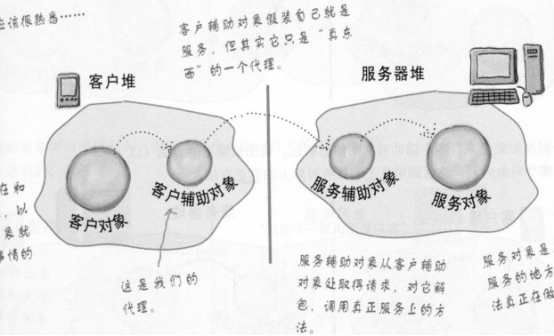

# Option 模式

使用闭包函数改变成员
```go
type Opt func(options *cache)

type Entity struct {
	count int
}

func SetCount(count int) Opt {
	return func(e *Entity){
		e.count = count
	}
}

func NewEntity(opts ...Opt) (*Entity, error) {
	e := &Entity{}
	for _, each := range opts {
		each(e)
	}
	return e, nil
}
```

# **设计模式——解决方案，不是类图的排列组合，不靠类图关系区分。**


 

 

 

# **策略模式**

 

『策略模式』 定义了算法族，分别封装起来，让它们之间可以互相替换，此模式让算法的变化独立于使用算法的客户。

```java
///////////抽象类，具体类
public abstract class Duck {
	FlyBehavior flyBehavior;           //包含行为类，实现行为算法，初始化由set完成
	QuackBehavior quackBehavior;
	public Duck() {
	}

	public void setFlyBehavior(FlyBehavior fb) {
		flyBehavior = fb;
	}
	public void setQuackBehavior(QuackBehavior qb) {
		quackBehavior = qb;
	}

	abstract void display();

	public void performFly() {
		flyBehavior.fly();
	}
	public void performQuack() {
		quackBehavior.quack();
	}
	public void swim() {
		System.out.println("All ducks float, even decoys!");
	}
}


////////////具体类
public class ModelDuck extends Duck {
	public ModelDuck() {
		flyBehavior = new FlyNoWay();
		quackBehavior = new Quack();
	}

	public void display() {
		System.out.println("I'm a model duck");
	}
}

////////////接口定义
public interface FlyBehavior{
	public void fly();
}

public interface QuackBehavior{
	public void quack();
}


//////////实现接口方法
public class FlyWithWings implements FlyBehavior {
	public void fly() {
		System.out.println("I'm flying!!");
	}
}

public class MuteQuack implements QuackBehavior {
	public void quack() {
		System.out.println("<< Silence >>");
	}
}

```

 

 

 

# **模板方法模式——规定算法步骤**

 

**Final方法不允许子类覆盖**

 

 

 

 

模板方法模式：父类方法中定义算法骨架，而将骨架中的步骤交给子类具体实现。

 

```java
public abstract class CaffeineBeverage {
    final void prepareRecipe() {
        boilWater();
        brew();
        pourInCup();
        addCondiments();
    }

    abstract void brew();
    abstract void addCondiments();

    void boilWater() {
        System.out.println("boilWater");
    }
    void pourInCup() {
        System.out.println("pourInCup");
    }
}


public class Coffee extends CaffeineBeverage {
    @Override
    void brew() {
        System.out.println("Coffee.brew");
    }
    @Override
    void addCondiments() {
        System.out.println("Coffee.addCondiments");
    }
}
public class Tea extends CaffeineBeverage {
    @Override
    void brew() {
        System.out.println("Tea.brew");
    }
    @Override
    void addCondiments() {
        System.out.println("Tea.addCondiments");
    }
}
```

 

JDK中的运用

Comparable接口，定义了compareTo方法，需要实现；其他集合类中的静态**sort(**)是排序模板。


 

 

 

 

 

# **观察者——让你的对象知悉现况**


本质：主题注册多个观察者，两个接口！


```java
//观察对象接口
public interface Subject {
	public void registerObserver(Observer o);
	public void removeObserver(Observer o);
	public void notifyObservers();
}
//观察者共同接口
public interface Observer {
	public void update(float temp, float humidity, float pressure);
}


//主题的特定实现
public class WeatherData implements Subject {
	private ArrayList<Observer> observers;
	private float temperature;
	private float humidity;
	private float pressure;
	
	public WeatherData() {
		observers = new ArrayList<Observer>();
	}
	public void registerObserver(Observer o) {
		observers.add(o);
	}
	public void removeObserver(Observer o) {
		int i = observers.indexOf(o);
		if (i >= 0) {
			observers.remove(i);
		}
	}
	public void notifyObservers() {
		for (Observer observer : observers) {
			observer.update(temperature, humidity, pressure);
		}
	}

	public void setMeasurements(float temperature, float humidity, float pressure) {
		this.temperature = temperature;
		this.humidity = humidity;
		this.pressure = pressure;
		measurementsChanged();
	}
	
	public void measurementsChanged() {
		notifyObservers();
	}

}


//具体的observer
public class ForecastDisplay implements Observer {
	private float currentPressure = 29.92f;  
	private float lastPressure;

	public void update(float temp, float humidity, float pressure) {
        lastPressure = currentPressure;
		currentPressure = pressure;
	}
	
	public static void main(String[] args){
	    WeatherData weatherData = new WeatherData();
	    ForecastDisplay forecastDisplay = new ForecastDisplay();
		
		weatherData.registerObserver(forecastDisplay);
	}
}
```

 

java.util.Observer  和  java.util.Observable  工具实现观察者，observer是接口，observable是类，主题实现需要继承observable


一个主题包含多个观察者，观察者们包含同个主题。

 

观察者模式 ——在对象之间定义**一对多的依赖**，这样一来，当一个对象改变状态，依赖它的对象都会收到通知，并自动更新。

```java
//JDK 中的Observable类，实现了notifyObservers(),addObserver(),setChanged()等方法，主题直接继承
public class WeatherData extends Observable {
	private float temperature;
	private float humidity;
	private float pressure;
	
	public void setMeasurements(float temperature, float humidity, float pressure) {
		this.temperature = temperature;
		this.humidity = humidity;
		this.pressure = pressure;
		measurementsChanged();
	}
	public void measurementsChanged() {
		setChanged();
		notifyObservers();
	}
}

//观察者，java.util.Observable 配合接口java.util.Observer使用
public interface Observer{
    public void update(Observable o, Object arg);
}

public class ForecastDisplay implements Observer {
	private float currentPressure = 29.92f;  
	private float lastPressure;

    public void update(Observable observable, Object arg) {
		if (observable instanceof WeatherData) {
			WeatherData weatherData = (WeatherData)observable;
			
			lastPressure = currentPressure;
			currentPressure = weatherData.getPressure();
		}
	}
}
```

 

JDK中的运用

Swing，GUI监听

**接口****java.util.Observer** **,** **类****Observable**

 

# **装饰者——装饰，增强**


装饰者和被装饰对象有相同的超类型。

 

装饰者模式 **动态地将责任附加到对象上。若要扩展增强功能**，装饰者提供了比**继承**更有弹性的替代方案。

 


```java 
//定义被装饰对象
public abstract class Beverage {
	public enum Size { TALL, GRANDE, VENTI };
	Size size = Size.TALL;
	String description = "Unknown Beverage";
  
	public String getDescription() {
		return description;
	}
	
	public void setSize(Size size) {
		this.size = size;
	}
	
	public Size getSize() {
		return this.size;
	}
 
	public abstract double cost();
}

//一个具体的被装饰者
public class Decaf extends Beverage {
	public Decaf() {
		description = "Decaf Coffee";
	}
 
	public double cost() {
		return 1.05;
	}
}

//-----------------------------------------------------------------------------------------------------------
//装饰者类
public abstract class CondimentDecorator extends Beverage {
	public Beverage beverage;
	public abstract String getDescription();
	
	public Size getSize() {
		return beverage.getSize();
	}
}

//一个具体的装饰者，继承自 装饰者父类（不是接口，是类继承）
public class Milk extends CondimentDecorator {
	//构造器参数为被装饰者
	public Milk(Beverage beverage) {
		this.beverage = beverage;
	}

	public String getDescription() {
		return beverage.getDescription() + ", Milk";
	}

	public double cost() {
		return beverage.cost() + .10;
	}
}


//测试，迭代装饰，大家都拥有共同父类Beverage
public class StarbuzzCoffee {
	public static void main(String args[]) {
		
		Beverage beverage = new Espresso();
		System.out.println(beverage.getDescription() 
				+ " $" + String.format("%.2f", beverage.cost()));
 
		Beverage beverage2 = new DarkRoast();
		beverage2 = new Mocha(beverage2);
		beverage2 = new Mocha(beverage2);
		beverage2 = new Whip(beverage2);
		System.out.println(beverage2.getDescription() 
				+ " $" + String.format("%.2f", beverage2.cost()));
 
		Beverage beverage3 = new HouseBlend();
		beverage3.setSize(Size.VENTI);
		beverage3 = new Soy(beverage3);
		beverage3 = new Mocha(beverage3);
		beverage3 = new Whip(beverage3);
		System.out.println(beverage3.getDescription() 
				+ " $" + String.format("%.2f", beverage3.cost()));
	}
}

//-----------------------------------------------------------------------------
```

 

 

JDK中的运用

Java  IO


```java
//JDK中的装饰，Filter过滤流，装饰字节流，BufferedInputStream为FilterInputStream子类
public class LowerCaseInputStream extends FilterInputStream {
    //装饰共同父类InputStream
	public LowerCaseInputStream(InputStream in) {
		super(in);
	}
 
	public int read() throws IOException {
		int c = in.read();
		return (c == -1 ? c : Character.toLowerCase((char)c));
	}
		
	public int read(byte[] b, int offset, int len) throws IOException {
		int result = in.read(b, offset, len);
		for (int i = offset; i < offset+result; i++) {
			b[i] = (byte)Character.toLowerCase((char)b[i]);
		}
		return result;
	}
}

//测试
public class InputTest {
	public static void main(String[] args) throws IOException {		
		int c;
		try {
			InputStream in = 
			new LowerCaseInputStream(
			    new BufferedInputStream(
			        new FileInputStream("test.txt")));

			while((c = in.read()) >= 0) {
				System.out.print((char)c);
			}
			in.close();
		} catch (IOException e) {
			e.printStackTrace();
		}
	}
}
```

 

 

 

# 工厂模式：封装new，对象的创建


**工厂方法**模式： 定义创建抽象对象的抽象方法，具体创建哪个对象（抽象子类），怎么创建由子类覆盖实现。

```java
public abstract class PizzaStore {
//工厂方法，定义对象创建，具体实现交给子类	
protected abstract Pizza createPizza(String item);
	
	public Pizza orderPizza(String type) {
	}
}

//一个具体的工厂
public class ChicagoPizzaStore extends PizzaStore {

	Pizza createPizza(String item) {
        	if (item.equals("cheese")) {
            		return new ChicagoStyleCheesePizza();
        	} else if (item.equals("veggie")) {
        	    	return new ChicagoStyleVeggiePizza();
        	} else if (item.equals("clam")) {
        	    	return new ChicagoStyleClamPizza();
        	} else if (item.equals("pepperoni")) {
            		return new ChicagoStylePepperoniPizza();
        	} else return null;
	}
}
...

//抽象的产品定义
public abstract class Pizza {
}

//具体产品
public class ChicagoStyleCheesePizza extends Pizza {
}
//...
```

 

 


**抽象工厂**：具有多个工厂方法，生产不同的产品

```java
//抽象工厂：多个工厂方法
public interface PizzaIngredientFactory {
	public Dough createDough();
	public Sauce createSauce();
	public Cheese createCheese();
	public Veggies[] createVeggies();
	public Pepperoni createPepperoni();
	public Clams createClam();
}

public class NYPizzaIngredientFactory implements PizzaIngredientFactory {
	public Dough createDough() {
		return new ThinCrustDough();
	}
	public Sauce createSauce() {
		return new MarinaraSauce();
	}
	public Cheese createCheese() {
		return new ReggianoCheese();
	}
	public Veggies[] createVeggies() {
		Veggies veggies[] = { new Garlic(), new Onion(), new Mushroom(), new RedPepper() };
		return veggies;
	}
	public Pepperoni createPepperoni() {
		return new SlicedPepperoni();
	}
	public Clams createClam() {
		return new FreshClams();
	}
}

//抽象产品
public interface Dough {
	public String toString();
}
```

 


# **单例模式**

类实例只准有一个，这个实例由类内部创建，外部不能得到构造方法new，只能调用类的静态方法得到这个实例

 

**饿汉式**

```java
class Single{
    private Single() {
    } 
    private static final Single onlyone = new Single();
    public static Single getSingle() {
        return onlyone;
    }
}
```

 

**懒汉式：调用时再创建实例，但有线程问题，需要解决**

```java
public class Singleton{
    private Singleton(){}

    private static volatile Singleton instance;

    public static Singleton getInstance(){
        If(instance==null){
            Synchronized(Singleton.class){

                If(instance==null)
                instance = new Singleton();

            }
        }

        Return instance;
	}

}
```

instance采用 volatile 关键字修饰也是**很有必要的**,使用 volatile 可以禁止 JVM 的指令重排，保证在多线程环境下也能正常运行。

instance= new Singleton(); 这段代码其实是分为三步执行:

1. 分配内存空间

2. 初始化对象

3. 将 uniqueInstance 指向分配的内存地址

但是由于 JVM 具有指令重排的特性，有可能执行顺序变为了 1>3>2，这在单线程情况下自然是没有问题。但如果是多线程下，有可能获得是一个还没有被初始化的实例，以致于程序出错。

 

**静态内部类实现**

```java
public class Singleton {

    private Singleton() {
    }

    public static Singleton getUniqueInstance() {
        return SingletonHolder.INSTANCE;
    }

    private static class SingletonHolder {
        private static final Singleton INSTANCE = new Singleton();
    }

}
```

 

当 Singleton 类加载时，静态内部类 SingletonHolder 没有被加载进内存。只有当调用 getUniqueInstance() 方法从而触发 SingletonHolder.INSTANCE 时 SingletonHolder 才会被加载，此时初始化 INSTANCE 实例。类只加载一次。类似饿汉

这种方式不仅具有延迟初始化的好处，而且由**虚拟机**提供了对线程安全的支持。

 

**枚举实现**

这是单例模式的最佳实践，它实现简单，并且在面对复杂的序列化或者反射攻击的时候，能够防止实例化多次。

（上面几种实现，会出现**反射攻击**，通过 setAccessible() 方法可以将私有构造函数的访问级别设置为 public，然后调用构造函数从而实例化对象。）

```java
public enum Singleton {
    INSTANCE;
    //private Singleton(){}  //默认构造函数，可以省略
}
```

 

 

 

 

# **命令模式——封装命令**


RemoteLoader 为测试类，与策略模式区别在于只有command接口，只调用execute()方法，策略可以调用多个方法接口

```java
public interface Command {
	public void execute();
	public void undo();
}

//具体命令类
public class DimmerLightOnCommand implements Command {
	Light light;
	int prevLevel;

	public DimmerLightOnCommand(Light light) {
		this.light = light;
	}
	public void execute() {
		prevLevel = light.getLevel();
		light.dim(75);
	}
	public void undo() {
		light.dim(prevLevel);
	}
}

//命令接收，执行者
public class Light {
	String location;
	int level;

	public Light(String location) {
		this.location = location;
	}
	public void on() {
		level = 100;
		System.out.println("Light is on");
	}
	public void off() {
		level = 0;
		System.out.println("Light is off");
	}
	public void dim(int level) {
		this.level = level;
		if (level == 0) {
			off();
		}
		else {
			System.out.println("Light is dimmed to " + level + "%");
		}
	}
	public int getLevel() {
		return level;
	}
}
```

 

 

JDK中的运用

Runnable为命令接口，实现的run()方法

线程

Thread implements Runnable {new Thread(Runnable);}

或者直接实现run()方法

 


# **适配器模式**


```java
public interface Duck {
	public void quack();
	public void fly();
}
public interface Turkey {
	public void gobble();
	public void fly();
}

//
public class TurkeyAdapter implements Duck {
	Turkey turkey;
 
	public TurkeyAdapter(Turkey turkey) {
		this.turkey = turkey;
	}
    
	public void quack() {
		turkey.gobble();
	}
  
	public void fly() {
		for(int i=0; i < 5; i++) {
			turkey.fly();
		}
	}
}
```

 

 

JDK中的运用

让旧时代的Enumeration接口，用起来像新世纪的Iterator接口


 

TreeSet和TreeMap实现的接口不一致，但TreeSet实现接口方法，是用内部TreeMap代替实现。

 

 

 

 

 

 

# **迭代器模式——定义组合模式**

`public interface Iterable<T>`

| 返回         | 方法           |
| ------------ | -------------- |
| Iterator <T> | **iterator()** |


`public interface Iterator<E>`

| **返回** | 方法摘要                                                     |
| -------- | ------------------------------------------------------------ |
| boolean  | **hasNext**()            如果仍有元素可以迭代，则返回 true。 |
| E        | **next**()            返回迭代的下一个元素。                 |
| void     | **remove**()            从迭代器指向的 collection 中移除迭代器返回的最后一个元素（可选操作）。 |

 


集合的遍历工具，脱离原集合，也可以通过Iterator访问该集合内的元素

 

```java
//java.util.Iterator<E>   Iterator
public interface Iterator {
	boolean hasNext();
	MenuItem next();
}

public class DinerMenuIterator implements Iterator {
	MenuItem[] items;
	int position = 0;
 
	public DinerMenuIterator(MenuItem[] items) {
		this.items = items;
	}
 
	public MenuItem next() {
		MenuItem menuItem = items[position];
		position = position + 1;
		return menuItem;
	}
 
	public boolean hasNext() {
		if (position >= items.length || items[position] == null) {
			return false;
		} else {
			return true;
		}
	}
}

//持有迭代器类类,表明可迭代Iterable
public interface IterableMenu {
	public Iterator createIterator();
}

public class DinerMenu implements IterableMenu {
	static final int MAX_ITEMS = 6;
	int numberOfItems = 0;
	MenuItem[] menuItems;
  
	public DinerMenu() {
		menuItems = new MenuItem[MAX_ITEMS];
 
//....
	} 
	public void addItem(String name, String description, 
	                     boolean vegetarian, double price) 
	{
//...
	}
 
	public MenuItem[] getMenuItems() {
		return menuItems;
	}
  
	public Iterator createIterator() {
		return new DinerMenuIterator(menuItems);
		// To test Alternating menu items, comment out above line,
		// and uncomment the line below.
		//return new AlternatingDinerMenuIterator(menuItems);

	}
//private class DinerMenuIterator implements Iterator {};//设定为内部类，可以直接访问数//组
 
	// other menu methods here
}
```


**自定义复合组合**


对比装饰者模式

 

遍历自定义collection复合组合的iterator，代码需要熟练

```java
public class CompositeIterator implements Iterator{
    Stack stack = new stack();
    
    public CompositeIterator(Iterator iterator){
        stack.push(iterator);
    }
    
    public MenuComponent next(){
        Iterator<MenuComponent> iterator = stack.peek();
        MenuComponent menuComponent = iterator.next();
        if (menuComponent instanceof Menu) {
            stack.push(menuComponent.createIterator());
        }
        return menuComponent;//是Menu也返回
    }
    
    public boolean hasNext(){
        if (stack.empty()) {
            return false;
        } else {
          Iterator<MenuComponent> iterator = stack.peek();
          if (!iterator.hasNext()) {
              stack.pop();
              return hasNext();
          } else {
              return true;
          }
        }
    }   
}
```

 

 

 

# **状态模式——状态转移**

【状态模式】允许对象在内部状态改变时改变它的行为，对象看起来好像修改了它所属的类。不同状态，行为不一样，好像一个类以不同方法实现了统一接口


 

```java
//定义上下文
public class GumballMachine {
 
	State soldOutState;
	State noQuarterState;
	State hasQuarterState;
	State soldState;
	State winnerState;
 
	State state = soldOutState;
	int count = 0;
 
	public GumballMachine(int numberGumballs) {
		soldOutState = new SoldOutState(this);
		noQuarterState = new NoQuarterState(this);
		hasQuarterState = new HasQuarterState(this);
		soldState = new SoldState(this);
		winnerState = new WinnerState(this);

		this.count = numberGumballs;
 		if (numberGumballs > 0) {
			state = noQuarterState;
		} 
	}
 
//很像代理
	public void insertQuarter() {
		state.insertQuarter();
	}
 
	public void ejectQuarter() {
		state.ejectQuarter();
	}
 
	public void turnCrank() {
		state.turnCrank();
		state.dispense();
	}

	void setState(State state) {
		this.state = state;
	}
 
	void releaseBall() {
		System.out.println("A gumball comes rolling out the slot...");
		if (count != 0) {
			count = count - 1;
		}
	}
 
	int getCount() {
		return count;
	}
 
	void refill(int count) {
		this.count += count;
		System.out.println("The gumball machine was just refilled; it's new count is: " + this.count);
		state.refill();
	}

    public State getState() {
        return state;
    }

    public State getSoldOutState() {
        return soldOutState;
    }

    public State getNoQuarterState() {
        return noQuarterState;
    }

    public State getHasQuarterState() {
        return hasQuarterState;
    }

    public State getSoldState() {
        return soldState;
    }

    public State getWinnerState() {
        return winnerState;
    }
 
	public String toString() {
		StringBuffer result = new StringBuffer();
		result.append("\nMighty Gumball, Inc.");
		result.append("\nJava-enabled Standing Gumball Model #2004");
		result.append("\nInventory: " + count + " gumball");
		if (count != 1) {
			result.append("s");
		}
		result.append("\n");
		result.append("Machine is " + state + "\n");
		return result.toString();
	}
}

------------------------------------------------------------------------------------------------------
//抽出状态要实现的行为，添加状态特有的行为，组成接口
public interface State {
	public void insertQuarter();
	public void ejectQuarter();
	public void turnCrank();
	public void dispense();
	
	public void refill();
}

public class NoQuarterState implements State {
    GumballMachine gumballMachine;
 
    public NoQuarterState(GumballMachine gumballMachine) {
        this.gumballMachine = gumballMachine;
    }
 
	public void insertQuarter() {
		System.out.println("You inserted a quarter");
		//
		gumballMachine.setState(gumballMachine.getHasQuarterState());
	}
 
	public void ejectQuarter() {
		System.out.println("You haven't inserted a quarter");
	}
 
	public void turnCrank() {
		System.out.println("You turned, but there's no quarter");
	 }
 
	public void dispense() {
		System.out.println("You need to pay first");
	} 
	
	public void refill() { }
 
	public String toString() {
		return "waiting for quarter";
	}
}
//.........
```


 

 

 

# **代理模式——控制对象访问**

控制对象的访问。



 

 


Proxy由系统反射动态生成，**命令模式**调用invoke()


 

 


 

 

 

动态代理生成技术:

​	1.jdk提供一个Proxy类可以直接给实现接口类的对象直接生成代理对象。

​	2.cglib  (spring学习)

 

```java
//为代理编写 方法调用处理类
public class OwnerInvocationHandler implements InvocationHandler { 
	//持有 被代理的对象
	PersonBean person;
 
	public OwnerInvocationHandler(PersonBean person) {
		this.person = person;
	}
    
	public Object invoke(Object proxy, Method method, Object[] args) 
			throws IllegalAccessException {
		try {
			if (method.getName().startsWith("get")) {
				return method.invoke(person, args);
   			} else if (method.getName().equals("setHotOrNotRating")) {
				throw new IllegalAccessException();
			} else if (method.getName().startsWith("set")) {
				return method.invoke(person, args);
			} 
        } catch (InvocationTargetException e) {
            e.printStackTrace();
        } 
		return null;
	}
}


Person person = new PersonBean("Tom");
Person personProxy = (Person) Proxy.newProxyInstance( 
            	person.getClass().getClassLoader(),
            	person.getClass().getInterfaces(),
                new OwnerInvocationHandler(person));
personProxy.dance();

```

```java
public class MyBeanFactory {
	
	public static UserService createService(){
		//1 目标类
		final UserService userService = new UserServiceImpl();
		//2切面类
		final MyAspect myAspect = new MyAspect();

//匿名内部类
		UserService proxService = (UserService)Proxy.newProxyInstance(
								userService.getClass().getClassLoader(), 
								userService.getClass().getInterfaces(), 
								new InvocationHandler() {
									
									@Override
									public Object invoke(Object proxy, Method method, Object[] args) throws Throwable {
										
										//前执行
										myAspect.before();
										
										//执行目标类的方法
										Object obj = method.invoke(userService, args);
										
										//后执行
										myAspect.after();
										
										return obj;
									}
								});
		
		return proxService;
	}

}
```

 

```java
//推广，能够代理所有对象Object，合并Proxy和handler
public class DynamicProxy implements InvocationHandler {
	Object obj;
    public Obiect bind(Object obj){
        this.obj = obj;
        //反射获取对象的接口，并自动实现接口
        return Proxy.newProxyInstance(
            obj.getClass().getClassLoader(),
            obj.getClass().getInterfaces(),this)
    }
    
    public Object invoke(Object proxy, Method method, Object[] args)  throws IllegalAccessException {
			    //接口方法具体实现委托给 Method，反射得到对象的方法，
			    return method.invoke(obj,args);
	}   

    public static void main(String[] args){
        Hello h = (Hello)new DynamicProxy().bind(new HelloImpl());
        h.sayHello();
    } 
}
```

 

# **复合模式**


实际的观察对象duck和observable类耦合构成主题

 

 

 

# **享元模式**

享元模式的意图是通过共享有效支持大量细粒度的对象，来提供应用程序的性能，节省系统中重复创建对象实例的性能消耗

1、当我们发现某个类型的对象有大量的实例时，我们是否可以对这些实例进行分类，经过分类后，我们发现只有很少的类别的情况下。

2、我们发现通过使用享元模式后能够提高系统的性能和不会带来更多的复杂度时。

享元模式一般是给出本地内存资源节省的一个方案，并不适合互联网上的分布式应用的情况，不过享元模式对于排他性的要求资源的控制，是个不错的选择的。


设计一个工厂类，用一个哈希表维护工厂所创建的对象，用对象的一个属性作为Map的key，外界通过工厂得到对象的实例。

如果对象这个key属性已在Map中存在，则直接返回该对象，否则工厂创建之返回，并加入Map中。

 

JDK中String常量池

 

 

# 责任链模式(Chain of Responsibility)

**意图：**避免请求发送者与接收者耦合在一起，让多个对象都有可能接收请求，将这些对象连接成一条链，并且沿着这条链传递请求，直到有对象处理它为止。

**主要解决：**职责链上的处理者负责处理请求，客户只需要将请求发送到职责链上即可，无须关心请求的处理细节和请求的传递，所以职责链将请求的**发送者和请求的处理者**解耦了。

**何时使用：**在处理消息的时候以过滤很多道。

**如何解决：**拦截的类都实现统一接口。

​	发出这个请求的客户端并不关心链上哪一个对象最终处理这个请求，这使得系统可以在不影响客户端的情况下动态地重新组织链和分配责任。


 

```java
package designPattern;

abstract class Handler {
    protected Handler successor;
    public Handler (Handler successor) {
        this.successor = successor;
    }
    protected abstract void handleRequest (Request request);
}

//是type1处理，否则放行给successor
class ConcreteHandler1 extends Handler {
    public ConcreteHandler1 (Handler successor) {
        super(successor);
    }
    @Override
    protected void handleRequest (Request request) {
        if (request.getType() == RequestType.type1) {
            System.out.println(request.getName() + " is handle by ConcreteHandler1");
            return;
        }
        if (successor != null) {
            successor.handleRequest(request);
        }
    }
}

//是type2则处理，否则放行给successor
class ConcreteHandler2 extends Handler{
    public ConcreteHandler2(Handler successor) {
        super(successor);
    }
    @Override
    protected void handleRequest(Request request) {
        if (request.getType() == RequestType.type2) {
            System.out.println(request.getName() + " is handle by ConcreteHandler2");
            return;
        }
        if (successor != null) {
            successor.handleRequest(request);
        }
    }
}

class Request {
    private RequestType type;
    private String name;

    public Request(RequestType type, String name) {
        this.type = type;
        this.name = name;
    }

    public RequestType getType() {
        return type;
    }

    public String getName() {
        return name;
    }
}
enum RequestType {
    type1, type2;
}

public class Client {
    public static void main(String[] args) {
        Handler handler1 = new ConcreteHandler1(null);  //没有后继
        Handler handler2 = new ConcreteHandler2(handler1); //后继为h1
        Request request1 = new Request(RequestType.type1, "request1");
        handler2.handleRequest(request1);//h2放行，h1进行了处理
        Request request2 = new Request(RequestType.type2, "request2");
        handler2.handleRequest(request2);//h2处理了，方法返回
    }
}
```


**JDK中javax.servlet.chain**